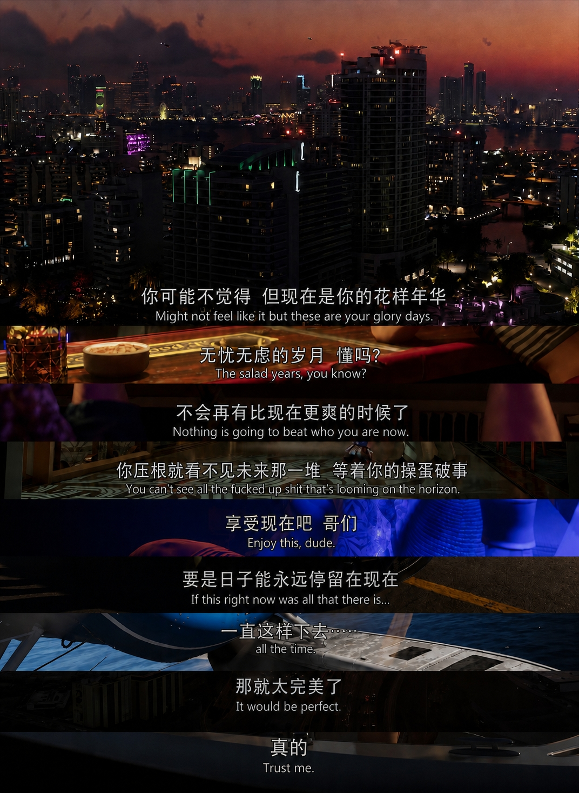

事先声明，《GTA 5》 77.1 小时以及 《RDR 2》 52.9 小时，占据本人 2022 年暑假以及寒假时光，所以多少对 Rockstar Games 开发的游戏多少了解。额咋说呢，最开始我玩《GTA 5》这个游戏，是高考完的暑假，在邻居 xxz 家使用 XBOX 游玩，值得一提的是当时接触到了风灵月影学会单机游戏开挂。我本人晕 3D 视角游戏，高考完我下载手机端《原神》，嗯，玩了五分钟就晕了，初中玩《我的世界》也是晕得很。但是这回玩《GTA 5》我虽然头晕但是能坚持下去。时间拉倒大一暑假，那年暑假我又不需要打比赛卷科研，因此在练车考驾照的空余时间我开始玩《GTA 5》，由于之前本科舍友 zgh 已经给我试玩过，大一下半学年受疫情影响我在宿舍呆了很久（三个月），因此很快就能入手游玩。22 年 9 月开学，我又买了一只八位堂猎户座（XBOX 授权）有线手柄，在紧张的学业之余投入地平线 4 以及大镖客 2。
想来时间已经过去将近 4 年，如今 《GTA 6》实机预告已经发布，感慨时间过得真快啊，甚至我的记忆还留在 18 年，那年我刚刚上高中，还在偷玩手机端 CR 《皇室战争》，《王者荣耀》，一切都是欣欣向荣，无限美好，就像《GTA 6》实机预告里说的。

```
你可能不觉得，但现在是你的花样年华。
无忧无虑的岁月，懂吗？
不会再有比现在更爽的时候了。
你压根就看不见未来那一堆等着你的操蛋破事。
享受现在吧，哥们。
要是日子能永远停留在现在，
一直这样下去……
那就太完美了。
真的。
```

看到这，我突然有种回来 22 年秋天首次游玩地平线 4 的那天早上（2022 年 9 月 24 日 08:42 左右)，我记得那天之后我得考 NCRE 2C，复习时间紧急但我感冒了比较难受，所以直接打开地平线 4。游戏是淘宝买的土耳其账号终极版，开局是地平线嘉年华近十分钟的游戏介绍，终极版有财富岛，乐高世界这两个 DLC，我现在只记得《A Moment Apart》-ODESZA 音乐以及那句**这是一场永不落幕的嘉年华**，然后我周游在英国街头小巷，慢慢欣赏美景以及参加车辆竞赛。时过境迁我当时的激动已经忘得差不多了，但是==音乐==《A Moment Apart》以及==嘉年华==这两个标签我是永生难忘，简直就像刘姥姥逛大观园，长见识。
最后贴上整个预告回看次数最多的片段。
<iframe
src="https://player.bilibili.com/player.html?isOutside=true&aid=117174744122018&bvid=BV1M9tK6BEcW&cid=41376090448&p=1&autoplay=0"
scrolling="no"
border="0"
frameborder="no"
framespacing="0"
allowfullscreen="true"
style="
width: 100%;
aspect-ratio: 16 / 9;
border: 0;
display: block;
">
</iframe>
