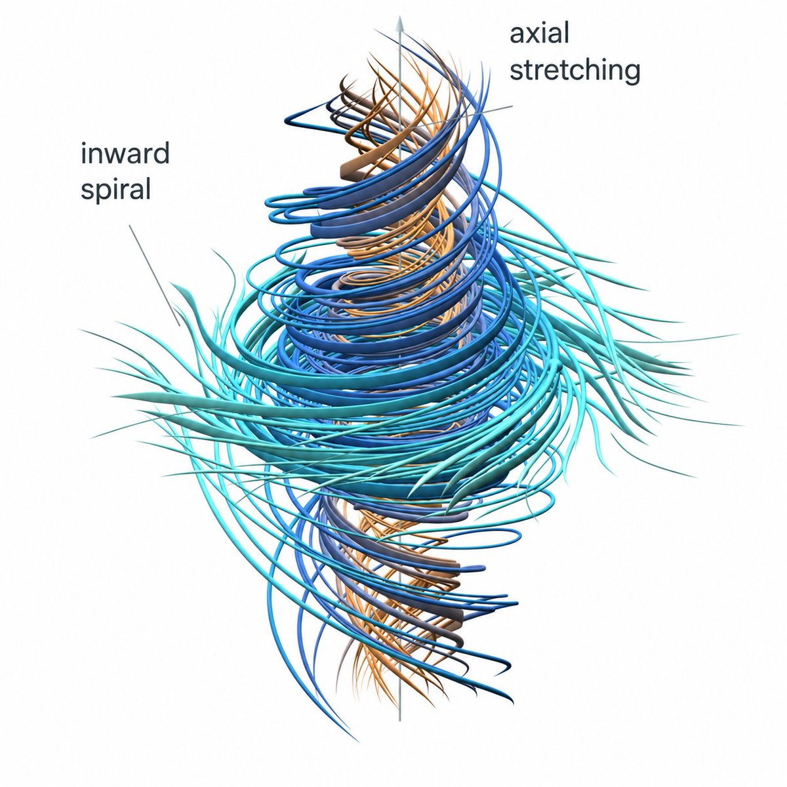

9 月 8 日，OpenAI 公布了一份 165 页的数学论文，宣布找到纳维－斯托克斯方程（Navier–Stokes，简称 NS）存在性与光滑性问题的解答。

We’re sharing a solution to the Navier-Stokes Millennium Prize Problem, one of the deepest problems at the frontier of mathematics.

The proof was produced by a group of agents, using an OpenAI next-generation model significantly more capable than GPT-6 Astra.

The problem concerns whether the description of smooth three-dimensional fluid motion modeled by the Navier-Stokes equations can break down. It has remained unresolved for roughly 90 years.

论文给出的结论是：对于任意正黏性，都可以构造一团从静止开始运动的三维不可压缩流体，在光滑外力作用下，让局部速度在有限时间内变得无界，同时保持总动能有界。这意味着，即使初始状态和外力都足够平滑，黏性也未必能够阻止经典光滑解发生“爆破”。论文署名为 OpenAI。

论文地址：https://cdn.openai.com/pdf/32d9f210-8b73-45e0-91bc-82a30aef8a9a/navier-stokes.pdf

