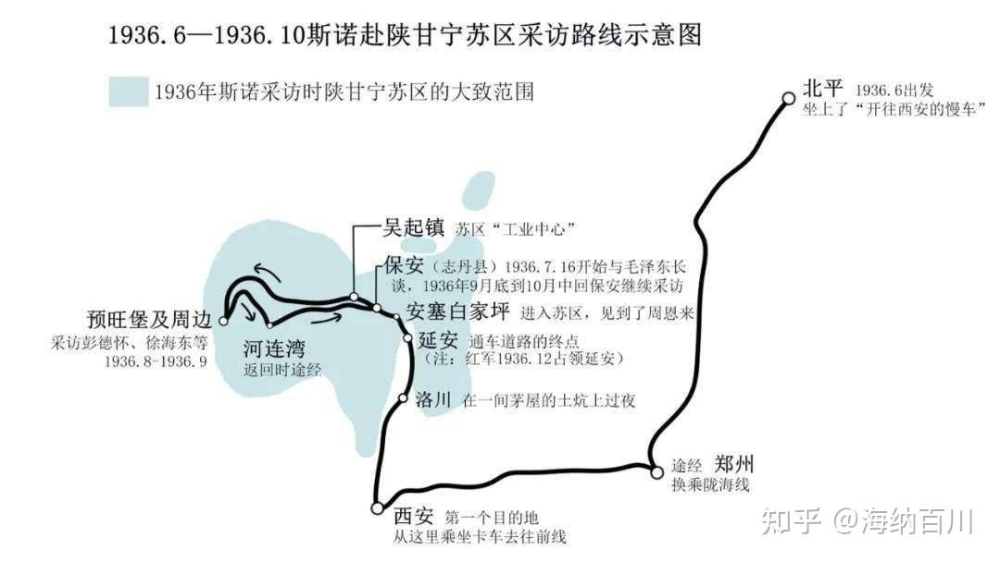

20250812-20260318

这段文字在网络上广为流传，其实来自美国记者埃德加·斯诺创作的纪实文学《红星照耀中国》的第四篇：一个共产党员的由来，革命的前奏部分。这一章是 1936 年斯诺对毛泽东关于从童年到长征到达陕西这段历史的简要记载。叙事主体逐渐从红军个体扩散到红军群体。

这段来自第八篇：同红军在一起。这一篇部分记叙斯诺对彭德怀和徐海东的访问，以及他对红军的整体认识。作者从彭德怀的童年经历写起，借此探讨红军如何成长、又为何能够成长。这是一场极为有趣且富有启发性的谈话。

土地革命时期的格局是：
多块苏区 → 各自发展 → 多数被国民党围剿瓦解 → 红军主力长征 → 在陕北重新集中

在土地革命战争时期，鄂豫皖苏区与江西中央苏区同为中国共产党领导的重要革命根据地，均多次粉碎南京国民政府发动的“围剿”，在斗争中不断发展壮大。但两块根据地的发展轨迹与战略结局并不相同。

江西中央苏区（即中央革命根据地）在成功粉碎前四次“围剿”后，于1934年第五次反“围剿”中失利。由于敌强我弱、军事指导方针失误等因素，中央红军被迫实行战略转移，开始举世闻名的长征。

相比之下，红四方面军所依托的鄂豫皖苏区更早面临严峻军事压力。1932年，在国民党军队大规模进攻下，主力部队在张国焘领导下向西突围，转战川北，创建了川陕根据地。因此，红四方面军的战略转移时间实际上早于中央红军的长征。

1935年6月，中央红军与红四方面军在懋功会师。但双方在战略方向问题上产生严重分歧。同年10月5日，张国焘在四川卓木碉另立“中央”。随后，毛泽东率中央红军主力北上，于10月19日抵达陕北吴起镇，与陕北红军及先期到达的红二十五军会师，逐步建立并巩固了陕甘宁根据地。

1936年10月，长征进入收官阶段。10月9日，红一方面军与红四方面军在会宁会师；10月22日，红二方面军总指挥部在将台堡与红一方面军主力会师。红一、红二、红四方面军在甘肃中部地区实现大会合，标志着长征胜利结束。

## 《红星照耀中国》总结
20250812-20260318
“历史和人民怎样选择了中国共产党”被《红星照耀中国》这本书真正意义上诠释，这不是喊口号，是实实在在的历史选择。
《红星照耀中国》围绕埃德加·斯诺于 1936 年 6 月至 10 月对中国革命根据地的实地采访展开，呈现出一个与当时主流舆论截然不同的“红色中国”图景。作者自北平出发，经西安进入陕北，根据地核心区域主要包括保安（今志丹）一带，而非以延安为中心。斯诺在红区先后采访了毛泽东、周恩来、徐特立等中共领导人与知识分子，系统了解了红军的政治理念、组织结构及长征的历史意义。随后，斯诺前往宁夏南部前线地区（如豫旺堡一带），对彭德怀等红军将领进行采访，观察红军作战与前线生活，进一步了解其军事策略与战斗精神。在完成对红色根据地的深入考察后，斯诺返回西安，并于西安事变爆发前夕离开，结束了此次具有历史意义的采访之行。

其核心可以概括为三个层面：历史背景、革命动力与组织形态。
首先，在历史背景上，1930 年代的中国处于内战与民族危机交织的阶段。一方面，国民党通过围剿、保甲制度等手段维持统治，甚至在“四一二政变”中大规模镇压共产党；另一方面，日本侵略加剧，使“抗日”逐渐成为全国性议题。西安事变则成为关键转折点，标志着从“内战优先”向“民族统一战线”的历史转向。
其次，在革命动力上，斯诺的观察揭示：中国革命的根本基础并非外部输入，而是中国社会内部结构性矛盾。中国是一个以农民为主体的社会，土地高度集中、灾荒频仍、基层控制严密（如民团、保甲），导致农民具有强烈的现实诉求。共产党通过土地分配、减税、组织动员等方式，将这种分散的不满转化为有组织的政治力量。由此，红军的战斗力不仅来自军事策略，更来自“为自身利益而战”的群众基础。这一点也解释了为何在外援极其有限的情况下，红军仍能长期生存并发展壮大。
再次，在组织与实践层面，本书呈现出红色政权的几个关键特征：一是高度政治化的军队与社会结构。红军不仅是作战力量，也是教育与组织工具，“一边战斗一边学习”，通过宣传、文艺、教育不断塑造认同。二是以纪律和理想为核心的组织能力，例如严格的群众政策（买卖付钱、不扰民）与强烈的革命信念，使其在资源极度匮乏的条件下仍能维持运转。三是明显的“过渡性制度”特征，无论是经济（合作社、货币）、政治（苏维埃政权）还是文化教育，本质上都是在战争环境中形成的临时性安排，服务于生存与扩张。
最后，在国际因素上，本书对“共产国际决定论”观点进行了修正。虽然早期中国共产党受到苏联与共产国际的影响，但这种影响更多体现在思想与经验层面，而非持续的物质支持。随着实践发展，中国革命逐渐走向“本土化”，形成以农村包围城市、武装斗争为核心的路径。这也说明，中国革命不同于后来的“颜色革命”，它不是外部推动的政权更替，而是一种基于社会结构重塑的长期战争过程。
总体来看，本书的核心结论是：中国共产党之所以能够在极端不利的条件下发展壮大，并非依赖外部力量或单纯的意识形态，而在于其成功地把“社会多数的生存问题”转化为“政治与组织问题”，并通过高度纪律化和动员能力，将这种力量持续地积累与放大。这种能力，才是决定历史走向的关键。

## 思考
最近刚看完《红星照耀中国》，其中有一章节就是写毛的生平，我读后最大的感觉和这个回答一样，非常强的自驱力，而且肯实干。我觉得什么不对，我会逃避、会翻儿、会认怂，但是我就是不愿意走出一条自己的路来，我觉得毛最值得我学习的一点就是，有自己的想法，而且自发的去实践，然后找到方法，坚持达成自己的目的。

自驱力是成大事者的固有能力之一。
在绝境中能不能翻盘，第一步要看自己的决心和毅力，我有过这一次大崩经历，如果没抗住，那就是人生拐点，我那段时间听左翼歌曲很多，看很多左翼的故事，感觉上个世纪的左翼有天然的乐观和面对绝境也能“笑着出头天”的概念，这就是一种非常强力的自驱力。
后来我走出来了，带着几个朋友去做事情，我就成了主心骨，因为他们会抱怨，会后悔，会沉迷过于去。而我觉得过去没有意义，现在的每一场打起来才有乐趣
