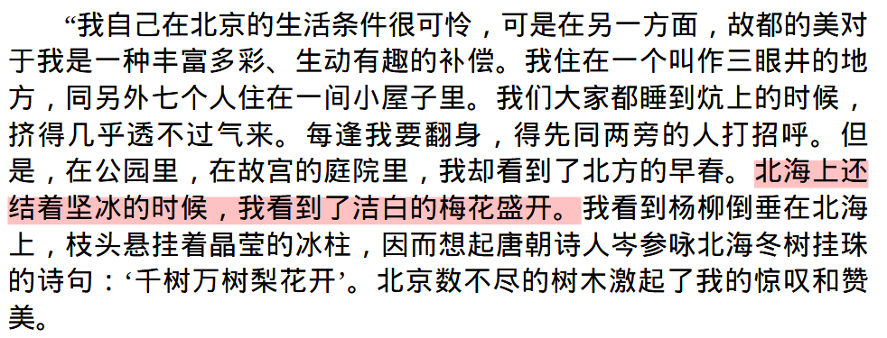
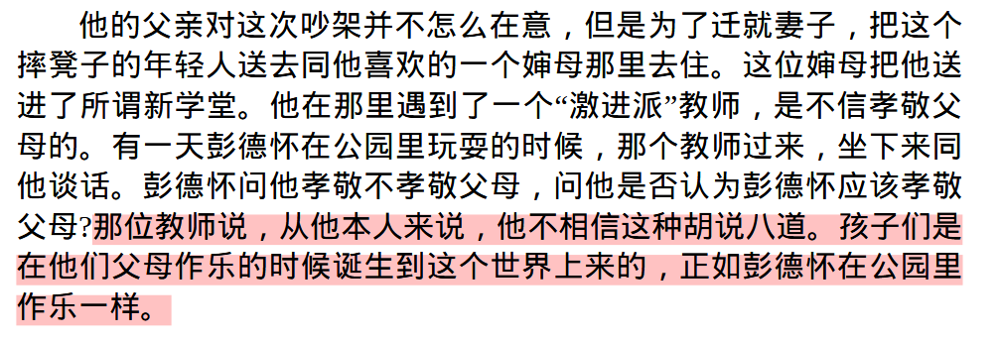

20250812-20260318

这段文字在网络上广为流传，其实来自美国记者埃德加·斯诺创作的纪实文学《红星照耀中国》的第四篇：一个共产党员的由来，革命的前奏部分。这一章是 1936 年斯诺对毛泽东关于从童年到长征到达陕西这段历史的简要记载。叙事主体逐渐从红军个体扩散到红军群体。

这段来自第八篇：同红军在一起。这一篇部分记叙斯诺对彭德怀和徐海东的访问，以及他对红军的整体认识。作者从彭德怀的童年经历写起，借此探讨红军如何成长、又为何能够成长。这是一场极为有趣且富有启发性的谈话。

土地革命时期的格局是：
多块苏区 → 各自发展 → 多数被国民党围剿瓦解 → 红军主力长征 → 在陕北重新集中

在土地革命战争时期，鄂豫皖苏区与江西中央苏区同为中国共产党领导的重要革命根据地，均多次粉碎南京国民政府发动的“围剿”，在斗争中不断发展壮大。但两块根据地的发展轨迹与战略结局并不相同。

江西中央苏区（即中央革命根据地）在成功粉碎前四次“围剿”后，于1934年第五次反“围剿”中失利。由于敌强我弱、军事指导方针失误等因素，中央红军被迫实行战略转移，开始举世闻名的长征。

相比之下，红四方面军所依托的鄂豫皖苏区更早面临严峻军事压力。1932年，在国民党军队大规模进攻下，主力部队在张国焘领导下向西突围，转战川北，创建了川陕根据地。因此，红四方面军的战略转移时间实际上早于中央红军的长征。

1935年6月，中央红军与红四方面军在懋功会师。但双方在战略方向问题上产生严重分歧。同年10月5日，张国焘在四川卓木碉另立“中央”。随后，毛泽东率中央红军主力北上，于10月19日抵达陕北吴起镇，与陕北红军及先期到达的红二十五军会师，逐步建立并巩固了陕甘宁根据地。

1936年10月，长征进入收官阶段。10月9日，红一方面军与红四方面军在会宁会师；10月22日，红二方面军总指挥部在将台堡与红一方面军主力会师。红一、红二、红四方面军在甘肃中部地区实现大会合，标志着长征胜利结束。
