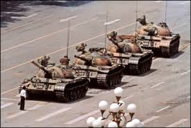
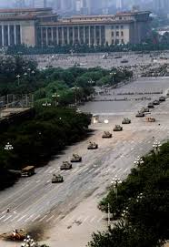
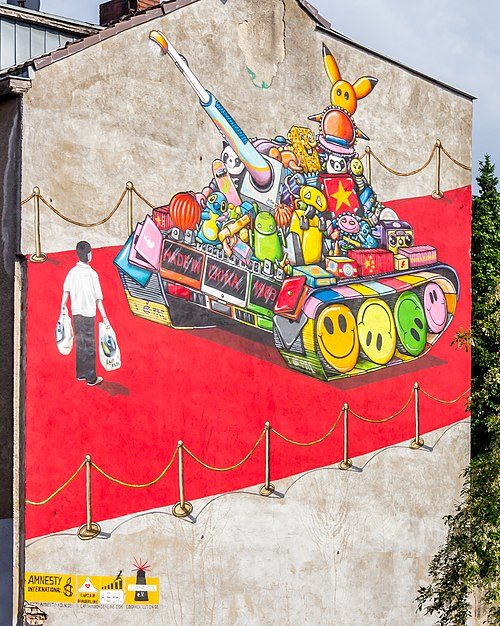
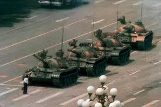

# 邓小平时代笔记
大概写写自己的笔记：
字里行间，作者作者认可崇敬邓小平，从客观角度去描述历史洪流之下邓小平的工作。
## 邓小平的“三起三落”
简单叙述邓小平的“三起三落”：
##### **第一次“落”和“起”**
1933 年初邓小平拥护以毛泽东为代表的正确路线，抵制王明“左”倾错误路线。邓小平在这次残酷的斗争中被撤销了中共江西省委宣传部长职务，并被给予党内“最后严重警告”处分。
1934 年底中共中央在黎平开会，毛泽东得到了多数人的支持，而一直拥护毛泽东的邓小平，经毛泽东提议，当上了中央秘书长。1935 年 1 月他参加了著名的遵义会议。此后，他的人生和党的事业一样，从一个辉煌奔向另一个辉煌。
##### **第二次“落”和“起**
1966 年错估形势的毛泽东领导和发动了“文化大革命”，邓小平对党中央工作中“左”的思想倾向进行抵制，被扣上“党内第二号走．资本主义道路当权派”的帽子受到错误的批判和斗争。从第一代中央领导集体的成员变成了专政的对象，从党的总书记的职务上一下子被贬到江西“劳动改造”。1969 年 10 月，邓小平被下放到江西省新建县拖拉机修造厂劳动。
1973 年，九一三”林彪事件后，毛泽东重新起用老干部。1973 年 3 月 10 日，中共中央发出了《关于恢复邓小平同志的党的组织生活和国务院副总理的职务的决定》。在 1975 年召开的中共十届二中全会和四届全国人大一次会议上，邓小平先后出任中共中央副主席、国务院第一副总理、中央军委副主席兼中国人民解放军总参谋长。第三次“落”和“起 1976 年邓小平被指控控为天安门事件总后台，第三次被打倒，被撤销了党内外一切职务，保留党籍，以观后效。 1977 年“文化大革命”结束后，党中央顺应民心，恢复邓小平所有职务。1977 年 7 月的中共十届三中全会，恢复了邓小平中共中央副主席、中央军委副主席、国务院副总理、中国人民解放军总参谋长的职务。
##### **第三次“落”和“起**
1976 年邓小平被指控控为天安门事件总后台，第三次被打倒，被撤销了党内外一切职务，保留党籍，以观后效。
1977 年“文化大革命”结束后，党中央顺应民心，恢复邓小平所有职务。1977 年 7 月的中共十届三中全会，恢复了邓小平中共中央副主席、中央军委副主席、国务院副总理、中国人民解放军总参谋长的职务。
##### **总结**
1966 年错估形势的毛泽东领导和发动了“文化大革命”，邓小平对党中央工作中“左”的思想倾向进行抵制，被扣上“党内第二号走．资本主义道路当权派”的帽子受到错误的批判和斗争。从第一代中央领导集体的成员变成了专政的对象，从党的总书记的职务上一下子被贬到江西“劳动改造”，但是他的党籍被保留了。1969 年 10 月，邓小平被下放到江西省新建县拖拉机修造厂劳动。1973 年，九一三”林彪事件后，毛泽东重新起用老干部。1973 年 3 月 10 日，中共中央发出了《关于恢复邓小平同志的党的组织生活和国务院副总理的职务的决定》。（1976 年“四五”运动 (为悼念周恩来)）1976 年邓小平被指控控为天安门事件总后台，第三次被打倒，被撤销了党内外一切职务，保留党籍，以观后效。1977 年 7 月 17 日, 十届三中全会通过了《关于恢复邓小平同志职务的决议》。

## 出访国外：1978 年–1979 年
1978 年 5–9 月，谷牧的出访和四个现代化建设务虚会;
1978 年 12 月 18 日至 22 日的十一届三中全会被称为开始实行邓小平“改革开放”政策的会议。出访缅甸和尼泊尔:
1978 年 1–2 月出访朝鲜:
1978 年 9 月 8–13 日成功访日:
1978 年 10 月 19–29 日在东南亚寻求盟友:
1978 年 11 月 5–15 日访问泰国:
1978 年 11 月 5–9 日马来西亚之行:
1978 年 11 月 9–12 日新加坡:
1978 年 11 月 12–14 日出访美国:
1979 年 1 月 28 日–2 月 5 日
## 对越自卫反击战: 1979 年 2 月 17 日–3 月 16 日
减少苏联的威胁
和美国的军事合作
精简军队
军工企业的“军转民”（军队经商）
**80 年代开始，00 年代结束**
## 一国两制: 台湾、香港和澳门
谋求台湾统一 1979 年 4 月 10 日
与台湾关系法（美国继续向台湾出售武器和干涉中国内政，阻挠台湾与中国大陆的统一）
1981 年 9 月 30 日，叶剑英提出“有关和平统一台湾的九条方针政策”。
收回香港主权
1997 年 7 月 1 日
澳门回归
1999 年 12 月 20 日.
## 经济改革：1979-1989
广东和福建的试验:1979–1984
中央没有钱, 可以给些政策, 你们自己去搞, 杀出一条血路来。
经济调整和农村改革:1978–1982
1978 年 11 月，安徽省凤阳县小岗村 18 位农民签下“生死状”，将村内土地分开承包。开创家庭联产承包责任制的先河。
1980 年 5 月，邓小平在一次重要谈话中公开肯定小岗村“大包干”的做法。
加快经济发展和开放:1982–1989
## 政治改革：1986–1987
(不搞政治体制改革, 经济体制改革也搞不通)
老干部退休中央顾问委员会：
1982 年至 1992 年清除精神污染运动;
1983 年 10 月发生的一项整党运动
反资产阶级自由化:1987
## 六四事件 ： 1989 年 4 月 15 日–6 月 4
从**悼念**到抗议
胡耀邦逝世
四二六社论
五四对话
学生分歧与绝食
戈巴卓夫的到访（5 月 15 日至 18 日）
	不仅标志着中苏关系的转折点, 也是学生运动的转折点。
5 月 20 日戒严令直到 1990 年 1 月 11 日正式结束
强硬派学生的坚持: 5 月 20 日–6 月 2 日
镇压:6 月 3–4日
	木樨地冲突
	群众撤离 
对首都戒严部队军级以上干部的讲话 1989 年 6 月 9 日

## 站稳脚跟:1989–1992

维持中美交流
东欧和苏联共产主义制度的崩溃
柏林墙的倒塌
东欧国家共产党统治的结束
**苏联的解体**
爱国主义教育
## 南巡:1992
邓小平南巡: 1992 年 1–2 月
包产到户和取消公社对于调动农民的积极性是必要的。但是由于新的农业技术的出现和发展, 耕作小块土地的农户单靠自身财力无法提升技术, 到一定时候仍然需要大的集体组织。
谁不改革, 谁就下台。
## 未来的挑战
为全民提供社会保障和公共医疗
重新划定和坚守自由的界线
遏制腐败
保护环境
维持统治的合法性
## 外交战略的主要指导方针
冷静观察、稳住阵脚、沉着应对、决不当头、有所作为
**韬光养晦, 绝不当头, 有所作为**

