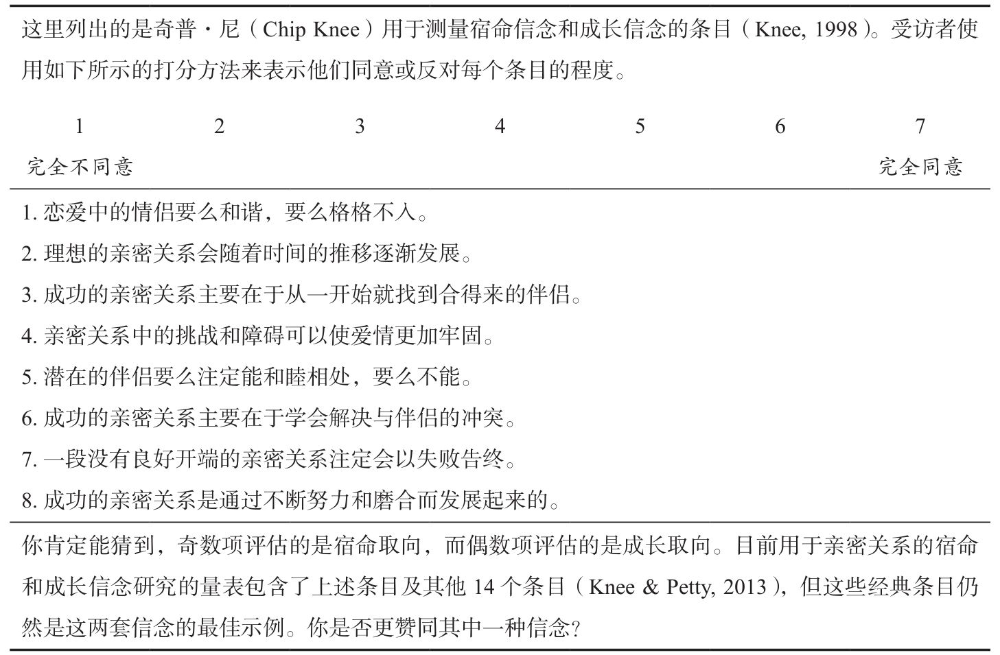
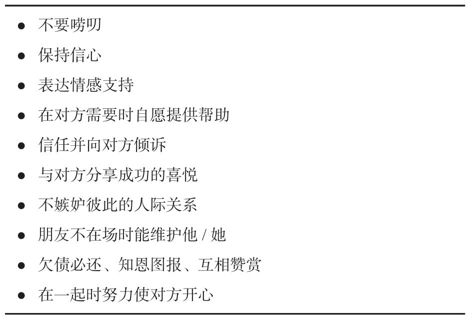
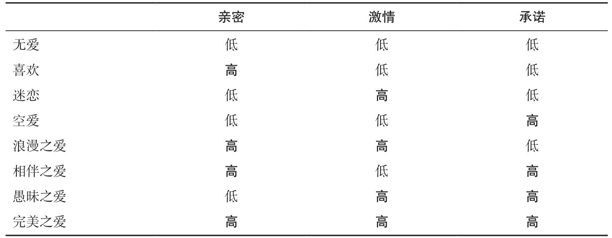
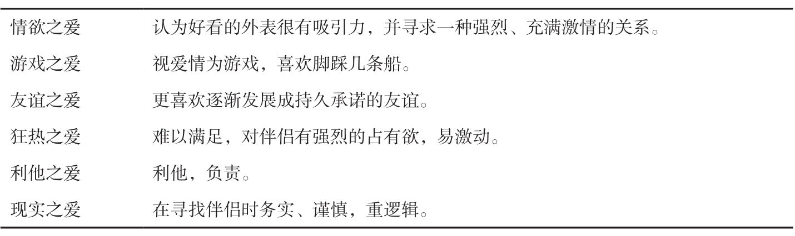

## **亲密关系**
Intimate Relationship
新一行如果是"> "结尾那么这一行代表我的个人理解与思考。
### 序章
第一个问题：如果你要到一座荒岛上生活，只能在你的各种亲密关系（父母、兄弟姊妹、好朋友、同学、同乡、同事，等等）中选择一个人同行，你会选择谁？
> 选择兄弟姊妹，因为最有可能帮助我存活

第二个问题：当你的父母、配偶、孩子、最好的朋友一起落水，只有你会游泳，而你只能救其中一个人时，你又会选择谁？
> 选择孩子，因为他最年轻
### 第 1 章人际关系的构成
马克和温蒂大三的时候在校园相识，他们很快发现彼此很喜欢对方。温蒂漂亮、非常有女人味还相当温顺，而马克在他们第二次约会时就勾引温蒂上了床，对此马克沾沾自喜。温蒂着迷于马克的个人魅力，因为她总是有点不自信，怀疑自己的优点。温蒂感到非常兴奋，能有一个强势、有非凡魅力的男人为她吸引。在大四的时候他们开始同居，毕业 6 个月后就结婚了。**他们的婚姻状况保持了传统的伴侣关系**。孩子还小时，温蒂就待在家里照看，马克则致力于自己的事业。他在职场成功了，加过好几次工资，但温蒂觉得丈夫爱工作胜过爱自己。她希望丈夫能多和她聊聊天，而马克则希望妻子节食减肥并照料好她自己。
据你看来，马克和温蒂婚姻生活的前景怎样？如果他们 10 年后还在一起会有多快乐？为什么？
>在我看来马克和温蒂婚姻质量不会特别好，10 年之后不会有新婚伊始的那般快乐，因为传统的伴侣关系缺陷在于男方主外女方主内，但是家庭经济压力全在男方，可能会出现男方一言堂造成两性地位悬殊（地位稍微不一样是正常的，因为家庭需要有一个主心骨，但是由于经济造成的地位悬殊会出现相互不理解）。但是考虑到他们都是接受同等的高等教育，我觉得最后会出现这样的阶段：一年之守，三年之痛，五年之离，七年之痒，然后十年之约或者和平离婚，而不是痛苦的坚守。
### 第 3 章吸引力
假设你独自在教室里阅读本章内容，此时门被推开了，一位陌生人走进来。这个人对你有吸引力吗？这个人可能成为你的朋友或恋人吗？
>不会，因为我不会因为路途的一朵鲜花而迷失前往森林的方向，如果他有特别之处吸引我，可能会成为我的朋友或恋人，但我还是会尽可能往前走。

吸引力的根基是工具性(instrumentality)，即他人能帮助我们实现当前目标的程度。那些能帮助我们得到现在所渴望的事物的人，就对我们有吸引力。
**亲不敬，熟生蔑**

#### 亲密接触
当然，熟悉也有局限性。随着我们对他人了解的增加，我们可能会发现他们令人厌烦、难以相处或笨拙无能，与这样的人接触（曝光）越多，可能会让我们更不喜欢他们，而不是更喜欢他们。

三分之一的异地恋情侣在重聚后的三个月内分手（记住，承诺是影响这一切的关键因素）。如果其他条件相同，身边的伴侣比异地的伴侣更有优势：与异地伴侣交往所耗费的金钱和付出的努力，诸如昂贵的机票或路上的耗时等，使异地关系总体上比同城关系的成本更高。异地关系的奖赏价值也低；**通过视频表达的爱意远不如真实的温柔一吻那样打动人**。当一段享受临近便利的亲密关系因距离而变得不方便时，它所遭受的损失可能是伴侣任何一方都始料未及的。坚守承诺的情侣通常能承受住分离的考验，但其他的伴侣关系最终可能因异地而破裂。

大多数情况下，当两个陌生人开始闲聊时，他们聊得越多就越喜欢对方。当我们开始了解他人，并且我们的目标只是与他们相处并享受一段美好时光时，熟悉和方便都会增加我们的吸引力。这就是**临近**的力量。
#### 外貌
一般来说，先不管对错，我们倾向于认为长相俊美的人比那些没有吸引力的人更讨人喜欢、更优秀。爱美之心人皆有之，但貌美之人有哪些优势，一定程度上取决于某一文化的特定价值观。

这些有吸引力的面孔具有哪些特征？毫无疑问，如果女人拥有“娃娃脸”特征，诸如大眼睛、小鼻子、尖下巴和丰满的双唇，则她们更有吸引力。然而，问题的关键并不是看起来孩子气，而是要有女人味，青春可人；美丽的女人结合了这些娃娃脸的特征和健康成熟的标志，诸如突出的颧骨、窄小的脸颊和灿烂的笑容。具备所有这些特征的女性在全世界都被认为有吸引力。男性的吸引力则比较复杂。下巴坚实、额头宽阔的男性——看起来强壮而有统治力——通常被认为是英俊的，（想象一下乔治·克鲁尼）。

男性认为体重正常、不胖不瘦、腰身明显细于臀部的女性身材最具诱惑力。最具吸引力的腰臀比(waist-to-hip ratio, WHR)是曲线玲珑的0.7，即腰部比臀部细30%；这种“沙漏”型的身材对全世界的男性都有吸引力。

如果你想测量自己的**腰臀比**，用最窄处的腰围除以最宽处（包括臀部）的臀围。你的臀部也包括在你的腰臀比中。比如在捷克共和国，女性的腰越纤细，她与自己男友或配偶的性生活就越频繁，并且男性的勃起功能也越好。这似乎也是人类的一种基本偏好；甚至天生失明的男性在通过触觉评估女性的身材时，也偏爱腰臀比例小的女性。人们通常认为超重的女性不如身材苗条和正常体重的女性有魅力，一般而言，当妻子比丈夫瘦时，夫妻双方对婚姻更为满意，但对于男性而言，瘦的女性不比正常体重的女性更有吸引力。在全世界，相比小乳房，男人更喜欢中等大小的乳房，而大乳房并不能让女人更具吸引力，但不管怎样，乳房的大小都不如其与女性身体其他部分的比例重要；**腰胸比**为0.75的曲线最吸引男性。此外，女人的腰臀比例比乳房大小更能影响男人对女人吸引力的判断。男性的吸引力更显复杂。当男性的腰比臀略窄，即腰臀比为 0.9 时，他们的身体最有吸引力。宽阔的肩膀、强壮的肌肉也很有吸引力；与肩膀较窄和肌肉松弛的男性相比，那些肩臀比例较高（约为 1.2）、肌肉更强壮的男性发生性关系的年龄更早，女性性伴侣也更多。然而，男性光有好身材并不能吸引女性，除非他还有其他资源；只有当他能挣一份体面的薪水时，他的腰臀比才会影响女性对他的评价。男性即使英俊但若贫穷，对女性也并不那么有吸引力。

陌生人偏好相貌出众之人的体味，而不是相貌平平之人的气味。
长发的女性比短发的女性对男性更有吸引力。男性参与者对约会长发的女性更感兴趣，部分原因是他们认为长发女性不太可能已经订婚或者结婚，而且更愿意在第一次约会时就与他们发生性关系。

有资料表明，女性处于受孕期时对待男性的行为会发生变化，你对此感到好奇还是烦恼？为什么？
> 好奇，因为这是生理问题。

男人被苗条、年轻、貌美的女人吸引，女人被高大、年轻、英俊的男人吸引。在人们通过几分钟的交谈所能了解的关于彼此的所有信息中，最重要的是**外表吸引力**。即使考虑了个体的大五人格特质、依恋类型、政治态度及其他价值观和兴趣，在第一次短暂的会面后，预测继续交往的最好因素仍然是**外表吸引力**。正如你所料，友好、外向的人往往很受欢迎，没有人喜欢害羞或对被抛弃感到高度焦虑的人，但在初次见面时，没有什么比**长相**更重要的了。

尽管男女两性（自称）对俊美长相的重视程度不同，但当人们在一起时，外表吸引力对男女两性都有影响。长相很重要。外表吸引力是影响两性最初喜欢对方程度的最有力因素。
#### 匹配
一段关系越认真、越坚定，匹配通常就越明显。人们可能会追求比自己漂亮的人，但他们不太可能与之保持稳定的关系或订婚，因为双方并不是“同一类人”。这意味着，即使每个人都想找一个长得好看的伴侣，但只有那些外表同样俊美的人才能得偿所愿。真正好看的人并不愿意和我们这些相貌平平的人成为伴侣，反过来，我们也不想要长相“比我们差”的伴侣。对于确立恋爱关系之前是**柏拉图式**朋友的伴侣而言，匹配就不那么明显，并且更可能发生吸引力不匹配的情况。显然，如果人们在相对吸引力的问题凸显之前变得亲近（可以这么说），那么匹配就不那么重要了。夫妻双方在外表吸引力上的确有明显的相似之处，有些关系根本不可能开始，因为两个人看起来太不般配——但情况并非总是如此。
#### 欲擒故纵
因为人们都喜欢被人喜欢，所以假装冷漠，对某人只是略感兴趣，是试图吸引他/她的一种愚蠢的做法。一味地欲擒故纵是行不通的。真正有效的方法是有选择地欲擒故纵，也就是说，除了你想吸引的人，任何人想要得到你都很困难。那些能够拒绝大多数人却乐于接纳我们的人，才是最有吸引力的潜在伴侣。不过，在其他条件相同的情况下，**我们很难不喜欢那些喜欢我们的人**。

你听到的关于一位新转校生的第一件事是他/她已经注意到你，并且真的喜欢你；作为回报，你难道不会对他/她产生好感吗？被他人喜欢和接纳具有强大的奖赏意义，我们会被提供这类奖赏的人所吸引。

#### 物以类聚，人以群分

以女性的年轻和美貌换取男性的地位和资源的匹配司空见惯。
文化论的倡导者认为，女性之所以要通过伴侣来获取想要的资源，是因为她们被剥夺了直接获得自身政治和经济权力的机会。

在找寻亲密伴侣时，我们往往不得不在这些标准之间权衡。找到（并赢得！）完美的伴侣来满足我们所有的愿望是非常困难的。如果我们坚持要求自己的伴侣既善良和善解人意，又貌美和富有，我们很可能会长期处于失望和沮丧之中。所以，当评估潜在伴侣时，男性往往会首先确认女友至少有普通的长相，然后再寻求尽可能多的温暖、善良、诚实、坦率、稳定、幽默和智慧。绝世容颜是男人所渴求的，但它不如高度的热情和忠诚重要（地位和资源屈居第三位）。女性往往会首先确认男友至少有一些钱或发展前景，然后再寻求尽可能多的温暖、善良、诚实、坦率、稳定、幽默和智慧。财富是女人所渴求的，但它不如高度的热情和忠诚重要，而长相排在第三位。

拉什德向丽贝卡做了自我介绍，因为她非常性感火辣。但当拉什德发现丽贝卡有点多疑、自我中心和爱慕虚荣时，他有点失望。另一方面，丽贝卡的确很性感，所以拉什德还是约了她。丽贝卡被拉什德的名牌服装和大胆举止打动，迷上了他，但几分钟后，丽贝卡就觉得他有点咄咄逼人、傲慢无礼。尽管如此，拉什德手里有一场昂贵音乐会的门票，所以她同意了他的约会邀请。
读完本章后，你认为拉什德和丽贝卡的这场约会及未来发展会如何？为什么？

> 短期内可能会因为资源吸引而在一起，但长期会因为差异性而分开。因为两人的匹配不是健康的开始，拉什德富有但傲慢自我，丽贝卡性感虚荣，两者关系互补，但是地位不平等，选择的权力可能在拉什德手上，因为约会的确定是基于拉什德的一场昂贵音乐会的门票，而不是健康的吸引力，所以未来我觉得二者不是一条路上的人，只会短暂的相遇，然后分道扬镳。
#### 本章小结
**吸引力的基础**
当他人的存在对我们有奖赏意义时，我们便会被吸引，因为他们于我们而言具有工具性意义，帮助我们实现目标。
临近性：喜欢身边的人
我们从周围的人中选择我们的朋友和敌人。
熟悉：反复接触。一般而言，熟悉会产生吸引力。即使是短暂的简单曝光，往往也会增加我们对他人的好感。
方便：远亲不如近邻。与异地伴侣的关系通常不如伴侣就在身边更让人满意。
临近的力量。空间上的临近能让两个人更可能相遇和互动，不管结果是好是坏。
外表吸引力：喜欢可爱的人
对美的偏爱：“美的即好的”。我们假设有吸引力的人也拥有其他理想的个人特征。
谁是漂亮的？对称、五官平均化的面孔尤其漂亮。腰臀比为0.7的女性最有魅力，而腰臀比为0.9的男人如果有钱，也有吸引力。
外表吸引力的演化观。关于美貌的跨文化共识、女性的偏好和行为的周期性变化，以及吸引力与身体健康的关联，都与演化心理学的假设一致。
文化也起作用。美的判断标准也会随着经济和文化条件的变化而改变。
长相很重要。当人们第一次见面时，没有什么比长相更能影响吸引力了。
美的互动代价与收益。外表吸引力对男性社交生活的影响要甚于对女性的影响。有吸引力的人会怀疑来自他人的赞美，但他们仍然比没有吸引力的人更快乐。
外表吸引力的匹配。人们通常是与自己容貌相当的人成双成对。
相互性：喜欢那些喜欢我们的人
人们不愿意冒被拒绝的风险。大多数人这样计算他人的整体吸引力，他人的外表吸引力和我们判断他人喜欢我们的可能性的乘积。那些能成为理想伴侣的人（即适配价值高的人）坚持认为，他们的伴侣也是理想的。
相似性：喜欢那些与我们相似的人
物以类聚，人以群分。人们喜欢那些与自己态度一致的人。
相似性的种类。幸福关系中的伴侣在人口统计学的出身和态度上更为相似，而人格在较小的程度上相似。
相异相吸吗？相异并不相吸，但人们之所以认为相异会相吸有几个原因。首先，我们会被那些我们认为与我们相似的人吸引，但我们可能会犯错。其次，感知到的相似性被对我们与他人共有的属性的准确理解所取代需要时间。人们可能会被那些与自己差别不大但与自己的理想自我相似的人所吸引。随着时间的推移，人们也倾向于变得更加相似，而某些种类的相似性更为重要。匹配也是一个广泛的过程，名望、财富、天赋和长相都能用来吸引他人。最后，我们可能会欣赏伴侣的行为，这些行为与我们自己的不同，但对我们有互补作用，有助于我们实现自己的目标。
男女两性期望什么样的伴侣
人们会从三个方面评价潜在的伴侣：(1)温暖和忠诚，(2)吸引力和活力，(3)地位和资源。对于持久的爱情，女人希望男人温暖、善良但不能贫穷；男人希望女人温暖、善良但不能没有吸引力。因此，人人都希望有一个和蔼可亲、随和、充满爱心的亲密伴侣。
### 第 4 章社会认知
假设你得了严重的流感，在家卧床不起，你的爱人一整天都没打电话询问你的病情。你感到很失望。为什么你的爱人不给你打电话？是他/她考虑不周和不体贴入微吗？或者这只是他/她一贯以自我为中心、缺乏同情心的又一个令人失望的例子？抑或更可能是你的爱人对你充满爱意和关心，不想贸然把你从睡梦中惊醒？有几种可能的解释，你可以选择一种宽恕、指责或介于两者之间的思路。重要的是，选择权就掌握在你的手中；同一个事实可以有几种不同的解释。但不论你选择何种解释，你的判断可能非常重要。说到底，**你的认知要么会维系要么会损害你们的关系。**
> 认知主观性比较强

我们对伴侣关系的知觉和解释无比重要：我们的所思所想会影响我们的感受，进而影响我们的行动。如果我们的判断总是准确的，这就不是问题。

有些错误也许从我们遇到某人的那一刻就开始了。
#### 第一印象
我们在第一次短暂的会面后所形成的对他人的判断往往相当持久，最初的看法在数月之后仍有影响力。
我们对他人的判断受到**首因效应**(primacy effect)的影响，即我们获得的关于他人的最初信息在连同我们的即时印象和刻板印象一起塑造我们对他人的整体印象时，往往具有特殊的重要性。
因此，第一印象会影响我们对随后获取的关于他人的信息的解释，也会影响我们对新信息的择取。当我们想要验证对他人形成的第一印象时，我们更可能寻求能够证实自己信念的信息，而不是查找能够证明自己这一信念错误的资料。
实际上，对异性恋关系的未来发展，最准确的预测往往来自女方的朋友。
但一旦我们致力于一段亲密关系并希望它持续下去时，我们就很难保持冷静；在这种情况下，我们特别容易产生支持我们对伴侣乐观的错误知觉的验证性偏差。
所以，我们对亲密关系的知觉往往并不像我们认为的那样超然和完全正确。并且，不管是好是坏，它们对我们随后的情感和行为都有相当大的影响。
首先，我们对他人的印象会受到各种各样的影响，其中有些影响与被评判的人无关。其次，在这些研究中，人们完全没有意识到当前的条件，如他们双手即时的温度，会左右其判断。我们并不总是知道为什么我们持有自己的观点，有时，我们对他人的印象是没有根据的。
#### 伴侣的理想化
我们对伴侣的满意度取决于他/她接近这些理想的程度。

随着时间的推移，当我们越来越了解我们的伴侣时，我们倾向于**修正我们对理想伴侣的期望**，以便我们的标准适合我们现在的伴侣。

人们通常能敏锐地意识到塑造他们行为的外部压力，但却忽视了同样的环境也会影响他人；因此，在解释自己的行为时，他们承认有外部压力，但当其他人表现出完全一样的行为时，他们却会做内部归因（如归因于他人的性格）。

伴侣双方可能意识不到彼此归因的差异，每个人都可能认为对方会像自己一样看问题。当伴侣们有意识地努力去理解对方的观点时，行动者/**观察者差异**就会减少。

尽管彼此真心相爱，伴侣们也可能表现出自**我服务偏差**(self-serving bias)，即乐于把成功归功于自己，却试图避免对失败承担责任。人们喜欢对发生在自己身上的好事负责，而情况变糟时则喜欢寻找外部理由。
##### 自我服务偏差
还记得那些你想写却没写的感谢信吗？你或许因为自己曾想找机会对他们表达感激而认为自己是个感恩的人，但失望的亲人却未曾收到你的一丝谢意，你的所作所为就像一个无礼的忘恩负义者！

我们中的大多数人都能轻易地认识到别人对成功的过分自居和对失败的苍白托词；但却认为自己类似的自我服务的看法明智而正确。

在令人满意的亲密关系中仍然存在自我服务偏差。特别是发生争吵时，夫妻双方都倾向于认为争吵主要是对方的过错所致。如果发生了婚外情，人们往往认为自己的外遇不过是无伤大雅的逢场作戏，但却认为配偶的出轨行为是严重的背叛。
#### 记忆

随着新事件的展开，我们会编辑和修正自己的记忆，甚至是那些看似生动形象的记忆。因此，我们对过去的记忆总是混杂着当时发生的事情和我们现在才知悉的事情。心理学家用**重构性记忆**这一术语来描述随着新信息的获得，我们的记忆被不断地修正和重写的现象。
##### 关系信念
人们对亲密关系所持的某些信念是有负面作用的：
- 分歧具有破坏性。分歧意味着伴侣还不够爱我。如果我们深爱对方，就不会有分歧。
> 分歧正常，只要是两个人就会有分歧，在于分歧的程度和方向。
- “读心术”很重要。真正彼此关爱的伴侣仅凭直觉就能知道对方的需要和喜好，根本不需要对方告知。如果必须由我来告诉伴侣我的想法和需求，那只能说明伴侣还不够爱我。
> 读心术固然重要，但是你只能理解潜意识，可能真实意思不能理解，因为潜意识和真实意思不能混为一谈。
- 伴侣不可能改变。一旦出现了问题，他们就会一直如此。如果爱人犯了错，他/她不会改正。
> 原则错误不能出现，做人要有底线。
- 每一次性生活都应该是完美的。只要我们的爱情是忠贞的，那么每一次性生活都应该是美妙的、令人满足的。我们应该总是渴望性生活并做好准备。
> 还好吧，你性能力也不是特别完美，看时间地点环境氛围心理条件，说不定 ED 呢。
- 男人和女人是不同的。男人和女人的性格和需求是如此不同，你真的不可能了解异性。
> 虽然不想承认我是这么认为的，但是这可能是因为社会文化环境所造就的错觉，我在尽量避免这个错觉。
- 美好的亲密关系是自然而然产生的。你不需要努力维持一段良好的亲密关系。人们要么相处融洽，注定幸福地在一起；要么格格不入，无法相处。
> 我靠，虽然不想承认，但是我的潜意识是这么认为的，比较相信**机械决定论**，一切都是自然而然产生的，但是现在静下心坐下来想想确实一段和蔼的亲密关系需要自己去追求。知行合一真的好难啊。我靠这么看我确实比较双标，内核确实不稳定。

如果你们是天造地设的一对，你就不必为了从此过上幸福的生活而努力奋斗——而且当亲密关系出现问题时，他们也不会采取建设性的行动。由于相信人不会改变、真爱天注定，这样的人不会努力去解决问题；他们报告说更愿意结束关系，而不是努力去修复它。
> 汗颜，我就是这样的😓

关于关系信念的研究中，这些观点被称为宿命信念(destiny belief)，因为这些信念假定两个人要么是天造地设的一对，注定永远幸福地生活在一起；要么不适合，注定走不到一起。
>汗颜，我就是这样干的
##### 宿命信念和成长信念
如果两个人注定要幸福，那么在相遇的那一刻他们就会知道；他们也将不会遭遇初期的猜疑或困难，一旦两个灵魂伴侣相遇，就必然有幸福美满的未来。这通常是好莱坞浪漫电影中描绘爱情的方式，而迷恋这类电影的人往往相信真爱天注定。

**宿命信念**和**成长信念**

总结一下，我对于当下争取的事情**成长信念**，对于长久的事情属于属于**宿命信念**。

当伴侣发生争吵或一方行为不端时，持有成长信念的人比不持这种观点的人更致力于这段关系，更乐观地相信任何伤害都可以修复。持有成长信念的人可以心平气和地讨论爱人的缺点；相形之下，持有宿命信念的人在面对伴侣的失误时会充满敌意。
”情侣们认为他们是天生的一对也许很浪漫，但当冲突出现，现实戳破完美结合的虚幻泡影时，就会适得其反。相反，**把爱情视为一段旅程**，常会有一些波折，但最终会朝向目的地前进，反而能消除关系冲突带来的一些影响”

认为只要找到对的、完美的伴侣就能从此过上幸福美满生活的信念对你并无益处。
##### 期望
行动者/观察者效应将会使知觉者把目标的行为归因于目标自己的性格或心境。毕竟，知觉者在目标身上发现了他/她所期待的行为；还有更好的证据来证明知觉者的期望是正确的吗？（这是我们在判断他人时往往过度自信的另一个原因；当我们让自己的错误期望成真时，我们永远不会意识到我们错了！）

那些经常担心被他人拒绝的人，往往表现出更可能遭人拒绝的行为方式。**拒绝敏感性高的人往往会焦虑地感知到他人的怠慢**，即使没有人有意冷落他们。于是他们反应过度，恐惧地表现出比其他人更多的敌意和防御。他们的行为令人讨厌，因此，他们自己和伴侣往往对他们的亲密关系不满意。

总而言之，我们对伴侣的知觉、所做的归因，以及带入亲密关系的信念和期望，都会对随后的事件产生重要的影响。我们对彼此的判断也很重要。与更为悲观的人相比，那些期望他人值得信赖、慷慨大方、充满爱心的人可能更经常发现他人实际上对自己挺好。
> 心理暗示罢了
##### 自我知觉
例如，与他人的特定关系有时会以反复出现的主题为特征。例如，你的父亲可能一直敦促你在学校要取得好成绩。现在，如果有什么东西不易察觉地使你想起了父亲——而且你喜欢他——你可能会比如果没有想起他的情况下在一项困难的任务中坚持更长的时间。你可以表现得就像父亲站在你的身后，催促你前进。反之，如果你不喜爱你的父亲，却又想起了他，你或许会做一些他不希望你做的事情。

此外，我们常不经意而又习惯性地把过去的经验带到新的关系中。如果新结识的人与过去苛待过我们的人相似，我们可能会无意中冷漠地对待他们却不自知。这些行动或许会引发他们不太友好的反应，于是，我们可能会开始建立新的不愉快的关系，就像我们不愉快的过去经历一样，而我们过去的伴侣不曾有意识地出现在我们的脑海中。

如果新结识的人与你曾愉快相处的人相似，你们的交往就可能会有一个特别好的开始。虽然你可能并未有意识地想起以前的伴侣，但你或许会（并非有意为之）表现得特别热情和友善。

另一方面，因为遇到与自己的信念相矛盾的信息会令人不安，所以我们也希望得到能维持我们现有自我概念的反馈。无论好坏，自我概念在组织我们对世界的看法方面起至关重要的作用；它们使生活变得可预测，并支持我们对每一天会发生什么的一致预期。**如果没有一个稳定和牢固的自我概念，与他人的交往互动将变成令人困惑的一团乱麻，而不断面对与自我形象相矛盾的信息会令人不安**。因此，如果他人的反馈与人们已有的对自我的看法一致，并证实了他们现有的自我概念，人们也能从中得到安慰。

那么，这又会怎样呢？这些现象与亲密关系研究的相关性在于，如果人们认真地选择亲密关系的伴侣，他们会选择那些支持他们现有自我概念的亲密伴侣，不论其自我概念是好是坏。

在恋爱关系中，情况变得更为复杂。当人们选择约会对象时，自我提升是首要的；人人都会寻找喜欢并接纳自己的伴侣。因此，即使是自我概念较差的人也会追求能提供积极反馈的伴侣。然而，在相互依赖性更强、承诺更多的关系（如婚姻）中，自我验证就显得尤为重要——这种现象被称为婚姻转变——人们希望得到支持他们自我概念的反馈。

从非常熟悉自己的人那里得到过度好评都可能助长一种不安和不真实感，以及对评价者的**不信任感**。

玛莎很期待见到盖丽，因为认识盖丽的人都说她友好、外向又聪明。但在她们碰巧相遇的那天，盖丽因接触了毒漆藤而出现了严重的皮疹，她因为没完没了的瘙痒而感到不舒服，又因为吃了过敏药而昏昏欲睡，总之盖丽这一天心情糟透了。所以，当玛莎向她问好并做自我介绍时，事情进展得并不顺利。短暂的接触后玛莎就走开了，心想盖丽实际上相当冷漠，不合群。
盖丽的皮疹好了之后，又恢复了正常的情绪状态。她再次遇到了玛莎并热情地打招呼，但却惊讶地发现玛莎显得冷淡而谨慎。读完本章后，你认为玛莎和盖丽未来的关系会怎样？为什么？
> 第一印象可能不太好，但是我认为盖丽会发挥她友好、外向又聪明的特点，和玛莎成为好朋友，走下去。
#### 本章小结
社会认知包括所有我们用于评价和理解自己及他人的知觉、思维和记忆的过程。
**第一印象**
当第一次与他人相遇时，我们会因为刻板印象和首因效应而妄下结论。然后，验证性偏差会影响我们对随后信息的选择，而过度自信会导致我们毫无根据地相信自己的判断。
**知觉的力量**
伴侣的知觉会产生重要的影响。
**伴侣的理想化**。幸福的伴侣会构建积极错觉，强调伴侣的优点，忽视他们的缺点。
归因过程。我们对事情发生的原因给出的解释被称为归因。伴侣会受到行动者/观察者效应和**自我服务偏差**的影响，他们还倾向于运用增进关系或维持痛苦的归因模式。
记忆。随着时间的推移，我们会不断修正和更新我们的记忆。这种重构性记忆的过程有助于伴侣们保持对未来的乐观心态。
关系信念。我们对婚姻将在生活中所起作用的设想表现为婚姻范式。有负面作用的关系信念，诸如宿命信念，显然对关系不利；成长信念则更为现实和有益。
期望。我们对他人的期望能变成自我实现预言，错误的预言使它们自己变为现实。
自我知觉。我们从他人处寻求自我提升和赞美的反应，以及与我们对自己的看法相一致的反应——自我验证驱使人们寻找支持他们现有自我概念的亲密伴侣。
**印象管理**
我们试图影响他人对我们的印象。
印象管理策略。人们常用的印象管理策略有四种，分别是逢迎讨好、自我推销、恐吓和恳求。
亲密关系中的印象管理。高自我监控者对伴侣的承诺较少，但我们所有人在向亲密伴侣展现良好形象时都不及在其他人面前那么卖力。
我们到底有多了解我们的伴侣？
我们通常并不像自己所认为的那样了解自己的伴侣。
了解。随着亲密关系的发展以及伴侣相处时间的增多，人们一般都能更好地理解对方。
动机。人们试图了解对方的兴趣和动机会影响其洞察力和准确性。
伴侣的易理解性。有些人格特质，例如外向，比其他特质更可见。
知觉者的能力。有些人是比其他人更好的判断者。在这方面，情绪智力很重要。
威胁性知觉。然而，当准确的知觉令人担忧时，亲密的伴侣实际上可能会被驱使成为不准确的知觉者。
知觉者的影响。最初不准确的知觉可能会变得更加正确，因为我们诱导我们的伴侣成为我们希望他们成为的人。
总结。无论对错，我们的判断都很重要。

### 第 5 章沟通
#### 非言语沟通
在沟通中，伴随着口头语言的是一系列明显的非言语行为，它们也承载着许多信息，不管你是否有意这样做。

#### 言语沟通

#### 沟通障碍及其应对

#### 本章小结
当信息发送者的意图与信息对接收者产生的影响不一致时，伴侣之间就存在着人际隔阂。
**非言语沟通**
非言语沟通发挥着重要的功能：提供信息、调节互动并定义双方关系的性质。
非言语沟通的组成部分。非言语沟通包括：
- 面部表情。面部表情能很好地表示他人的情绪状态，但文化规范会影响表达行为。
- 注视行为。个体注视的方向和时长对于界定关系和调节互动都非常重要。此外，当我们看到自己感兴趣的事物时，瞳孔会放大。
- 肢体动作。手势的含义在不同的文化之间差别很大，但整个身体的姿势和动作也能传达丰富的信息。
- 身体接触。不同类型的身体接触有截然不同的含义。
- 人际距离。在不同类型的互动中，我们会使用不同的个人空间区域，即亲密区、人际区、社交区和公共区。
- 体味。个体的情绪信息可以通过体味传递给他人。
- 副语言。副语言包括个体声音的所有变式（除了讲话者使用的词语），如节奏、语速和音量。
- 各组成部分的结合。当人们使用了类似的非言语行为而不自知时，模仿就发生了。非言语的行动能让我们以微妙而真实的方式对互动的亲密程度进行精细调整。
非言语敏感性。不幸福的夫妻，尤其是丈夫，在非言语沟通上表现很糟糕。
**言语沟通**
自我表露。亲密涉及与伴侣分享自己的个人信息。
- 自我表露的发展过程。随着关系的发展，自我表露的广度和深度都会增加。当我们觉知到他人表现出的回应性，表明他们理解和在乎我们时，亲密感就会增强。
- 秘密和禁忌话题。夫妻会回避禁忌话题，即使在亲密的伴侣关系中，存在一些秘密也是常有的事。
- 自我表露与关系满意度。适当的自我表露会孕育喜爱和满足感，表达爱意对我们有益。
言语沟通中的性别差异。女性比男性更可能讨论情感和人物话题，但男性和女性一样健谈。不过，有大男子主义的男人较少向其他男人进行自我表露，即使是自己的朋友，因而他们可能只能与女人分享其最有意义的亲密情感。交谈反应性高的女人和沉默寡言的男人的结合可能并不稳定。
**沟通障碍及其应对**
沟通不良。痛苦的伴侣很难表达自己的真实意图，他们会出现具有破坏性的言语行为，其特征是：数怨并诉、偏离主题、读心术、打断、是的—不过句式及反向抱怨，还会涉及批评、蔑视、石墙和交战状态。
精确表述。有技巧的信息发送者会运用行为描述、第一人称陈述和XYZ陈述，把谈话聚焦在特定的行为上，并清楚地表达自己的感受。
积极倾听。好的倾听者会通过改述和知觉检验来理解伴侣。
礼貌待人，保持冷静。幸福的夫妻还会避免消极情感互惠模式的恶性循环。
尊重和认同的力量。即使伴侣之间出现分歧，他们也应该表达出对对方观点的尊重和认可。
### 第 7 章友谊
你可能非常了解他们、信任他们，并对他们做出了很多承诺；你体验到的**关心、相互依赖、回应性和相互性**可能不如与恋人相处时那么多，但尽管如此，这四个因素在朋友之间都存在。

友谊与爱情一样，都是建立在亲密关系构成要素的基础上的，但各个要素的结合通常不同。爱情还有一些友谊通常并不具有的要素，所以两者的构成的确不一样。但友谊和爱情的许多要素是非常相似的。

本章还会涉及一些其他主题，包括友谊的各种特征，以及男人和女人是否可以“仅仅是朋友”。
> 应该不太可能，除非水平差距过大。

首先，亲密的朋友喜爱彼此。他们彼此欣赏、信任和尊重，珍视忠诚和真诚，双方都能无拘无束地做真实的自己，根本不用伪装。其次，深厚的友谊涉及交心。朋友之间给予和接纳有意义的自我表露、情感支持和实际帮助，遵守平等的准则，双方的喜好都得到应有的重视。最后，朋友还能提供陪伴。他们有共同的爱好和活动，并把对方视为娱乐和乐趣的源泉。最好的友谊显然是一种亲密、有奖赏价值的关系，故而有学者把友谊(friendship)定义为“一种自愿的私人关系，通常能提供亲密感和帮助，关系中的双方彼此欣赏，并寻求对方的陪伴”。

#### 友谊和爱情的区别
深厚的友谊虽然不如爱情那般充满激情和具有排他性，但仍然包含了对朋友和爱人都具有奖赏意义的亲密关系的所有其他成分。

有时，帮助朋友最好的方式是默默地提供支持，不给他/她添麻烦。
#### 友谊的规则

唐和特迪在一起读研究生时，成了最好的朋友。他们同一年入学，选修了同样的课程，还在课外的几个项目上一起合作。他们了解到双方都认真、聪明，并且逐步完全尊重和信任对方。他们知道对方最私人的秘密。他们在一起玩得也很开心。他们都不是墨守成规的人，都有一种讽刺和不落俗套的幽默感，其他人听不懂的笑话经常能引发他们开怀大笑。在特迪完成她的博士论文的那天晚上，二人喝醉了，差点发生性关系，但是他们被人打断了，机会就这样溜走了。不久后，他们毕业了，在美国不同的地方找到了工作，唐去了加利福尼亚州，而特迪去了明尼苏达州。而今，六年过去了，他们都已结婚，大概每年会在学术会议上见上一面。
读完本章后，你认为唐和特迪的友谊未来会怎样？为什么？
> 唐和特迪的友谊拥有异常坚固的基石，这使得它能够抵御时间和距离的考验。他们目前的互动模式（一年一会于公开场合）是维持这种特殊友谊相对安全的框架。**然而，那个“未完成事件”如同埋藏的地雷，为这段友谊注入了永恒的风险因素。** 它使得这段友谊无法完全等同于那些从未有过情欲张力的纯粹友谊。
> **未来走向大概率是“维持现状”：** 深厚的感情、地理距离、婚姻约束和理智会让他们努力将友谊保持在安全界限内。他们会是彼此生命中一个非常特别、值得信赖的老友。
> **但“维持现状”本身也意味着一种脆弱平衡：** 需要双方持续地、有意识地维护边界，避免触发那个潜在风险点。任何一方在婚姻或情感上的波动，都可能打破这个平衡。
> **彻底越界或完全疏远是较小概率但确实存在的可能性。**
> **关键在于双方对婚姻的承诺程度、处理边界问题的成熟度，以及避免将自己置于高风险情境的自律性。** 如果他们都能清醒地认识到那段往事所代表的风险，并共同选择将友谊严格限定在安全范围内，那么这段独特的友谊可以继续成为他们人生中一份珍贵的财富。反之，则可能走向混乱和伤害。
#### 本章小结
**友谊的本质**
友谊是快乐和社会支持不可或缺的源泉。
友谊的属性。亲密的友谊是名副其实的亲密关系，它涉及喜爱、交心和陪伴；但友谊通常不如爱情那般有激情和承诺。友谊包含：
- 尊重。我们通常钦佩我们的朋友并且非常尊重他们。
- 信任。我们确信朋友会善意地对待我们。
- 资本化。朋友通常会对我们的大小成功做出热切而积极的回应，分享我们的喜悦，增强我们的快乐。
- 社会支持。社会支持有多种形式，包括情感、建议和物质帮助。有些人更擅长提供社会支持，最好的支持符合我们的需求和偏好。没有被接受者察觉到的无形支持有时非常有益，但感知到的支持非常重要；从长远来看，真正起作用的并非朋友为我们做了什么，而是我们认为朋友提供了什么帮助。
- 回应性。朋友会对我们的需求和兴趣给予关注和支持，而感知到的伴侣回应性非常具有奖赏意义。
友谊的规则。友谊也有规则，即在一种文化中，关于朋友应当（或不应当）如何行事的共同信念。
**人生不同阶段的友谊**
**童年期**。随着儿童的发育和成熟，他们的友谊也逐渐变得更加丰富和复杂。成人经营友谊的复杂方式需要岁月的锤炼。
**青少年期**。在这一时期，青少年越来越多地从朋友处寻求重要依恋需求的满足。
**成年早期**。大学毕业后，人们往往与较少的朋友交往，但他们与朋友的关系变得更深厚。
**中年期**。当人们更多地与爱人见面时，二元退缩现象就会发生；他们与朋友见面少了（但与姻亲见面多了）。
**老年期**。社会情绪选择理论认为，老年人在友谊中追求的是质量，而不是数量。
**友谊的差异**
同性友谊的性别差异。女性的友谊通常以情感分享和自我表露为特征，而男性的友谊则围绕共同活动、相伴相随和相互竞争而展开。
友谊的个体差异。大多数同性恋者都有异性恋的朋友，但大多数异性恋者（认为他们）没有同性恋取向的朋友。关系型自我构念使得人们注重其人际关系而非独立性。我们最好提防那些具有黑三角特质（自恋、马基雅维利主义和精神障碍）的人，他们通常冷漠无情，喜欢操纵别人。
**友谊发展的障碍**
羞怯。羞怯者害怕社交否定，行动畏首畏尾，常常会给人留下他们本希望逃避的负面印象。羞怯者如果能为其糟糕的互动找到借口，他们大多能轻松地与人交往，所以他们需要增强自信，而不是更好的社交技能。
孤独。当我们想与他人保持（比现有）更多、更令人满意的联系时，不满和痛苦就会出现，这可能涉及社会性孤独和情感孤独。孤独源自遗传影响、不安全型依恋、低自尊和低表达性。它与消极态度及对他人毫无吸引力的乏味互动有关。充满希望的积极归因和对互动的合理期望有助于我们克服孤独。
### 第 8 章爱情
请你思考一个有趣的问题：如果某个人具有你所期待的所有品质，但你并不爱他/她，你会与这个人结婚吗？
> 有选择就不，没选择当然结婚。

如果激情和浪漫随着时间的流逝而减弱——那么建立在爱情基础上的婚姻不免令人尴尬，甚至失望。对某人充满激情的情色渴望常被视为“危险的，是通往地狱之门，即使在夫妻之间也不能容忍”。

#### 爱情三角理论
**罗伯特·斯滕伯格**提出，三种不同的成分可以组合成不同类型的爱情。
爱情的第一个成分是**亲密**(intimacy)，包括温暖、理解、信任、支持和分享等爱情关系中常见的特征。
爱情的第二个成分是**激情**(passion)，其特征为生理的唤醒和欲望、兴奋和需要。激情常以性渴望的形式出现，但任何能使伴侣感到满足的强烈情感需要都可以归入此类。
爱情的最后一个成分是**承诺**(commitment)，它包括持久和稳定的感觉，以及全身心投入一段关系并努力维持的决心。
承诺在本质上主要是认知性的，而亲密是情感性的，激情则是一种动机或驱力。人们认为，恋爱关系的“火热”来自激情，温情来自亲密；相反，承诺则可以说是冷静的决定，完全与情绪或性情无关。
##### **类别**
**无爱**(nonlove)
如果亲密、激情和承诺三者都缺失，爱情就不存在了。
**喜欢**(liking)
当亲密程度高而激情和承诺都非常低时，就是喜欢。
**迷恋**(infatuation)。
如果缺乏亲密或承诺却有强烈的激情，那就是迷恋。当人们被几乎不认识的人激起欲望就会有这种体验。斯滕伯格承认，他在 10 年级时曾痛苦地迷恋过一位生物课上的女生，为她衣带渐宽，但最终也没勇气向她表白。他现在认为那种爱情仅仅是激情。他对她的爱是迷恋。
**衣带渐宽终不悔，为伊消得人憔悴。**
**空爱**(empty love)
没有亲密和激情的承诺就是空爱。
**浪漫之爱**(romantic love)
浪漫的爱情有强烈的亲密感和激情。
**相伴之爱**(companionate love)
亲密和承诺结合在一起所形成的爱就是相伴之爱。
**愚昧之爱**(fatuous love)
在缺失亲密的情况下，激情和承诺只会产生一种愚蠢的体验，即愚昧之爱。
**完美之爱**(consummate love)
当亲密、激情和承诺都达到一定程度时，人们就能体验到“完整的”或完美的爱情。
##### 总结
[表 8.1] 爱情三角理论：爱情关系的类型

激情最容易发生变化，也最不可控。所以我们会发现自己对他人的欲望急剧飙升，随后又迅速消退，而我们很难理性地控制这些变化。
#### 生理学的视角
首先是性欲或性驱力，由**性激素**调控。性激素主要包括睾酮（男性主要的性激素）和雌激素（女性主要的性激素）等。
而浪漫的爱情由特定脑区里控制奖赏情感的神经递质**多巴胺**来调控。
依恋驱动的是相伴之爱，由神经肽**催产素**调节。
##### 浪漫激情之爱
正如爱情三角理论所指出的，性吸引力（或者“激情”）是浪漫爱情必不可少的特征之一。所以，如果恋人对你说“我只是想和你做朋友”，会令你很受伤。
浪漫的爱情包含激情，这一点非常重要。**激情包括激活和唤醒**，值得一提的是，任何形式的强烈唤醒，无论好坏，都会影响我们对浪漫爱情的感受。
研究表明，**肾上腺素**能够激发爱情。
浪漫爱情的一个方面就是高度唤醒的兴奋和欢快，各种能使我们兴奋的事件都可以增加我们对伴侣的爱恋。然而，浪漫爱情不仅仅是激情，还涉及我们的思想。
**浪漫爱情是一种情绪体验吗？**
如果浪漫的爱情确实是一种情绪，那么它就应该具有具体、实用的功能，应该针对特定的刺激做出反应，引起可见的、特定的身体变化，并能产生可识别的行为反应。
已有的证据让大多数观察者认为，浪漫的爱情更像一种有特定动机的**心境**(mood)，而不是一种独立的情绪。心境持续的时间则更长，也更具有弥散性，对我们的行为有更多不同的影响。如果浪漫的爱情是一种心境，那么对不同的人就会产生不同的影响。
其他的情绪、心境和动机都不会永远持续，那么爱情能持续吗？我们对伴侣的浪漫、激情吸引力能永久地持续下去吗？
##### 相伴之爱
持久且令人满意的婚姻似乎包含很多相伴之爱。

即便多巴胺是浪漫爱情的重要参与者，催产素是相伴之爱的核心成分，这两种化学物质在人体内总有一定的含量，所以我们很少能遇上纯粹的浪漫之爱和相伴之爱，即只出现一种而另一种不存在。
##### 同情之爱
同情之爱听起来好像结合了浪漫、激情之爱（显然包含激情）和相伴之爱（与陪伴有关）；但它与这两者又都不同。同情包含了对他人的同理心和帮助他人的仁慈愿望。
#### 爱情风格
由社会学家约翰·艾伦·李提出
[表 8.8] 爱情风格

一种你不想经历的爱——**单恋**
你是否曾经爱过并不爱你的人？或许爱过。
为什么我们会经历这样的爱情？可能有几个原因。
第一，想要成为对方恋人的人会被不情愿的对象强烈吸引，他们想当然地以为与对方的爱情关系值得努力和等待。
第二，他们过于乐观地高估了对方喜欢自己的程度。
第三，可能也是最重要的一点，单恋通常隐含一种希望：**未来能获得回报**；人们始终抱有幻想，认为自己最终能赢得心仪对象的爱。
单恋而得不到对方的爱会很痛苦，但成为他人的单恋对象，得到不希望得到的爱慕实际上更糟。当然，有人追求是好事，但有人单恋我们时，我们常常会发现追求者的执着是一种骚扰，令人讨厌，而且拒绝狂热的追求者通常会让我们心生内疚。被单恋的一方一般都是好人，“心存善意，却发现自己陷入了另一个人的情感漩涡，并常因此而深感痛苦”。渐渐地，我们开始意识到所爱之人不可能成为我们的稳定伴侣，这会让我们很痛苦，同样，我们的单相思可能也会让我们的单恋对象更为难堪。
#### 爱情能否持久
亲密关系科学所能给出的最佳答案是，可能做不到，至少达不到伴侣们所期望的程度。
浪漫爱情之所以会随时间而减弱，大致有这么几个原因。
首先，幻想促进了浪漫。如前所述，爱情在一定程度上是盲目的。激情洋溢的爱人们往往会将伴侣理想化，最小化或忽略那些会让他们犹豫的信息。想象、希望和幻想，可以让与我们截然不同的人看起来很有吸引力，至少暂时是这样。
故此，你应该只把自己托付给一个同时也是好友的爱人。你还可以有目的、创造性地努力防止任何可能损害满足感的厌倦情绪。当爱情关系变得重复和单调时，它就会停滞不前。厌倦的出现并非因为发生坏事，而是因为婚姻生活变得无趣、缺乏刺激或挑战。
#### 本章小结
**爱情简史**
不同的社会文化对爱情的看法截然不同。直到最近，人们才有了因爱情而结婚的观念。
**爱情类型**
爱情三角理论。爱情三角理论认为，亲密、激情和承诺可以组合成8种不同类型的爱情。
浪漫激情之爱。激情（任何原因引起的生理唤醒都能使其增强）和亲密结合成为浪漫之爱。浪漫之爱的特征是对伴侣的理想化评价。
相伴之爱。承诺和亲密结合成为相伴之爱，这是一种在生活相互交织的伴侣之间建立的深厚友谊。幸福的夫妇通常认为他们同时也是好朋友。
同情之爱。亲密与对爱人无私的呵护结合成为相伴之爱。富有同情心的行为能促进亲密关系。
爱情风格。研究者还确定了爱情体验中的六个方面，它们与各种类型的爱情存在不同的相关。
**爱情的个体和文化差异**
文化。爱情在全世界都非常相似，但也存在一些细微的文化差异。
依恋类型。安全型依恋的人比不安全型的人体验到更强烈的浪漫之爱、相伴之爱和同情之爱。
年龄。随着年龄的增长，人们变得成熟，并且随着时间的推移，他们体验到的爱情也变得不再那么强烈了。
男人和女人。男性和女性在爱情方面大同小异。不过，与男性相比，女性挑选爱侣时更谨慎，坠入爱河也较慢。
**爱情能否持久**
在大多数情况下，但不是所有情况，浪漫的爱情会在人们结婚后减弱，有时减弱的速度还非常快。
浪漫爱情为何难以持久。浪漫和激情包含幻想、新奇和唤醒，它们都会随时间推移而消退。
爱情的未来会怎样。相伴之爱非常令人满足，可能也比浪漫之爱更稳定。如果爱人彼此是好朋友，并且努力克服沉闷而乏味的婚姻生活，他们就更可能维持长久而满意的爱情关系。
### 第 9 章性爱
#### 性态度
##### 对随意性行为的态度
女性更可能后悔她们已做过的事（如发生一夜情），而男性更可能后悔他们未曾做的事（如自己当初有机会却没有发生性关系）。谈到随意性行为时，女性往往后悔自己做过的行为，而男性后悔的则是自己的不作为,

一个人的性行为可能还涉及其他性态度。传统上，人们对女性性经历或性放纵的评价要比男性更为严苛。男性如果有许多性伴侣，可能会被人称赞为“**风流帅哥**”；而女性如果有同样数量的性伴侣，则会被人贬斥为“淫娃荡妇”。

人们对罹患性病的女性的评价远比对男性的评价更苛刻。

如今，一旦步入成年人行列，人们一般希望潜在的恋爱对象有一定的性经验，童贞并不能提升你的吸引力。但是，如果你有过两三个以上的情人，即过去的伴侣数量越多，你作为潜在伴侣（无论男女）的吸引力也就越低。
##### 对同性恋的态度
如果人们认为性取向受出生前发生的生物学因素的影响，他们在很大程度上就会认为同性恋是可以接受的。另一方面，如果人们认为同性恋是个体后天选择的一种生活方式，则会有相当多的人认为同性恋难以忍受。

近几年来，心理学和生理科学已有定论，“对性别认同和伴侣的偏好显然已经不可逆转地刻入了发育中的胎儿大脑里，且不可改变。我们的性别身份是什么，在性方面，我们爱谁及如何爱，在大多数情况下似乎是与生俱来的，甚至在出生前就已经开始了”。**生物据定论**：性别认同和性取向具有很强的先天基础，但并非完全由基因或大脑结构机械决定。

##### 性态度上的文化差异
随着时代的进步，性态度会变得越来越宽容。
#### 性行为
发生关系的过程遵循了日益亲密的行为轨迹：接吻，进而爱抚，最终发生性交。

在新确定的恋爱关系中，什么时候发生性关系更为合适。在此给出一个小建议：**耐心等待似乎总有回报**。与那些等待数周才有亲密性接触的情侣相比，第一次约会（或之后不久）就发生性关系的情侣，其将来的结果通常更差，满意度也更低，沟通也更为不畅。

如果你是个年轻人，你的亲密关系能得以维系，至少部分是因为你们有非常火热的性生活，如果你据此期望自己对伴侣的激情、性欲和需要永远不会变那就太过幼稚了。性行为当然会发生变化，“平均来看，伴侣在确定亲密关系的第一年的性生活会比之后的任何时候都要更频繁”。
#### 性欲望
男性比女性更常常想到性。让年轻人携带计数器计算他们每天的想法，男性每天有 34 次想到性；而女性只有 19 次。

#### 性满足
只要我们一个月的性生活超过两三次，当我们关注性互动的质量而非数量时，我们就会更幸福。

根据自我决定理论(self-determination theory)的基本观点，如果我们日常参与的活动允许我们选择和控制自己的行动（即自主），让我们感到有信心和能力（即胜任），并且能建立与他人的亲密联系（即关系），我们就会感到最幸福美满。
#### 性沟通
如果异性恋者能诚实地告知对方自己喜欢和讨厌的性方式，以及对方表现如何，他们就更可能拥有质量极高的性生活。

#### 本章小结
**性态度**
对随意性行为的态度。随着时代的变化，人们对性行为的态度变得更为宽容。今天，如果伴侣之间彼此关心，大多数人都能容许未婚性行为，但性的双重标准会使我们对女性性行为的评判比对男性更苛刻。
对同性恋的态度。如果美国人认为性取向是个体选择的结果，他们就会讨厌同性恋者。不过，时代已经不同了，大多数美国人如今都支持同性婚姻。
性态度上的文化差异。与许多其他国家的人相比，美国人的性态度相对保守。
**性行为**
第一次性行为。几乎所有人都有婚前性关系，而第一次性行为通常发生在稳定的亲密关系中。如果伴侣间并不亲密，悔恨常常会接踵而至。
承诺关系中的性行为。人们发生性行为的理由多种多样，亲密关系的状况、年龄、性取向都会影响性行为发生的频率。平均而言，一周一次性生活的夫妇与那些有更多性行为的夫妇一样幸福。
不忠。与女性相比，男性更容易出轨，且他们更可能具有不受约束的社会性性行为取向。优质基因假说认为，女性出轨是为了养育健康的后代，但精子竞争可能正是为了抵抗这类行为而演化出来的。
性欲望。男性的性驱力比女性高。当异性恋夫妻协商他们的性互动时，这种性驱力的差异可能会带来烦恼。
安全而明智的性行为。大多数大学生都曾有过一夜情，有时还不使用安全套。安全套的使用受到这些因素的影响：低估风险、错误决策、人众无知、权力不等、禁欲教育、低自控和对亲密感及愉悦度的关注。
**性满足**
最美满的性行为是由趋近目标和满足基本需要所驱动的，但传统的性别角色往往有损于女性在床上的选择和控制。当挑战出现时，性成长信念是值得拥有的。
性沟通。直接而真诚的性沟通与更高的性满足有关。与异性恋者相比，同性恋者能更坦率地讨论他们的性偏好，所以也能享受到更好的性生活。良好的沟通也能避免对性意图产生误解。
性满足与关系满意度。性生活满足的伴侣一般对他们的亲密关系也更为满意，这两者似乎会相互促进。
**性胁迫**
结合不同形式的压力和行为结果可以归纳出四大类型的性侵犯。这些都是令人沮丧的普遍现象，但采用一些策略可以减少它们的发生。
### 第 13 章亲密关系的解体与消亡
#### 本章小结
**离婚率的变化**
离婚的普遍性。在 20 世纪，离婚变得越来越普遍，尤其在美国。
离婚率增加的原因。对婚姻的高期望、女性步入职场、性别角色的变化、日益兴起的个人主义、无过错离婚法及婚前同居都可能有影响。儿童也更可能面临父母的离异，我们很多人身边都有离异的朋友。
**离婚的预测因素**
障碍模型。当吸引力和障碍都很低，而替代选择的价值又很高时，离婚就可能发生。
脆弱—压力—适应模型。持续存在的个体的脆弱、压力事件和人们应对困难的适应过程结合在一起影响了婚姻的质量。
亲密关系适应过程项目结果。持续动力模型能预测婚姻的幸福程度，但幻灭模型能最好地预测哪对夫妻实际上会离婚。
婚姻早期项目结果。伴侣们构筑亲密关系的社会背景对他们婚姻关系的结果有重要影响。
人们对自身婚姻问题的个人看法。离婚的夫妻认为，他们提出离婚的 3 个最常见的理由是：不忠、感情破裂和药物滥用。
离婚的具体预测因素。很多社会学的、人口统计学的、人际关系的、个人的影响因素都与离婚风险的增加有关。
**分手**
与婚前伴侣的分手。不懈的间接性是最常用的分手策略。人们在分手后常常会修改自己社交媒体上的内容，这种行为被称为关系清理。
离婚的步骤。当配偶离婚时，他们常常要依次经历个人阶段、双人阶段、社交阶段、善后阶段和复活阶段。
**分手的后果**
解体后的关系。在恋爱关系破裂后，有些伴侣会继续做朋友，但大多数人会形同陌路。在一段关系最终结束前，可能会出现一些折腾或扰动。
从分手的低谷中走出来。离婚常常会引发强烈的负面情绪，但这些情绪通常不如我们预期得那般强烈，也不会永远持续。
离婚不同于恋人分手。离婚通常是重大事件，其后果会持续很多年。
离异家庭的孩子。离异家庭的孩子的幸福感会降低，但如果父母能与他们保持联系，彼此以礼相待，孩子仍能健康成长。如果父母脾气暴躁、彼此充满敌意，那么相比不离婚，他们离婚对孩子可能更好，因为经常发生的父母冲突对孩子有害。

