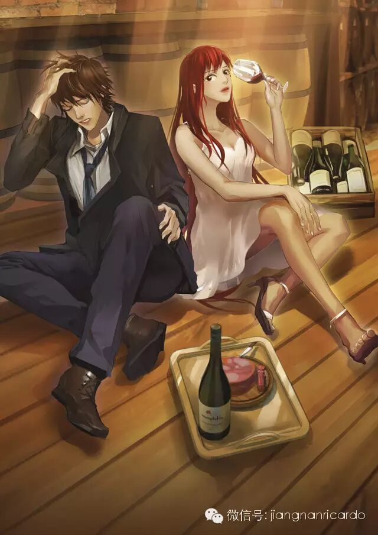

结论：暂时（20260721）==不看了==

这段挺有意思的：
节选自第 5 章 少年(4)：
...
走出电教大楼的时候，外面已经是大雨绵绵，门口空无一人，雨滴在水泥地砖上破碎。我打开伞，忽然看见那个白色的影子向我跑来，女孩穿了一条红色碎花的裙子去配那套白裙的上衣。
那是我距离她最近的一次，也是我对我的青春告别的一次。我直视她，微笑，努力勇敢，不掩饰我对她稚嫩的、无由的仰慕。我期待在那一刻她会觉得这个师兄有点奇怪，从而记住，==于是这场无果的爱慕便不是镜花水月==。
她的红裙在雨中翻动......哈!裙子真短!腿也许真是有点粗。
雨声落在我的耳中，仿佛雷鸣，我们擦肩而过。
我打着伞站在门外，看向光线昏暗的门洞里，她消失的地方。我大概站了十五分钟，然后转身离去。==我这一生诸多勇敢，也做过很多懦弱的事。==
...
目前 202607192349 看到第 9 章 城游(2)，目前江南的文笔不错，就是太散漫了，废话，这本书就是江南随笔精选啊。

202607211733 随笔写得有点散，我不怎么喜欢看了。最开始我以为江南与学姐 Celina(诺诺原型)的故事就在龙与少年游这本书里面，结果看了半天，才发现故事被发布在微信公众号了。我 c。

随笔来源：随笔丨粉黛
```
如今回忆起人生中对我最重要的时间段，竟然不是在北大，而是在合肥八中混世、梦想当古惑仔的那段时间，还有就是美国那五年。
因为在那段时间里我没有任何明确的方向，像一匹跑在荒原上的野马那样，探索一切的可能，在合肥八中我认识了兄弟，在美国我认识了姑娘。
其实美国是颜值的重灾区，并没有多少风花雪月，我还记得我第一年到美国，在联谊会上跟某系师姐见面打个招呼，扭头就说师姐好丑……跟我相熟的师兄语重心长地说，小伙子，那是你刚从国内来，在这里呆久了，你会觉得师姐越来越好看的……
但偶尔也会有惊才绝艳的姑娘，比如Celina。
Celina是我们学校中国舞蹈团的团长，这个名头很大，但委实说基本都是已婚妇女，亦即师兄们的夫人。已婚妇人异国陪读，无以寄托对人生的追求，便想着锻炼形体，那个舞蹈团便这么成立起来。其中只有少数是真正可追求的妹子，比如Celina。
说起Celina的名声，那是如雷贯耳，我曾去看过一场Celina的排练，剧场里稀稀疏疏坐了1/3的人。我不懂这场合的规矩，悄声问兄弟说居然有那么多人来看排练？兄弟说你看台上跳舞的就有多少人呢？有一个跳舞的，就得有一个家属来看对不对？
我说那也不至于那么多家属吧？兄弟哼哼着说，我们其他人都是来看Celina的！
Celina其实不是个冰山美人，是个很活泼的女孩，熟不熟你都不用仰望她，她自己会跟你打招呼，鹅蛋脸，细红框的眼镜，在运动场上跑得飞快，还是个开车很可靠的姑娘。
我没想过追求Celina首先是因为Celina比我大一岁，其次是Celina的追求者太多，我插不上队，最后是Celina有个很好的男朋友在哈佛读商科。
我们大家都相信某一天Celina会忽然转去哈佛或者麻省理工和她那伟岸多金的男友相会，她存在于我们这个排名全美第八的学校里只是个过渡态，而过渡态是不稳的，这一点谁都知道。
跟我抱着一样想法的低年级男生不少，我们参加Celina组织的郊游和聚餐，一起去看棒球赛，喝酒聊大天儿，不是为了跟Celina接近，而是想要认识别的女孩子。
Celina有一辆日产跑车，这也是那位人在哈佛的精英男友送的，Celina懂很多牌子的啤酒，Celina知道去意大利餐馆怎么点菜，Celina居然还能跟你聊足球，总之跟着Celina就能上层次，何况她还漂亮和优秀。
我跟Celina的关系绝说不上亲近，基本是个闲人，但是某个下午Celina出现在我的实验室里，那时候我正跟某种极臭的气体战斗，像只戴着眼镜的臭鼬——我们做实验都得戴防护眼镜。
Celina问我说你晚上有空么？我说有啊师姐有饭局么？我少年时代基本就这点出息……
Celina说有，但你得穿像样点儿，我说我有新买的牛仔裤，Celina说穿牛仔裤去吃法国菜会被人赶出来，我说呦呵吃法国菜？Celina说走我带你去买身西装。
西装倒是不贵，几百美金就拿下了，但是皮鞋贵，皮鞋也几百美金，我有点胆怯了，心说师姐这是要泡我？要泡我直说啊！不用那么委婉？我能上校网发帖求点赞么……开玩笑的，那时候还没点赞这个功能，我就是心惊胆战。
Celina拍拍我肩膀上的皱褶，说一会儿坐我旁边少说话，多吃东西，今晚上有牡蛎。
我于是坐在一间颇为豪华的餐厅里，吃着牡蛎，听Celina和她的哈佛男友谈分手……我的耳朵竖得很直，务必把这场惊天大八卦的每个细节都听进去。
哈佛男友真是金光闪闪，牛逼大了，在我土狗的岁月里我看到这等男人真是心生自卑，导致于我后来非常舍得在衣服上花钱，所有西装都是定制，还强行要投资我家裁缝楼下的酒廊……以便在心里农奴翻身做主人扬眉吐气……
俩人谈分手的同时也在谈结婚，电视剧的感觉，男友的主张是他在国内找到了一份非常好的工作，Celina应该立刻跟他回国，如果Celina不愿意回国也不要紧，他们结个婚就好，他觉得自己回了国，女朋友在美国很不安全。
这倒也非常霸道总裁，我喜欢……可是霸道总裁不是要娶我而是要娶Celina，Celina不喜欢，Celina说我嫁给你当家庭主妇？我也是辛辛苦苦考到美国来的，我不读书了跟你回国？你当我是你的保姆？
精英说那结婚！我们在一起那么久了我们结婚不就好了？Celina说你那只眼睛看我觉得我非你不嫁？男友说你们建筑那行就是画图画到死，女人怎么做？我跟你说国内有很多机会，你听我的没错，Celina说……
然后他们就决定要分手，然后就开始谈钱的问题，我这才知道Celina可以读我们学校那个很贵很贵且没什么奖学金的建筑系是因为男朋友慷慨出资，而男朋友也不是自己有钱，而是家里觉得Celina早晚是自家的儿媳妇所以慷慨出资……
最后Celina说没问题我把学费还给你，但我现在没有那笔钱，给我一年时间我分期给你，男朋友当时说了句把我惊呆了的话说，年利息按照定期算我也不多要你的。
Celina说可以！男朋友终于失去平静大声说你知道我为什么问你要利息么？他指着我说因为你今晚带了这个小子来跟我讲道！你不带他来我一分利息不要你的还暂缓你一年还那笔钱！
我说大哥你不要乱枪扫射老子他妈的就是来帮忙开车的！男朋友不屑地瞟了我一眼，大概也丝毫没觉得我有资格成为他的竞争者，说，我知道你们这种人有很多。
总之就是这么不欢而散了，Celina开着她的尼桑跑车送我回我的公寓，非常礼貌地说今晚辛苦你了，他那个人有时候发起脾气来不受控制我不敢单独见他了，我说你是很难过吧，难过了别强撑，我们可以组局吃饭一起骂那个傻逼。
Celina笑笑说其实我以前……很喜欢他的。
那之后Celina的生活一下子就变得拮据了，她打着好几份工包括黑工来支付自己的学费，好在最终男朋友还是坚持把那辆尼桑跑车送给了她，说那是礼物而不是需要偿还的东西，Celina卖了跑车，买了辆二手小丰田继续开着。
她仍旧是那么闪闪发亮，只有很少数的人知道她的辛苦，她渐渐地形容憔悴但依然微笑，用化妆来掩盖自己的黑眼圈，更多地出现在运动场而不是练习跳舞，她说她得保持运动否则就会倒下。
最辛苦的时候她问我借过钱说一个月就还，我尽我的能力给了她一张3000美元的支票，到期的时候她还了我一张3100美元的纸片说能否过一周再去兑？我就知道那时候她的户头里没有钱，还要一周，我把那张支票拿了个图钉钉在我办公桌对面的墙上，过了三个月才去兑的。
我说谢谢你送我西装和皮鞋，Celina说那是你的武装，就像女孩子用化妆来武装一样，你以后会有更好的武装。
再后来Celina毕业回国当了设计师，跟前男友结婚了，精英男一直等她，那应该是个蛮好的人，也是配得上Celina的人，只是太自我。想必如今他再也不敢跟Celina那样说话了，因为Celina无求于他，只是爱他而已。
Celina让我敬畏于女孩的骄傲和强大，原来粉黛之下，也会是钢铁般的内心。
```
