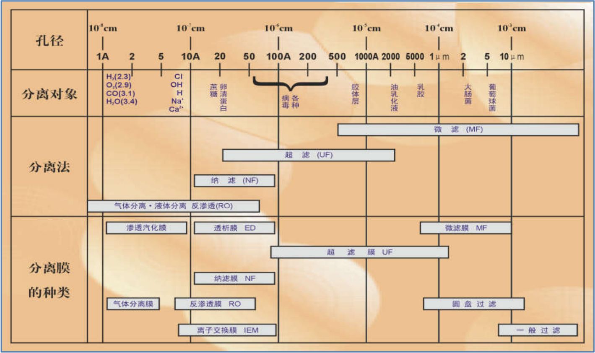
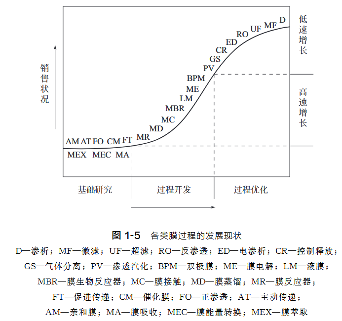
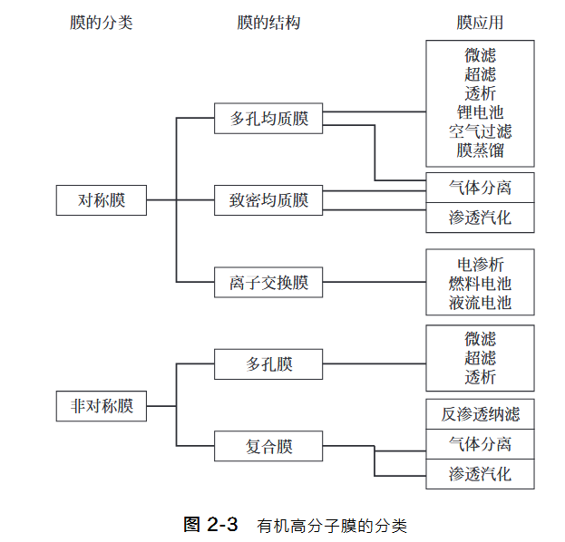

2025‎01‎0‎5
目录
##### 第1章导言
膜科学研究的基本流程
1.**材料**
- MOFs，COFs
2.**制膜**
3.**表征**
4.**应用**

膜一般很薄，厚度从几纳米、几微米至几百微米之间，而长度和宽度要以米来计量。

**渗透**：水（溶剂）过去。
**透析**：小分子溶质过去。
**渗析**：旧词，常混用，现在多被“透析/渗透”取代。

##### 第2章有机高分子膜
基本操作：配制 → 铸膜 → 成膜 → 后处理

##### 第3章无机膜

##### 第4章有机-无机复合膜

##### 第5章膜分离中的传递过程

##### 第6章膜过程的极化现象和膜污染

##### 第7章膜器件

##### 第8章反渗透、正渗透和纳滤

##### 第9章超滤和微滤

##### 第10章渗析

##### 第11章离子交换膜过程

##### 第12章气体膜分离过程

##### 第13章气固分离膜

##### 第14章渗透汽化

##### 第15章液膜

##### 第16章膜反应器

##### 第17章膜接触器

##### 第18章控制释放与微胶囊膜和智能膜

##### 第19章典型集成膜过程

