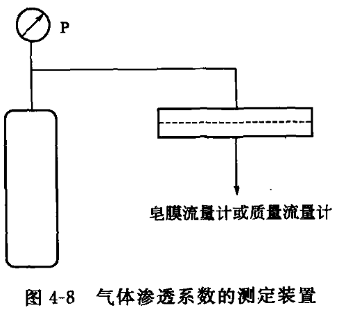
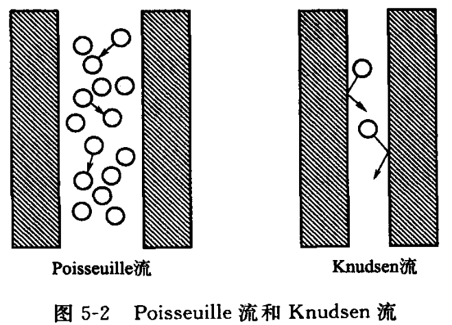

[膜基础]

# 4.膜的表征
主要是[结构参数]和[渗透参数]的测定
## 4.1 结构参数的测定
4.1.1 孔径的测定
扫描电子显微镜SEM
原子力显微镜AFM

4.1.2 孔隙率的测定
扔进水里面，然后测试质量差额

4.1.3 表面分析
X 射线光电子能谱 XPS
## 4.2 渗透参数的测定

### 选择性
膜的选择性可以用溶质截留率(retention)、分离因子表示。
(1)溶质截留率
溶质截留率[用于含有溶剂和溶质的稀溶液体系]，如反渗透膜表观截留率
(2)分离因子
分离因子[用于气体混合物或液体混合物体系]，如气体分离、渗透汽化。
分离因子 $\alpha$ 定义为
$$
\begin{equation}
\begin{aligned}
\alpha_{ij}=\frac{y_i/y_j}{x_i/x_j}
\end{aligned}
\end{equation}
$$
式中，$x$,y 分别表示原料侧和渗透侧组成；下标 $i$, $j$ 分别代表组分 $i$ 和 $j$。在选择分离因子时，应使其大于 1。例如，如果 A 组分通过膜的速率大于 B,则分离因子表示为 $\alpha_\mathrm{A/B}$ 。

### 渗透性能
气体渗透系数的测试装置如图 4-8 所示。

将已知厚度的均质膜装入测试池中，通入气体加压，渗透气体的量用质量流量计或**皂膜流量计**测定。
气体渗透系数是材料的本征性质，但并非常数，与样品老化状态、测试条件、所用气体种类有关。
CO₂、SO₂、H₂O、乙烯等是作用性气体，会改变聚合物的形态。
He、H₂、N₂、Ar、O₂ 可视为惰性或非作用性气体，不会改变聚合物的形态。
Tg 和结晶度是影响渗透系数的重要参数，这是因为传质主要发生在无定形区。

测定渗透汽化膜的渗透系数时，在膜上游侧的容器中加入纯液体，在膜下游侧抽真空，使下游侧压力低于实验温度下纯液体饱和蒸气压的 1/10，以维持足够的推动力。渗透通过膜的液体在下游侧蒸发，然后在冷凝器中收集称重。

在工业上经常需要测定膜的渗透参数，但吸附、浓度极化、膜污染等会严重影响渗透速率和截留率。例如，在化工、医药、食品等工业中使用的超滤膜，其实际水通量通常不到纯水通量的 1/10，而截留效果比预测结果好得多。微滤膜的实际水通量与纯水通量差别更大，有时很快降为 0。一般很难将结构参数直接与渗透参数相关联，因为简单模型中的孔构型（圆柱孔或球堆积间隙孔）与实际孔有时相去甚远。

在压力驱动膜过程中，回收率和体积浓缩比也是重要的参数。在连续操作中，设 Qₚ 为渗透液流量，Qₚ 为进料液流量，定义回收率 y 为：
$$
\begin{equation}
\begin{aligned}
y=\frac{Q_p}{Q_f}\times100\%
\end{aligned}
\end{equation}
$$
回收率的范围在 0~1。工业膜过程中通常希望回收率尽可能高，但随着回收率提高，不易渗透组分的浓度增大、膜性能下降。体积浓缩比 VCR 定义为初始原料流量与截留物流量之比，表示溶液浓度增加的程度：
$$
\begin{equation}
\begin{aligned}
\mathrm{VCR=}\frac{Q_\mathrm{f}}{Q_\mathrm{r}}
\end{aligned}
\end{equation}
$$

## 4.3 荷电参数的测定
## 4.4 其他参数的测定
玻璃化温度和结晶度
力学性能
稳定性
膜污染状况

# 5.膜传递机理
## 5.1 膜内传递过程
---
### 5.1.1 通过多孔膜的传递
##### 1.筛分模型
$$
\begin{equation}
\begin{aligned}
J = \frac{\varepsilon r^2 (\Delta p - \Delta \pi)}{8 \mu l}
\end{aligned}
\end{equation}
$$
##### 2.优先吸附-毛细管流动模型

##### 3.Knudsen 流动模型
当膜两侧存在压差 $\Delta p$ 时，气体以小孔 Knudsen 流或大孔黏性流（viscous flow）形式通过微孔膜。
**当孔径 $d_p$ 比气体分子平均自由程（即分子两次连续碰撞之间的平均移动距离，mean free path）$\lambda$ 小很多时**

气体与孔壁之间的碰撞概率远大于分子之间的碰撞概率，此时气体通过膜孔的传递属于 **Knudsen 扩散**。
这里，$\lambda$ 由下式求得：
$$
\begin{equation}
\begin{aligned}
\lambda = \frac{kT}{\sqrt{2}\pi d^2 p}
\end{aligned}
\end{equation}
$$
式中，$d$ 为分子的动力学半径。对于纯气体，可用 Knudsen 因子 $K_K$ 判断传递机制：
$$
\begin{equation}
\begin{aligned}
K_K = \frac{\lambda}{d_p}
\end{aligned}
\end{equation}
$$
当 $K_K < 0.01$ 时，通量用**黏性流公式**[泊肃叶（Poiseuille）方程]描述；
当 $K_K > 10$ 时，可视为**纯 Knudsen 扩散**。
通量为：
$$
\begin{equation}
\begin{aligned}
J_K = \frac{n \pi r^2 D_K \Delta p}{RT l}
\end{aligned}
\end{equation}
$$
式中，$r$ 为膜孔半径；$D_K$ 为 Knudsen 扩散系数，$D_K = 0.66r(8RT / \pi M)^{1/2}$，其大小与压力无关。
可见，$J_K$ 与 $M^{1/2}$ 成反比，**当组分的相对分子质量不同时可实现分离**。基于 Knudsen 扩散的气体 A 和 B 的通量之比称为理想分离因子：
$$
\begin{equation}
\begin{aligned}
\alpha = \frac{J_{K,A}}{J_{K,B}} = \left( \frac{M_B}{M_A} \right)^{1/2}
\end{aligned}
\end{equation}
$$
例如，氢-氮混合气的理想分离因子 $α=14^{1/2}=3.74$。假设该混合气通过 $γ-Al_{2}O_{3}$ 复合膜（表层孔径 2～4nm，平均压差 100kPa）的分离因子为 2.9±0.2，表明接近 Knudsen 流。
 >氦气/氢气理想分离因子 $α=(\frac{4}{2.016})^{1/2}=1.41$ 

从 $^{238}UF_{6}$ 中分离 $^{235}UF_{6}$ 的**理想分离因子很低**，仅为 1.0043，采用多孔陶瓷膜分离时**需要采用多级操作**。气体分离时，高温和低压都有利于提高λ，同时还可避免表面流动和吸附现象发生。

液体中分子间距离很小，$\lambda$ 只有几个埃，所以，液体分离中 Knudsen 扩散可忽略。当组分的相对分子质量处于同一数量级时，如 $\mathcal{O}_2$ 和 $\mathcal{N}_2$、己烷和庚烷，多孔膜分离困难，需要使用非多孔膜。见图 5-2。

##### 4.表面扩散

##### 5.毛细管凝聚

---
### 5.1.2 通过非多孔膜[致密膜]的传递

20 世纪 60 年代，Lonsdale,Merten 和 Riley 提出了溶解-扩散模型(solu- tion—diffusion model），描述通过非多孔膜的传递，适用于**气体分离**、**渗透汽化**、**反渗透**等过程。

假定膜是无缺陷的理想膜，溶剂和溶质首先溶解在无孔膜的表层中，然后各组分扩散通过膜（设组分间不存在化学势或通量间耦合），最后从膜下游侧解吸。
溶质和溶剂在膜中的溶解度和扩散系数是该模型的重要参数。

在溶解、扩散和解吸三个步骤中，涉及聚合物和组分间的相互作用，按照相互作用不同，分为理想体系、弱相互作用体系和强相互作用体系三大类。

##### 理想体系
聚合物和组分之间的**相互作用可忽略**时为理想体系。
##### 相互作用体系
当组分与膜存在**相互作用时不符合理想行为**。
表 5-1 为某些组分在聚二甲基硅氧烷中的渗透系数（40℃）
甲苯、三氯乙烯等的渗透系数比 $N_{2}$ 等小分子大 4~5 个数量级，这么大的差别是由于组分和聚合物间相互作用程度不同而导致溶解度和扩散系数不同之故。

|       气体       | 渗透系数/Barrer |
| :------------: | :---------: |
| N2  |     280     |
| O2  |     600     |
| CO2 |    3200     |
|       氯仿       |   329000    |
|      三氯乙烯      |   740000    |
|       甲苯       |   1106000   |
表 5-1 某些组分在聚二甲基硅氧烷中的渗透系数（40℃）

###### 溶解度
组分溶解度不符合 Henry 定律，等温吸附线为高度非线性的，特别是压力较高时。
当气体在玻璃态聚合物膜中的吸附等温线为凸形曲线时，可用双吸附(dual sorption) 理论描述。
该理论假设同时存在两种吸附机理，即基于 Henry 定律的吸附和 Langmuir 吸附，气体在聚合物中的浓度可用两种吸附之和表示：
###### 扩散系数
组分的扩散系数也与浓度有关，高溶解度通常会导致高扩散速率，这是因为渗透组分的溶解使聚合物溶胀，促进链节的自由转动，降低了扩散活化能；

另外，通过膜中溶解液体的扩散比通过固体聚合物快，扩散系数可用下列经验式表示：
$$D=D_0\exp(\gamma\varphi)$$
式中, $D_{0}$ 是渗透物浓度为零时的扩散系数; $\varphi$ 为渗透物的体积分数; **$\gamma$ 表示渗透物对链段运动的增塑作用**, 简单气体几乎不与聚合物发生作用, $\gamma \rightarrow 0$ 。

扩散系数与浓度的定量关系可用自由体积 (free volume) 理论解释。
> 自由体积是指分子间的空隙, 以大小不等的空穴形式无规分布在聚合物中, 提供分子运动的空间, 使分子链可以通过转动和位移调整构象。只有存在足够的自由体积时, 分子才能从一处扩散到另一处。

自由体积 $V_{f}$ 定义为 $0 K$ 的紧密堆积的分子受热膨胀产生的体积:
$$
\begin{equation}
\begin{aligned}
V_{\mathrm{f}}=V_{T}-V_{0}
\end{aligned}
\end{equation}
$$
式中，$V_{T}$ 为温度 $T$ 时的表观体积，由聚合物密度确定；$V_{0}$ 为 $0\text{ K}$ 时分子占据的体积，可由基团贡献法确定。

自由体积分数 $v_{\mathrm{f}}$ 定义为自由体积 $V_{\mathrm{f}}$ 与表观体积 $V_{T}$ 之比：
$$v_{\mathrm{f}}=\frac{V_{\mathrm{f}}}{V_{T}}$$
---
### 5.1.3 通过荷电膜的传递
离子通过**荷电膜**的传递受膜中固定电荷的影响。溶液中与膜中固定离子带相同电荷的离子受到排斥而不能通过膜，称为 Donnan 排斥。

---
综上所述，对于非荷电膜，从多孔到非多孔，其分离机理由筛分向表面力（膜/溶剂/溶质之间相互作用力）-孔流动、Knudsen 流动，直至溶解-扩散变化。
同样，对于荷电膜，从多孔到非多孔，其分离由筛分和 Donnan 效应机理到 Donnan 效应和溶解-扩散机理变化。

## 5.2 膜表面传递过程
### 浓度极化
#### 压力驱动膜过程

#### 浓度驱动膜过程

#### 电渗析过程

### 膜污染
## Questions
---
1.从多孔膜到非多孔膜, 分离机理如何逐步变化?
**1️⃣ 从多孔膜到非多孔膜：分离机理的逐步变化**

在膜材料由“多孔结构”到“非多孔致密结构”的演化过程中，分离机理经历以下变化：

| 膜类型             | 孔径范围       | 主导机理                       | 特征             |
| --------------- | ---------- | -------------------------- | -------------- |
| **微滤 (MF)**     | 0.1–10 μm  | 筛分（机械阻挡）                   | 粒子尺寸控制，类似筛网    |
| **超滤 (UF)**     | 1–100 nm   | 筛分 + 吸附                    | 高分子或胶体分离       |
| **纳滤 (NF)**     | 1 nm 左右    | 筛分 + 电荷排斥                  | 小分子有机物、二价离子分离  |
| **反渗透 (RO)**    | <1 nm（非多孔） | 溶解–扩散 (Solution–Diffusion) | 仅溶剂分子可透过       |
| **气体分离 / 渗透汽化** | 非多孔致密膜     | 溶解–扩散机制                    | 按分子溶解度和扩散系数差分离 |

👉 **总结趋势：**
从“物理筛分”（多孔膜） → “分子级传质与溶解扩散”（非多孔膜）
分离机理由**几何选择性**过渡到**热力学与动力学选择性**。

---
2.压力驱动膜过程、浓度驱动膜过程和电渗析中浓度极化有何区别?
**2️⃣ 压力驱动膜、浓度驱动膜、电渗析中浓度极化的区别**

| 驱动力类型    | 典型过程           | 浓度极化特征                         | 本质区别                        |
| -------- | -------------- | ------------------------------ | --------------------------- |
| **压力驱动** | MF, UF, NF, RO | 膜表面溶质富集形成浓度边界层；浓度梯度阻碍溶剂通量      | 由**溶质截留引起的局部富集**            |
| **浓度驱动** | 渗析、渗透汽化        | 由膜两侧浓度差形成扩散流，膜表面浓度偏离本体浓度       | **跨膜浓差**引起的偏析               |
| **电场驱动** | 电渗析            | 离子迁移受电场驱动，一侧富集、一侧稀释；出现极化层甚至水分解 | **离子迁移极限浓差**与**电位梯度耦合**导致极化 |

---
3.分析下列膜过程中浓度极化的特点:
(1) 超滤和微滤; (2) 反渗透; (3) 气体分离; (4) 渗透汽化; (5) 渗析; (6) 电渗析
**3️⃣ 各类膜过程中浓度极化的特点**

| 过程            | 浓度极化特点                         | 主要影响              |
| ------------- | ------------------------------ | ----------------- |
| (1) **超滤/微滤** | 溶质（胶体、蛋白质）在膜面富集形成浓差层甚至凝胶层      | 通量下降、膜污染严重        |
| (2) **反渗透**   | 盐类等被截留，膜面浓度升高 → 渗透压上升，净驱动力下降   | 降低透水通量、可能导致结垢     |
| (3) **气体分离**  | 若膜为非多孔致密膜，气体分压梯度导致轻组分富集于膜入口    | 较弱，但影响渗透速率与选择性    |
| (4) **渗透汽化**  | 液相侧溶质或非挥发组分富集膜面                | 改变局部活度，影响分离因子     |
| (5) **渗析**    | 由膜两侧溶质浓度差驱动扩散，膜面浓度接近平衡         | 极化层影响扩散速率，分离效率下降  |
| (6) **电渗析**   | 离子在膜表面堆积（富集层）或耗尽（稀释层），可能出现极限电流 | 降低迁移效率，甚至引发水电解副反应 |

---
4.减轻浓度极化的途径有哪些?
**4️⃣ 减轻浓度极化的主要途径**

| 控制途径             | 原理             | 实施方法            |
| ---------------- | -------------- | --------------- |
| **增强膜面湍流**       | 降低边界层厚度、提高对流传质 | 提高流速、错流过滤、旋涡扰流器 |
| **周期性反冲洗或脉冲操作**  | 破坏极化层结构        | 反洗、脉动流、气液混合冲洗   |
| **降低操作压差或电场强度**  | 减少溶质累积速率       | 优化运行参数          |
| **改性膜表面**        | 减弱溶质吸附         | 亲水化、荷电调控、抗污染涂层  |
| **多级串联或循环设计**    | 分散传质阻力         | 阶段式操作或并联膜组件     |
| **扰流板/中空纤维结构优化** | 增强局部剪切力        | 增加湍流再分布区        |

---
✅ **整体总结**
- **浓度极化是膜过程普遍存在的副作用**，其根本原因是“传质受限 + 截留累积”；
- 它的表现形式因驱动力不同而异（压力、浓度、电场）；
- 从多孔到非多孔膜，分离机理由筛分 → 扩散 → 溶解–扩散；
* 有效控制浓度极化是提升膜通量、稳定性和寿命的关键。

---

[膜过程]
# 8.气体分离
## 气体分离
气体膜分离是利用不同气体透过膜的速度差异而实现混合气体的分离。气体在膜中的传递过程可分为 3 个步骤：
①气体在进料侧膜表面吸附溶解；
②在浓度差的推动下扩散透过膜；
③气体在透过侧膜表面解吸。
通常，气体在膜表面的吸附溶解和解吸过程能很快达到平衡，气体在膜内的**渗透扩散**是气体透过膜的速率控制步骤。
### 8.1膜材料
气体分离膜应具有较高的气体渗透通量和选择性，能在 13~20 MPa 的高压下工作。在很多气体分离过程中，**选择性是主要问题**。常用膜材料有以下几类：

(1)橡胶态聚合物

(2)玻璃态聚合物

(3)高分子金属络合物

(4)液晶复合高分子膜

(5)无机膜

### 8.2膜应用
气体膜分离的工业应用主要包括：
从空气中富集 $\mathbb{N}_2$ 和 $\mathcal{O}_2$,从合成气
炼厂气中回收 $\mathcal{H}_{2}$ 或调节合成气组成
从天然气中脱除酸性气体$CO_{2}$ 和 $\mathcal{H}_{2}\mathcal{S}$
从空气或天然气中除水
 从天然气中富集回收 He 

在气体膜分离中，原料气的各组分应是不饱和的，以防止在膜上冷凝而引起膜性能劣化。实际中原料气的温度应高于露点 20~40°C .

