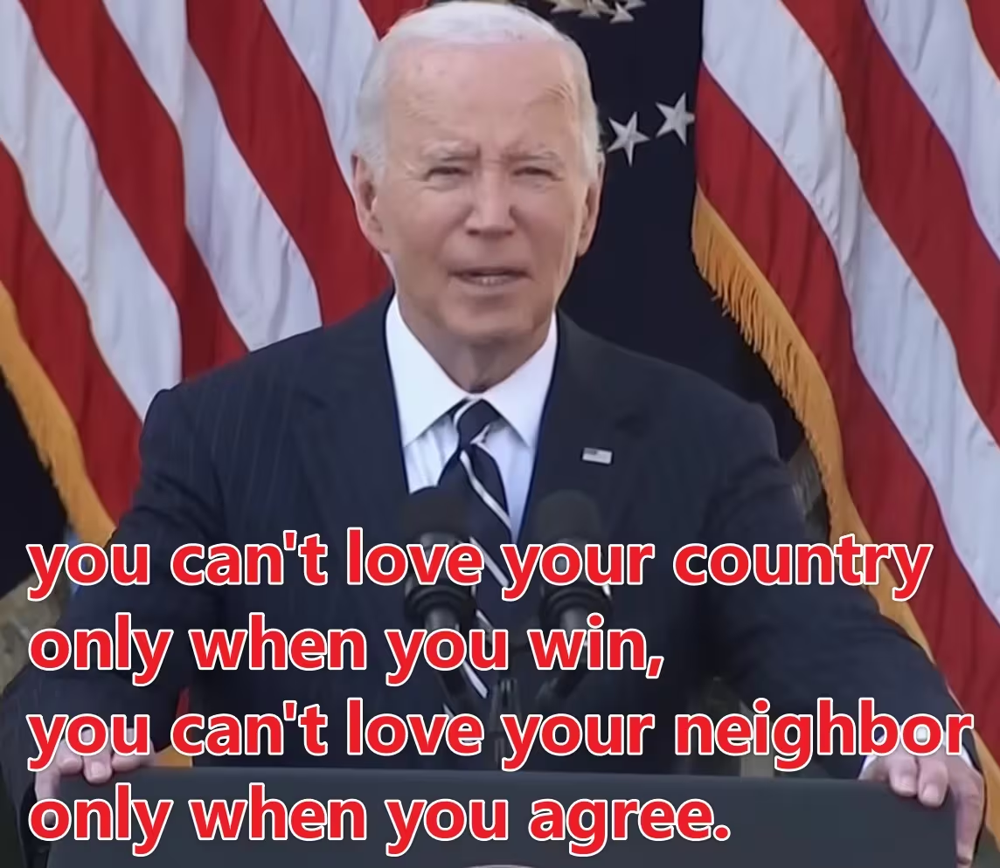
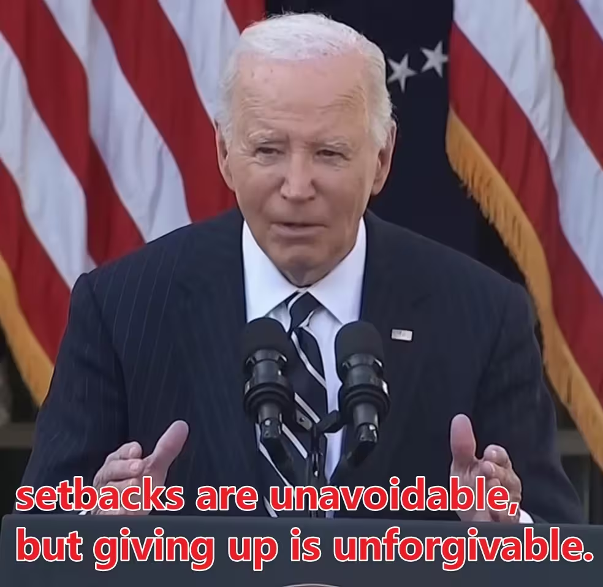

---
title: "随笔-202506 思绪汇总"
date: 2025-06-01
description: "随笔"
slug: 202506
tags:
  - 随笔
categories:
  - 随笔

---

# 随笔-202506 思绪汇总
## ‎本科毕业论文致谢
2025‎0‎6‎03‎0‏‎934
光阴荏苒，流年似水。忽觉四载春秋竟已悄然翻页，本科生涯如白驹过隙，承载着无数破茧成长的瞬间。致谢是毕业论文的终章，也代表着人生旅程新的开始。在此，我以最诚挚的文字诉说心底的感激之情，如正在燃烧的火焰，又似即将绽放的花朵。

春蚕到死丝方尽，蜡炬成灰泪始干。衷心感谢我的指导老师张中标老师，张老师对科学问题的敏锐洞察力与精益求精的治学精神，将始终激励我在未来的道路上砥砺前行。特别感谢钱伟老师，钱老师拥有着严谨的教学态度和丰富的学科知识，老师的耐心点拨总让我豁然开朗。感谢化工与爆破学院化学工程系的全体授课教师。诸位老师在课堂上的倾囊相授，为我奠定了扎实的专业基础，在课外实践中的悉心指导，更让我体会到学以致用的意义。

愿岁并谢，与友长存。感谢这一路上帮助过我的同学们和朋友，在本科学习阶段我们彼此陪伴，相互成长，你们承载了我青春的回忆。寒风凛冽独寂寥，瘦影摇曳伴清箫。感谢求学路上遇见的所有人，祝大家未来一帆风顺，各自奔赴山海不负韶华。

哀哀父母，生我劬劳。感恩我的父母，始终无私地支持我、理解我，让我有了追逐梦想的底气，你们是我最坚实的后盾。感谢我的妹妹，你是我生命的坚实支柱，更是我奋斗不息的动力。

但行好事，莫问前程。感谢全力以赴的自己，感谢那些奋笔疾书的日日夜夜，感谢无数个含泪仍咬牙坚持的瞬间。正是那些努力与坚持，成就了此刻的我。过去的日子里有收获，有失去，有成长，也有遗憾。我不是一个聪明的人，我接受自己的平庸，但我深知努力与坚持的力量；以后的路可能会坎坷不平，但我也坚信一分耕耘一分收获。往事堪堪亦澜澜，前路漫漫亦灿灿。

谨以此篇，送给我的二十二岁，送给我的本科生活，送给我的青春。

二零二五年盛夏。
## 三观问题
202506032225
**三观与亲密关系：一段思考的记录**
我愈发意识到，**三观是否契合**，是维系**人际关系**的一项核心因素。尤其在人与人之间的亲密交往中，三观的冲突往往不易察觉，却能在长期的相处中逐渐显露裂痕。当然一些沟通技巧可以弥补这些不足，但是终究是一个人的妥协，不是雪中送炭，而是杯水车薪。
**回顾旧观念：自我与他人**
这是前几日（大概是 5 月 30 日午休时）我在抖音上发的一则短文：
**此去经年，何日再相逢。他日仙界重相逢，一声道友尽沧桑。**
当时是感慨人与人之间的相逢既是缘分，而之后的路途却各自分化，能否同行，其实更多地取决于三观的契合与认同。想到大一时我曾在朋友圈发过一条说说，大意是“个人的快乐建立在他人的痛苦之上”。现在回想，才意识到那时的我忽略了一个根本：你可以自私，但**不能自私到以为别人不自私**。过去的我忽视了个体与环境之间的相互作用，也未能真正理解尊重与边界。钻了许多牛角尖，也撞过不少南墙。
**三观与亲密关系的交织**
深入思考后，我发现三观的差异在亲密关系中尤为敏感。
**边界感缺失**：健康的关系需要明确的边界。很多人（包括曾经的我）会误以为“关系亲密”就意味着“无所不谈”，甚至通过揭露隐私或贬低他人来快速建立连接。但这种方式建立的联系，是极不稳固的。
**语言与人设的风险**：靠脏话、废话或者搞笑“人设”来拉近距离，虽然短期有效，但长久下来可能会让人厌倦，甚至引发误解。很多人内心并不真的是好色或贪欲，但因为“搞笑”而把这些表现得过于明显，久而久之，人设崩塌，关系也难以维系。
**隐私与信任的底线试探**：有些人倾向于通过交换秘密来建立信任。但一旦这种隐私被误用，关系便很难修复。更有甚者有人通过侮辱性语言试探个人底线，这其实是一种对边界和信任的双重挑战。
我想起《亲密关系》这本书里的一些观点，比如亲密不等于融合，爱不是控制，而是给予空间。这种思考让我逐渐意识到，真正持久的关系，靠的不是情绪的高潮，而是价值观的深度契合与尊重。
总结：成长的轨迹
写下这些，是一次自我记录，也是一种思维整理。三观的冲突不一定是坏事，它也是我们认清自己、审视关系的契机。重要的不是追求完美契合的人，而是学会在相遇时辨识是否值得同行，在分别时坦然祝福。
成长，是不断撞南墙后的领悟；  
亲密，是建立在尊重与认知之上的深层理解。
## 对双标问题‎的思考
2025‎0‎6‎03‎2232
l've said many times 
you can't love your country only when you win,
you can't love your neighbor only when you agree.
——Joe Biden
我说过很多次了
你不能只在胜利时才爱你的国家，
你不能只在一致时才爱你的邻居。
——乔·拜登
setbacks are unavoidable,
but giving up is unforgivable.
——Joe Biden
挫折是不可避免的，
但放弃是不可原谅的。
——乔·拜登
以上出自《拜登祝贺特朗普胜选演讲》

你不能只在（对方行为的实质）时，才支持/选择/开始（对方行为的表象），可以发现这个句式的本质就是拆穿利己主义，暴打伪君子。

你不能在**孤独的时候**才**开始恋爱交朋友**。
你不能在**失败的时候**才**开始努力**。
你不能只在**需要安慰时**才去**听懂他人的痛苦**。
你不能只在**想赢的时候**才**讲规则**。
你不能只在**别人认同你**时才**表达自我**。

“你不能只在 X 的时候才 Y”这种句式，本质上是指出**选择性原则** 的问题。人们之所以会陷入这种双标行为，有几个心理机制：
**利己本能**
人在面对选择时倾向于选对自己有利的那一边。
**即时反馈心理**
人更关注眼前的感受和需求，而非长期价值。
**缺乏原则意识**
很多人没有**稳定的内在价值观**，行为完全随环境波动，导致在不同情境下标准不一致。（内核不稳定）

这种行为不仅是一种软弱的逃避，更是对“真正的价值”的消解。比如：真正的**爱国**是连在国家犯错时也愿意建设它；真正的**关系**是即使你不寂寞，也想与某人分享生活；真正的**努力**是在还没有失败时就开始耕耘。
也就是说，这些句式指出了一个核心问题：
“你做这件事，是为了它本身，还是为了你自己？” 

在痛苦时依然善良；
在失败时依然坚持；
在孤独时依然理智；
在被讨厌时依然自重。

## 榜样的力量
202506050938
秉承“团结、奋进、博学、奉献”的校训，弘扬“志存高远、追求卓越、求真务实”校园精神。

今天召开第十届“化学化工”专业奖学金，见到了（13 级）优秀校友**常智**，说的一番话令我深思，考虑到现在直到未来数十年“环境”会比较差，争取做你所在环境一批人里边最优秀的前几位，不会辜负你的努力的。

这个校友本科成绩并不突出，甚至考研是二战，但所谓流水不争先，争的是滔滔不绝，校友一路发扬“志存高远，追求卓越”的精神，最终成为国家级人才，确实是我应该学习的榜样。

志存高远，追求卓越。
值得深思。

## 对身材管理的一点认识
2025‎06060‏‎919
一般来说，**女性**腰臀比＞0.8、**男性**＞0.9 就可定义为苹果型肥胖，也就是“啤酒肚”身材。
**原因**
吹一瓶啤酒的热量≈吃一个苹果。
如果非得让啤酒背锅，那么只能说是你喝的太多了。
而形成“啤酒肚”的原因诸多，常见的有：
- 错误的饮食习惯，包括过量饮酒，暴饮暴食，爱吃**高糖油、高热量**食物等。  
- 缺乏运动，摄入热量远大于消耗，直接导致脂肪堆积。  
- 作息不规律，经常**熬夜**，这是当下中青年人肥胖和高血压率逐年攀升的诱因之一。  
- 情绪**压力**导致新陈代谢紊乱。
**危害**
啤酒肚可能会出现的疾病：
- 心血管疾病
- 第二型糖尿病
- 诱发癌症
- 睡眠呼吸中止
- 三高（高血脂、高血压、高血糖）
**解决方法**
要想减掉啤酒肚，可以从下面的方向来改变：
- 压力控管
- 戒烟
- 定期锻炼
- 健康饮食
**总结**
管住嘴，迈开腿，重回人生巅峰！

## 关于人生的思考
202506142141
关于人生的思考：人生的目的、意义以及人的一生该怎样活
1
一个人，当他遇到一些挫折，开始能生活感到迷茫之时，就会思考一些关于人生的问题。
未进大学之前，我便知道，大学早已不是象牙塔。但我想无论大学是怎样的，我都能坚持自我。
<mark>多读有用的书，多做有意义的事，让每一天都过得真实且充实。</mark>
可进了大学之后，我才发现，我的意志力并没有想象中那么顽强。
接着发现，我其实是一天性懒惰的人。
而现实生活却经常让你去做一些你很不愿意去做的事情。
所以，大学一年，我过得很糟糕，如果一直这样，那么我整个大学生活，甚至整个人生，都可能就此毁掉。
所以，我得思考清楚一些关于人生的问题。我需要这些问题的答案，来指导未来三年乃至整个人生的生活。
2
天于人生，有三个最根本的问题。
<mark>人生的目的；人生的意义与价值；以及人的一生该怎样活。</mark>
先思考第一个问题：人生的目的是什么？
每个人的人生都是有目的的，只不过，有的人的人生目的很明晰，而有的人，他的人生目的是潜在的，不是很明晰。
而且，每个人的人生目的都不同，人生的目的千千万万，是很难一一考察的。我要做的是，寻找这千千万万千差万别的人生目的背后的根本目的。
人的一生，是一个由出生到死亡的行为过程。不过，在我看来，人生并非就指人的一生，比如，人刚出生到一岁之时，天天在母亲怀里吃奶，此时便算不得是真正的人生。人生应该是自我意识觉醒之后，由自我意识主导的行为过程。
由自我意识主导的行为的目的包括在所以人的行为的目的之中。所以，我先思考的人所有行为的目的，细细考察下来，所的所有行为的目的只有三种：
<mark>保存自身；满足欲望；完善自我。</mark>
整个宇宙来看，有无目的是生命与非生命在行为上的区别，而所有生命最基本的第一位的行为目的就是保存自身。
包括人类。
从整个生命界来看，满足欲望的是动物与其它生命在行为目的上的区别。所有的动物在保存自身的基础上，都具有满足欲望的行为目的 nf。
包括人类。
从整个动物界来看，完善自我是人类与其它动物在行为上的区别。但是，并不是每个人都有完善自我的行为目的，当一个人被骂说“你不是人”时，通常就是因为他的行为只是以保存自身或满足欲望为目的——当然，情侣间调情除外。不过，可以肯定，只有人类才会以完善自我为行为目的。
只有人类。
那为什么有的人没有完善自我的行为目的呢？那是因为这些人的自我意识尚未觉醒或自我意识迷失了。人来到这个世界上的时候，他的自我意识是处于蒙昧状态的，这时候他的行为主要受本能冲动控制，行为目的则是保存自身和满足欲望。当他开始接触社会会，由于社会意识过于强大，人的行为会受到社会意识的影响，这时人或有完善自我的行为，但究其根源还是出于保存自身和满足欲望的需要。随着人的知识跟阅历的增长，人的自我意识就会渐渐苏醒，人就会反思自我，同时发现自我之不足，这个时候，人就会想着完善自我。但是，社会意识过于强大，很多人的自我意识往往屈从于社会意识。
3
前面说过，人的一生是由生到死的行为过程，而人生则是自我意识觉醒后由自我意识主导的行为过程。因此，人的人生目的包含在行为目的中，而人的三种行为目的中，只有完善自我才能成为人生的目的。
不过，光用完善自我四字来概括人生的目的，过于笼统，有必细化一下。
人的自我意识，是在反思自我的时候觉醒的。人开始反思自我的时候，就会发现自我之不足，这时，人就会想提升自我；当人发现自我之存在的时候，就会想实现自我；当人发现自我之渺小的时候，就会想升华自我。
因此，完善自我的人生目的，可以细分为提高自我，实现自我和升华自我。
提高自我是人生的基本目的，它贯穿于人生的始终。
实现自我是人生的根本目的，达到这个目的是自我存在的凭据。
升华自我是人生的终极目的，是提高自我的质变。
我们身处的世界，在空间上是无边无际的，在时间上是无始无终的，而自我之于世界，则是完全可以忽略的渺小。因此，我们只有升华自我，才能对抗这无边无际无始无终的世界。
要之，人生是人自我意识觉醒之后由自我意识主导的行为过程。人生的目的是完善自我。具体来说：<mark>提高自我是人生的基本目的；实现自我是人生的根本目的；升华自我是人生的终极目的。</mark>
4
第二个问题：人生的意义与价值是什么？
我起初认为，人生根本没有意义和价值，因为就个人而言，人总是要死的，就人类而言，人类总是要灭亡的，那么，人生还有什么所谓的意义跟价值呢？
但是，现在我又认为，人生是有意义有价值的。
我们估量一个事物是否有价值，就看它是否对我们有用，它的价值来自于的我们对它的认同。同理，人生的意义和价值来自于我们对人生的认同。
我们包括我（自我）和他人（社会）。
以前，政治书上常说，人生的真正意义在于奉献，在于获得社会的认可。这句话我五分认同。
所谓的五分认同，就是不完全赞同。通常情况下，你为社会做出奉献，便会获得社会的认同，从而实现了人生价值。但是——
但是，并非所有的奉献都能获得社会的承认。
假设，曾有一人卧底日本侵略军，但是为了保密，跟他联线的人只有一个，也就是只有一个人知道他的卧底身份。后来，很不幸，他的上线死了，也就没有人知道他的卧底身份了。抗战胜利后，他被当成卖国贼抓了，最后在人民的唾沫中死去。那么，这个人的人生，有价值吗？
当然有，谁也不能否认，一个为了民族大义奋斗一生的人是有人生价值的。
但是，他的人生价值显然不是在社会认同中实现的，因为根本没有人认同他。
这个世界是没有人认同他，除了他自己。
因此，他的人生价值是在自我认同中实现的。
人生的意义和价值，是自我存在的内在要求，是为了让自我存在更加真确可感。这其实就是人生的根本目的，即实现自我。而自我存在的真确可感，是通过认同实现的，这认同就包括自我认同和社会认同。但是，社会认同并不能直接产生价值感，它需要通过自我认同才能获得价值感。
所以，人生的意义和价值，最终是通过自我认同实现的。
5
第三个问题：人的一生该怎样活。
这个问题很难，因为人的活法有很多，我们很难认定，某种活法是对的，而别一种活法是错的。我们根本不应该在别人的活法上指指点点。
但是，我们可以在人生的目的和价值的指导下，对人生的活法设定一些基本原则和方向。
一、永远不要迷失自我，因为人生的根本目的是实现自我，人生的意义和价值在于自我的实现，没有自我的生活，不能称之为人生。
二、永远不要伤害他人，永远不要伤害自己。人不可能通过伤害获取认同感。
三、尊重生命，你之所以比别的生命高贵，完全只是因为你很幸运。
四、心存敬畏。无论你知道多少东西，对于未知的世界仍然微不足道；无论你拥有怎样的能力，对于无限的宇宙仍然渺小可笑。
五、让美成为生活方式。人唯有在美中，才能得到自我升华。
好了，就这些。我能想到的就这些了。这其中，前四种是人生观念，人唯有怀着这些观念生活，才像是人的生活。第五种是生活方式，是人应该追求的活法。
最后，说一个现象，包括我，很多人都曾感到人生的荒芜与空虚，这是因为我们开始反思自我，反思我们的人生，这是好的。要知道，这世界上还有很多人根本没有时间思考他们的人生，也没有办法作出自由的人生选，因为他们整天与饥饿为伴，随时都有死亡的威胁。因此，我们要为自己感到幸运，并思考出正确的人生观。
6
这篇文章耗费了十几天时间，还耗费了几包烟钱，而且曾一度因畏惧而中断，但总算写完了。
不管写得好不好，总算写完了。
至少我不像做其它事一样，总是半途而废，经过艰难的思索，我终于把它写完了。
无论如何，完成一件事的心情总是很愉快的。
我现在就很愉快，但是我也知道这篇文字有很大的局限。
关于人生的问题，有很多先哲已经思考过了，而且思考得更深。
而我的知识阅历，则达到不到解决这个问题的程度，所以这些只是我坐在井底，仰望星辰的一些思考。
我之所以写下来，是为了梳理一下我所思考的东西。
所以，勿笑！
文 | 谢小楼
2012 年 7 月 27 日
后记
这是我刚上大二时，写一篇文字，写下的时候，我就知道它很不完善，但我依然很珍惜它。
那是我第一次，试图从整体的甚至接近形而上的角度，来思考人生，即使思考不完善，文字写得不好，我依然很看重这次思考，很珍视这份文字。
令人痛心的是，这么多年过去了，我没有完善我对人生的思考，甚至忘了我自己曾经如此用心地思考过人生。
今天发出来，算是鞭策一下自己，再不努力，我都不如八年前那个自己了。
电影《无问西东》中，吴岭澜说：“我从思索生命意义的羞耻感中，释放出来，原来这些卓越的人物，也认为花时间思考这些，谈论这些是重要的。今天，我把泰戈尔的诗介绍给你们，希望你们人以后的人生中，不要放弃对生命的思索，对自己的真实。”
——自勉。
## 关于爱情与亲密关系的思考
202506151221
亲密关系中，真正意义上的亲近需要跨过一个必然会有的，真实抗拒的部分。我们都知道在恋爱初期，人们会有一种和伴侣高度融合的体验，有人甚至可以做到为对方去死。但这种亲密很脆弱，因为它指向的是一个理想客体，并体验到了一个与之关联的理想自我，这是热恋时才会有的特殊体验，本质上它是两个人的自恋借助对方实现了一种共同的满足。随着时间的推移，关系的递进，双方的理想化滤镜就会去除掉，这时候就要面对一个赤裸裸的真实的人，面对那样一个可能有着瑕疵和问题的人，它会直接威胁到一个人的自恋一一当对方不再是理想客体的时候，我们也就不再是理想自我，我们也就无法借着对方去进入一种浪漫叙事，自我感动。有人甚至会进入一种自恋防卫，会对伴侣产生强烈的厌弃和想要疏离，因为那个真实个体威胁着一个人心中的理想客体一-与那个真实的人重合就会被污染，所以想要摆脱。也就是在这个重新产生的裂隙中，关系才真正开始，游戏才开始变得有难度。因为这是一个不再靠直觉和本能就能够跨过的领域，它需要知识，需要学习，需要行动，需要建设，需要共情，需要协同，它考验着一个人全方位的心智水平和情感功能，大多数关系都会在这个阶段进入无能的沉默，哪怕看起来还在延续着。

很多人不相信爱情，是因为这个阶段的体验佐证了自己的想法。有些不能够跨过，是因为一开始就选择了错误的人；有些不能够跨过，是因为自己的迟疑和恐惧；还有些人不能够跨越，是因为冲突和隔阂导致的情感关闭。最难以跨过的是自恋的阻抗，有谁会相信爱情这件事是需要学习的，人们只想要各种简化的真理，只想倨傲的用个人的有限体验，对这个接近无穷的情感领域，做出简单而终极的个人解释。

而那些跨过这个阶段的人，会有完全不同的感觉，会在那个早已熟悉无比，普通至极的伴侣身上，感受到毫不动摇的依恋和信任，依然渴望分享和链接。和第一阶段不同的是，那不再是一种浪漫叙事，它不再是单纯的满足自恋，它从一人关系变成了二人关系，变成了"我们之间”,这是跨越第二阶段才会有的体验。
## 永远的安理人思考
202506152048
秉承“团结、奋进、博学、奉献”的校训，
弘扬“志存高远、追求卓越、求真务实”校园精神。

## 本科毕业感想
202506131802
202506181254
刚才参加本科毕业典礼，拿到双证，意味着本科生活的彻底结束。
本科毕业，那么之后要干什么呢？读研，工作，房子，生活，还要处理婚姻的烂摊子。
<mark>过去</mark>
**个人规划**
现在捋一捋大学期间的想法。其实没转专业的原因很简单，绩点高可以走推免[本来想着可以跨专业推免（其实转专业也是因为对化工厂倒班工作环境差早有耳闻），但实际学习上还是不可避免的以化工为主线学习]，推免可以保证学历的提升，我觉得最起码还是要有硕士学位这块敲门砖[学历学位对我而言是一种手段方法]，所以抱着推免的想法我没有转专业继续卷绩点[假如成绩达到转专业要求，但是推免无望，我大概率会转专业]。综合而言，学习卷绩点这件事，虽然看上去是大学前三年都在干的事，但是目的不一样。大一上学期是朦朦胧胧的意识到未来规划的重要性，大概做了这样一个规划框架，然后发现可以走推免这条路，所以我后面几年开始按部就班进展下去。然后事实上也可以证明我这条路走通了，虽然效果仁者见仁智者见智，但是终究是可行的。
**职业规划**
然后我看同学们的职业规划方面，我猜测应该是考研前的大三学期开始的，面对就业和考研考公的分岔路，不同人有不同的选择。因为我相对来说有更早的规划，因此我会提前计划好一些事，比如竞赛[可以提升推免的概率，对于考研也是加分项]；对于就业人员而言，实习可能比较重要。
**个人感情**
感情方面，我喜欢一个叫 smy 的女生，可惜人家在大一和大四都找了对象，[感情方面我是没有立足之处]。回头看看大一学年的自己，又黑又矮，与众不同的地方可能是丑得吓人，丑得不一样，还没事剃个寸头，思考人生，我那个时候其实只是单纯的觉得寸头也不错，方便。人家找对象嘎嘎快，我是和尚庙敲钟。大一追人家，估摸着看不上我；大二还是大三追[这个时候已经分手处于单身状态]，假如成功，后续可能去不了天大，最多去吉大；大四在二月底我直接拉了坨大的，给人家骗出来说做社会实践，给人家说我可能喜欢她，我自己当时也不知道自己的心意，铺垫了很久聊了很多[大概从下午 4 点聊到晚上 8 点]，我不想和喜欢的人做朋友，特别是她还有对象，于是最后祝愿她好好生活。
写下这些文字的时候心乱如麻，想了很久，我自己也是脸圆圆的，大概 174cm，65kg，有小啤酒肚，也没啥气质，就是单纯的屌丝男士吧，[人家长得漂亮白白净净的]。**我悄悄的碎掉了**。然后就在一个夜黑风高的晚上，我悄悄删除了人家的联系方式，悄悄的碎掉了。虽然拍毕业照的那天下午，我躲在会议室不敢拍照，但是看见那么多人，我犹豫了很多次，腿都软了，请求和她合影，出于礼貌吧，她同意了，我很高兴。然后就没有然后了。
我悄悄得碎掉了，此去经年，何日再相逢？可能没有下次见面的机会了。我也不知道为什么会喜欢她，可能喜欢一个人不需要理由吧，这大概是我这辈子最后一个纯粹的喜欢一个人了，而且到后面我感觉有点释怀或者爱上她了，虽然我不知道什么是爱，但我很希望看见她过的很好。这种被激素刺激的喜欢和爱意让我 emo 了很长一段时间，一种爱而不得的痛苦。实话实说，smy 是我奋发前行的动力之一，按照我原本的规划，我本来是准备在大学毕业的时候给她表白，**这是一段小有遗憾的岁月**，我悄悄得再次碎掉了。可能是爱而不得吧，或许遗憾总是难以释怀的，总之我十分难过，碎成一片又一片。
写于**202506131802**。
罗伯特·斯滕伯格提出爱情三角理论，爱情由三种不同的成分组成：**亲密**(intimacy)，**激情**(passion)和**承诺**(commitment)。
如果缺乏亲密或承诺却有强烈的激情，那就是**迷恋**。当人们被几乎不认识的人激起欲望就会有这种体验。斯滕伯格承认，他在 10 年级时曾痛苦地迷恋过一位生物课上的女生，为她衣带渐宽，但最终也没勇气向她表白。他现在认为那种爱情仅仅是激情。他对她的爱是迷恋。
**衣带渐宽终不悔，为伊消得人憔悴。**
正如爱情三角理论所指出的，性吸引力（或者“激情”）是浪漫爱情必不可少的特征之一。所以，如果恋人对你说“我只是想和你做朋友”，会令你很受伤。
**春心莫共花争发，一寸相思一寸灰**。
写于 202506181254。

**总结**
总的来说，我是为了提升自我读研，变得更加优秀，读研后期望进入高薪资行业。工作是为了打造事业。房子与婚姻，是阶段性目标。我希望成就一番事业。上大学以来我的规划是：拿到学士学位证和毕业证，拿到硕士研究生录取通知书。目前我已经拿到天津大学化工学院[硕士研究生的录取 offer]，加入[膜科学与海水淡化课题组]，接下来进行学习深造。
<mark>现在</mark>
**认知**
战略上藐视敌人，战术上重视敌人。现在有点怀疑当年的认知水平了，当年战略上蔑视敌人，战术上轻视敌人。
**专业技能的重要性**
专业技能的问题，大学学到啥了呢，Autocad？Aspen Plus？Matlab？**技术不能变现，就只是爱好。技术是卷不完的。**
短期主线应聚焦于研究生学习准备（学术能力、生活适应等）
提升专业性，不可被替代性，做一些属于自己的东西。
**规划**
规划在膜材料或海水淡化领域的技术深耕方向。
建立技能壁垒：掌握一项“能变现”的技能，比如编程、数据分析、仿真建模、SCI 论文写作、英语口语等。
**主动靠近资源**
积极与导师沟通、参与课题组项目、寻找横向合作机会。
**构建自己的人际网络**
别让自己在研究生阶段再次“孤军作战”，人脉是职场最硬核的“外挂”。
## 对日本经济兴衰必然发生一些观点认识‎
2025‎0‎6‎19‎‏‎1027
<mark>观点 1：婴儿潮必然带来大学生失业潮。</mark>
这句话的逻辑是这样的：
> **婴儿潮 → 人口基数变大 → 大学生数量激增 → 就业岗位不足 → 失业潮**

从人口结构的角度来看，这条链条是有一定事实依据的，
但它的**必然性**需要被打一个问号，因为其中每一步都受到其他变量的影响。
历史案例：对比日本、中国、欧美
**日本**：
- 1947-49 是日本的婴儿潮高峰（称“团块世代”）。
- 1960-70 年代这些人进入大学或就业市场，正值日本经济高速增长，就业市场吸收力强，“失业潮”被经济繁荣消化掉。
- 反而是后来的**泡沫破裂 + 少子化 + 经济停滞**，让年轻人遭遇“就业冰河期”。
> ✅ **结论**：婴儿潮 ≠ 必然失业潮，关键看经济增速与产业结构是否匹配。

**中国**：
- 90 年代初是计划生育严格执行前的“尾巴”，也就是今天的 20 出头至 30 岁的主力劳动力。
- 高等教育扩招（1999 年起）导致大学生人数激增，但**产业升级未同步，岗位质量下降**。
- 当前中国大学生就业难，本质上是**人口结构变化 + 经济转型迟缓 + 教育与岗位脱节**的结果。
> ✅ **结论**：婴儿潮造成教育和就业资源紧张，但就业压力是否转化为“失业潮”，要看制度与经济弹性。

在缺乏产业和政策配套的情况下，婴儿潮很可能演化为大学生就业难甚至失业潮。
<mark>观点 2：日本学历贬值的结构性陷阱：劳务派遣与教育市场化的双重冲击</mark>
日本社会长期以来是一个典型的“**学历社会**”，学历被视为阶层跃升和稳定人生路径的通行证。然而，自 1990 年代末起，一系列制度改革与经济现实共同引爆了“学历贬值”的深层危机，其根本原因可以归结为两个方面：**劳务派遣制度的市场化**和**高等教育的市场化改革**。

***
一、**劳务派遣市场化**：打破学历与体面工作的稳定关系
1999 年《派遣劳动法》的修正极大放宽了派遣用工限制，原本只允许在临时岗位使用的派遣工，开始被广泛用于常规岗位。企业为了降低人力成本，大量压缩正社员岗位，改以合同工、临时工和派遣工为主，导致：
* **学历不再保障体面职业**：即便毕业于名校，也难以获得稳定正职。
* **大学生被迫进入低技能岗位**：如便利店、流水线、客服中心等。
* **收入与社会地位严重脱钩**：同样是本科毕业，正社员与派遣工收入差距悬殊，社会尊重也不同。
这一变革摧毁了“学历=稳定工作”的信仰，形成了“高学历、低岗位”的结构性错配，严重打击了青年信心，催生了大批“高学历穷人”。
***
二、**大学市场化改革**：使高等教育变成高风险投资
2005 年，日本实施大学法人化改革，要求各大学自负盈亏。这导致：
* **大学学费急剧上涨**，教育成本激增；
* 学生普遍依赖**助学贷款求学**，平均负债高达 300 万日元；
* 然而大学毕业后的**就业回报不足以偿还贷款**，至 2010 年已有 33 万人贷款违约，陷入“信用破产”。
大学变成了高投入、低回报的“教育投机”，不再是稳定晋升的保障。面对沉重的经济压力和不确定的职业前景，越来越多的年轻人放弃升学，直接在高中毕业后就选择就业，日本社会逐步滑向“**低学历化**”趋势。
***
三、教育信仰崩塌，社会欲望退化
学历贬值带来了深远的社会心理影响：
* **青年低欲望化**：不婚、不育、不消费成为常态；
* **中产焦虑加剧**：家庭仍将巨资投入升学竞争，却回报无期；
* **社会阶层固化**：教育不再提供平等竞争的可能。
这种制度性挫折，成为日本“失落的三十年”的典型缩影。
***
四、迟来的反思与政策修正
2010 年后，日本政府开始意识到问题严重性，逐步推动：
* 实施**同工同酬**；
* **限制派遣用工的等级歧视**；
* 改善派遣员工的晋升渠道和待遇。
尽管改革姗姗来迟，但已显示出对“过度市场化”教育与就业制度的反思。
***
📌 核心结论
> 日本学历贬值不是某一制度的偶发副作用，而是**劳务派遣制度扩张与教育市场化改革**在经济长期停滞背景下，共同塑造出的结构性悲剧。它打破了“学历—正职—中产”的旧有路径，迫使整个社会重新思考教育的意义与价值。

对于当下的中国，这一过程具有重要的警示意义。如果不尽快改革教育结构、优化岗位质量、遏制非正式就业的泛滥，“学历贬值”极可能在未来十年内演变为中国社会的核心矛盾之一。
<mark>观点 3：学历信仰崩塌的时代创伤：从高投入教育到低回报社会的断裂</mark>
尽管日本早在 2000 年代初便已陷入“学历贬值”困境，但出于社会观念的惯性，大多数人仍相信“知识改变命运”，并将教育作为最重要的家庭投资。然而，现实并未给出相应的回报。**对于那些在泡沫破裂后成长的一代人来说，教育信仰的崩塌，成了一种深刻的时代创伤。**

***
一、**“最后一代精英教育”成为高风险押注**
日本在 1990 年代仍推崇高度竞争的应试教育制度，社会普遍认为“考上好大学=进入大公司=稳定人生”。这一代学生：
- 经历了最激烈的升学竞争，是**日本“鸡娃”最严重的一代**；
- 家庭倾尽资源支持其求学，是典型的“教育投资型中产”；
- 但步入社会时，正值**泡沫破裂 + 派遣制度泛滥 + 高失业率**，文凭回报断崖式下跌。
他们亲身经历了：**一个将学历神化的社会，如何将他们抛入现实的低谷。**
***
二、**高学历群体成为“隐形受害者”，走向心理边缘**
- 2000 年以后，日本的自杀率持续攀升，高峰期每年超过 3 万人；
- 其中大量为**受过良好教育却长期处于非正式就业状态的年轻人**；
- 精神压力来源包括：工作不稳定、债务沉重、社会期待落差大。
这是日本社会中最具象征性的悲剧：**最听话、最努力的一群人，反而在社会转型中首当其冲被牺牲。**
***
三、**就业回暖，却“为时已晚”**
近年来，随着人口老龄化与劳动人口紧缩，日本就业环境逐步回暖，出现某种“重返 80 年代”的迹象：
- 企业重新感受到“人才荒”；
- 正社员岗位回升，就业机会增多。
但对于曾在荒芜中奋斗的一代来说，这一切已失去意义：
- **他们的黄金年龄已过去，人生轨迹已定型**；
- 社会保障与职业上升空间严重不足；
- 甚至在制度纠错之后，依旧被忽略与边缘化。
***
四、**从他国经验中反观当下中国**
2025 年的中国，同样面临大学生就业压力剧增的问题：
- “学历=稳定未来”的信仰正在被现实撕裂；
- 高考竞争依旧激烈，但学历含金量不断下降；
- 教育成本高、岗位稀缺、期望落差大，成为当代青年的集体焦虑。
日本的教训告诉我们：**教育信仰一旦崩塌，带来的不是理性转型，而是集体幻灭。**
***
📌 核心结论
> 日本学历贬值的故事并未随着制度修复而结束，其深层伤痕体现在一个“失去黄金十年”的年轻群体身上。这不仅是一段关于教育回报的失败史，更是一场社会价值体系的全面坍塌。

对我们而言，这是来自未来的镜子。要避免重蹈覆辙，关键在于：**不再以“学历至上”压榨个体，不再让制度变革迟滞于一代人的青春。**
<mark>观点 4：行业兴衰的预判与现实错位：教培泡沫与养老幻影的双重映照</mark>
“很多都不需要预测就知道啊，教培行业肯定不行，养老行业肯定可以”，这句话看似直白，却揭示出两个值得深入反思的现实：
- 为什么“看得见的泡沫”依然会被推上高点后再惨烈破裂？
- 为什么“看得见的蓝海”却长期停留在幻象层面、难以落地？
同时，对比日本泡沫经济后的结构变化，我们正在经历相似的路径，值得我们**以未来的视角重新理解当下的现实与抉择**。
***
一、**教培行业的幻灭：需求真实，模式失败**
在中国，教培行业曾一度狂飙突进，背后是家长期待通过教育“逆天改命”的刚性需求。但即便如此，它还是迅速被政策按下“暂停键”：
- 教育资源过度市场化，焦虑被无限放大；
- 资本疯狂逐利，教育沦为“收割工具”；
- 最终被国家以“双减”之名整顿，行业瞬间瓦解。
这与日本泡沫时代对奢侈品、股市、房产的信仰如出一辙：**需求是真的，疯狂是病态的**。
日本当年年轻人狂热追求消费主义，中国家长如今押注教育赛道，本质上都是对“阶层跃升”的不安全感的回应。而当宏观环境逆转，幻觉破裂时，受伤的总是中产与青年。

***
二、**养老行业的潜力困境：蓝海为何变成“PPT 产业”？**
理论上，养老是**最不需要预测的行业**：人口老龄化数据摆在眼前、需求巨大、痛点清晰。
但现实却是：
- 除了“卖保险”外，养老产业始终未能形成稳定盈利模式；
- 资本进入后发现“没法快钱”，逐渐撤退；
- 服务、人才、医疗、政策等配套体系严重滞后。
这也是日本的老问题：
- 虽然老龄化全球领先，但除去极少数成功案例外，大多数养老模式仍停留在政府兜底与传统观念之间；
- 年轻人不愿为老服务、老年人不愿花钱养老，产业被“夹在中间”。
这说明：**有数据支撑≠能形成产业**。养老的难，不在预测，而在“落地”。
***
三、**泡沫社会的结构共振：从日本看中国**
> “就从日本泡沫经济年轻人的消费，就业，生活，婚嫁，和我们十几年前地产起飞一模一样...而泡沫之后，日本的消费，就业，生活，婚嫁和我们现在又很像，日本真可以作为模板研究。”

这段描述提供了极具穿透力的类比：

| 维度  | 日本泡沫时代  |   中国过去十年   | 日本泡沫破裂后  |   中国当下    |
| :-: | :-----: | :--------: | :------: | :-------: |
| 消费  | 奢侈主义盛行  |  超前消费/高房贷  | 极简、理性回归  | 低欲望、消费降级  |
| 就业  | 正职保障体系  | 高薪互联网+公务员热 | 派遣盛行、不稳定 | 灵活就业+平台用工 |
| 婚姻  |  高婚育率   |  房+车+育儿焦虑  |   不婚不育   | 婚育率断崖式下跌  |
| 产业  | 房产/金融泡沫 |  教培/地产过热   |  工业空心化   | 出口受压+内需疲软 |

结论是显而易见的：**中国当下越来越像泡沫破裂后的日本**，而非泡沫中的繁荣期。

***
四、**真正的预判，是制度与结构的提前修复**
我们不缺“趋势判断”，缺的是对“现实困局”的制度化应对：
- 教培泡沫不是需求的问题，而是制度设计与社会目标出了偏差；
- 养老不是没人看到，而是没人能为它“建桥铺路”，变愿景为现实；
- 人口红利已退，产业升级却未完成，就业结构裂缝难以弥合；
- 如果不进行跨周期治理，未来的中国可能面临“泡沫已破而自觉繁荣”的幻觉陷阱。
***
📌 核心结论

> 中国并不是没有看到问题，而是**清醒得太晚、执行得太慢、配套得太弱**。从教培到养老，从消费到就业，我们已经站在日本 30 年前转折点的回音里。如果只停留在“我们比他们幸运”而不去深刻改革，那些历史的尘埃，最终仍会落到个人身上，压出沉重的代价。

最聪明的预测，不是喊破喉咙，而是提早准备。真正值得下注的，不是风口上的幻象，而是那个**难、慢、但是必须做的长期系统工程**。
## 对政治风波的一些思考
2025‎0‎6‎‎19‎1446
##### 🧭 一、与“89 事件”性质相似的历史事件

1.匈牙利事件（1956）

- 匈牙利民众、学生、知识分子要求民主改革、退出苏联阵营。
- 苏联派遣军队武力镇压，约 2500 人死亡。
- 结果：改革失败，原体制加强。
🔗 **相似点**：学生主导、民众大规模动员、诉求政治转型、强力镇压。
***
2.布拉格之春（1968） – 捷克斯洛伐克
- 共产党内部改革派（杜布切克）推动“带人性面孔的社会主义”。
- 社会充满希望，但苏联和华约国家**出兵镇压**。
- 改革失败，捷共强硬派重新掌权。
🔗 **相似点**：政治开放受欢迎 → 被上层干预逆转 → 长期保守化。
***
3.光州事件（1980） – 韩国
- 在军人统治下，民众要求民主化。
- 全斗焕政权**武力镇压光州起义**，据称死亡数百人。
- 后期韩国民主化成功，但当时镇压非常残酷。
🔗 **相似点**：地方起义、强力镇压；但不同的是后来韩国走向民主。
***
4.缅甸民主运动（1988）
- 大规模学生运动要求结束军政府统治；
- 军方镇压，死者估计达数千人；
- 随后军政府长期延续，直到 21 世纪才部分开放。
🔗 **极为相似**：学生主导、城市为中心、武力镇压、政权更强硬。
***
##### 🧠 二、这类事件的共性
1. **学生或知识分子是先锋**
2. **诉求以自由化、反腐、民主为主**，初期非暴力
3. **政府因担忧体制崩塌而强硬反制**
4. **最终走向镇压，开启政治“再收紧”周期**
5. **在历史记忆中被部分压制、模糊或扭曲**
***
##### 📉 三、不同点：**“走向”各异**

|国家/地区|事件|后续走向|
|---|---|---|
|匈牙利 1956|镇压 → 苏式强化|数十年维持现状|
|韩国 1980|镇压 → 十年后民主化|最终民主制度确立|
|缅甸 1988|镇压 → 封闭化|后期偶有波动|
|中国 1989|镇压 → 经济放开+政治收紧|政治稳定+意识形态重构|

***
##### 🧩 总结一句话
> 世界历史上确实有许多类似“89 事件”的案例——即体制内外呼吁政治改革的高峰期被强力压制，最终导致改革失败、政权更加稳固。这些事件往往在短期成为历史禁忌，但在长期历史叙述中，成为国家走向现代性的关键拐点。
***
## 研究生阶段破局行动计划
202506221630

一、为什么要写这个计划

本科阶段留下了一些遗憾，也对自己产生过怀疑。进入研究生，不想再被情绪和惯性推着走，所以给自己做一个相对清晰、可执行的规划。
目标很简单：这三年不再混、不再虚耗，把路走实。

二、学术能力：先站稳，再往前走

我已经确定进入天津大学化工学院，加入膜科学与海水淡化相关课题组，方向是明确的，但对科研能力并不自信。所以这一阶段的重点不是“多厉害”，而是尽快适应科研节奏，建立基本信心。

主要目标：
适应研究型学习方式
掌握基本科研方法
尽早进入课题状态

具体安排：
提前预习方向内容
阅读膜材料、海水淡化相关文献
至少 3 篇综述 + 3 篇近两年 SCI
重点关注术语、研究思路和方法

尽早与导师沟通
了解研究方向、项目和带学生风格
必要时提前邮件联系，表达准备意愿

补齐科研工具能力
Zotero / NoteExpress
Origin / Excel
Python 或 Matlab
LaTeX

三、技能积累：让自己不那么容易被替代

我逐渐意识到，只有兴趣但无法变现，很难长期立足。研究生阶段，需要开始为未来负责。

主要目标：
拓展通用能力
打造 1–2 项可迁移技能

具体安排：
选定一个相对专精的技术点
膜过程建模、材料制备或分离模拟
在某个细分点上做到清楚明白

提升通用能力
PPT 和科研汇报
英语听说
争取至少一次公开或组内汇报

培养可变现技能
科研插画、文献翻译
数据处理、小项目
简历与文书写作

四、内在修复：不再被情绪拖着走

我承认自己曾经碎过，但不能停在原地。研究生阶段，需要慢慢把情绪放回背景。

主要目标：
减少内耗
建立新的自我认同

具体安排：
允许遗憾存在，但不反复回看
用小目标积累成就感
调整外在状态
每周至少 3 次运动
保持干净利落
主动承担展示任务

五、职业路径：确保读研不是自我安慰

读研是为了进入更好的赛道，而不是逃避现实。

主要目标：
明确就业方向
提前准备资源

具体安排：
积累实习或项目经历
主动了解行业情况
提前准备简历和自我介绍

六、日常执行参考

| 时间 | 内容 |
|---|---|
| 8:00–9:00 | 运动 + 早餐 |
| 9:00–11:30 | 文献或技术 |
| 13:30–16:00 | 项目推进 |
| 16:30–18:00 | 技能提升 |
| 20:00–22:00 | 复盘与阅读 |

结尾

这份计划不是给别人看的，而是给未来的自己一个交代。
## **暑假安排**
202506251533
直播，外卖，快递，是拉动中国经济的三驾马车！
我想要学会生活，体验生活，体验人间烟火，当然也可以认为去找点苦吃，其实我不想吃苦。去打工(当然打工挣点小钱最好)会吃苦头，但是目前我需要去感受生活烟火味儿。待在学校这座象牙塔里边太久了（假若从初中开始算起，已经 10 年了），对生活的认知可能有失偏颇，这不太好不太健康。想去看看外面的世界。
为什么不就在县城找个暑假工呢。这里有点小私心，一方面不想在家里待着，想出门转转，另一方面确实找不到比较合适的暑假工（暑假家教或者商城暑假工可以考虑一下）。可能确实是找不到合适的暑假工，想逃避问题吧。
因此，我会尽量在深思熟虑之后，才做出这个决定。比如说住房问题，工作问题，饮食问题，交通问题，健康问题等等，这些都是我考虑到的问题。我有一定金额作为保障，希望在接下来两个月里面，能够有所收获，当然没有也算增加阅历。
**想想怎么办呢**
在县城做啥活呢
**和乐补习班**
迄今为止[202507121436]仍然没有电话。

## 对日本经济的兴衰历史的一点认识
2025‎07‎131729
历史不是用来感慨的，而是用来**指导当下，少走弯路**。
90 年代的日本，经济泡沫破裂，经历了长达 **30** 年的经济下行期。

“泡沫经济”前的日本经济史的主题很简单——“**增长**”是主基调(即便在石油危机的打击下一时顿挫，也能快速回归增长轨道)，这与泡沫经济崩盘后的主基调“**增长乏力**”形成了鲜明的对比。
##### “增长的年代”：从焦土到巅峰（1945–1989）
<mark>焦土重建 1945-1955</mark>
“**焦土重建**”期 [1945-1955]：被“打残了”的日本迅速恢复工业实力
1945 年日本投降
“硬件”上：被战争消耗/摧毁得“约等于废墟”。
“软件”上：仍保留着工业国的底子。

措施 1：倾斜式生产（外汇产业）
关键词：“超级通胀”
> 战后初期的日本百姓生活在极度贫困与不稳定之中，通货膨胀与物资短缺使得“生存”成为头等问题，经济恢复的红利直到 1950 年代中期后才逐渐传导到普通人身上。

措施 2：“财阀解体”（不彻底）
关键词：名存实亡
> “财阀解体”是日本战后民主化象征性改革之一，但其不彻底源于两个根本矛盾： 一是对经济恢复的现实需求大于改革理想；二是美国战略重心的转变让“去财阀”让位于“稳定与增长”。

措施 3：“战时特需”（救活日本经济，输血式复兴）
关键词：朝鲜战争
> “战时特需”如同注入一剂强心针，把处于崩溃边缘的日本经济瞬间拉回正轨，但这场复苏并非源自日本自身的重建能力，而是一场冷战逻辑下的“战略外包”。

<mark>经济起飞 1955-1971</mark>
“**经济起飞**”期 [1955-1971]：日本通过“经济高速增长”跃居西方世界第二
神武景气 [1954.12-1957.6]
时代特征:“**三神器**”：**黑白电视**、**洗衣机**、**电冰箱**；
岩户景气 [1958.7-1961.12]
时代特征:“三神器”**普及**；**超市**出现；
奥林匹克景气[1962.11-1964.10]
时代特征：新干线、(东京)首都高速公路/东京地铁等交通设施、日本武道馆/国立竞技场等地标建筑；
伊奘諾景气[1965.11-1970.7]
时代特征:**新“三神器”**：**汽车**、**空调**、**彩电**;

<mark>平稳增长 1971-1985</mark>
“平稳增长”期 [1971-1985]：日本从“抄作业式追赶”向“引领创新”转型
70 年代石油危机：第一次危机（1973 年），第二次危机（1978 年）
时代关键词：**通货膨胀**
1971–1985 年，这个时期日本经历了两个石油危机，却没有被通胀击垮，反而实现了结构升级、稳定增长。有以下四个原因：
**产业结构成功转型** —— 从“钢铁重化”到“电子汽车”
- 第一次石油危机（1973 年）打破了“能源无限可得”的幻想。
- 政府推动从**高耗能产业**（钢铁、造船、化工）向**高附加值、低耗能产业**（电子、汽车、精密机械）转型。
- **丰田、本田、索尼、松下、日立**等企业成为代表，输出全球。
🔑 关键词：**去能源依赖 + 技术密集型替代**
**企业系统的效率极高** —— 以“微创新”精耕细作
- 日本企业在生产管理上精细到极致（“丰田生产方式”=Just-in-Time）。
- 技术上虽起步“抄作业”，但在细节、工艺、整合能力上形成“**微创新的领先**”。
- 不再是粗放追赶，而是成为某些领域（家电、半导体、汽车）**引领者**。
***
**政府与企业协同的“产业政策国家”**
- 通商产业省（MITI）主导资源配置，有明确国家级产业战略。
- 政府支持企业转型、研发、出口扩张；
- 贸易摩擦频发，政府积极“指导”企业分担国际压力（如“自愿出口限制”）。
***
**社会稳定 + 消费升级**
- 工会温和、就业制度稳定（终身雇佣+年功序列）。
- 城市中产阶级扩大，消费品（电视、空调、汽车）普及，内需活跃。

能源价格上涨引发高通胀，政府为抑制通胀不得不采取“给经济踩刹车”(抑制投资&消费)的措施。第 1 次石油危机的“惨痛教训”促使日本积极谋划经济结构转型。转型后经济对能源依赖度降低，汽车/电子等对能源依赖较小的产业成为支柱。日本摆脱了“追赶式”增长，在汽车/电子等产业开始引领时代真正“有了发达国家的样子”。
> 石油危机虽带来冲击，但日本通过**主动转型、精细管理和产业引导**，不仅成功抑制通胀，还在新兴技术产业上实现“从跟跑到并跑甚至领跑”的转型。

<mark>泡沫经济 1985-1989</mark>
“泡沫经济”期 [1985-1989]：日本陷入“失去的 30 年”前最后的经济狂欢——泡沫堆起来
**起初经济独秀与外部压力显现**
美欧经济放缓，而日本经济却呈现 “一枝独秀” 的态势，这让美欧对日本产生了连年巨额贸易赤字。面对这种情况，美欧希望通过干预汇率，改善对日贸易赤字，于是有了 1985 年 9 月 22 日的《**广场协议**》。按照协议要求，在美欧 “逼迫” 下日元大幅升值。
**初期影响及后续政策刺激**
日元升值的**直接冲击** ：日元升值本来会使日本出口（产品销量）受到打击，经济下行，但初期日元升值让生产（进口）成本下降，一定程度上推动了经济复苏。日本央行**刺激经济**降息 ：由于出口受阻等影响，日本央行为了提振经济，大幅降息，刺激投资和消费，让企业和民众敢花钱、敢投资。
**经济过热与泡沫催生**
资金**涌入市场** ：在低利率环境下，大量资金涌入股市和房地产市场，推动了股价和房价的暴涨。经济泡沫**形成** ：房地产和股市价格不断攀升，远远脱离了实体经济的实际增长和支撑，经济过热的态势愈发明显，经济泡沫就此产生，并且不断膨胀。
**美日间的 4 场“贸易战”**
伴随着日本经济的高速增长，日本商品的国际竞争力增强。
这触动了美国（特定产业）的利益，进而引发了“美 vs 日”间纺织、钢铁、汽车、半导体等产业的一系列贸易争端。

|  贸易战时期   | 争端产业 |     美国诉求      |      日本应对措施      |
| :------: | :--: | :-----------: | :--------------: |
|  1960s   |  纺织  |    限制对美出口     |      自愿出口限制      |
|  1970s   |  钢铁  |   日钢太强，冲击美企   |    提高价格、限制出口     |
| 1980s（早） |  汽车  | “日本车抢了美国人的饭碗” | 自愿限制出口+在美设厂（丰田等） |
| 1980s（后） | 半导体  |   日本垄断全球芯片    |   半导体协定+强制开放市场   |
> **美日贸易战没有直接制造日本泡沫经济，但它通过《广场协议》引发日元急升，使日本政府被迫采取超宽松政策，最终形成一场“为安抚美国而制造的虚假繁荣”。**

日本泡沫经济诱发机制：
**“广场协议”（1985）导致日元剧烈升值**
- 为缓解美日贸易逆差，美国强压日本在 1985 年签署《广场协议》；
- 日元对美元汇率迅速从 240:1升值到 120:1；
- 结果：**日本出口受损，日本经济面临失速风险。**
为应对汇率冲击，日本政府不得不实施**超宽松货币政策**：
降息+放水 → 股市、房地产价格飞涨 → 形成泡沫
**逼迫日本“内需扩张”替代出口**
- 美国要求日本“**调整经济结构**”：
> 不要再靠出口赚钱了，要靠内需拉动。
- 日本政府响应，推动**信贷扩张、房地产投资**，制造“景气感”；
- 实际上，这是一种被动的、非自然的增长模式，积累巨大泡沫风险。
**结果：泡沫在 1990 年破裂**
- 日本央行加息以压制资产泡沫，结果是：
> 股市崩盘 + 地产暴跌 + 企业/银行债务链断裂 → 失落三十年
***
##### “失去的三十年”：增长停滞的深层原因（1989–2019）
失去的三十年[1989-2019]：日本从泡沫经济崩溃转向经济增长低迷的三十年，所以又被称为失去的三十年。

<mark>第一阶段：金融危机与“失去的 10 年”（1989–2000）</mark>
**金融危机“失去的 10 年”**（1989–2000）
**核心关键词**：资产泡沫破裂、金融系统崩溃、政策误判
- 1990 年代初，随着央行加息抑制泡沫，股市与房市相继崩盘。
- 银行体系遭遇前所未有的**不良债权危机**，金融机构陷入资不抵债状态。
- 政府反应迟缓，对银行问题“遮掩不治”，形成大量“僵尸银行”和“僵尸企业”。
- 多次财政刺激计划（如桥梁、高速公路等公共工程）无效，**需求端提振失败**。
- 1997 年亚洲金融危机进一步冲击日本，山一证券等大型金融机构破产。
> 🎯 **总结**：这是日本经济泡沫后直接“休克”的十年，经济几乎零增长，被称为“失去的十年”（Lost Decade）。

<mark>第二阶段：不良债权拖累与“失去的 20 年”（2000–2010）</mark>
**不良债权“失去的 20 年**（2000–2010）
**核心关键词**：债务拖累、企业保守、通缩持续、人口老龄化
- 到 2000 年代初，日本银行系统仍未彻底摆脱不良资产，银行惜贷，民间投资不足。
- 企业普遍去杠杆、减少投资，形成长期的“**资产负债表衰退**”现象。
- 消费者与企业对未来持续悲观，导致通缩预期根深蒂固，进一步抑制投资与消费。
- 同期，日本社会进入**老龄化拐点**，劳动人口持续减少，社会保障压力加剧。
- 政府债务攀升至 GDP 的 150%以上，但**财政刺激边际效应递减**。
> 🎯 **总结**：这是金融系统问题“拖而不决”的十年，也是结构性问题进一步固化的阶段。

<mark>第三阶段：“安倍经济学”与“失去的 30 年”（2010–2019）</mark>
**安倍经济学和“失去的 30 年**（2010–2019）
**核心关键词**：超宽松货币、结构改革有限、“日本化”困局未破
- 2012 年，安倍晋三第二次上台，推出“三支箭”经济政策，即：
    - **大规模货币宽松**（量化宽松、负利率政策）；
    - **灵活的财政支出**；
    - **结构性改革**（女性就业、劳动力市场改革等）；
- 前两支箭确实短期内刺激了股市与汇率，但**第三支箭改革推进迟缓**；
- **通缩虽被抑制，但未真正回归健康通胀**；
- 企业依然保守，现金持有过剩，劳动生产率改善有限；
- 国际竞争力持续下降，与中国、韩国在科技、制造业、互联网等领域差距扩大。
> 🎯 **总结**：这是日本试图打破停滞、恢复增长的十年，但**路径依赖与制度惰性**让“安倍经济学”未能根本解决“日本病”，经济长期低迷状态延续至 2019 年前后。

“失去的三十年”并非某一个政策或事件造成，而是由**金融危机冲击→结构改革迟缓→人口结构转折→制度反应不足**一系列因素交织形成的长期衰退陷阱。从“失去的十年”到“安倍时代”的最后挣扎，日本经济始终未能摆脱一种**“低增长—低通胀—低欲望”**的慢性停滞。

<mark>总结评述</mark>
“失去的三十年”并非单一事件或错误政策所致，而是：
- 金融危机冲击未清；
- 结构改革长期推迟；
- 人口老龄化持续加剧；
- 官僚体系与社会心态保守化；
- 通缩心理难以扭转。
> 日本经济逐步陷入一种“**低增长—低通胀—低欲望**”的慢性停滞状态，成为全球范围内警示“日本化风险”的经典范例。

<mark>如何避免</mark>
重蹈覆辙“日本化经济泡沫”
- 保持政策灵活性，避免长期路径依赖；
- 把握技术革命浪潮，避免错失转型窗口；
- 面对人口问题，提前布局社会与产业结构调整；
- 以“改革红利”代替“泡沫红利”，建立可持续的增长逻辑。
> **日本的经验不是过去式，而是我们可能的未来。**
------
