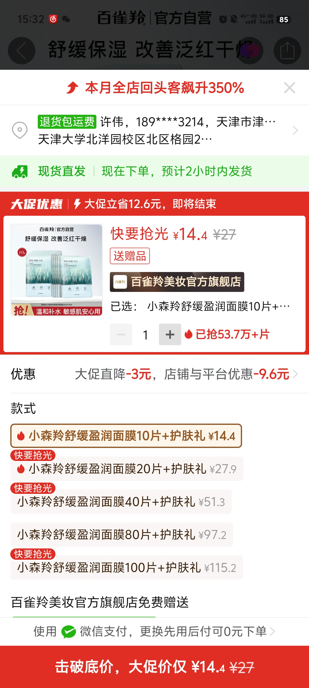
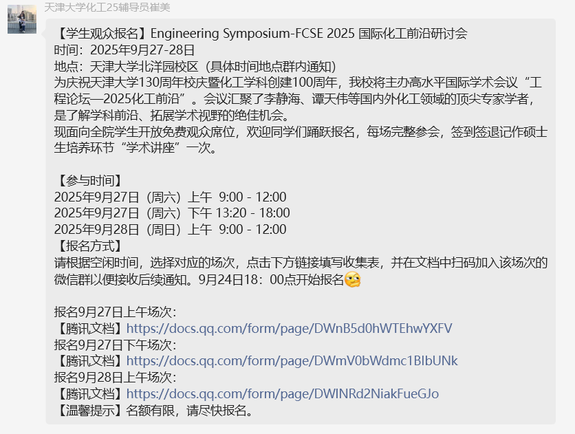
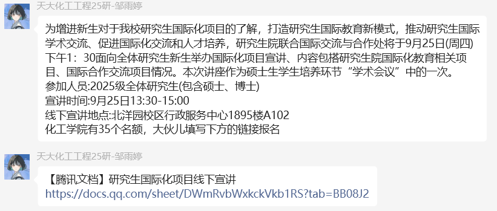

---
title: "随笔-202509 思绪汇总"
date: 2025-09-01
description: "随笔"
slug: 202509
tags:
  - 随笔
categories:
  - 随笔
---

---

# 随笔-202509 思绪汇总
## 路线选择
‎2025‎0‎9‎0‎‏‎1723
说起考公前两天看日本一个纪录片，特别强调**房地产泡沫衰退背景**下，日本年轻人考公务员有些岗位甚至高达 20 多比 1 ，tmd 咱们国考平均 70：1 报录比（还只是平均啊）。靠这个别说消化就业了，添头都算不上。

思考一下，是不是可以学习这段历史

研究生 18 年起年年扩招
本科生扩招：20250306 双一流高校本科再扩招

怎么充分利用平台？
出国留学也是条路
什么是自己的选择？
有规划比没有规划好，就像打游戏之前应该确定好方法
多了一个叔叔......
资源确实很重要
比如说 Gemini Advanced 的 16 个月白嫖需要 edu 邮箱，国内应该只有科大才有
不回收邮箱的高校，邮箱登录应该是独立服务器，而不是那种企业邮箱的网址
教育邮箱 over

## 局部最优解
202509072023
#### 原始版本
**局部最优解的集合不等于全局最优点**。
看到这句话，我多少有点感悟，之前我都是抱着一种过饱和准备的状态做一件事儿，就像《流浪地球 2》 那个饱和式救援的情节。虽然有点夸张，但我是抱着不成功便成仁[不成功便成仁是春秋战国时期出自《论语》的一句话。意为凡做事就有风险，这是说干大事的人要执著努力。比如丢了命，虽然没有成功，却也能成就“仁”。有舍生取义的意思。]的心态去干一件事儿（比如推免）。现在回头看来，不少地方走了弯路和捷径吃了不少苦头留下一些隐患，但是从当时我的认知与判断而言，我是可以肯定自己的努力的。
话转过来，来自于贪心算法**局部最优解的集合不等于全局最优点**的这句话，让我开始思考做项目的得与失。其实自从读本科以来，我就开始有种套模型[可知论]的认知观点：我开始认为学习的知识其实是可以运用在实际生活中，简单说就是学习的课本知识中的理想世界是最简单基础的模型，现实世界是一个困难而又复杂的模型。我们学习各种理想世界中简单基础的模型，是为了在观察了解现实世界之后，可以得到更好的改造解决现实世界的建议行为。再进一步说，我认为世界属于可知论，我们要做的就是去学习现实世界中发现的各种理论知识，然后我们再反过来指导运用并改造这个世界，而这个改造的过程是一个漫长而又艰辛的过程。用机器学习中迭代循环进行拟合的步骤来说，我们不断学习并修改各种参数，来达到某种目的。其实我知道机器学习是通过参考人类的思考经验而形成的一门学科，但是我通过学习机器学习反而认为学习理论知识反而可以指导现实世界，觉得这太不可思议，实际上我想我应该感慨将现实世界高度抽象并用数学语言描述这个过程。
思考有点偏题了，但是我想我只是拿这句话**局部最优解的集合不等于全局最优点**聊以自慰吧，我也不知道未来的日子会怎么样。只是不管我承不承认，自从 2018 年中考完的那个傍晚，迷茫彷徨的这种情绪一直萦绕在我心间，就像人生按下了加快键，我不断站在人生选择的这个那个岔路口，我不断徘徊在各条路之前想尽可能看清哪条路相对正确，那条路是目前的局部最优解，我想我境界太低也没有贵人在我背后指导，那么局部最优解是我能做到的最好结局。
我也不知道为什么迷茫彷徨不知所措这种情绪依旧萦绕在我的心头，可能 2018 年到现在过去 7 年我依旧是那个手无寸铁的小毛头。
#### ai 优化后的版本
局部最优解的集合，并不等于全局最优点。
看到这句话时，我下意识地把它对照到了自己这些年的状态。很长一段时间里，我做事习惯用一种近乎“过饱和”的方式推进自己，像《流浪地球 2》里的饱和式救援——不计代价，只求不留退路。那种心态，说好听一点叫全力以赴，说直白一点，其实是不成功便成仁。
回头看，这样的方式并非没有问题。走过弯路，吃过苦，也留下过隐患。但至少在当时的认知范围内，我并不否认那是一种真实而用力的努力。那不是敷衍，也不是投机，而是我当时所能做出的最坚定判断。
“局部最优解的集合不等于全局最优点”这句话真正让我停下来想的，是项目和选择的得失问题。自本科开始，我逐渐形成了一种偏向模型化的思维：课本里的知识是高度简化的理想模型，现实世界则是复杂、噪声极多的系统。学习这些模型，并不是为了照搬，而是为了在理解现实之后，至少能提出不那么糟糕的行动方案。
我大概是个偏可知论的人。总觉得世界并非完全不可理解，我们能做的，是在有限的认知里不断修正判断。这个过程更像迭代，而不是一锤定音。后来学到机器学习，我反而更清楚地意识到这一点：不断拟合、不断修正，目标并不是完美，而是减少偏差。某种程度上，人生也是如此。
但这些想法，说到底多少有点自我安慰的意味。因为现实是，自 2018 年中考结束的那个傍晚开始，迷茫和迟疑几乎从未真正离开过。我像是被提前推上了一条不断做选择的轨道，站在一个又一个岔路口前，试图判断哪条路是当下的“局部最优”。
我没有全局视野，也谈不上有人在背后指路。局部最优，可能已经是我能力范围内能做到的最好选择。七年过去了，我有时仍觉得自己像个手无寸铁的小毛头，只是学会了用更多概念来描述这种状态。
也许问题不在于有没有走向全局最优，而在于：在看不清全局的时候，是否还能对每一次局部选择负责。至于答案会不会在某一天显现，我并不确定。
## 日常感悟收藏
202509091002
今天收藏了一句话：“爱应该是让人变的温柔与勇敢，而不是让人时常感到委屈或妥协。”
世人都晓神仙好，惟有功名忘不了！
**局部最优解的集合不等于全局最优点**。
人的命运从来不可能依靠体力劳动改变，如果我不找出另一条路，那我的未来只会在这同样的苦难中，不断重复。---李在明
夫祸患常积于忽微，而智勇多困于所溺
**什么东西应该分享，什么东西<mark>不应该</mark>分享？**
何炅：人不能困在一个地方太久，待久了会慢慢退步，眼界会越来越窄。满怀期待和热爱，是对生活最好的交代。
## 入学感想
202509192228
这两天有点小忙刚刚安顿下来。这段时间最大的感悟是：个人发展与规划，家庭等因素密不可分（努力有时候可能都排在这二者之后）。
本科的时候，我发现可能这是此生最后在学校学习的机会。同时我个人喜欢折腾，无论是好是坏，尽可能去学习，虽然偶尔我也会感到疲倦陷入自我怀疑，但是我抱着“我只是想给自己多点学习的机会”。
硕士期间，我发现本科的这种观点放到研究生阶段不太适用，应该改为“我只是想给自己多点选择的机会”。学习应该朝着有功利性目的性的方向进行，从大而广向着小而精的方向前行。只是时不时会怀疑自己行不行能不能，会怀疑方向的正确性。
得谋定而后动。
前两天和老师见面聊了聊，谈话间有种大家长气质（会聊聊上学怎么来的），然后介绍了一下课题组情况，但是最近还没解决一些事没想好怎么和老板聊天。什么事可以说，应该说什么以及怎么说。
老板说可以现在假如我现在冲进老板办公室给老板说实验室是我家我爱做实验，那么又是怎么一番场景：研一没有工位（这是客观事实无法改变），我得兼顾学业（研一还是有部分学业压力，而且我现在不知道上课考试啥情况）和实验，最好的情况可能是恶心到同门和师兄师姐了；我的打算是先选课，然后拿到课题，研一上学期在学习课程之余，给师兄师姐打点下手，学点技能，看点文献，平稳度过研一上学期，然后过完年甚至是期末考试结束就真正进组干活了 qwq；
## 信息茧房-Information Cocoon

##### 信息差-Information gap
202509251529
key words：

今天上午到的百雀羚维他命 B5-精华乳和两片小森羚面膜
结果前脚收货，后脚看见这个 15.3￥ 的同款商品
让我看看，27-15.3-14.4/5=5￥
我 c，专坑信息差的我，这个[价格差]算是典型的信息茧房-Information Cocoon 具体化表现。

##### 时间差-Time gap

时间差指的是开始报名时间和得知这个信息之间的差距，有的人是在开始报名时间之前就知道了，有的是过了一天才知道这件事。

这个[【学生观众报名】Engineering Symposium-FCSE 2025 国际化工前沿研讨会]就是典型的时间差表现

##### 解决方法-Resolution
目前看来只有
即时关注消息
扩大社交全，增大信息获取渠道
但是这样不可避免会增加时间花费
得取舍一些东西

## 和叔叔的交流
202509251312
青山的核心表达
处境与感悟
开学事务繁忙，刚处理完选课，进入新阶段。
最近的体会：发展与个人认知、规划、家庭密不可分，努力有时甚至排在后面。
真正感受到规划的重要性：需要亲身经历甜头或害处才能理解。
虽然表面记下了很多道理，但并不全能理解，最近只是有所触动。
情绪与心态
有一定的悲伤、迷茫，思考个人未来走向。
提出“痛苦的人”与“快乐的猪”的思考，最后倾向于“痛苦的猪”，说明更看重清醒认知，即便代价是承受痛苦。
战略上保持乐观，战术上（具体行动、身份定位）却常感到悲伤。
→ 青山的关键词：感悟、认知、悲伤、规划、清醒。

糊涂虫的核心表达
人生经验与建议
强调发展是硬道理，认知是决定上限的关键。
人的一生挣不到认知以外的钱，要不断突破思维壁垒。
规划要有长远和短期结合，“人无远虑必有近忧”。
不要忽略父母的托举，但也不能过度依赖。
人生观与鼓励
青年是“八九点钟的太阳”，要乐观积极。
成长必然有阵痛，经历迷茫是正常的。
允许自己低落、认怂，但要对生活保持希望。
分享自身经历：从无到有，靠自己打拼，即使起点低也能凭本事立足。
亲情与关怀
多次强调“叔叔家就是你自己的家”，希望青山不要有顾虑。
提到可以一起吃饭，见导师，提供支持。
虽然联系不多，但心里一直挂念。
→ 糊涂虫的关键词：发展、认知、规划、希望、托举、亲情。

整体总结
青山更多在表达自我认知的提升和对未来的迷茫：虽然听过很多大道理，但只有经历才真正理解；在乐观的大方向上，仍对自己定位和未来路径感到痛苦和不安。
糊涂虫则体现出过来人的经验、劝勉与亲情：强调认知的重要性，鼓励保持乐观，承认低谷也没关系；同时用亲身经历传递坚韧和自立的信息，并不断表达对青山的支持和关怀。
两人对话的内核是：青年人的迷茫与自我认知的觉醒，和长辈对后辈的经验传授与情感支撑。

总结
青山之所以觉得糊涂虫的发言“没啥用”，主要原因在于他表达的多是感悟和情绪，没有抛出明确的待解决问题，因此糊涂虫只能用长辈式的“大道理”和鼓励回应，缺少针对性的实操建议。换句话说，青山的困惑比较抽象，糊涂虫的回答也就显得空泛；如果青山提出更具体落地的问题（如导师沟通、职业选择、入党经验），糊涂虫才可能给出更有帮助的内容。现在青山陷入一种虚无主义的迷茫情景，可能是闲的。

## 感想 1
202509271052
选了不少水课。目前没啥感想，只想着按照培养计划，研一上把课程学分拿到手，水课也行，不想着在课程上学到很多东西，没事干干实验啥的科研入门。
