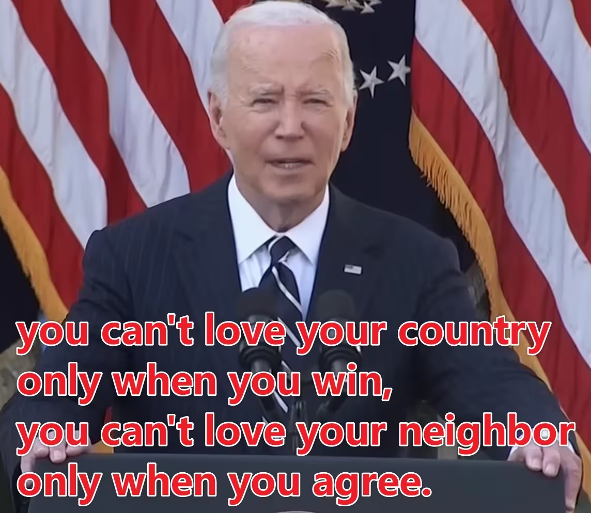
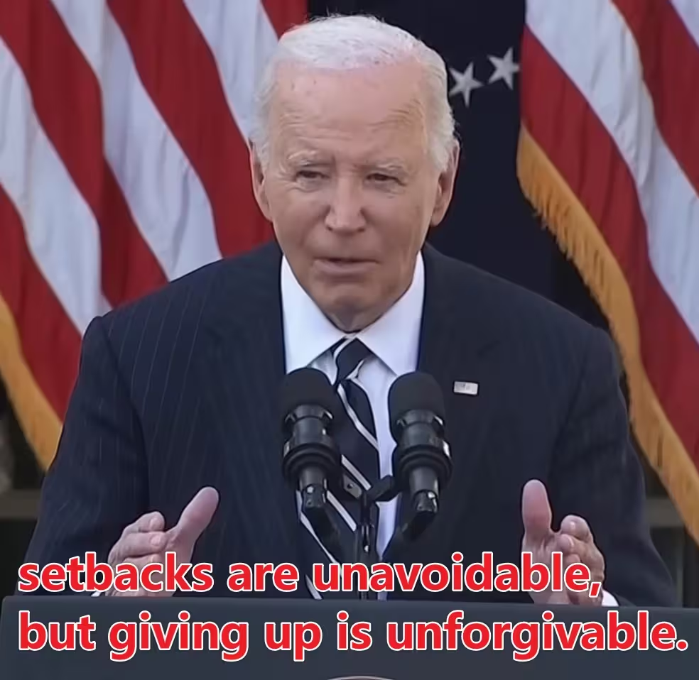

---
title: "随笔-2025 年思考汇总"
date: 2025-01-01
description: "随笔"
slug: 2025
tags:
  - 随笔
categories:
  - 随笔
---

---

# 随笔-2025 年思考汇总

## 对学习机问题的思考

2025‎02‎19‏‎1155
这两天跟一个初中教师朋友聊天，他感叹现在学生学习已经没有“勤能补拙”这些话了，全看天分。一个班 40 个人，只有 10 个人在学，剩下 30 个全是陪跑的。课上都学不会，课下就更别提了，各种诱惑，手机、电视，真正学习时间很少。那差距怎么办？有些能通过题海战术搞定，有些却不行，差距会越来越大，优秀的更优秀。
说到这个，我就想到以前一个朋友，高考失利两次，第三次走了个 985，前两次是大专跟二本。他说学习就是要“痛起来”，不然谁都可以学得很好，痛了才能学会。
感觉还是那句话：**课上学不会，课下就要多付出汗水。** 不管是学习机还是其他的，总得付出吧。勤是可以补拙的，但是现在诱惑太多了，回到家看电视、耍手机，家长也看，没有学习环境，买再贵的学习机，你得打开啊。
所以我对学习机、补习班这些东西的看法是：**没必要把希望寄托在工具上。** 校内课堂都搞不定，校外补习一样可能搞不懂；学习机本身也没什么神奇的，重点还是家长怎么引导、孩子怎么使用。与其花钱买学习机、补习班，不如多买点书，甚至可以买一个平板，但要考虑视力问题。互联网本身有很多学习资源，关键是怎么使用。
我认为目前最重要的还是**身体健康、保护视力、亲子关系和学习习惯**。女孩子可能对语文和英语有天赋一点，但一定要练字，不要有拖延症。
小学成绩其实具有一定的欺骗性。考个 90 分左右就行了，成绩没有那么重要，因为大家都考 95～100 分，你考 90 分以下可能就落后排名了；但我认为，小学更重要的是培养学习态度和学习习惯。做到课前预习、课后复习就已经很厉害了。语文一定要提前学，一二年级抓拼音、抓识字量；英语和语文一样；数学可以不用写很多题目，重点是把基本的东西弄懂。
我反而认为，**真正的“思考能力”可以等到 12 岁左右，也就是六年级到初一再开始重点培养。** 因为大的改变、遇到新的问题，人才更容易开始思考。升学、对比、背叛、失落、打击、失恋、离婚、亲友离世……这些事情都会迫使人重新认识世界。一成不变、过于安稳的生活，不太可能孕育出真正的智慧。
所以现在还是认识世界的时候。正常上学、上课、吃饭、放学回家、写作业、看动画片，动画片也是认识世界的一种途径。多看书，多学语文，小许也应该多和别的小朋友讲话。有机会就带小许出去转转、见见市面，我打算今年 2025 年带小许去天津大学走走看看。
也不能所有事情都包办。解决不了的事情就随缘，作业不会写可以上网查，怎么查本身就是一种解决问题的能力。现在 AI 也比较发达，可以问 AI。要懂得放权，舍弃一些东西去获得另一些东西。比如，买学习机和补习的钱，也可以拿来买手机、买书，让小许自己去探索，但最好不要沉迷抖音短视频。手机不能只会享受，也应该成为探索世界的工具。
**学习不是靠学习机就可以一劳永逸的，就像人生不是靠父母可以解决所有问题的。终究还是要靠自己闯。**
现在是认识世界的时候，等到六年级、初一以后，再慢慢谈思考问题。也要逐渐认识到，有些事情是不能轻易改变的，比如阶级、资产和人。能改变的努力改变，不能改变的，就随缘吧。

## 梦
202504220205
吃鱼，午餐时间，出去旅游，一盘鱼，鱼肉鱼刺交界处蓝色，梦见几个初中同学，和我一起瓜分鱼肉，吃到一半，我妈不让我吃了，说鱼肉脏，一手把鱼肉打掉。

## 《智取威虎山》剧组集体滞留
202505101532
1988 年，上海京剧院《智取威虎山》剧组赴美国演出。**齐淑芳**（饰“小常宝”）是主要演员之一。==演出结束后，齐淑芳以及部分团员没有返回中国，而是在美国继续生活。==很多报道说涉及 30 多人，并称其为“集体滞留”。他们后来在美国继续从事京剧演出，成立了齐淑芳京剧团，传播中国传统戏曲。
其实样板戏演员**宋玉庆**，因在《智取威虎山》中饰演杨子荣而成名，是上海京剧院著名样板戏演员。曾高喊“打败美帝”的宋玉庆，晚年全家定居美国，并继续从事京剧活动。由于曾塑造过革命英雄杨子荣这一经典形象，其赴美经历在当时引发了较大关注。
1980 年代中国刚开放不久，“出国后不回来”在国家机关和文化单位中非常敏感。因为那时很多人出国机会有限，尤其是以国家名义派出的人员，所以类似事件容易被赋予强烈政治含义。而今天，一个外交官，学者，企业家退休后去海外生活，只要手续合法，本质上属于个人迁徙选择，不会自动等同于当年的“滞留不归”。
所以简单总结，齐淑芳不是像战争年代那种“投敌叛逃”，但她确实是在 1988 年赴美演出后选择留美，造成了当时中国文化界轰动的“滞美不归事件”。这件事之所以传播很广，是因为她的身份非常特殊——她演的是样板戏《智取威虎山》里的“小常宝”，这个角色本身带有强烈的革命符号，所以“革命样板戏演员后来留在美国”的反差被不断放大。
因此从历史背景差异的角度看**齐淑芳**事件属于“集体滞留”也就是“滞美不归事件”，而**宋玉庆**事件属于正常移民。

## 对 AI 大模型一点认识
202505270016
我觉得可以多看一点书籍，虽然 AI 很厉害，但是它只能 从 1 到 2 再到无穷，不能做到从 0 到 1。

## 对三观与亲密关系思考的记录

202506032225
一段对三观与亲密关系的思考记录
我愈发意识到，三观是否契合，是维系人际关系的一项核心因素。尤其在人与人之间的亲密交往中，三观的冲突往往不易察觉，却能在长期的相处中逐渐显露裂痕。当然一些沟通技巧可以弥补这些不足，但是终究是一个人的妥协，不是雪中送炭，而是杯水车薪。
回顾**大一**时我曾在朋友圈发过一条说说：

```
肤浅的认为个人的快乐建于他人的痛苦上💩
```
前几日（大概是 5 月 29 日午休时）我在抖音上发的一则短文：
```
此去经年，何日再相逢。 他日仙界重相逢，一声道友尽沧桑。
我觉得相逢既是缘分，但这其后的路途却截然不同，愈发认为三观的相似与认可重要性了。
想到大一发过的一个朋友圈说说，内容大概是认为个人的快乐建于他人的痛苦上。现在想来，当时没想到这样一点：你可以自私，但不能自私到以为别人不自私。忽略环境与个体之间的关系，现在想来，之前倒是钻了不少牛角尖，撞了不少南墙。
```
当时是感慨人与人之间的相逢既是缘分，而之后的路途却各自分化，能否同行，其实更多地取决于三观的契合与认同。
进一步思考亲密关系，我发现三观的差异在亲密关系中尤为敏感。
这条抖音大概是 5 月中旬我痛苦思考亲密关系发的。
```
永寤烂柯人，万事一梦幻 梦见上课铃响起，梦见你的脸庞，醒来发现是舍友的呼噜声。真是黄粱一梦啊。
```
还有这条，引用自《龙族》
```
你为什么喜欢隔壁桌那个穿白棉布裙子的女生呢？虽然你能找出成千上万的理由，但是真正的原因无非是你也不知道怎么回事，看见她心里就老是跳，特别在意她说的话，以及记得所有跟她相关的事情，于是你就知道自己喜欢她了。为什么？没理由的。
```
我觉得亲密关系里还有几个很容易被忽视的问题，比如**边界感、语言和人设，以及对隐私和信任底线的试探**。很多人会误以为关系亲密就意味着无所不谈，甚至通过揭露隐私、贬低别人来快速拉近距离，但这种建立起来的关系其实很脆弱。靠脏话、废话垃圾话或者刻意搞笑的人设同样如此，短期可能让气氛变得轻松，但时间久了容易让人厌倦，也容易让别人误解真正的自己。有些人本身并没有那么好色、贪欲，只是为了搞笑而把这些东西表现得过于明显，最后反而被自己塑造的人设绑住。还有人喜欢通过交换秘密来建立所谓的信任，但秘密一旦被误用，关系往往很难再恢复；甚至用侮辱性的语言去试探一个人的底线，这其实既是在试探边界，也是在消耗信任。**关系再亲密，也不是没有边界；真正稳定的关系，应该是敢于靠近，也知道什么时候停下来。**
我想起《亲密关系》这本书里的一些观点，比如亲密不等于融合，爱不是控制，而是给予空间。这种思考让我逐渐意识到，真正持久的关系，靠的不是情绪的高潮，而是价值观的深度契合与尊重。
写下这些，是一次自我记录，也是一种思维整理。

## 对双标问题‎的思考
2025‎0‎6‎03‎2232
l've said many times 
you can't love your country only when you win,
you can't love your neighbor only when you agree.
——Joe Biden
我说过很多次了
你不能只在胜利时才爱你的国家，
你不能只在一致时才爱你的邻居。
——乔·拜登
setbacks are unavoidable,
but giving up is unforgivable.
——Joe Biden
挫折是不可避免的，
但放弃是不可原谅的。
——乔·拜登
以上出自《拜登祝贺特朗普胜选演讲》


你不能只在（对方行为的实质）时，才支持/选择/开始（对方行为的表象），可以发现这个句式的本质就是拆穿利己主义，暴打伪君子。

你不能在**孤独的时候**才**开始恋爱交朋友**。
你不能在**失败的时候**才**开始努力**。
你不能只在**需要安慰时**才去**听懂他人的痛苦**。
你不能只在**想赢的时候**才**讲规则**。
你不能只在**别人认同你**时才**表达自我**。

“你不能只在 X 的时候才 Y”这种句式，本质上是指出**选择性原则** 的问题。人们之所以会陷入这种双标行为，有几个心理机制：
**利己本能**
人在面对选择时倾向于选对自己有利的那一边。
**即时反馈心理**
人更关注眼前的感受和需求，而非长期价值。
**缺乏原则意识**
很多人没有**稳定的内在价值观**，行为完全随环境波动，导致在不同情境下标准不一致。（内核不稳定）

这种行为不仅是一种软弱的逃避，更是对“真正的价值”的消解。比如：真正的**爱国**是连在国家犯错时也愿意建设它；真正的**关系**是即使你不寂寞，也想与某人分享生活；真正的**努力**是在还没有失败时就开始耕耘。
也就是说，这些句式指出了一个核心问题：
“你做这件事，是为了它本身，还是为了你自己？” 

在痛苦时依然善良；
在失败时依然坚持；
在孤独时依然理智；
在被讨厌时依然自重。




## 榜样的力量
202506050938
秉承“团结、奋进、博学、奉献”的校训，弘扬“志存高远、追求卓越、求真务实”校园精神。

今天召开第十届“化学化工”专业奖学金，见到了（13 级）优秀校友**常智**，说的一番话令我深思，考虑到现在直到未来数十年“环境”会比较差，争取做你所在环境一批人里边最优秀的前几位，不会辜负你的努力的。

这个校友本科成绩并不突出，甚至考研是二战，但所谓流水不争先，争的是滔滔不绝，校友一路发扬“志存高远，追求卓越”的精神，最终成为国家级人才，确实是我应该学习的榜样。

志存高远，追求卓越。
值得深思。

## 关于爱情与亲密关系的思考
202506151221
亲密关系中，真正意义上的亲近需要跨过一个必然会有的，真实抗拒的部分。我们都知道在恋爱初期，人们会有一种和伴侣高度融合的体验，有人甚至可以做到为对方去死。但这种亲密很脆弱，因为它指向的是一个理想客体，并体验到了一个与之关联的理想自我，这是热恋时才会有的特殊体验，本质上它是两个人的自恋借助对方实现了一种共同的满足。随着时间的推移，关系的递进，双方的理想化滤镜就会去除掉，这时候就要面对一个赤裸裸的真实的人，面对那样一个可能有着瑕疵和问题的人，它会直接威胁到一个人的自恋一一当对方不再是理想客体的时候，我们也就不再是理想自我，我们也就无法借着对方去进入一种浪漫叙事，自我感动。有人甚至会进入一种自恋防卫，会对伴侣产生强烈的厌弃和想要疏离，因为那个真实个体威胁着一个人心中的理想客体一-与那个真实的人重合就会被污染，所以想要摆脱。也就是在这个重新产生的裂隙中，关系才真正开始，游戏才开始变得有难度。因为这是一个不再靠直觉和本能就能够跨过的领域，它需要知识，需要学习，需要行动，需要建设，需要共情，需要协同，它考验着一个人全方位的心智水平和情感功能，大多数关系都会在这个阶段进入无能的沉默，哪怕看起来还在延续着。

很多人不相信爱情，是因为这个阶段的体验佐证了自己的想法。有些不能够跨过，是因为一开始就选择了错误的人；有些不能够跨过，是因为自己的迟疑和恐惧；还有些人不能够跨越，是因为冲突和隔阂导致的情感关闭。最难以跨过的是自恋的阻抗，有谁会相信爱情这件事是需要学习的，人们只想要各种简化的真理，只想倨傲的用个人的有限体验，对这个接近无穷的情感领域，做出简单而终极的个人解释。

而那些跨过这个阶段的人，会有完全不同的感觉，会在那个早已熟悉无比，普通至极的伴侣身上，感受到毫不动摇的依恋和信任，依然渴望分享和链接。和第一阶段不同的是，那不再是一种浪漫叙事，它不再是单纯的满足自恋，它从一人关系变成了二人关系，变成了"我们之间”,这是跨越第二阶段才会有的体验。
## 永远的安理人思考
202506152048
秉承“团结、奋进、博学、奉献”的校训，
弘扬“志存高远、追求卓越、求真务实”校园精神。


## 本科毕业感想
202506131802
202506181254
刚才参加本科毕业典礼，拿到双证意味着本科生活的彻底结束。我突然想起一部电影《毕业生》 The Graduate的结尾，男主角舍弃他的小红车，抢到了新娘，经历了人生罕有的刺激与浪漫，但喜悦迅速消散，只剩失落与尴尬。他们并没有那么相爱，坐上车，冷静下来，就又迷茫。
离开家庭和学校后，我清楚地意识到——我的人生终于可以由我做主了，可没有什么比这更让人迷茫的了。想到这，我知道，我会在迷茫中，把自己的人生搞砸。
本科毕业，那么之后要干什么呢？读研，工作，房子，生活，还要处理婚姻的烂摊子。
关于大一转专业这件事。现在捋一捋大学本科期间的想法。其实没转专业的原因很简单，绩点高可以走推免[本来想着可以跨专业推免（其实转专业也是因为对化工厂倒班工作环境差早有耳闻），但实际学习上还是不可避免的以化工为主线学习]，推免可以保证学历的提升，我觉得最起码还是要有硕士学位这块敲门砖[学历学位对我而言是一种手段方法]，所以抱着推免的想法我没有转专业继续卷绩点[假如成绩达到转专业要求，但是推免无望，我大概率会转专业]。综合而言，学习卷绩点这件事，虽然看上去是大学前三年都在干的事，但是目的不一样。大一上学期是朦朦胧胧的意识到未来规划的重要性，大概做了这样一个规划框架，然后发现可以走推免这条路，所以我后面几年开始按部就班进展下去。然后事实上也可以证明我这条路走通了，虽然效果仁者见仁智者见智，但是终究是可行的。
关于职业规划这件事。我看同学们的职业规划方面，我猜测应该是考研前的大三学期开始的，面对就业和考研考公的分岔路，不同人有不同的选择。因为我相对来说有更早的规划，因此我会提前计划好一些事，比如竞赛[可以提升推免的概率，对于考研也是加分项]；对于就业人员而言，实习可能比较重要。
关于个人感情这件事。感情方面，我喜欢一个叫 smy 的女生，可惜人家在大一和大四都找了对象，[感情方面我是没有立足之处]。回头看看大一学年的自己，又黑又矮，与众不同的地方可能是丑得吓人，丑得不一样，还没事剃个寸头，思考人生，我那个时候其实只是单纯的觉得寸头也不错，方便。人家找对象嘎嘎快，我是和尚庙敲钟。大一追人家，估摸着看不上我；大二还是大三追[这个时候已经分手处于单身状态]，假如成功，后续可能去不了天大，最多去吉大；大四在二月底我直接拉了坨大的，给人家骗出来说做社会实践，给人家说我可能喜欢她，我自己当时也不知道自己的心意，铺垫了很久聊了很多[大概从下午 4 点聊到晚上 8 点]，我不想和喜欢的人做朋友，特别是她还有对象，于是最后祝愿她好好生活。
写下这些文字的时候心乱如麻，想了很久，我自己也是脸圆圆的，大概 174cm，65kg，有小啤酒肚，也没啥气质，就是单纯的屌丝男士吧，[人家长得漂亮白白净净的]。**我悄悄的碎掉了**。然后就在一个夜黑风高的晚上，我悄悄删除了人家的联系方式，悄悄的碎掉了。虽然拍毕业照的那天下午，我躲在会议室不敢拍照，但是看见那么多人，我犹豫了很多次，腿都软了，请求和她合影，出于礼貌吧，她同意了，我很高兴。然后就没有然后了。
我悄悄得碎掉了，此去经年，何日再相逢？可能没有下次见面的机会了。我也不知道为什么会喜欢她，可能喜欢一个人不需要理由吧，这大概是我这辈子最后一个纯粹的喜欢一个人了，而且到后面我感觉有点释怀或者爱上她了，虽然我不知道什么是爱，但我很希望看见她过的很好。这种被激素刺激的喜欢和爱意让我 emo 了很长一段时间，一种爱而不得的痛苦。实话实说，smy 是我奋发前行的动力之一，按照我原本的规划，我本来是准备在大学毕业的时候给她表白，**这是一段小有遗憾的岁月**，我悄悄得再次碎掉了。可能是爱而不得吧，或许遗憾总是难以释怀的，总之我十分难过，碎成一片又一片。
写于**202506131802**。
罗伯特·斯滕伯格提出爱情三角理论，爱情由三种不同的成分组成：**亲密**(intimacy)，**激情**(passion)和**承诺**(commitment)。
如果缺乏亲密或承诺却有强烈的激情，那就是**迷恋**。当人们被几乎不认识的人激起欲望就会有这种体验。斯滕伯格承认，他在 10 年级时曾痛苦地迷恋过一位生物课上的女生，为她衣带渐宽，但最终也没勇气向她表白。他现在认为那种爱情仅仅是激情。他对她的爱是迷恋。
**衣带渐宽终不悔，为伊消得人憔悴。**
正如爱情三角理论所指出的，性吸引力（或者“激情”）是浪漫爱情必不可少的特征之一。所以，如果恋人对你说“我只是想和你做朋友”，会令你很受伤。
**春心莫共花争发，一寸相思一寸灰**。
写于 202506181254。

关于现在。总的来说，我是为了提升自我读研，变得更加优秀，读研后期望进入高薪资行业。工作是为了打造事业。房子与婚姻，是阶段性目标。我希望成就一番事业。上大学以来我的规划是：拿到学士学位证和毕业证，拿到硕士研究生录取通知书。目前我已经拿到天津大学化工学院[硕士研究生的录取 offer]，加入[膜科学与海水淡化课题组]，接下来进行学习深造。
战略上藐视敌人，战术上重视敌人。现在反而有点怀疑当年的认知水平了：当年不仅是战略上蔑视敌人，战术上也轻视敌人。大学到底学到了什么？AutoCAD、Aspen Plus、MATLAB？**技术不能变现，就只是爱好；技术是卷不完的，真正重要的是形成自己的专业壁垒。**

短期主线还是聚焦研究生阶段的准备，尤其是学术能力和生活适应。专业上计划在**膜材料或海水淡化**方向深耕，主动靠近导师、课题组和横向项目，掌握一项真正能变现、且具有不可替代性的技能，比如编程、数据分析、仿真建模、SCI 论文写作、英语口语等。同时也要主动构建自己的人际网络，别让自己在研究生阶段再次“孤军作战”。**做一些真正属于自己的东西，形成技能壁垒，也形成自己的资源网络。**


## 暑假实习阶段小感悟

今天是周六，没回姑妈家。原因比较简单：一方面距离太远了，坐车转地铁转公交需要大概 3hours；另一方面，天气热，现在是夏天，大概 8 点左右气温就有 28℃，下午最高气温可以到 36℃，然后持续到晚上 6 点左右才开始降温。

一句话就是不想去，去了和没去除了吃饭方便点，啥也没有区别（<font color="#ff0000">人家也有自己的生活，不能围着你转，得自己有安排计划</font>），不如自己呆在这自由自在，就是浪费点电（空调一直开着）了。

但是我也不打算一直呆在这儿，得去进货买点零食，然后晚上去跑步（这周除了周五也就是昨天晚上，我每天晚上都去附近一个大专[天津滨海汽车工程职业学院武清校区]跑步），但是下午太热了，出门根本不想动。现在的打算是明天上午坐公交车去市区打野，然后中午在外面吃一顿，下午再坐车回来，[其实今天晚上也可以]。

我发现一件事，随着年龄的增长，你做出的选择都需要去承受，不是说你不做出选择就不需要承受了，我的意思是无论你做不做出选择，这本身就需要去承受，无论结果是好是坏，区别在于你是主动还是被动。因为你就处在这个世界里边，你不是独立一个人，这和我本科期间独立自主的生活完全是两回事[四年期间我只需要好好学习，父母唯一的输入就是每个月固定的 1.5k 和偶尔的问候]，就是说随着时间的流逝，个人的背后有双命运的大手默默推动你前进[逝者如斯夫，不舍昼夜]，当然我现在这么说是因为我目前还是被动的前进，抛开推免的荣誉[我自己看来不算荣誉，算是一种将就，因为去年暑假我比较倾向于中科大稀土所，现在感觉都行]，我做的所有努力都是按照经典的努力读书这个步调进行下去。

流水不争先，争的是滔滔不绝。嗯感觉还是多少有点被动了，但话又说回来，我这次暑假主动走出舒适圈也是为了主动在简历上面添上一笔[曾任天津森聚柯密封涂层材料有限公司实验员 2 个月，双组分涂料原料配置，涂料喷涂；单组份涂料性能测试；密封胶原料配置，产品包装]稍微见识一点社会的边边角角，有了稍微深入的思考，对认知多少有些帮助，不再是那个天真无邪懵懵懂懂的大学生[现在会摸鱼消极怠工]，对社会关系多少有点认识了。

大人虎变，其文炳也。君子豹变，其文蔚也。[“伟大的人物像猛虎一般进行变革”，表明变革必然成功，其美德光照天下。“君子像有斑纹的豹子那样进行变革”，说明君子协助有道德的大人物一起变革。]希望我可以豹变，君子一般，栩栩生辉。

另外我也想到一件事，那就是变现能力和副业问题，我得考虑生存问题也就是赚钱问题，未雨绸缪也得有伞去准备。这周二接了个 cad 绘图，就是帮学弟学妹画[管道及仪表流程图 P&ID]，价格比较美丽，只有 130 人民币，画了大概三天结束。

## 阶段会议小总结

耐得住寂寞，忍得住孤独，扛得住压力。
有善始者实繁，能克终者盖寡。

今天晚上老板又讲了大概 70min；
我发现当老板表达能力一定很重要，无论是不是技术出身，一定要能够表达自己的观点，输出自己的意见；
首先讲了段前段时间发现别的公司盗用森聚柯公司聚脲涂料技术，然后目前正在起诉看情况，言外之意有点敲打我的意思；
然后开始顺藤摸瓜讲物质分析：滴定法与仪器法；
首先进行无机相有机分离；
无机金属阳离子进行滴定法，燃烧光谱法；阴离子进行滴定；
有机进行，气象液相色谱，质谱MASS，核磁共振（氢谱碳谱），红外（傅里叶，拉曼），紫外；
然后讲一堆美国的遗产税，讲美国父母与子女之间的金钱关系远没有中国亲子之间的关系密切，以及美国企业之间公平交易，中国商业交易建立在关系之上；这和他之前的观点一致：中国是一个农业国家，一切问题的根源在于**交易不公平**，只有建立在交易公平的基础上，社会才会进一步发展。什么民主政治体制都不是重点，政治体制是建立在符合国情需求之上，但是交易公平是一切公平的前提，社会公平，经济发展。然后问了问我硕士期间的课程，研究方向啥的，无意中会说点我有个朋友厂就在做气体分离厂啥的。然后说了说研究生阶段，硕士只是简单的科研入门，了解研究的基本方法路线啥的，而博士是搞一个真正的创新出来，虽然现在也有一些水的也可以毕业。国外的研究基本上被大小企业说垄断（90%），高效是来服务于企业的，当中国不是这样，政府打压民营企业（担心资本主义，不符合国情），不让小企业搞科研，实际上国外科研都是由大小企业起领导作用。
最后又讲了讲现在就业市场确实有点差，可能三年之后会好一点，毕业之后去大厂啥的，不行也可以回来森聚柯来干留个岗位，之前来过几个南开天大北京化工的女硕士，干了一年左右就回家结婚生子全职妇女去了，然后还有同事赵锦鹏是河北工业大学研究生，emmm 韩松是燕山大学本科生，田华龙是天津工业大学本科生，邱锦鹏是计算机科学与技术专业。
老板一直在说中国社会以关系为主导推动力，美国的话假如你没有奋斗没有技术没有强大的一面会被狠狠的抛弃，但是中国社会领导人很累，追求的是一种大的稳定，管大家吃饭最基本的需求；然后关键是我发现他虽然一直在说公平交易，但是实际上他利用的就是关系，emmm。今天问我怎么反向推测物质原料，我尼玛不知道气相色谱，高分子材料通过溶剂溶解然后气相色谱接MASS。
关键是我好像发现这公司进来一个比我大一岁的学计算机的好像是啥亲戚朋友介绍进来的，老板有个侄子在生产部门干了两个星期然后喜提升职去了北京公司，而且这部门没啥发展前景，尼玛总管是老板的孙侄辈，他和老板一个姓，同事就没啥进步动力，干啥都是老板上司说了算。那个计科同事不是买了辆 Tesla 吗，贷款 20w，然后有家庭和没家庭的人是两者情况
这老板是真当过化学老师的，95 年北理工硕士，专科考研，然后去德国立邦吧（一个外企）干了 5 年，国企也干了几年。30 多岁出来创业，然后干到现在。

总结之前老板说过的两个观点，两个批评，之前每次晚上吃饭会讲很多内容，但是我听了然后就忘记了不少细枝末节。
中国目前需要解决的两个问题。对应下面两个观点：

观点 1：
中国是一个农业国家，这是长期且难以改变的历史事实现象，在此基础之上，农业国家追求稳定，执政党执政全国，就如同一个家庭中老大指挥全家一样，父系社会式国家导致政府管理各方面，强调稳定；而美国作为一个移民国家，拥有超过 1.3 亿中产阶级居民（根据 2024 年数据，美国约有 40.8% 的家庭年收入达 10 万美元以上，估计人数约为 5,401 万户，已知：2024年**≥$100k**的美国家庭≈ 5,401 万户（40.8%），用美国平均家庭规模 ≈ 2.49人/户（2023 ACS）来估算人数。美国人口普查数据计算：5,401万户 × 2.49 ≈ 1.35 亿人（约 1.3–1.4 亿人）。大概有 40%人口）消费群体，加上外来经济文化旅游科技流动性消费，支撑起美国作为作为全球第一大消费市场。中美之间最大的一个差异是公平交易，但绝对的公平就有点扯淡，简单来说：目前中国需要解决的一个关键问题是**交易公平**。
> 中国作为传统农业国家，制度基因中强调秩序、稳定和集体利益，政府在市场中扮演主导角色，交易往往受到政策与行政力量的干预；而美国作为商业与移民国家，强调个人自由与契约精神，制度上更注重交易的公平性和规则透明，形成了以市场为导向的工业化路径。

观点 2：
北京上海很多年轻人啃老，或者摆烂，领失业金+父母退休金匀一点，一个人没有奋斗的想法，这是中国目前需要解决的一个问题。一个人需要不断的奋斗，家长在孩子从小就应该培育一直独立自主民主平等的想法，特别是独立自主。一个人奋斗的一生是最幸福的。下面列出一些论据：
> Thomas Edison 的孩子 Thomas Jr. 曾因沾父亲名号从事一些诈骗性质的产品推广，最终父亲给了他每周 35 美元的补助，同时要求他改名以避免滥用影响力。他后来健康急剧恶化，并于 1935 年与酒精依赖和抑郁症相关问题去世。另一子 Charles Edison 则通过自身努力，成为罗斯福政府的海军助理部长和新泽西州州长。可见，继承财富并不必然带来幸福，唯有奋斗才能真正改变人生轨迹。
>
> 比尔·盖茨作为世界首富，却选择不给子女留下巨额遗产。他认为过多的财富会剥夺孩子奋斗的动力，让他们失去追求幸福的机会。相比之下，盖茨本人正是因为不断奋斗，才实现了自我价值与社会价值的统一。由此可见，幸福并不是来自于财富的堆积，而是在奋斗中获得的成就感。

2 个批评：
1.没有积极主动性，要自己积极争取，干活也一样。简单来说就是做事要有积极主动性。
2.干事没有自己的想法，缺乏主观能动性，中国人是让干啥就干啥，没有自己的一点反馈和 Report，需要有自己的规划与想法。干事之前要想好，要知道自己在做什么，做实验要知道自己是在干什么，比如说滴定原理啥的都要基本知道。简单来说就是不要被人牵着鼻子走。

## 实习生活大总结

学会输出信息，虽然事以密成；感觉这个观点核心在于要输出自己暗暗牛皮的意思，但是话又说回来自己不牛皮咋整？
[目前已经准备好生源地国家助学贷款需要的资料。]
今天下午是实习以来最充实的一个下午，先是跑去裁片测性能，然后跑去贴标签搬产品桶（大概一桶得有 25kg）搬了大概 100 来次，不断的提起放下，重复性体力劳动性工作，让我深度怀疑大化工工作的意义，以及公司大小对生活质量的影响。唉真是 emmm，难说。老板真不把你当人看。

现在我体会到学习的意义：
**往大的说**
为了让自己的人生有更多的选择
**往小的说**
为了拿硕士学位证

不要为打翻的奶茶而哭泣
小小的**总结**一下这两个月的实习生活：
实习的这两个月里，我曾经交流过，观察过，聆听过一些人的言行举止：有喜笑颜开的，有沉默不语的，有笑里藏刀的，有偷懒摸鱼的，有仗势欺人的，有钱人亦或者打工人罢。
老板谈笑风生，言语间，从滴滴与Uber 不正当商业竞争开始，从农业国家和工业国家的角度出发，聊到国内交易不公与关系社会；又从个人奋斗造就幸福的角度出发，聊到个人考研经历和读研期间发生的种种趣闻；又谈到自己下海入外企再进编制然后自主创业，从科研技术谈到技术专利，从公司专利谈到侵权法案；又从员工积极主动性的角度出发，谈到有生产操作岗与研发岗的区别，本科生与研究生的区别，一个好员工的基本要求；又从技术谈到金钱，谈到国内业界产品的落后与海外产品的差距，相同工艺下国产原料与进口原料制作产品之间的显著差异；又谈到实验操作原理，实验结果反馈和个人Report 原因分析，从自己的规划与想法出发，聊到谋定而后动；又谈到美国知名公立和私立常春藤名校，从化学化工双学位到 AI 人工智能的转变。听了老板这么多的讲话，我认识到一个人应当以自己的事业为发展路线，要成就自己的一番事业。
同事言语之间，插科打诨间大多是污言秽语，笑话不少，细来想想真会骂人，下的功夫或者说是天赋异禀，真是想笑就好笑，但事后又忘得一干二净。这里同事又分为 20+与 30+两个区间的同事：20+的我和另一个同事被称为小孩儿，他开着一台 Tesla Model Y上下班，我很是羡慕，但是细枝末节的谈话中我好像窥见到每个月加班费必定拿满的背后是 20w 的贷款；30+的同事都有了家室，老婆孩子炕拉满了。有人背上房贷，为了省钱不说加班甚至连小车车窗玻璃坏了也不舍得修，有周一请假生病孩子看病，也有腰疼严重得去就医。有人闲得慌，有人忙得分身乏术，有人为了加班费可以同意调休，也有人说公司强制加班不给加班费，有人上下班打卡然后平时不见人影，有人深挖他人的人脉背景，有人通过泄露与他人的谈话以此作为谈资，但更多的是我看见他们的认命与无奈，以及那一句不干这个干啥呢。从这两个月与同事之间的沟通对话，我认识到：不是每个人都有更好的选择，有时候作为一个普通人有选择的资格是十分奢侈的，一个人就像一条芦苇漂浮在社会洪流之中，随波逐流固然不失为一种生活态度，自己就像一头老黄牛默默受到公司被当牛马使唤，就像那句话：年轻多出去玩儿，不像现在我孩子还这么小，能跑去哪儿？[这么近，那么美，周末到河北]。但看不起别人的同时也是在看不起自己，通过贬低他人来获得优越感，这本身就是一种意识形态的阶级划分，自己的高高在上是通过不断挖苦讥讽而来，那么自己的精神世界可能有点过于空洞，又或者说现实世界无能为力，只能通过阿 Q 精神胜利法来获得胜利感？另外我想说，难怪大家平时都在摸鱼，原来老板真不把你当人看，得自己把自己当人看。
朋友 A 目前已经实习工作，在 7 月份陪我聊了很多，他教我不要刻意摸鱼就行了，领导来了就开始伪装，可惜的是后面聊天火花慢慢熄灭了；朋友 B 目前已经提前进组，这两个月和我断断续续的一直聊到现在，他在沿海某中科院实验室过着早 9 晚 10 上六休一的日子，付费上班有点苦；朋友 C 作为我为数不多的 11 年老友，我们俩几乎天天聊天，作为一个合格的话叨，我们互相倾吐衷肠：他会戳破我的小九九然后打脸，有时候气得我都红温了，但更多时候他会讲一些君子不救的故事，会分享电影浪浪山小妖怪，会聊聊做事落子无悔，为人平凡而不平庸的道理。看得出来他有点小寂寞，也许是清闲太久，人就容易被空洞的虚无感吞没。意义需要自己去建造，而不是被动等待；朋友 D 的经历波澜壮阔（考公就业送外卖），可惜这位仁兄在实习送外卖过程中摔倒手臂受伤，不仅丢了工作还得花点小钱治疗，正所谓伤筋动骨一百天，可能还得修养两个月。因此八月份我们聊得比较多，何况我们俩都属于那种臭味相投份子，一聊就会上头有时还会打语音互相问候，在这里为他祈祷好得快点。感谢以上这些朋友陪伴我度过实习摸鱼之余这段闲暇寂寞日子，弥补了我的空白。
至于我嘛，说来话长。最开始我的实习是定在一家药企小公司，职务算是研究药物合成与研发的研发岗。但是我看到实习补贴低到 1K 一个月以及吃饭睡觉没有保障，在历经一个小时玻璃仪器的清洗，泡酸缸，泡碱缸的操作之后，我果断选择没签劳动合同就跑路，其实这家小公司算是比较合格实习岗位，管理正式需要打卡而且是药企，假如工资没有这么低我现在会接受这家公司，因为毕竟能学到不少药物合成的有机实验方法，但是我当时受限于认知直接就跑了。然后换了一家小型化工企业，位置在偏僻的工业园区，药企也比较偏僻但是在市区的工业园区，这家小型化工企业是在镇上面，离市中心有 20 公里。先说优点：工资还凑活 2.5K 一个月（正式员工应该 8K 一个月，因为我记得田哥说过 100w 得 10 年不吃不喝才能存下来），包吃包住（虽然吃的不怎么样睡得也不怎么样），工作时间严格执行，说五点下班 16.55 就换好常服准备打卡下标了，虽然我这里不需要打卡，上班日常摸鱼，虽然规定上上班时间是 8.30-17.00 ，但是大多数时间我都在摸鱼：上午干两个小时，下午干两个小时，然后晚到早退，哈哈哈哈哈，就是比较自在，而且让我干啥我一般就只干啥，别的我从来没兴趣过问，导致老板说我缺乏积极主动性。在这里两个月的实习日常就是 7 点起床买早点，打开电脑看看文献，快上班了换上工服去找小领导报道，在接到工作任务之后开始划水干活，中间歇息半小时然后继续干活，有时提前下班就溜号看文献或者刷抖音，快到中午吃饭就赶紧溜去食堂干饭，午睡半小时之后继续报道干活，基本都是提前下班跑去宿舍开电脑瞎折腾，晚上跑去食堂干饭，歇息之后出去跑步，晚上八九点回来洗个澡开电脑干点活，然后大概 11 点 12 点上床睡觉。
就像儿童文学作品《查理九世》的那句引言“....那是一段小有遗憾的幸福时光”，从七月初到八月末的八个星期日子里，87.5%的时光我都呆在公司的宿舍四楼 403 房间吹空调，这是一段大有遗憾的平淡时光，早知道我就一来公司就嘎嘎学习公司顶级当家产品，嘎嘎学习这部分知识......但是平淡之余我庆幸有先见之明，在这里的八个星期里，127 这三个周末在宿舍和市区转溜达，3456 这四个周末在北京和天津之间辗转，去天安门广场看升旗降旗，国博，圆明园，毛主席纪念堂，人民大会堂，雍和宫，天坛公园，颐和园，故宫，清华大学......然后顺便看电影《你行！你上！》《南京照相馆》《浪浪山小妖怪》......其实我觉得不如在宿舍看一些经典电影比如《紫日》或者美剧《怪奇物语》。日常就是工作日嘎嘎干活，周末到处嘎嘎玩儿。好在最后能领点工资交学费，丰富点相关业界知识（基本原理，合成试剂，制备工艺，小试中试，车间生产，性能测试，产品包装）入个门儿，以及闻了两个月的试剂味儿。周六周末也就是这个月底，30 号和 31 号，我将会把行李搬到学校宿舍，然后乘坐火车回到故乡岳阳。

## 明成祖手植柏与崇祯帝罪槐
202510121536


太庙出口有棵明成祖手植柏树，如今，这株柏树主干粗壮、高大挺拔，冠如华盖，为太庙古柏树之冠。景山公园有颗歪脖子树，旁边的石碑篆刻“明思宗殉国处”，据路人介绍，在 2011 年前它的旧称为“崇祯皇帝自缢处”。
整理照片的时候，我突然想到以前和某人争论过天子守国门，君王死社稷这个说法。当时大家都赞同前半句，后半句却有待争论。
造成南明苟延残喘数十年的，也许正是那份“死社稷”的迟疑。崇祯的死像一道决裂，把王朝的气数斩断，却也让后人无从判断；他究竟是尽了君王的本分，还是提前交出了所有可能。有人说他是亡国之君，也有人说他是大明王朝最后一个男人。其实更令人感慨的，是他之后那一群人——流亡的、复国的、背着“明遗民”之名的人——在失去中心之后，仍然想扶起一个已经崩塌的天下。
我后来才明白，“天子守国门”更多是一种姿态，而“君王死社稷”是一种命运。前者有豪气，后者有悲意。那棵歪脖子树和太庙的手植柏树隔着一条时间的缝隙，一棵是开创者的象征，一棵是终结者的见证。树犹在，而人早已散尽。
正如那棵歪脖子树下的碑文一样——不是纪念死亡，而是在提醒：有人曾试图不死。

## 荣升“最强王者”
202510251644
“如果我看得更远，那是因为我站在巨人的肩膀上。（If I have seen further it is by standing on ye shoulder of Giants.）”(Newtown,I. 1676)
——牛顿曾经这么说，而我则想补一句：如果我上分更快，那是因为我蹭了董哥，王哥，肖哥，蔡哥，徐哥，边哥，各位“农具”的光，还有他们带来小姐姐的神秘与惊喜。
虽然我本人技术感人，手速堪忧，意识常常离线，简称唐人操作。但我有神兵利器——他们不是外挂，而是神秘高人。他们分别负责开局稳、团战刚、关键时刻送助攻（有时还送人头）。
白天搬砖，晚上披星戴月；别人上分靠实力，我上分靠毅力。每天挤出宝贵的一小时，对抗路上亚瑟与夏侯惇刀光剑影，汗流浃背，气氛紧张得像期末考试。
一分耕耘一分收获——虽然我耕得歪歪斜斜，但总算也刨出了点成果。今天下午，在没有任何仪式感的情况下，我悄悄荣升“最强王者”。  
再次强调，主播技术依旧菜，但菜得有骨气，穷得有仪式感！
在今天下午，本人默默荣升段位最强王者。
特此告知。

## 年度小思考

202512182136
本科时我因为担心谈恋爱会分心学业，一直刻意回避感情；
而现在，我开始不得不认真想一想自己真正想要什么？我想要博士学位，也想要一份有钱多事少、离家近、轻松稳定的工作，过一种平平淡淡的生活。
虽然我算是晚熟的人，但我依然相信自己。
以前我一直怀疑自己凭什么能进天大，后来想想，其实无论是普通一本还是 C9，本质上不都是人读的吗？所谓 369 的区别，不过是资源差异而已。
晚熟的人往往被迫早熟，但我也清楚地知道，自己并不是一个意志非常坚定的人，所以很多时候反而会给自己找绊子。大学四年我几乎一直是寸头，就是为了彻底断掉谈恋爱的可能，因为我很清楚自己能力有限，不该把时间花在那些没有长期收益、期望值又很低的事情上。当时没有转专业，是因为化工考研相对简单；
但后来刷到一个“三战天大”的抖音，我沉默了——这真的值得吗？后来想明白了，这样做对我来说或许不值得，但对他来说一定是值得的。
之所以写下这些，是因为昨晚失眠时，我突然意识到自己的逻辑无法自洽，像是左脑在攻击右脑。大学里我一直想证明自己不是颜控，可结果却发现，喜欢的始终是好看的人；我做不到去发现“可爱”的女生，也做不到曾经那种纯真的心态了。至于性感，对我而言更多只是激素上头时才有意义，而且我潜意识里觉得那会提高出轨的概率，并不适合作为“战友型”的长期关系基础。