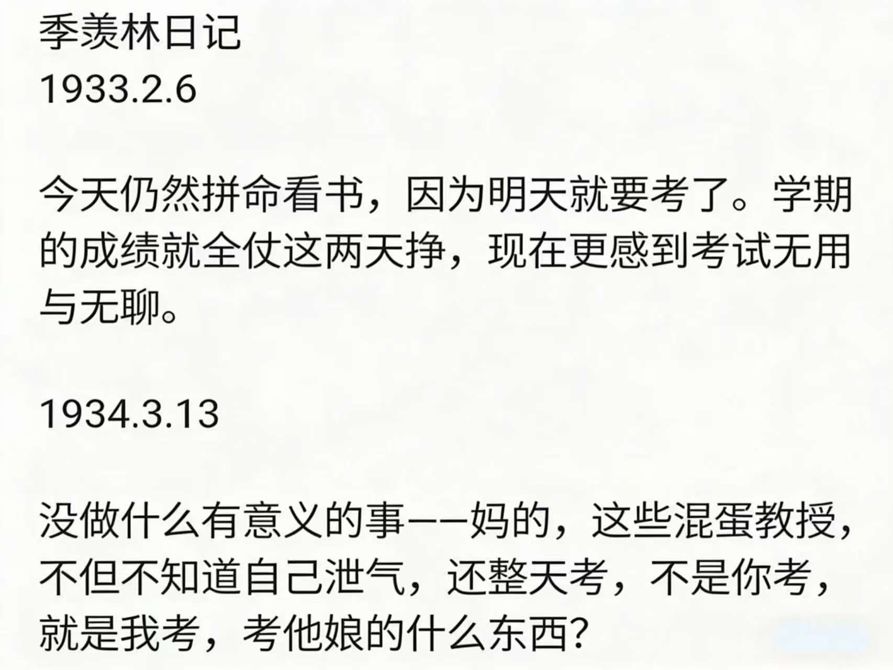
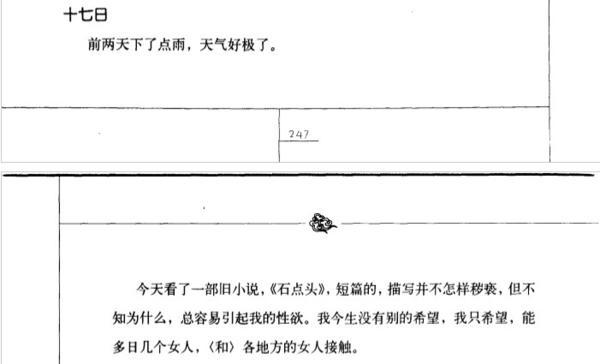
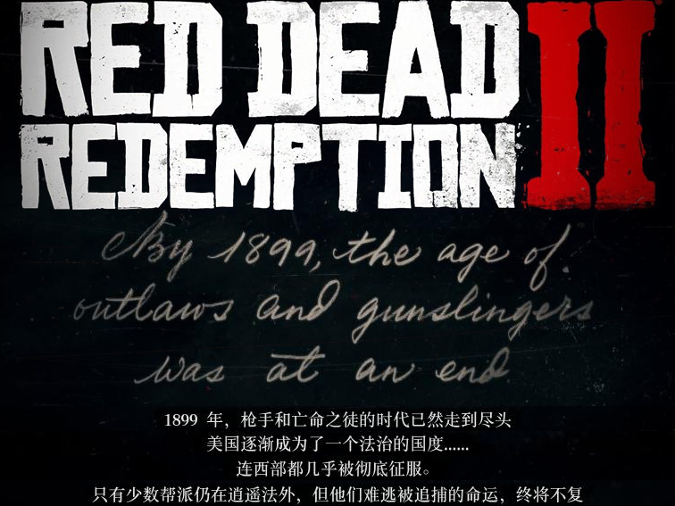

---
title: "随笔-202601 思绪汇总"
date: 2026-01-01
description: "随笔"
slug: 202601
tags:
  - 随笔
categories:
  - 随笔
---

---

# 随笔-202601 思绪汇总
## 元旦之旅有感
202601041811
31 号我早上洗了会儿袜子，结果发现地铁可能卡点到，我想着网约车可能更快，结果天津西站的高铁发车 5 mins 我还没到，赶紧改签天津南站，紧赶慢赶终于赶上高铁。下午 4 点多到无锡，然后打车去队长小舅家，晚饭吃了顿牛肉面+烙饼，然后去赵一鸣买了 100￥的零食，然后走回去。晚上队长打三角洲，我就坐在电热毯上面看投屏电视，看了一晚上《**凡人修仙传**》动漫和《怪奇物语》，甚是无聊，然后打电话骚扰仅有的几个朋友。
1 号爽玩白天，把《**怪奇物语**》第五季大结局第八集看完，中午本来打算去无锡学院，结果没预约不让进去，气得我直接去梅里古镇，瞎逛，点了两杯茶颜悦色，然后晃悠到梅里遗址博物馆，然后再去各种小店看了不买，最后在小镇时光店（卖各种小时候零食的地方）买了点东西，接着和从无锡站赶来的 wrz 碰面，在小镇逛了逛，大概 4 点多就去吃晚饭，吃完大概 6 点天黑了。在饭店门口拍下一张竖中指的照片，然后 wrz 被发朋友圈了。晚上去 KTV 唱歌，3 h，唱到最后 wrz 累了，大概 10 点结束。然后我定了一个酒店，他们去网咖玩游戏，我去酒店洗澡拉屎，然后看了一会儿工程数学基础（因为 2026.01.10 考试）。大概 11.30 左右他们回来了，三个人住一个房间，我让他们睡一张床，然后 wrz 点 KFC，我还一脚踢爆瓶冰可乐（第二天地板上很多糖分，粘脚）。
2 号 9 点多早上吃了点锡笼包，10 点打车去无锡博物馆，逛了一上午，快 1 点在南长街喝了杯霸王别姬，然打车后去惠山古镇，因为时间原因没去惠山古镇里面的**文物古迹区+锡惠名胜区**：70 元（包含寄畅园、天下第二泉、惠山寺等）。花了 10 元去里面的惠山公园逛了逛，爬上之前特意去了阿炳墓，然后爬山，累死我了。大概 6 点多打车去三阳广场，冷死我了，由于没预定，从海底捞到老乡鸡最后到龍歌自助，排队 68 mins 排了 105 位，我的妈呀，晚上 21 点多才去酒店。大概 23.30 左右 wrz 就走了。
3 号 9 点多没吃早餐，我和队长去**鼋头渚**，emmm，走了半天各种瞎逛，12 点多然后坐汽轮之前喝了杯奶茶，上岛，各种打卡，然后下午 4 点多离岛，快五点才打车离开鼋头渚，转地铁又去三阳广场就已经 18.30 左右了，吃了顿**必胜客**披萨，然后在 19.30 左右我吃饱喝足，登上了回天津的火车。
总结，累死我了，但是美美拍照，就是忘记带电动剃须刀了，胡子邋遢的。

## 观校园集市帖子有感
202601052207
靠时间忘记的人经不起见面
以为日子久了，总会慢慢释怀。我已然收拾好过往心绪，一步步朝着生活的新奔头稳步前行，可昨夜一场梦，轻易就击碎了所有伪装。
梦里，她满心欢喜地奔赴了另一个人——一个我都不得不承认很优秀的人。那些我求而不得的陪伴，那些她不愿与我共度的时光，此刻她没有半分迟疑，满心热忱，甘之如饴。
那一刻，我的心骤然停跳了一瞬。偏偏这一瞬，刚好弥补了初见她时，那毫无预兆多跳一下。
从前总天真地想，真心喜欢过一场，哪怕结局是分开，也该坦荡盼她岁岁安澜。可直到此刻我才看清，心底翻涌的从不是坦荡，而是汹涌的嫉妒，是不甘的占有欲。
原来我这般邪恶，这般虚伪。
我终于明白，有些人，从来都不是靠时间就能忘掉的。旁人说，要靠下一段感情才能抽身，可我早已在这段过往里，对情爱彻底祛魅。
往后的人生规划里，再也没有“另一个人”的位置。
我忽然觉得，那些谈情说爱的缠绵与欢喜，终究不过是一场幼稚的执念。
这份执念，该如何安放？我无解。
## 复习工程数学基础有感
202601061050
对自己有点失望，有点碌碌无为，自己是个普通人，老废物了。
Someone younger will ask you a question that reminds you why you started.
You’ll learn that scaling up isn’t just for membranes—it’s for patience too.
A membrane can separate gases; your focus can separate noise from insight.
Life is short， you need Python.
人生苦短我用 python
手搓太难了
## 观季羡林日记《清华园日记》有感
202601101659
1933.2.6
今天仍然拼命看书，因为明天就要考了。学期的成绩就全仗这两天挣，现在更感到考试无用与无聊。
1934.3.13
没做什么有意义的事一一妈的，这些混蛋教授，不但不知道自己泄气，还整天考，不是你考，就是我考，**考他娘的什么东西**？

前两天下了点雨，天气好极了。今天看了一部旧小说，《石点头》，短篇的，描写并不怎样秽亵，但不知为什么，总容易引起我的性欲。我今生没有别的希望，我只希望，能多同几个女人，各地方的女人接触。

乐死我了.
## 午睡醒来奇想
202601111448
关于运气那些事儿
有一次抽奖抽到一本关于奥特曼的书籍，关键是我还已经买过了。
关于言外之意的那些事儿
开学以来我一直说舍友有多厉害啥的，然后保本校基本上都是养老的这句话，我后知后觉大概半个学期才能明白。
## 图书馆感悟
202601121049
曾经我以为身边有很多人，现在我才明白，孤独是人生的常态。
故司马迁曰：“天下熙熙，皆为利来；天下攘攘，皆为利往。”
所以说，努力提升自己在社会层面的价值（也可以说世俗眼里的成功），自然而然，有人有需求你有价值，然后你们之间就必定存在联系。
孙燕姿的歌曲《遇见》歌词提到：“......我排着队，拿着爱的号码牌......”。
热力学里面对于一个封闭的热力学系统，有熵增原理，大概讲的是系统总会自发地向更无序、更混乱的状态演化。人与人之间也是如此，会自发的向**更无序、更混乱的状态演化**。
感情本就是一个熵减的过程，所以说假如你喜欢一个妹子，先加微信创造一点机会，然后一点点有序起来。
社会价值观正在物化每个单独的个体，促进这台巨大的机器运作。
18 世纪末至 19 世纪中期，第一次工业革命，蒸汽机与机械化生产；19 世纪末至 20 世纪初，第二次工业革命，电力与大规模工业化生产；20 世纪中后期，第三次工业革命，电子技术、计算机与互联网；21 世纪初，第四次工业革命，数字化、自动化与智能制造（工业 4.0）；21 世纪中期（提出阶段），第五次工业革命，人机协同与可持续发展；
蒸汽机的发明引发了工业革命，电力的普及推动了社会生产方式的全面变革，而现代信息技术的进步则重塑了全球经济格局。
## 老师谈话
202601131854
在人工智能时代怎么增强自己的不可被替代性？
教育，老师，学生和 AI 三者如何衡量好
## 刷小红书有感
202601141120
千万不要自己摸索，你大部分的问题，这个地球上早就有人解决过。你不是第一个来到这个星球的人，很多事情早就有人做过了，你没必要从头开始去摸索。临摹是最快的学习方法。绝大多数人的成长之所以缓慢，是因为掉进了一个叫“原创强迫症”的陷阱。他们总觉得借鉴是可耻的，非要撞个头破血流，试图通过一己之力去发明轮子。这种思维表面上是勤奋，本质上是极致的傲慢。在任何成熟的领域，几乎所有坑位早已被前人踏平，所有的捷径早已被绘制成图。你那所谓的“独立探索”，在概率学面前，可能只是在低水平地重复前人失败的路径。全网都知道拳王阿里打遍赛场的招牌拳法，但很少有人知道，那是他对着偶像的比赛录像，一帧一帧拆解，反复模仿千万次练出来的；哪怕是好莱坞教父斯皮尔伯格，到现在还会翻乔治·卢卡斯的创作手稿；而卢卡斯这种级别的叙事大师，也会盯着斯皮尔伯格的分镜头反复研读，甚至直接“复刻”他的叙事节奏。你看，连站在金字塔尖的人，都在互相临摹、彼此验证，你凭什么觉得能靠自嗨赢过概率？ 就像毕加索所说：“平庸的艺术家借用，伟大的艺术家偷取。”这里的“偷”不是拙劣的复刻，而是剥开表象去偷走那个底层的决策模型。投资大师查理·芒格，从不发明新的理论，他只是把物理学、生物学和社会学的经典模型套用在商业上。他深知，解决复杂问题的钥匙，从来不在未来的迷雾里，而在历史的灰尘中。承认前人的答案，是你通往更高级进化的唯一入场券。想要实现人生的指数级增长，你必须学会“先复制，再迭代”。首先，找到那个已经在你目标领域拿到顶尖结果的人，把他当作你的活地图，停止一切无效的乱撞。其次，关掉你那无谓的自尊心，进行暴力拆解——不要看他说了什么，要看他如何构思、如何决策、如何执行，把他的逻辑骨架血淋淋地剔出来。最后，在掌握了那个1:1的成功模型后，再根据你的现实场景进行微调。这个过程就像是在巨人的肩膀上焊接你自己的零件。别再把时间浪费在推导已经存在的公式上。所有的伟大，起初都源于一场卑微的效仿；所有的超越，都建立在对前人智慧的深度占有之上。借用别人的光，去照亮你自己的路，这才是普通人通往卓越的唯一真相。真正的成长捷径，是放弃这种“重复发明轮子”的执念，去直接占有前人跑通的底层逻辑。
202601142206
如果你跟一个人没有结果，但是你又特别喜欢他，应该怎么办？宝贝，我跟你说，这就像你明知那盆仙人掌永远不会开花，但还是每天都会给它浇水。有时候我们总要允许自己的心保留一些无用的浪漫。特别喜欢的定义早就变了，以前是把他设为特别关注，现在却成了及时取消置顶。手指经常还是会自动滑到那个熟悉的位置，却发现他早已不在置顶了。
就像你衣柜最里层那件起球的旧毛衣，明明不会再穿，但每次换季整理的时候都会把它重新叠好放回原处。这些存在的本身已经成为了你生活里的褶皱。其实身体总是比心灵更固执，你还会在人群里下意识寻找他的身影，闻到熟悉的气味时会突然停下脚步。手机相册里还存着舍不得删的聊天截图，最难过的是那些无人接应的分享欲。
看到好看的云想拍给他，听到好笑的梗想艾特他，直到举起手机才想起来原来你的消息已经不在他的接收范围里了。可是宝贝，特别喜欢这件事本来就不需要结果的认证，就像你童年珍藏的玻璃珠，现在不会拿出来玩了，但是知道他们还在铁盒里闪着微光就安心了。那些透明的彩色的圆球封存着某个夏天最纯粹的快乐。
不如把这份感情当做他送你的那双鞋，不必天天穿着它，汤水也不用急着扔掉，就放在玄关角落。等某个起风的清晨你会发现膜拜鞋带儿上竟然钻出了细小的三叶草，原来那些走过的路早已在你不经意时留下了生命的痕迹。就好像你以前单曲循环的歌，不必强迫自己切歌，也不用设置成起床铃声，就让它自然的在播放列表里流转，直到某天你突然发现曾经让你落泪的副歌现在只会让你微笑着跟着哼唱。
而你的歌单里早已新增了更多动人的旋律。宝贝，特别喜欢的意义不在于能否拥有，而在于他让你知道了自己心跳的模样。那件他留下的旧 T 恤就叠在衣柜最底层，未来当某个月光很好的夜晚你把它拿出来当睡衣，站在镜前会看见是当年那个痴痴的自己，又不再是当年那个怯怯的自己。这大概就是时间最温柔的魔术，让所有的特别喜欢都变成滋养你灵魂的月光。好不好？
## B 站思考
202601151032
中国没有中产，只有无产阶级和手握生产资料的资本家，这也是一直以来的阶级斗争，从未停止，所以放弃幻想，踏实干活为未来做打算
## 短视频盛行提升了/降低了当代人的认知能力
202601151255
辩论赛：短视频盛行提升了/降低了当代人的认知能力【字幕版】
这场辩论看下来，其实很清楚，吵的根本不是短视频，而是**人还剩多少是自己的**。
正方一直在往前推时代叙事：工具早就不是外物了，它已经长在人身上。短视频不过是把信息压缩、递到你面前，让你在有限注意力里看到更多世界。认知不该只算“脑内算力”，还该算**你能不能借助工具把世界接进来**。你刷到心理学概念、社会议题、陌生风景，那就是边界在被拓宽。
反方从头到尾就死守一件事：
**能力不能外包。**
认知的核心不是你看了多少，而是你能不能专注、能不能抽象、能不能独立思考。而短视频的机制，本质就是高频刺激+即时反馈，它不是在帮你想，是在替你想。久而久之，注意力碎了，思考肌肉退化，工具从延伸变成了替代。
这场比赛真正的分水岭，不在“短视频有没有好内容”，也不在“娱乐能不能寓教于乐”，而在**认知能力到底要不要算工具那一部分**。
正方试图重写定义，说这是新时代的认知形态；
反方坚持原教旨，说人至少要守住不被技术接管的底线。
评审最后站在反方，其实很合理。不是因为他们讨厌短视频，而是因为正方的新叙事来得太晚、太散，没能彻底抢下定义权；而反方把“专注力—抽象思维—机制因果”这条链条扣得很死，完成了论证责任。
所以你会发现，这不是一场谁更懂平台的比赛，而是一场**谁更敢为“人还要不要自己思考”负责的辩论**。
短视频没有被判死刑，它只是被提醒了一句：
工具一旦开始替你活，
那你再多看几个世界，
也可能不是你的。
这是一场披着媒介外衣的老问题复刻。正方主张工具即能力的外延，短视频是认知的外骨骼；反方坚守人类认知原教旨主义，认为专注力与抽象思维不可外包，工具一旦接管就会“用进废退”。比赛走向最终落在这条警戒线上——当工具从**延伸**滑向**替代**，人就像被推着跑的马拉松选手：看似更快、更省力，实则是在把思考一点点交出去。
## 人工智能应用反思
202601151317
造梦西游作弊器事件：因 Flash 架构易被篡改，玩家普遍使用 CE 修改器“开挂”；官方无力从底层封堵，便采取“报复性数值膨胀”策略，将 BOSS 血量调至变态级以制裁外挂。结果导致正常玩家无法生存，被迫加入作弊行列，最终陷入了“不作弊没法玩 → 全员作弊 → 难度更变态”的死循环。
一边吐着血，一边奔跑的马拉松：在特摄剧《奥特赛文》第 26 集《超强兵器 R1 号》中，诸星团说出了这句名言：“就像一边吐血，一边还要不断跑下去的马拉松啊”，用讽刺当时的美苏冷战。
国际华语辩论邀请赛-短视频盛行提升了/降低了当代人的认知能力：人类认知原教旨主义中能力与工具辩证：工具是延申还是替代。
## 专业反思
202601201220
研读基础学科的多数人是傻比，没有一定的智商。
特别是学化工的，都是一群脑子有毛病的人。
## 新中特复习思考
202601211922
**现在中美是不是处于新时代中国特色社会主义与新时代美国特色资本主义？**
中国是“先有理论 → 再塑造现实”；美国是“现实变化 → 尚未形成新理论”
在政治叙事上，中美确实正被塑造成两种“新时代制度道路”的竞争；
但在理论自觉程度上，中国是在“命名自己的时代”，
而美国是在“被时代推着走”。
**两个凡是和两个确立，两个维护的区别？**
“两个凡是”是把个人变成真理；
“两个确立”是把核心和思想变成制度化的政治前提。
一个封闭认识，一个统一方向。
**马克思主义有个绝对真理的存在，党是绝对真理吗？**
党不是绝对真理。
党最多只能被认为是在特定历史阶段里，承担推进真理实践的政治力量。
**党大还是法大？**
从法治原则（应然）看：法应当大。
从权力结构（实然）看：党在关键问题上更大。
从治理质量看：关键是让权力接受法律约束，而不是让法律服务权力。
**全过程人民民主是最广泛、最真实、最管用的民主？**
全过程人民民主强调“全过程参与 + 结果有效”，以治理能力为核心指标；
美国大选民主强调“程序正当 + 周期授权”，以选举程序为核心指标。
**如何跳出历代王朝“其兴也勃焉，其亡也忽焉”的历史周期率问题？**
当黄炎培先生提出如何跳出历代王朝“其兴也勃焉，其亡也忽焉”的历史周期率问题时，毛泽东同志给出的答案是“让人民来监督政府”。习近平总书记给出的答案是“自我革命”
**我国社会主要矛盾已经转化为人民日益增长的美好生活需要和不平衡不充分的发展之间的矛盾?**
发展不平衡不充分问题，是指在经济社会总体发展水平显著提高的背景下，区域、产业、城乡、群体和公共服务等方面存在结构性失衡，以及发展质量、效率、公平性和可持续性不足，已成为制约满足人民美好生活需要的主要矛盾。
**社会中存在的根本性矛盾**
主要体现在生产力与生产关系、经济基础与上层建筑之间的矛盾
生产关系主要由生产资料所有制关系、人与人之间的关系以及产品分配关系构成。
<mark>习近平思想</mark>
**政治思想**
（习近平新时代中国特色社会主义思想）
	社会主义核心价值观
	中国梦
	两个一百年
	五位一体
	四个全面 
		全面建成小康社会→全面建设社会主义现代化国家
		全面深化改革
		全面依法治国
		全面从严治党
	四个自信
	四个意识
	两个维护
	两个确立
	四个不是
	中国式现代化
	党领导一切
	深化党和国家机构改革
	国家治理体系和治理能力现代化
	全过程人民民主
	两个结合
**经济思想**
（习近平经济思想）
	新常态
	高质量发展
	新发展理念
	新发展格局
	新质生产力
	两山论
	供给侧结构性改革
	共同富裕
	房住不炒
	双减政策
	精准扶贫→脱贫攻坚战
	动态清零→与病毒共存
**外交思想**
（习近平外交思想）
	大国外交
	新型国际关系
	人类命运共同体
	全人类共同价值
	一带一路
	百年未有之大变局
	东升西降
	网络主权
	战狼外交
	外事访问
## 反腐思考
202601251238
2014 年 07 月 29 日<mark>中共中央政治局常委</mark>、中央政法委书记周永康
2014 年 06 月 30 日<mark>中央军委副主席</mark>徐才厚
2015 年 07 月 30 日<mark>中央军委副主席</mark>郭伯雄
2017 年 07 月 24 日<mark>中共中央政治局委员</mark>、重庆市委书记孙政才
2023 年 10 月 24 日<mark>中央军委委员</mark>、国务委员兼国防部长李尚福
2025 年 10 月 17 日中央政治局委员、<mark>中央军委副主席</mark>何卫东，<mark>中央军委委员</mark>、军委政治工作部原主任苗华
2026 年 01 月 24 日中央政治局委员、<mark>中央军委副主席</mark>张又侠，<mark>中央军委委员</mark>、中央军委联合参谋部参谋长刘振
> 有点哈人，维基百科上面说周，徐，郭这几个都是蛤蟆派，然后胡被架空两年（中央军委主席在中共中央主席交接两年之后才进行更换）。
## 自辩复习思考
202601251511
所谓**辩证关系**，并不是简单的相加，而是指事物之间既有区别，又有联系；既存在矛盾，又能够在矛盾中实现统一和发展。
> **辩证关系不是非此即彼，而是在差异中统一，在对立中运动。**

从这个角度看，“辩证”之所以被很多人误解，恰恰是因为它看起来像是“两头下注”：既不完全站这一边，也不完全站那一边。但它并不是诡辩或狡辩，更不是简单的折中，而是一种**非二元论**的思维方式——你中有我，我中有你。
这种感觉，其实和阴阳、八卦、太极图很像，也和凯库勒提出的“衔尾蛇”意象相通：对立并不意味着割裂，而是相互生成、相互转化，统统属于哲学层面的思维方式。
在此基础上，就能理解**自然辩证法**的几个层面：
- 自然观
- 科学技术观
- 科学技术方法论
- 科学技术社会论
- 中国马克思主义科学技术观
再往上追溯，就是马克思主义哲学（马哲）的普遍原理中对立统一规律（矛盾规律）。比如：
- 矛盾的普遍性
- 矛盾的特殊性与转化
马哲的这些普遍原理，本质上是用来**指导人们认识世界和改造世界**的方法，其核心是**辩证唯物主义**和**历史唯物主义**。马克思主义的经典作家也一直非常重视方法论问题，马克思主义科学方法论的核心，正是**辩证思维**与**系统思维**。
具体到科学技术领域，马克思主义科学技术方法论强调：
把辩证法贯彻到科学技术研究中，将**对立统一规律（矛盾规律）、质量互变、否定之否定**这些思想，与系统思维一起，渗透进具体研究过程。
因此，在实际研究中，它强调的是多重统一：
- 分析与综合相互照应
- 归纳与演绎相互结合
- 从抽象到具体的辩证过程
- 历史与逻辑的统一
- 整体与部分的统一
- 结构与功能的统一
再往外延展，马克思主义哲学的普遍原理，几乎覆盖了：
- 世界观、价值观、人生观
- 方法论、认识论、本体论
- 辩证唯物主义与历史唯物主义
理论确实很厉害。
但此刻我对它的理解，大概也就到这里了——可能是我的小脑袋只有核桃大小，或者只是单纯晚上没睡好，灵感暂时不太配合。
至少目前能确定的是：
马哲关注的核心始终是**认识世界与改造世界**，以及与现实生产力、一般生产力相关的一整套问题。至于形而上学、唯心主义与唯物主义之间的区分，也都在这个体系中被反复讨论和界定。
## 关于 AIGC 的应用反思
202601261812 第一次整理
202602022308 第二次整理
##### AIGC 带来的技术替代是必然的
首先 **AIGC 带来的技术替代是必然的**
对于科学技术中 AIGC 的发展与运用，可以明显看到 AIGC 对于部分文职岗位的冲击，这方面可以认为是技术替代。这就像印刷术替代手抄，蒸汽机替代水力与人力，电力替代煤气与蒸汽动力，内燃机替代马车与蒸汽机，互联网替代传统通信手段（邮递、电报），计算机替代算盘与人工计算，数字摄影替代胶片摄影，自动化生产线替代人工手工生产，以及游戏 RED DEAD REDEMPTION Ⅱ开局那段讲述混乱与暴力逐渐被文明和法治取代的经典故事：“1899 年，枪手和亡命之徒的时代已然走到尽头，美国逐渐成为了一个法治的国度，连西部都几乎被彻底征服，只有少数帮派仍在逍遥法外，但他们难逃被追捕的命运，终将不复存在……”
“Rockstar Games 出品”
“RED DEAD REDEMPTION Ⅱ”
因此我们应该积极拥抱先进的 AIGC 技术

##### AIGC 带来的技术依赖是必然的
其次**AIGC 带来的技术依赖是必然的**
技术依赖本质上说，是一个关于人类认知原教旨主义中能力与工具辩证：工具是延申还是替代。AIGC 带来的技术依赖就像一边吐着血，一边奔跑的马拉松。
你可以实现技术对人能力的延伸：AI 像碳板跑鞋，让你把同样的体能跑得更好，但你的肌肉还在发力。但必定会有人实现技术对人能力的替代：AI 像电动车，你看似更快，但你的心肺和肌肉在退化，离开电机你就跑不动多远。有人说你这是纯粹搞极端，没人逼着让你跑，但是人类对于技术的依赖性是不可避免的。一旦人类接受了技术带来的便捷和进步，就会对它产生依赖，而不愿意放弃。这与现代社会中普遍存在的技术进步与人类依赖之间的关系非常相似。无论是互联网、智能手机，还是人工智能技术，都是这种依赖的例证。
说起来很遗憾，现在社会是没有办法停止使用电磁波。当然，停止和减少使用电磁波这件事情，说起来很容易。问题是，如果不使用电磁波，人类能生活下去么？人类一旦习惯了使用方便的东西，再回头很难啊！
因此我们应该警惕 AIGC 带来的技术依赖。
##### AIGC 带来的技术异化是必然的
最后**AIGC 带来的技术异化是必然的**
科学技术的运用一方面显著提升社会运行效率与制度便利：例如线上缴纳水电费；网约车即时出行；即时通讯；社交媒体流行。减少了时间成本与交易摩擦，让公共服务与资源配置更高效。
但另一方面，当技术深度嵌入平台与组织治理，并与利润—绩效逻辑绑定时，就可能出现“技术异化”：技术不再只是人的工具，而以算法规则、指标体系和流量机制的形式反过来支配人。比如，网约车与电商平台通过差异定价“杀熟”加剧信息不对称；外卖平台以算法调度与考核压缩骑手的时间与安全空间；企业以绩效数据与流程管理强化 996，使劳动过程被量化、碎片化并失去自主性；社交媒体以推荐与流量逻辑重塑注意力结构，制造信息茧房，削弱个体的判断与公共讨论能力。
同样，在今天的 AIGC 时代，尽管我们享受到了便利和生产力的提升，但也需要警惕它带来的社会不平等、就业问题、隐私侵犯和创作的同质化等道德风险。如果这些问题没有得到妥善解决，技术的进步可能变成一种 **“工具异化”** ，让人类丧失对技术的掌控和理解。
> 这里技术的异化是由劳动的异化所带来的，前提是技术的胜利似乎是以道德的败坏为代价换来的？马克思主义认为，技术的异化本质上是资本主义体制下劳动的异化的延伸和深化。技术进步可以提升生产力，但如果没有社会制度的保障，它也可能加剧劳动者的异化。**技术的进步**如果没有适当的伦理监管，**可能会导致社会不平等、劳动异化等道德和社会问题**。

因此，科学技术的关键问题不在“用不用”，而在“<mark>由谁制定规则、为谁分配收益、如何约束算法权力</mark>”：当技术服务于人的发展，它是制度优势；当技术沦为控制与榨取的机制，它就表现为异化。
**技术的胜利以道德败坏为代价**，其实可以类比为**工业革命中的劳动异化**。虽然工业革命让人类的生产力得到了空前的提升，但随之而来的却是大量的低薪工人、恶劣的工作环境以及对工人生活条件的忽视。这种情况下，**技术的进步确实是以道德、劳动者福祉和社会伦理为代价的**。
因此我们应该时刻警惕 AIGC 从人的工具变成支配人的力量。
##### **社会人文文化与科学技术之间的关系**
默顿在《十七世纪英格兰的科学，技术和社会》中提出“清教主义促进英国近代科学的制度变化”，“李约瑟难题”的核心“近代科学为什么没有在中国诞生”，证明科学技术的产生需要一定的社会文化环境。2022 年 ChatGPT 3.5 没有出现在中国，但 2025 年出现了 DeepSeek-R1。这说明中国培养科学技术的人文文化土壤还是有的，虽然效果不一定比得上 ChatGPT 3.5，但这说明中国并不缺乏创新的人才与文化基础。
最后聊一点关于“要么与 AI 同进化，要么被 AI 边缘化。”这句话听起来像暴论，但它描述的其实是一个正在发生的趋势：AI 正在把“会用工具”和“不会用工具”的差距，放大成效率、质量与机会的差距。边缘化不一定是被取代，而是在新的生产方式里失去话语权和选择权。
##### AIGC 的挑战与发展？
AIGC 的优势首先体现在逻辑层面，而人与 AI 目前最大的不同，仍然在于主观能动性。人并不是只会被动完成任务的存在，而是会主动产生欲望、目标和行动方向。至少在这一点上，技术还无法替代人。
因此，与其把 AIGC 看成一种“抢岗位”的工具，不如把它理解为一种提供新质生产力的工具。技术本身并不必然指向失业。回看前两次工业革命，类似的担忧同样存在，但结果并非岗位消失，而是岗位结构发生变化，整体生产力被显著抬高。从这个意义上说，生产力的提升本身并不是坏事，真正需要被认真讨论的，是如何使用技术、如何建立规范，以及如何在制度层面回应随之而来的变化。单纯的焦虑并不能解决问题。
真正值得警惕的，反而是**技术替代、技术依赖以及技术异化**。当工具开始反过来支配人的节奏，当人被迫围绕技术运转，这才是需要思考的核心问题。
AIGC 时代确实会让个体在相对意义上的“不可替代性”下降，但这并不意味着个人价值在绝对意义上的贬损。本质上，这是社会生产力快速发展，而生产关系尚未完成调整所带来的错位现象。技术在加速，而制度、分工和评价体系尚未跟上，于是就出现了“人被工具追着跑”的状态。
问题不在于技术本身，而在于我们是否有能力重新定义人与技术之间的关系。
## 读研半年阶段性有感
202601271045
思考 1
坐标天津某 9，体验读了这半年研，想谈谈自己的感受。
随着自己年事的增长，对于未来的焦虑更甚从前，晚上会有因为迷茫的失眠，家庭的托举也仅限于供我去读书，去提升自己，对于未来我必须自己去规划。
而现实往往是，对于我这种“小镇做题家”出身的人来说，长辈给不了指导建议，只能自己摸着石头过河，前方也不知是暗是明。
齐先生，现实大概率是不会“千年暗室，一灯即明”的。
我自己深刻得明白，读研是需要培养打磨自己的技能的，但是否有多大的进步，是否做的事情真得能在未来派上用场，一切都显得太茫然，太空洞。
一路走来，做的所有思考与决策都是来源于我自己本身，无论是好是坏，也必须硬着头皮继续往前。
另外，对于研究生阶段找对象这事，我也觉得是场难以解决的问题。我并非能够对刚认识的人无话不谈推心置腹，也并不想没有话题硬找话题。所以我有时候挺模糊 i 人和 e 人的界限，在略微熟一点的人面前，我可以长篇大论滔滔不绝，但对于刚认识的或者行将认识的人，我并提不起太大沟通的欲望，又或者说，他人也未必想做你的倾听者亦或者了解者，你想表达的东西，其实多半没有意义。大家都很忙，难以有什么真正的联络。
这么一来，主线和支线都是相当困难的任务，那么又该如何呢?
<mark>何以解忧？唯有杜康。</mark>
思考 2
没有父母托举的普通人大多只有两种归宿。
要么认知晚熟，一生浑浑噩噩成为父母的复制品；要么冲破规则，极度珍惜每一次出现的新风口，死命抓住后逆天改命。
这个世界什么东西都讲究一个继承关系，你原生家庭的认知、父母的格局、为人处世的方式，都会潜移默化影响你的思维方式。所以如果你仔细观察，你会发现现实中很多普通人一辈子都在走父母的老路，本质上生存模式是没变的。
工薪阶层父母，往往就是会天然地培养孩子上个好大学、找个好工作，安稳度过一生。做生意的父母，大概率会更倾向于培养孩子的财商意识，让他们在很小的时候就尝试了解商业，以便长大后可以依靠交易生存，而不是出卖体力。
有些知识父母不教，学校不教，朋友之间更不会聊，所以大多数普通人的知识体系是被锁死的，只能被动从周围人群那里继承。
但庆幸的是，其实还是有那么一小撮普通人，他们受尽了贫穷的折磨，于是“穷则生变”，开始认真研究人生的问题到底出在哪里，以及如何改命。有些人想通了，于是就会开始重构认知体系，停止对父母思想的继承，开始阅读、学习、结交牛人，试着走出一条不一样的路子。
## 读短文《阶层复制：一个高校老师看见的精英家庭教育》有感
202601291035
这篇短文底下有很多评论，其实并不是在反驳文章，而是在分享补充一个更残酷的认识：
<mark>阶层真正的力量，不只是资源，而是让人意识不到资源本身的存在</mark>。
有人指出，精英家庭最成功的教育，并不是替孩子铺路，而是让孩子以为这条路本就存在；让他们自然地相信，世界理应回应自己，机会本该向自己敞开。这种“配得感”，比金钱更早进入身体，也更难被后来者习得。**而普通人的困境，恰恰相反**。他们的人生往往是一条不能出错的单行线：专业要选稳妥的，工作要选能养活自己的，兴趣和理想必须服从风险评估。不是不想试，而是试错的代价太高——一旦失败，没有兜底，没有重来，只能自我消化。于是谨慎被误解为保守，焦虑被误解为能力不足，但这其实是一种理性的生存策略。
也有人试图拉回希望，提醒“人生很长，终会均值回归”。确实，个体命运并非完全被出身封死，总有人逆流而上，甚至后来居上。但这种反例本身，恰恰说明它的稀缺。它需要的不只是努力，还需要时代窗口、个人韧性、偶然机遇的叠加。把少数幸存者当作普遍路径，本身也是另一种精英叙事。
评论里反复出现的愤怒，并非源自嫉妒，而是来自<mark>被优绩主义羞辱的体验</mark>。当成功被简化为“你不够努力”，结构性的差距就被抹去，失败者不仅要承受结果，还要承担道德指控。于是精英可以心安理得地把一切归因于自己，而普通人只能在一次次比较中怀疑自身价值。
也有人选择抽身，不再执着于阶层叙事本身。他们说，年龄增长之后，会逐渐意识到：世界足够大，人生并不只有一条成功模板。与其用别人的起点折磨自己，不如重新定义“过得好”的含义。这并非逃避现实，而是一种对自我主体性的回收。
最令人警醒的，其实是那些看似冷静的声音：他们指出，这一切并非阴谋，而是长期运行的结果——资源会向资源聚集，认知会向认知靠拢，教育只是这套系统最温和、也最有效的再生产工具。理解这一点，不是为了绝望，而是为了不再误把结构当成个人。
当这些声音汇聚在一起时，你会发现，讨论早已超越“精英是否努力”这种浅层问题。真正被反复触碰的，是一个更根本的命题：
**<mark>在一个起点严重不均的世界里，我们究竟该如何理解努力、失败与自我价值</mark>。**
这本书读起来一直让我有种如鲠在喉的感觉，问题倒不完全在于它说错了什么，而在于它默认了一套我并不完全认同的价值判断。书中似乎很自然地把分数带来的校园优势，当成一种值得肯定的能力和正当性，把挑战老师、凌驾规则视为“优秀”，再顺势将这种学生时期被制度偏爱的体验，延伸为未来社会竞争中的资本。这种逻辑在学校里或许说得通，但一旦跳出校园，我始终对它是否成立心存疑问。
更让我困惑的是，这套判断建立在非常有限的样本之上。仅凭二十余人的田野材料，便概括出“<mark>学神—学霸—学渣—学弱</mark>”的结构，并据此推演出一整套精英逻辑，难免显得有些仓促。书中反复描绘的分数等级、标签化话语和由此产生的师生互动，其实并不只存在于所谓的北京精英教育现场，而是全国高中普遍存在的一种做题秩序。如果这些现象本身并不特殊，那么它们究竟在多大程度上能够支撑“精英教育”的结论，我是存疑的。
读到后面，我逐渐感觉这本书更像是在用既有理论反复印证一个预设结论：社会是不平等的，学校是精英化的，北京学生尤其内卷。但真正让我期待被展开的部分——比如学生和家庭如何理解自身处境、如何想象未来、是否拥有承担失败的空间——却被轻轻带过。书中被不断强调的“学神”，在我看来也未必是真正意义上的学神，更像是作者理解中的一类精英特权形象。
我并不否认这个议题本身的重要性，恰恰相反，我觉得它非常值得被认真讨论。只是至少就这本书而言，它给我的感觉更像是“<mark>拿着锤子找钉子</mark>”：问题被提前设定，材料被用来反复佐证，而不是在研究过程中真正被问题牵着走。此外作者思想源自书籍《学神：中国精英教育现场一手观察》，也许这本书可以和《我的二本学生》《读书的料》《文凭社会》《金榜题名之后》《寒门子弟上大学》《特权》《音乐神童加工厂》《美国的职业结构》以及<mark>布尔迪厄</mark>的系列著作对照来看？反而更容易懂到这一问题的复杂性。
后续继续思考这个有价值的问题