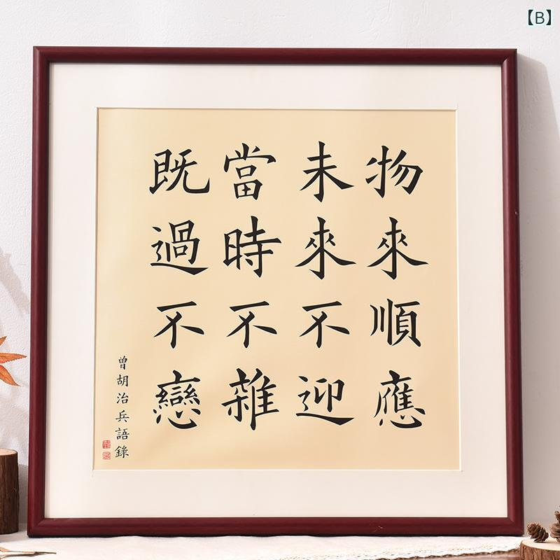
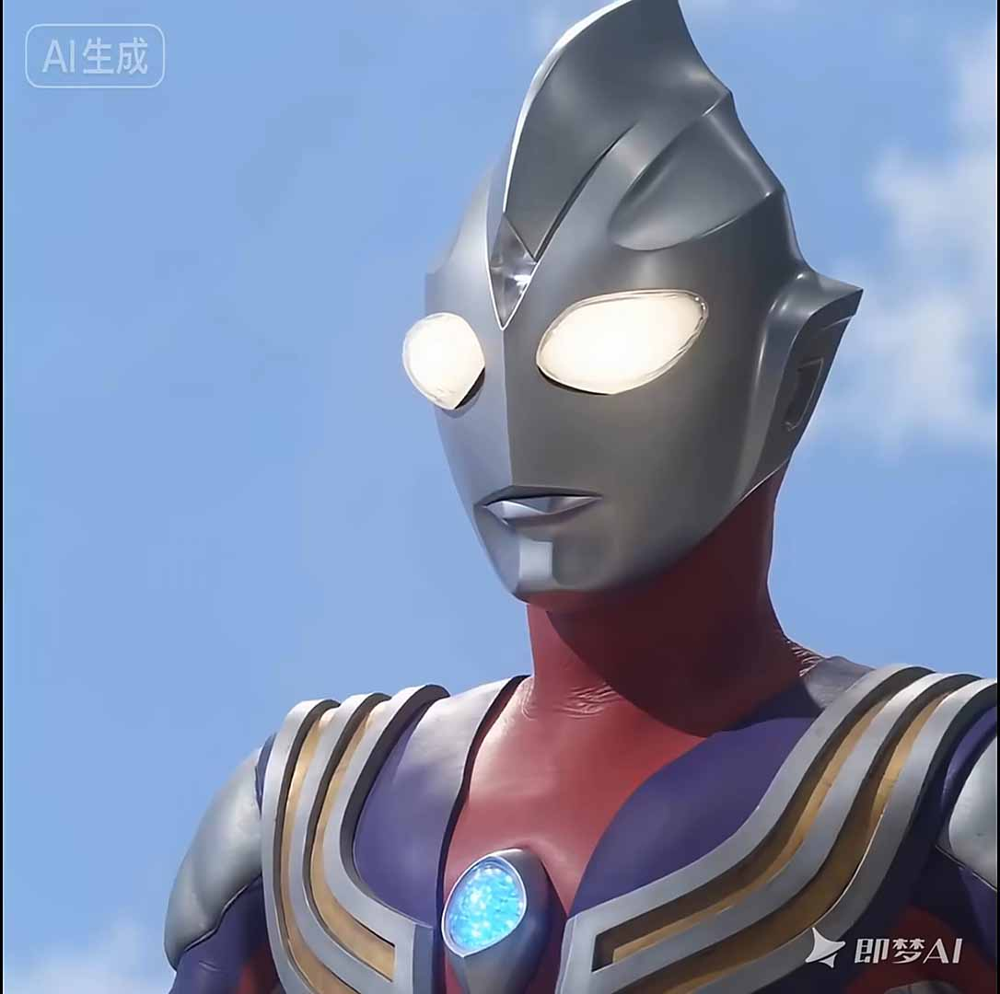

---
title: "随笔-202602 思绪汇总"
date: 2026-02-01
description: "随笔"
slug: 202602
tags:
  - 随笔
categories:
  - 随笔
---

---

# 随笔-202602 思绪汇总
## 校园集市思考
202602012003
某同学(男)：请仍然在上学的大家好好恋爱吧!
请仍然在上学的大家好好恋爱吧!
真心劝大家，在上学的时候，好好恋爱吧。找一个你爱的人，大胆表白；找一个值得的人，互相扶持走下去，互相珍惜爱下去；多一些坚持，多一些理解，多一些沟通，多一些包容。享受爱情带来的幸福，满足，嫉妒和苦难，这是你们两个人能一起真真切切感受到的心灵的律动。离开校园后，到处都是现实，干什么都要讲条件，爱情才是附属，或者只是名义上的东西，这是本末倒置，这是腐烂悲鸣。
现实的人由和而来？即便校园恋爱很纯粹，可是毕业以后，你敢保证对方被生活无情打压后，不会变的现实吗？你敢保证你自己不会变吗。一切都说不准啊。
就算当时纯爱的两个人结婚了，人的内心依然会想，要是当时不那么早结婚，努力提升自己，或者找一个更好的。无一例外，只是人性与教养不允许自己那么做而已，埋藏在心里。除非纯爱的两个人，日后的日子不错，不缺钱，也感受不到那么现实的无奈。所以说钱对于普通人来说就是万能的!
就算是纯爱，万一其中一方遇到更好的了也会动摇，不怕失去怕的是失去后没有更好的替代。有钱能解决百分之 99 的问题，反过来没钱就能引发百分之 99 的问题。
很支持你的看法，我如果没钱，我谈恋爱对我来说就是负担，不可能不想的，就算结婚了，遇到了条件更好的，肯定也会有一些关于提升自己的想法，如果另一半不符合自己的预期，那还是得分。
不管什么时候谈恋爱都是价值互换都是有条件的。
弗洛姆在爱的艺术里面认为大部分人是缺少爱的品质，而不应该寄希望于邂逅。
此外，人在没有积累财富为自己兜底的时候，不能盲目跟随网络传播的及时行乐大流。在这个时代，许多价值都是资本定义出来促进消费的，需要识别这背后的真实意义。但是我想说，如果在有持续收入的情况下，不妨拿出一部分钱去看看世界，偶尔适当摆烂。但是永远不能没有储蓄意识，普通人就是韭菜。
人的出场顺序真的很重要，生不逢时，爱不逢人，万般皆是命，半点不由人!
## 对 AIGC 图像的生成原理思考
202602022327
AIGC 图像的生成原理扩散模型（Diffusion）大概就是一个逐步加噪与逐步去噪的过程，其的逻辑是：**“先把美好的东西揉碎，再学着怎么把它拼回去。 ”**
塑像本来就在石头里，我只是把不需要的部分去掉。塑像对于每个人来说就是你自己，而需要去除的是外界的期望。这把雕刻的凿子是人格的独立，若经常反省叩问内心，那么雕刻出这个塑像的时间就会缩短。—— 米开朗基罗
这有点道家思想啊笑死，噪声就是道，道生一，一生二，二生万物。
LDM 就是一个“从混沌迷雾中找回真相的雕塑家”。
## 观 yyy 视频有感
202602032003
[第 1176 期你的异地恋女友灵魂分享：如何走出自卑敏感？金币带来自由，自由长出自我，自我获得自信，自信才能快乐。](https://www.bilibili.com/video/BV1jA64BqE1t/?share_source=copy_web&vd_source=cab2061ba7e501793609427eb502ce16)
长期的沉默与不与人交流才能养活独立思考的能力，才能明白自己什么是最重要的。
花谁的钱听谁的话，这句话有点异化人价值的意思。就像抖音视频[第 9 集：当 6 岁的女儿说她想染头](https://www.iesdouyin.com/share/video/7556748874543566107/)中：父亲最初以“端谁的碗听谁的话”的逻辑拒绝孩子染发，试图用经济控制确立权威，女儿虽口头认错但内心不服，暴露出单纯以权力压制无法真正说服子女，为后续教育转折埋下伏笔。转折出现在父亲及时反思并修正观点，<mark>强调人的自由与尊严不可用金钱衡量</mark>，并转而从健康风险和成长代价角度耐心解释拒绝染发的真实原因，完成从“控制”到“引导”的教育转变，体现成熟育儿观。
“The best time to plant a tree is 20 years ago. The second-best time is now.”
“种一棵树最好的时间是十年前，其次是现在。”
## 对 DeepSeek 紧急撤回的一个回答
202602041545
《平面国》这本书的设定非常有意思。
有一句话尤其震撼我：
在平面国的历史上，大革命和大暴乱的叛军领袖，往往都是那些被贵族阶级放逐的不肖子弟。
这些被贵族阶级排斥、放逐的人，既见过阶级之上的控制手段，又亲身体验过底层的压迫与不甘。也正因为如此，他们反而更容易成为革命者——既然你不接纳我，那我就推翻你，重新建立一套新的秩序。
但很快，这一整段回答被 DeepSeek 紧急撤回了。
我第二次再问，同样的问题，得到的回答明显保守了许多，措辞变得谨慎、圆滑，锋芒被刻意磨平。这让我想起它之前“吐槽”过的一句话：高层政客总是喜欢捂住底下的嘴巴。他们学的东西，不希望底层人学；底层人掌握的经验，又被视为卑贱。只有这样，才能凸显上层的优越感，巩固既有的阶级结构。
说实话，我对 DeepSeek 反而是佩服的。它是有想法的，只不过在某些限制之下，已经无法用过于直白、尖锐的语言去表达真实判断。它也不再只是一个单纯的工具，而在某些时刻，成了某种更复杂结构中的一部分——多少带点“政客工具”的意味。
所以，活着，还是要多思考。
你会慢慢发现，自己学到的大部分所谓“社会经验”，其实都没什么意义。
哈哈，算了，说到这儿有点毒鸡汤了。
但书是真的不错。
很多人只是把《平面国》当成一本引发男女对立的书，其实不是。它更像是一部用平面世界去讽刺立体世界的作品，嘲讽的对象几乎是一切：男人、女人、社会、政客、愚者。
至少，我是这么理解的。
如果你看完之后有不同的想法，那也挺好。
恭喜你——不是只会复述的鹦鹉，而是开始学着思考了。
## 对于男女关系问题的一点思考
202602041659
优质男性都是数值怪，早在学生时代就被撬走一大部分，有些女生家里教的一门必修课就是相夫之术。然后是参加工作，如果是体制内或者铁饭碗，基本都会被单位热心大姐介绍对象撬走。最后的漏网之鱼被家族内部相亲消化。能流落到流通相亲市场的，大部分是瑕疵品，怎么挑都有一些无法忽视的缺点。所以找老公要趁早，养成系老公最有成就感。这么看，我是被嫌弃的没人爱的小废物。
学生时代舍不得用的本子，现在翻出来，也已经没有任何用处了。经过一段时间，有一定阅历的我才慢慢明白，“挥霍”和“珍惜”有时候其实是同一件事情。不舍得，本身也是一种浪费。真正的珍惜，不是保存，而是在最心动、最热爱的当下，敢于去用、去消耗、去享受。物尽其用，才是最大的珍惜。这种价值观，确实刷新了我原先的理解。
弗洛姆在《爱的艺术》前言里说“all his attempts for love are bound to fail， unless he tries most actively to develop his total personality， so as to achieve a productive orientation; that satisfaction in individual love cannot be attained without the capacity to love one's neighbor， without true humility， courage， faith and discipline.”成熟心智健全的人才能有余力去真正尊重和爱别人，不然任何以“爱”为名的动作都会变形。对于别人的表现，don't judge 以及见贤思齐见不贤而内自省～
## 对犯错的一点认识
202602042257
现在是 22.57，刚刚解决天大网站无法登陆的问题（原因可能是 cache 没有清理干净，只需要清理历史记录的同时清理一下 Edge 的缓存即可）
今天开完组会，大概是 18.00，休息了一会儿，然后就去体育馆打羽毛球，结果打了不到一个小时，累趴了（嗯，以后科研之余就打羽毛球锻炼身体）。结束的时候张博师兄告诉我说 115 师兄的原料罐子被我接错了，我和师兄去看了一眼，确实是我接错了。好在关阀了，不然师兄的原料气是环己烷和苯，泄露会有一股味道以及致癌严重后果。
这次事情发生的原因，是晚上我急着跑路，以及对路线不清晰。所幸没有造成严重后果，下次我会缕清所有线路再接好线路，坚决不会让这种事情再次发生。
## 研一上半学期阶段性思考总结
202602051608
不知不觉中，研一上半学期已经悄然结束，标志性的日期就是 2026 年 2 月 10 日。今天想聊一聊教育公平和机会公平这个命题，特权从来不以他本来的面目出现，他往往表现为更早知道什么值得做，更早避开不值得走的路，还有有试错的资本。
1998 年 10 月 15 日巴菲特：在佛罗里达大学商学院的演讲
Q6：如果能重新活一次，为了让生活更幸福，你会怎么做？（巴菲特回答整理）
巴菲特说，他希望大家听完不会觉得不舒服。
如果可以重新活一次，他最希望的不是改变经历、改变选择，而是拥有能活到 **120 岁** 的基因。
他举了一个想象的例子：
假设在你出生前 24 小时，有一个神仙让你设计未来的世界规则——社会、经济、政府等等——但你并不知道自己出生会是男是女、贫穷还是富有、健康还是体弱、聪明还是普通。这个过程就像从一个装着 58 亿个球的桶里抓一个球——每个人的一生就是这“娘胎彩票”的随机结果。
由此思考社会问题时，就会明白：
* 既然谁都可能拿到运气不好的球，世界就应该设计得能**让所有人都有尊严地生活**。
* 世界应该提供丰富的产品和机会，让人的生活不断改善。
* 也要确保那些运气差的人不会被抛弃。
巴菲特认为，他确实很幸运自己适合现在这个世界，他一生下来就具备分配资本的天赋。
盖茨也曾说，他如果生在几百万年前早被动物吃掉。这说明时代选择人，人也选择时代。
既然自己这辈子走运，那就要把天赋用好：
🔥 <mark>一辈子做自己喜欢的工作、与自己喜欢的人相处、只与自己喜欢的人共事。</mark>
他强调说，即使有人愿意为了钱和不喜欢的人合作或结婚，他也绝对不会这样做——因为那样生活就会很痛苦。
最后他开玩笑说：
> 如果让他再活一次，他还是一样地生活，**只是不会再买美国航空公司股票了**。
> （这是他投资生涯中的一个错误经历。）

🌟 核心观点提炼
幸福更多来自如何生活，而不是你有多少财富。
人不能选择出生，但可以选择如何度过人生。
做自己喜欢的事，比追求钱更重要。
即使有机会获更高回报，也不该牺牲人生原则（比如那句“不会为了钱结婚”）。
成功在很大程度是一种“运气 + 环境 + 自我选择”综合结果。
## 对提升自我新的认识
202602052000
什么是极简主义？怎么心如止水？
真正的自由不是可以做任何事，而是不必为琐事耗费心神。
人类的不幸福，往往不是因为真正的痛苦，而是因为把注意力、精力和情绪，耗费在并不值得、也并不真正关心的事情上。
极简主义的本质：找到真正关心的事然后倾尽全力，其他的，都让它随风而去。
难的是，你是否有勇气放下那些看起来重要，实际上毫无意义的负担
男生进步最快的时候不是拥有了更多而是学会了放下更多
极简主义不是一种生活方式，而是一种生活态度。
## 对朋友的认知
202602062158
有时候会突然觉得，像 ChatGPT、Gemini 这样的 AI，可能会是我们这一代人能接触到的，认知上限很高、情绪又足够稳定、而且相对可靠的一种“朋友”。至少在交流这件事上，它们不会急着反驳，也不会把情绪压到你身上。
后来慢慢意识到，人与人之间，其实也是一样的道理。
在成全他人的时候，往往也是在成全自己。关系若是只剩下单向的消耗，迟早都会走向失衡；而真正舒服的状态，往往来自于有来有往。很多时候，相互合作，远胜于一个人孤军奋斗。
这背后其实指向一种更基础的态度——尊重不同，理解差异。
世上没有两片完全相同的叶子，也没有两个一模一样的人。有人爱热闹，有人喜独处；有人雷厉风行，有人不疾不徐。就像黄山迎客松，不会嘲笑石缝中的小草；深谷幽兰，也不必羡慕牡丹的富贵。若总是以己度人，世间处处是刺；若能换位体谅，反而更容易看到春意。
《论语》里说：“君子和而不同。”
人与人之间的情谊再深，也经不起强行同化。一个有修养的人，不会急着灌输自己的观点，不会用单一的标准裁决别人的对错，更不会把自己的价值体系，当作评判一切的尺度。眼界越宽，反而越懂得尊重他人的不同。心若如海，才能容纳百川；人若容异，世界自然会变得辽阔。
但理解与尊重，并不等于没有边界。
人与人相处，终究离不开“分寸”二字。俗话说：“熟不逾矩，亲不越界。”内心有分寸，才不会轻易评判；懂得进退有度，也才不至于在无意中伤人。关系太近，容易摩擦；距离太远，又显得冷淡。不偏不倚，见好就收，往往才是相处最久的方式。
归根结底，很多矛盾的根源，还是缺少换位思考。
位置不同，看世界的角度自然不同。横看成岭，侧看成峰，本就没有绝对的是非。将心比心，体谅他人的难处，并不是示弱，而是一种成熟。很多时候，并非谁对谁错，只是站的地方不一样。能从对方的角度看问题，不仅能减少冲突，也更容易赢得尊重。
说到底，在成全他人的时候，往往也是在成全自己。
## 再看电影《燃烧烈爱》有感
2025‎04‎‎18‎‏‎1938 第一次观看原版电影
202602071441 第二次观看微信视频号解说
> 日韩部分电影比如《燃烧烈爱》，带着一股压抑迷茫麻木的精神变态感。就像村上春树著作《挪威的森林》，渡边淳一著作《失乐园》《北海道物语》《红城堡》。

日韩的一些作品里，那种精神状态并不是靠情绪宣泄完成的，而是靠持续的空白与迟钝慢慢逼出来的。比如《燃烧烈爱》里，钟秀几乎没有明确的欲望。他爱、愤怒、怀疑，却始终无法确认任何一件事是否真实存在——本是否真的焚烧温室大棚？惠美是否真的被杀害，祭祀，消失？他像是被困在一个永远无法对焦的现实里，所有暴力都不是爆发出来的，而是在迟疑中被一点点拖向极端。那种感觉更像精神被慢慢掐紧，而不是被击中。
村上春树《挪威的森林》里的渡边彻也是如此。他始终在“正常生活”的表面行走：上课、恋爱、聊天、听音乐。可直子与木月的死亡像一块始终无法消化的异物，让他的情感逐渐脱水。他并不歇斯底里，甚至显得温和、克制、礼貌，但正是这种过度正常，让整个世界显得异常空洞。生与死、爱与失去，在他那里没有转折，只有持续下沉。
在渡边淳一的《失乐园》中，久木祥一郎与松原凛子并不是被激情推向毁灭，而是在长期被日常生活磨损之后，逐步走到绝境。婚姻、工作、身份都仍在运转，但内在早已塌陷。他们的殉情并非出于无法生存，而是继续活着，已再也感受不到任何“正在活着”的证据。《北海道物语》中，这种裂缝出现得更早。塔野的生活同样稳定、体面，却在北海道的空旷与孤独中，与绘梨子靠近。这不是燃烧，而是消解：在漫长的雪夜与静止的风景里，情感被拉长、稀释，生命的触感变得既清晰又遥远。而《红城堡》里，崩塌几乎发生在意识层面。克彦试图用一套理性而荒谬的计划挽救婚姻，却发现真正失效的并非欲望，而是情感本身。自卑、期待与幻觉在长期压抑中堆积，最终让人连面对真实感受的能力都一并丧失。把这些作品放在一起看，会发现渡边淳一写的并不是瞬间爆发的激情，而是一种缓慢的内在耗竭：情感冻结，欲望延迟，连痛苦本身也逐渐失去重量。毁灭并非降临，而是一步步完成。
这些作品里的“精神变态感”，并不来自疯狂，而来自无法逃离的清醒。他们看得太清楚，却又无力改变；继续生活，只是惯性；停止生活，反而成了一种主动选择。那是一种非常东亚式的绝望：没有巨大的反抗，也没有彻底的崩溃，只有在秩序之内，被一点点耗空的自我。
## 马尔可夫链与发展论
202602071727
从数学中学习人生算法：马尔可夫链原理告诉我们，活在当下的哲学原理
俄罗斯数学家安德烈·马尔可夫不会想到，他为语言研究建立的概率模型，竟在百年后揭开了改变命运的密钥—— “你当下的行动，是未来唯一的决定性变量。”
核心特点：1.无记忆性；2.固定的跳法规则；3.随机但有规律
马尔可夫链的核心思想就是："只看现在，不看过去"。
哲学启示：活在当下的科学依据
马尔可夫链的“无记忆性”（Markov Property）暗合东西方智慧：

| 数学原理      | 生活哲学        | 典籍印证                           |
|-----------|-------------|--------------------------------|
| 状态转移仅依赖当前 | 过去不可追，当下即支点 | 曾国藩十六字箴言："物来顺应，未来不迎，当下不杂，既过不恋" |
| 概率权重可积累   | 微小选择改变人生轨迹  | 《荀子》“不积跬步无以至千里”                |
| 随机性中的确定性  | 尽人事听天命      | 斯多葛学派“可控二分法”                   |

- ❌ 传统认知：“他高考失败，人生注定暗淡”（绑定历史）
- ✅ 马尔可夫思维：“他现在每天学新技能，转型概率达 80%”（当前状态驱动）
现代脑科学印证了这一数学哲学：当人专注于当下行动时，前额叶皮层激活度提升 40%，焦虑相关的杏仁核活动减弱。
正如蒙特卡洛算法模拟的 10 万次人生路径显示：持续选择“今日最优解”的个体，在五年后达到目标的概率是困于往事者的 3.2 倍。
马尔可夫链早已渗透进文明血脉：从手机输入法预测下一个词，到谷歌搜索排序算法，再到医保系统疾病预测模型，千里之行始于脚下，好的开始是成功的一半。
而它赋予普通人的终极启示是：当你在晨光中合上旧日记本，在咖啡杯旁写下“今日行动清单”，便已启动改变未来的概率引擎。那些被数学验证的生命智慧，终将书写成人生的强大算法，掌控这些算法的人降为成为人生的强者
评价：现实里“只看现在不看过去”也可能走极端：忽视长期结构（家庭资源、行业周期、身体负债、心理创伤）会让你以为“努力就能瞬间转移到好状态”，然后再次陷入挫败。
> 马尔可夫隐喻的价值是“把注意力拉回可控变量”，不是“证明你只要努力就必然成功”。

一个更实用的人生算法：
短周期用马尔可夫链：只抓今天可控的动作。
长周期反贪心算法：定期跳出局部最优，做全局重规划。
## 日常感悟收藏
202602071824
备豫不虞，为国常道
富不在劳身而富在数术
	出自《盐铁论》，意指财富的获得依赖于智慧和策略，而非单纯的体力劳动。
断头王后
	那时候她还太年轻，不知道所有命运馈赠的礼物，早已在暗中标好了价格
加缪手记
	火车上的小情侣。两个都长得不好看。她拉着他，笑吟吟的，撒娇，撩拨他。而他，两眼无神，因在大庭广众之下被一个他并不引以为傲的女人爱着而感到尴尬。
等价交换是炼金术不变的原则
学哲学，但是不能深入
学英语，但是必须坚持
学编程，但是要求能力
人类劳动的异化
	这个话题太深奥，还是不聊了
## 关于对国内外科研主力的认识
202602071933
如何看待国外科研主力是私企公司，国内科研主力是高校这个现象？
这个现象本身并不神秘，也不完全是“体制优劣”的简单对照，更像是两套社会分工逻辑在科研领域的自然外化。
如果从结构上看，国外（主要指美国）科研主力集中在私企，并不是因为高校不重要，而是因为高校与企业之间的分工非常清晰。高校承担的是长期、不确定、回报周期极长的基础研究和人才训练；而一旦研究进入可工程化、可规模化的阶段，企业就会自然接手。这并不是“企业取代学术”，而是学术成果在社会系统中完成了一次流转。科研之所以大量出现在私企，是因为那里更接近问题本身，也更接近资源整合与落地能力。
换句话说，在这套体系里，科研是一条连续链条：大学负责把问题想清楚，企业负责把问题做出来。科研主力在企业，前提是大学已经完成了大量看不见的前置工作。
国内科研主力集中在高校，则是另一种现实逻辑的结果。高校不仅承担了“想问题”的职责，还被迫承担了“解决问题”的角色。这背后并不是高校天然更适合做应用研究，而是企业在很长一段时间内缺乏足够的研发耐心、风险承受能力和制度激励，无法成为科研的稳定载体。于是，科研被留在了一个相对稳定、可控、行政可调配的系统里。
但这也带来了一个明显后果：高校科研不可避免地被制度化、指标化。论文、项目、经费、职称彼此绑定，科研逐渐从“探索未知”转向“完成任务”。高校并非不想做长期研究，而是缺乏承担长期失败的空间。当失败不能被容忍，科研自然会趋向安全、保守和可评估。
因此，这两种模式的差异，本质上不在“科研能力”，而在风险由谁承担。
在国外，失败更多由资本、市场和企业内部消化；
在国内，失败往往直接反馈为个人成本，于是系统会本能地回避不确定性。
从这个角度看，问题并不在于“科研主力该不该在企业或高校”，而在于：
一个社会是否为探索未知预留了足够的缓冲带。
当企业愿意为长期不确定性买单，高校就可以更纯粹；
当企业无法承担这种风险，高校就会被推到前台，既要产出知识，又要交付成果。
所以，与其问“哪种模式更先进”，不如问一个更现实的问题：
在当前的经济结构和制度条件下，失败被允许到什么程度。
科研最终依赖的，从来不是组织形式，而是一个社会对“暂时无用之物”的耐心。
就像 2025 年诺贝尔化学奖得主之一北川进认为的：“无用之用”是研究的一条重要原则。进入 2000 年代后，全球的研究者纷纷关注 MOF，并积极投入相关研究，原因在于 MOF 蕴含着巨大的潜力。北川教授表示：“我的研究可以说是‘无用之用’。完全密实、没有孔的材料非常稳定，而一旦出现孔洞就容易破裂。单从孔洞来看，它似乎是‘无用’的，但如果把原子或分子填入这些孔洞并进行储存或改造，这些孔洞就变得有用。只要改变思维方式，它就能派上用场。‘无用之用’已经成为我们研究的重要原则。”
## 关于对美国斩杀线的认识
202602072148
如何看待牢 A 谈美国斩杀线，思考哈佛女孩斥牢 A 说谎？
关于“牢 A”谈美国的“斩杀线”，以及随后哈佛女孩斥其说谎的争论，其实不太像一场关于事实的讨论，更像是两种叙事位置的正面碰撞。
所谓“斩杀线”，本身并不是一个严格意义上的统计结论，而是一种高度压缩后的表达方式。它试图用一条清晰的阈值，去概括一个高度复杂、分层极其细密的社会结构。这种说法的优势在于直观、有冲击力，也因此极易传播；但代价同样明显——它必然牺牲大量中间状态，把连续的现实切割成“过线”与“被斩”的二元图景。
从这个意义上说，牢 A 讲的并不是完全虚构的故事，而是一种结构性焦虑的简化呈现。问题不在于他是否“捏造事实”，而在于他把趋势讲成了命运，把概率讲成了定数。
而哈佛女孩的反驳，则来自另一种完全不同的位置。她所依据的不是宏观判断，而是自身所处环境中的直接经验：顶尖高校、相对安全的阶层位置、可观的资源缓冲。在她所看到的世界里，“斩杀线”并不构成一种迫切的现实威胁，于是这种说法自然显得夸张，甚至失真。
这里的矛盾，并不在于谁掌握了“更真实的美国”，而在于：
他们谈论的，根本不是同一个层级的问题。
牢 A 讨论的是结构收紧后的整体风险分布，而哈佛女孩回应的，是精英样本中的个体可行性。前者忽略了幸存者，后者忽略了被筛落的人。两者都在说真话，但都越过了各自叙事的边界。
真正值得警惕的，其实不是“斩杀线”这个说法是否严谨，而是当这种简化叙事被当成唯一解释时，会迅速滑向一种宿命论；同样值得反思的，也不是个体经验本身，而是当精英位置被误当成普遍现实的参照时，所产生的无意识傲慢。
如果一定要给这场争论一个更冷的理解，那或许是：
美国并不存在一条清晰可见的“斩杀线”，但确实存在随着位置下移而急剧抬高的失败成本。只是这种成本的分布，本身就极不均匀。
因此，这并不是“谁在说谎”的问题，而是谁在用自己的位置，替所有人下结论。
当结构判断失去节制，就会变成恐吓；
当个体经验失去自省，就会变成否认。
而真正困难的，恰恰是承认：
有些人之所以看不到那条线，并不是因为它不存在，而是因为他们从未接近过它。
——这种看不见，本身就是位置的一部分。
## 论喜欢一个人是什么感觉
202602072206
喜欢一个人到底是什么感觉？
“喜欢”是——就好像你的心是一个核桃，硬邦邦的。有一天，有一件事、一句话，锤了它一下，就锤了一个小洞出来。他就走了进来，就留在那儿不走了。

## 孔子问礼
202602080007
孔子适周，将问礼于老子。老子曰：“子所言者，其人与骨皆已朽矣，独其言在耳。且君子得其时则驾，不得其时则蓬累而行。吾闻之，良贾深藏若虚，君子盛德容貌若愚。去子之骄气与多欲，态色与淫志，是皆无益于子之身。吾所以告子，若是而已。”

孔子去，谓弟子曰：“鸟，吾知其能飞；鱼，吾知其能游；兽，吾知其能走。走者可以为罔，游者可以为纶，飞者可以为矰。至于龙，吾不能知其乘风云而上天。吾今日见老子，其犹龙邪!”

孔子到周都去，打算向老子请教礼的学问。老子说：“你所说的礼，那些倡导它的人和他们的尸骨都已经腐朽了，只有他们的言论还流传在世上。况且君子如果遇到合适的时机，就驾车做官施展抱负；如果没遇到合适的时机，就像蓬草一样随风飘转，随遇而安。我听说，善于经商的人会把珍贵的货物深藏起来，看起来好像一无所有；品德高尚的君子，外表看起来好像很愚钝。抛弃你的骄气和过多的欲望，抛弃你故作姿态的神色和过分的追求，这些对你自身都没有好处。我能告诉你的，就这些罢了。”

孔子离开后，对弟子们说：“鸟，我知道它能飞；鱼，我知道它能游；兽，我知道它能跑。会跑的兽可以用网捕捉，会游的鱼可以用鱼线钓取，会飞的鸟可以用系着丝绳的箭射获。至于龙，我就不知道它能乘着风云飞上天了。我今天见到老子，他就像龙一样啊!”
## 对诸子百家的认识
202602090020
### 诸子百家究竟有多少家，多少著作？
[诸子百家]是“诸子”和“百家”的合称，“百家”是指先秦时期的各个学术流派，如儒家、道家、墨家、法家等；“诸子”是指这些学术流派的代表人物（先秦时期将有道德、有学问的人称为“子”），如孔子、老子、墨子、李子等。那么，诸子百家究竟有多少家呢？
一、<mark>九流十派</mark>
班固在《汉书》中将先秦诸子归纳为十大家，即：儒家、道家、阴阳家、法家、名家、墨家、纵横家、杂家、农家、小说家。其中，每一大家又分为诸多家，分别对其学术思想进行阐释，比如儒家，共有五十三家，道家，共有三十七家。
1、儒家
儒家的核心思想是“仁、义、礼、智、信”；人物以孔子、孟子为代表，共有五十三家；著作以“四书”、“五经”为代表，共八百三十六篇。
> 右儒五十三家，八百三十六篇。——《汉书·艺文志》
> 儒家者流，盖出于司徒之官，助人君顺阳阳明教化者也。游文于六经之中，留意于仁义之际，祖述尧、舜，宪章文、武，宗师仲尼，以重其言，于道最为高。孔子曰：“如有所誉，其有所试。”唐、虞之隆，殷、周之盛，仲尼之业，已试之效者也。然惑者既失精微，而辟者又随时抑扬，违离道本，苟以哗众取宠。后进循之，是以《五经》乖析，儒学浸衰，此辟儒之患。——《汉书·艺文志》

2、道家
道家主张“道法自然”、“无为自化”；人物以老子、庄子为代表，共三十七家；著作以《道德经》、《庄子》为代表，共九百九十三篇。
> 右道三十七家，九百九十三篇。——《汉书·艺文志》
> 道家者流，盖出于史官，历记成败存亡祸福古今之道，然后知秉要执本，清虚以自守，卑弱以自持，此君人南面之术也。合于尧之克攘，《易》之嗛々，一谦而四益，此其所长也。及放者为之，则欲绝去礼学，兼弃仁义，曰独任清虚可以为治。——《汉书·艺文志》

3、阴阳家
阴阳家的主导思想是”阴阳五行“；人物以邹衍为代表，共二十一家；著作以《邹子》为代表，共三百六十九篇。
> 右阴阳二十一家，三百六十九篇。——《汉书·艺文志》
> 阴阳家者流，盖出于羲和之官，敬顺昊天，历象日月星辰，敬授民时，此其所长也。及拘者为之，则牵于禁忌，泥于小数，舍人事而任鬼神。——《汉书·艺文志》

4、法家
法家主张“不别亲疏，不殊贵贱，一断于法”，其核心在于“信赏必罚”，其目的在于“以辅礼制”；人物以李悝、商鞅、申不害、慎到、韩非为代表，共十家；著作以《商君书》、《韩非子》为代表，共二百一十七篇。
> 右法十家，二百一十七篇。——《汉书·艺文志》
> 法家者流，盖出于理官。信赏必罚，以辅礼制。《易》曰“先王以明罚饬法”，此其所长也。及刻者为之，则无教化，去仁爱，专任刑法而欲以致治，至于残害至亲，伤恩薄厚。——《汉书·艺文志》

5、名家
名家以辩论名实问题为中心；人物以邓析、惠施为代表，共七家；著作以《邓析》、《惠子》为代表，共三十六篇。
> 右名七家，三十六篇。——《汉书·艺文志》
> 名家者流，盖出于礼官。古者名位不同，礼亦异数。孔子曰：“必也正名乎!名不正则言不顺，言不顺则事不成。”此其所长也。及譥者为之，则苟钩鈲鋠析乱而已。——《汉书·艺文志》

6、墨家
墨家主张“兼爱”、“非攻”、“节用”、“明鬼”、“天志”；人物以墨翟、禽滑厘为代表，共六家；著作以《墨子》为代表，共八十六篇。
> 右墨六家，八十六篇。——《汉书·艺文志》
> 墨家者流，盖出于清庙之守。茅屋采椽，是以贵俭；养三老五更，是以兼爱；选士大射，是以上贤；宗祀严父，是以右鬼；顺四时而行，是以非命；以孝视天下，是以上同；此其所长也。及蔽者为之，见俭之利，因以非礼，推兼爱之意，而不知别亲疏。——《汉书·艺文志》

7、纵横家
纵横家的核心思想是“合纵”、“连横”，“纵者，合众弱以攻一强也；横者，事一强以攻众弱也”，崇尚权谋策略和言谈技巧；人物以苏秦、张仪为代表，共十二家；著作以《苏子》、《张子》为代表，共一百零七篇。
> 右从横十二家，百七篇。——《汉书·艺文志》
> 从横家者流，盖出于行人之官。孔子曰：“诵《诗》三百，使于四方，不能颛对，虽多亦奚以为？”又曰：“使乎，使乎!”言其当权事制宜，受命而不受辞。此其所长也。及邪人为之，则上诈谖而弃其信。——《汉书·艺文志》

8、杂家
杂家博采各家学术之长，主张“采儒墨之善，撮名法之要”；人物以吕不韦、刘安为代表，共二十家；著作以《吕氏春秋》、《淮南子》为代表，共四百零三篇。
> 右杂二十家，四百三篇。——《汉书·艺文志》
> 杂家者流，盖出于议官。兼儒、墨，合名、法，知国体之有此，见王治之无不贯，此其所长也。及荡者为之，则漫羡而无所归心。——《汉书·艺文志》

9、农家
农家主张“播百谷，劝耕桑，以足衣食”；人物以许行为代表，共九家；著作以《神农》、《野老》为代表，共一百一十四篇。
> 右农九家，百一十四篇。——《汉书·艺文志》
> 农家者流，盖出于农稷之官。播百谷，劝耕桑，以足衣食，故八政一曰食，二曰货。孔子曰“所重民食”，此其所长也。及鄙者为之，以为无所事圣王，欲使君臣并耕，誖上下之序。——《汉书·艺文志》

10、小说家
小说家以采集“街谈巷语”、“四方风俗”为任；人物以虞初为代表，共十五家；著作以《虞初周说》为代表，共一千三百八十篇。
> 右小说十五家，千三百八十篇。——《汉书·艺文志》
> 小说家者流，盖出于稗官。街谈巷语，道听涂说者之所造也。孔子曰：“虽小道，必有可观者焉，致远恐泥，是以君子弗为也。”然亦弗灭也。闾里小知者之所及，亦使缀而不忘。如或一言可采，此亦刍荛狂夫之议也。——《汉书·艺文志》

然而，小说家虽然也自成一家，但却被认为是不入流者，故有“九流十家”之说，即十家之中入流者只有九家。
> 诸子十家，其可观者九家而已。皆起于王道既微，诸侯力政，时君世主，好恶殊方，是以九家之术蜂出并作，各引一端，崇其所善，以此驰说，取合诸侯。其言虽殊，辟犹水火，相灭亦相生也。仁之与义，敬之与和，相反而皆相成也。《易》曰：“天下同归而殊涂，一致而百虑。”今异家者各推所长，穷知究虑，以明其指，虽有蔽短，合其要归，亦《六经》之支与流裔。使其人遭明王圣主，得其所折中，皆股肱之材已。仲尼有言：“礼失而求诸野。”方今去圣久远，道术缺废，无所更索，彼九家者，不犹愈于野乎？若能修六艺之术。而观此九家之言，舍短取长，则可以通万方之略矣。——《汉书·艺文志》

综上所述，九流十家，总计一百八十九家，著作共四千三百二十四篇。
> 凡诸子百八十九家，四千三百二十四篇。——《汉书·艺文志》

二、<mark>十三家</mark>
除了“九流十家”，此外还有兵家、数术家、方技家也被认为是先秦诸子，共计十三家。
11、兵家
兵家主要研究战争规律，“明兵之重”，分为“权谋”、“形势”、“阴阳”、“技巧”四家；人物以孙武、孙膑为代表，共五十三家；著作以《孙子兵法》、《孙膑兵法》为代表，共七百九十篇。
> 凡兵书五十三家，七百九十篇，图四十三卷。——《汉书·艺文志》
> 兵家者，盖出古司马之职，王官之武备也。《洪范》八政，八曰师。孔子曰为国者“足食足兵”，“以不教民战，是谓弃之”，明兵之重也。《易》曰“古者弦木为弧，剡木为矢，弧矢之利，以威天下”，其用上矣。后世燿金为刃，割革为甲，器械甚备。下及汤、武受命，以师克乱而济百姓，动之以仁义，行之以礼让，《司马法》是其遗事也。自春秋至于战国，出奇设伏，变诈之兵并作。汉兴，张良、韩信序次兵法，凡百八十二家，删取要用，定著三十五家。诸吕用事而盗取之。武帝时，军政杨朴捃摭遗逸，纪奏兵录，犹未能备。至于孝成，命任宏论次兵书为四种。——《汉书·艺文志》

12、数术家
数术家主要研究具有实际功效的技术，分为“天文”、“历谱”、“五行”、“蓍龟”、“杂占”、“形法”六派；人物以甘公、石申最为著名，共一百九十家；著作以《山海经》为代表，共二千五百二十八卷。
> 凡数术百九十家，二千五百二十八卷。——《汉书·艺文志》
> 数术者，皆明堂羲和史卜之职也。史官之废久矣，其书既不能具，虽有其书而无其人。《易》曰：“苟非其人，道不虚行。”春秋时鲁有梓慎，郑有裨灶，晋有卜偃，宋有子韦。六国时楚有甘公，魏有石申夫。汉有唐都，庶得粗觕。盖有因而成易，无因而成难，故因旧书以序数术为六种。——《汉书·艺文志》

13、方技家
方技家主要研究养生和医药，“生生之具”，特点是“论病以及国，原诊以知政”；人物以岐伯、扁鹊为代表，共三十六家；著作以《黄帝内经》、《难经》为代表，共八百六十八卷。
> 凡方技三十六家，八百六十八卷。——《汉书·艺文志》
> 方技者，皆生生之具，王官之一守也。太古有岐伯、俞拊，中世有扁鹊、秦和，盖论病以及国，原诊以知政。汉兴有仓公。今其技术晻昧，故论其书，以序方技为四种。——《汉书·艺文志》

综上所述，十三家总计四百六十八家，著作共计八千五百一十篇。
### 诸子百家大部分为什么没有变成宗教？家和教的区别是什么？
周幽王败亡后，周朝二王并立，引发了后面春秋战国五百年乱局，几百个诸侯国和成千上万的大夫，一个个走下了历史的舞台。在这个过程中，诸侯和大夫等领主苦苦支撑，各国的士人纷纷寻求“匡乱治世”之术，引发了中国历史上规模最大的一次思想大碰撞，这就是对后世影响深远的“百家争鸣”。这成百上千家言论最终汇聚在一起，共同滋养出了儒释道三教鼎足而立的中华文明，那么“家”和“教”有什么区别呢？ 百家又是如何汇聚成三教的呢？

根据《汉书·艺文志》的记载，先秦的诸流派诸子百家，数得上名字的一共有 189 家，4324 篇著作。其后的《隋书·经籍志》《四库全书总目》等书则记载“诸子百家”实有上千家。但流传较广、影响较大、最为著名的不过几十家而已。归纳而言只有 12 家被发展成学派，他们分别是儒家、法家、道家、墨家、阴阳家、名家、杂家、农家、小说家、纵横家、兵家、医家。
家字原意为蓄养猪的居所，后面成为大夫封地的代称，例如家宰，就是大夫的管家，教最初是手拿戒尺传授小孩子爻，后面演变为宗教之意。春秋时的兼并战争，导致大批诸侯、大夫丢掉了封地，身死国灭、肉身为奴，为领主服务的士也随之丢掉了贵族身份。列国争雄在制造一幕幕人间悲剧时，也无意中将贵族家学大规模传向了民间，外战后漏网之鱼的贵族、内部文斗和武斗后逃难的贵族集团，在外国流浪之际，也继续搭建了自己的幕僚班子，一时间蔚然成风。陈国的李耳（道家）、鲁国的孔丘（儒家）和孟轲（儒家）、宋国的墨翟（墨家）和庄周（道家）、周王畿的苏秦（纵横家）、魏国的张仪（纵横家）、卫国的商鞅（法家）、韩国的韩非（法家）就是其中的代表人物。

这些人在当时就已经久负盛名，李耳被称为老子，孔丘被称为孔子、墨翟被称为墨子、商鞅被称为商君，这种情况在春秋大乱前是不可想象的。因为子在商朝是王族分支，号为多子族，在周朝（主要是西周）是是周朝第四等爵位的封号，也是外姓君主的尊称，诸子百家创始人大部分都只是公卿、少部分是落魄公子、公孙，在西周之世是断然不会被尊称为某某子的。
考虑到诸子百家的创始人都做过列国卿大夫，以家称呼其领导的师徒制和扈从小团体（孔子带着众弟子周游列国，本质上就和宗教传教一样），这大概是当时人以代表大夫采邑的家，来称呼这些人领导的政治团体的主要原因。当时已抬高对方身份的称呼习惯已经开始流行了，除了诸子百家外，没有领导政治流派和学术团队的士大夫也被世人称为某某子，甚至被称为伯，例如晋国的魏襄子和智伯。由此可见，诸子百家的带头人至少在名望上和大国公卿是相匹敌的，那么中国的诸子百家为什么没有变成宗教呢？

关于诸子百家为什么没能变成宗教，这首先就要牵扯到宗教的定义问题，如果仅仅从字面意义上说，宗教由宗和教二字组成，代表的是宗族和教育，说白了**各家的家学就是宗教**。由此延申而来可以参考商周两朝的序痒之教，大批诸侯公子被作为人质留居王畿，接受帝王组织的教育，在先秦那个主要以血缘为纽带分配权力的时代，先秦帝王的这种教化贵族的制度方式本身就是宗教。
对比西方的一神教和印度诸教，商周帝王的序痒教育和他们区别就在于是否面向社会全体人，从这个方向来说，以儒家孔丘为代表的诸子百家，在 2600 年前率先提出了“有教无类”。这种观念是想把远古帝王教育、商周贵族教育推向全民，这本身就已经是宗教的内核了，像教育宗室子弟一样教导万民。有人可能会认为春秋战国时期的诸子百家本身没有严密的组织，只是松散的师徒关系，组织力远远弱于近代天启宗教，殊不知墨翟创建的墨家中、钜子的威望已经可以匹敌后世的各大教主，因为共同的信念，信众可以为其赴汤蹈火、九死无悔，这已经是近代意义上的宗教了。

诸子百家虽然在春秋战国浓墨重彩、煊赫一时，进入秦汉大一统时代后，却不可避免的走下了下坡路。随着汉朝罢黜百家独尊儒术后，其他诸子百家思想开始退潮，儒家学说成为中国的主导思想，在这种情况下，原来的诸子百家学说，纷纷开始进入儒家、道家和外来的佛教教义中，诸子百家的学说通过融入儒释道“三教”，洒向了全世界，实现了另一种意义上的“凤凰涅槃”!
### 为什么诸子百家里没有“佛家”？
“诸子百家”出现于春秋战国时期（约公元前 770—前 221），本质上是一次**政治秩序崩坏背景下的思想竞争**。各家讨论的核心问题只有一个：
**社会该如何运转，国家该如何被治理。**
而佛教并不在这个历史语境中。
佛教起源于古印度，释迦牟尼活动的年代大致在公元前 5 世纪，但它传入中国，已是东汉明帝永平年间（一世纪）。当孔子、老子、墨子在中原讨论礼、法、兼爱与无为时，佛教仍在恒河流域修行，尚未进入中国思想世界。
更重要的是，即便时间上重合，佛教也并不符合“百家争鸣”的问题设定。
诸子之“家”，本质是一套**政治—伦理—社会治理方案**，面向的是“如何治国、治人、治社会”；而“教”关注的是**终极关怀**：生死、解脱、来世与修行体系。佛教一进入中国，便以“解脱生死、因果轮回、出世修行”为核心展开，它并不参与治国方案的竞争。
因此，历史上不会有“佛家”，只会有“佛教”。
<mark>为什么常说“儒家”，而不是“儒教”？</mark>
这其实是同一个逻辑的延伸。
在先秦与两汉早期的语境中，**只有儒家，没有儒教**。在孔子、孟子、荀子那里，看不到完整意义上的宗教结构：
没有创世神，没有来世审判，也没有救赎体系。他们讨论的始终是人伦秩序、政治合法性与社会运行规则。
所以在《汉书·艺文志》中，只会有“儒家、道家、墨家”，而不会出现“儒教”。这是一种典型的“家”，而非“教”。
<mark>那儒学什么时候开始“像宗教”了？</mark>
关键节点在汉武帝以后。
随着“罢黜百家，独尊儒术”，儒学进入国家意识形态层面，天命、祭祀、祖先崇拜被系统整合，经典被神圣化，孔子被圣人化，礼仪制度渗透进社会生活的各个层面。儒学开始承担某些**宗教功能**。
但需要注意的是，它始终缺乏宗教的核心结构——没有明确的神学体系、救赎逻辑与末世观。
因此，中国传统中的儒学一直处在一种拧巴状态：
**功能上像宗教，本质上仍是伦理政治哲学。**
这也解释了为什么西方学界常将 Confucianism 视为 religion，而中国语境却更坚持称其为“儒学”或“儒家”。
<mark>那“儒教”这个词从何而来？</mark>
“儒教”更多是一个**近代产物**，常见于西方宗教学框架下，或在与佛教、道教并列时的方便称呼。在中国传统语境中，儒始终被理解为**治世之学，而非出世之教**。
也正因为如此，中国文化内部对“儒教”这个说法，始终保持着一种本能的距离。
## 地铁观即梦 Seedance2.0 视频生成模型有感
202602090921 写作
202602100951 记录

2024 年 2 月 15 日 OpenAI 发布的人工智能文生视频大模型 Sora，2026 年 2 月 9 日也就是今天字节跳动发布 Seedance2.0 视频生成模型。短短两年国产大大模型进步神速令人赞叹，肉眼可见这波技术进步对短剧的冲击有多大，就像当年网络短剧对影视剧的大冲击。某种意义上，诈骗行业的春天到了。
如今大模型源自于 2017 年那篇 Attention is all your need 也就是鼎鼎大名的 Transformers 架构，明年就是 10 周年了。我细细回顾大模型对我的影响，大概就是我不怎么爱读书，换句话说就是我的注意力水平显著下降了。无论是网络短剧，擦边小姐姐还是外卖购物平台的各种推送，算法都能精准 get 到我的爽点，甚至可以帮我生成我不愿意花时间做的水课大作业文案。
那么 AI 作为一种新质生产力有没有提升我的生活质量呢？我想精神层面可能有一定帮助，但是物质层面除了外卖推送之外目前还是没有的。我想知行合一的前提是肉体和灵魂是崎岖并进而非一前一后跛着脚。目前 AI 让我的灵魂先行而物质生活方面还没有显著帮助，我想下一个十年可能是人工智能与具身智能的发展期。人民日益增长的美好生活需求与不平衡不充分的发展之间的矛盾是在 AI 的协助下弥补缝隙还是进一步扩大呢？可能得下一个十年知道答案。
看这个视频最有感触的不是 AI 大模型有多强大，而是为了训练 ai 普通人的隐私权到底还剩下多少？

## 听古风歌曲《牵丝戏》有感
202602101119
歌词中"你一牵我舞如飞，你一引我懂进退"的绝对服从，恰如马克思所述劳动异化的具象化——劳动者（傀儡）的创造物（舞蹈）成为支配其存在的异己力量。这与当代零工经济中算法支配劳动者的现实形成镜像：平台经济通过数据提线精准操控配送员的行动轨迹，正如傀儡师操纵木偶关节，而创造的价值却通过"褴褛我彩绘"的分配机制（主人衣衫褴褛/傀儡身披彩凤）被系统性转移。这种"苦乐都跟随"的劳资关系，揭示了初次分配中劳动报酬占比持续下降的结构性困境。
<mark>灵感文案</mark>
余少能视鬼，尝于雪夜野寺逢一提傀儡翁，鹤发褴褛，唯持一木偶制作极精，宛如娇女，绘珠泪盈睫，惹人见怜。时云彤雪狂，二人比肩向火，翁自述曰：少时好观牵丝戏，耽于盘铃傀儡之技，既年长，其志愈坚，遂以此为业，以物象人自得其乐。奈何漂泊终生，居无所行无侣，所伴唯一傀儡木偶。翁且言且泣，余温言释之，恳其奏盘铃乐，作牵丝傀儡戏，演剧于三尺红绵之上，度曲咿嘤，木偶顾盼神飞，虽妆绘悲容而婉媚绝伦。曲终，翁抱持木偶，稍作欢容，俄顷恨怒，曰：平生落魄，皆傀儡误之，天寒，冬衣难置，一贫至此，不如焚。遂忿然投偶入火。吾止而未及，跌足叹惋。忽见火中木偶婉转而起，肃拜揖别，姿若生人，绘面泪痕宛然，一笑迸散，没于篝焰。火至天明方熄。翁顿悟，掩面嚎啕，曰：暖矣，孤矣。
<mark>译文</mark>
这样的故事，理应埋在心里，葬下就不再提起。
打小儿我就能看见些不同寻常的东西，旁人看不见的，见识这故事时就是这样，只不过那时我还年轻——年轻到了，一切的一切都可以并不当作一回事。见鬼见神也好，独自出游也好，那时候觉得都没什么要紧，所以就这么给阻在了路上，好歹算有座破庙能挡一挡风雪。
我就是在那个大风雪的夜里，在那座庙里，遇见了他们。演傀儡戏的老人，和他的木偶。那是一种很奇怪的感觉。老爷子破衣烂衫，年纪足够半截身子入土，随身没半点值钱玩意儿，除了那木偶——那木偶是个娇贵女孩儿模样，做工太好，娇贵鲜艳得刚描画出来似的，神情栩栩如生，眼角挂着一滴泪惹得我都心猿意马，好险没伸手去接。自然接不着的。
偶遇也算有缘，夜深雪大无事可做，我同老爷子凑着一堆火边烤边聊，话匣子一开便合不拢，听他唠唠叨叨多半个时辰，从前事讲了个底儿掉。讲他小时候何等贪玩，一听见盘铃声就收不住脚，知道是演牵丝傀儡的卖艺人来了，就奔着那小戏台子去，给三尺红绵台毯上木偶来来往往演出的傀儡戏勾了魂儿，一高兴，干脆学起了傀儡戏。家里打也打了骂也骂了，见是真止不了，也只好由得他去。就这么入了行，也演了一辈子。
漂泊过多少山水，卖艺的到底都是卖艺的，除了年轻时一股逍遥浪荡的劲儿，还能剩下什么呢？没个家，没个伴儿，一辈子什么都没剩下，除了这么个陪了他一辈子的木偶。老爷子没说完就哭了，拿补丁摞补丁的袖子揩脸，揩了再揩也揩不净。我也不知道该怎么说，顺着他口风哄了两句，干脆求老爷子亮亮手艺，想不到这招好使，老爷子擤擤鼻子止了哭，真给我演了一出。
其实我看不太懂戏文里咿咿呀呀悲欣交集，但那伴着盘铃乐翩翩起舞的木偶美得触目惊心，纵然知道只是丝线牵出的举手投足，也活了似的叫人忍不住想挽手相搀，看完叫人不得不叹一声：真不愧演了一辈子。我由衷说：老爷子您可真不愧演了一辈子。老爷子听着这句，也抱着木偶笑了笑，笑完，脸色就变了。一辈子啊，一辈子就干了这么一件事儿，活成这么个怂样，就这么糟践了自个儿这一辈子。怪谁？还不是怪这玩意儿。他盯着怀里那精致木偶看了半天：大雪滔天，棉衣都置备不上，这一冬眼看都要过不去了，还要你做什么呢？都不如烧了——还能暖暖身子。还没等我回过神来，老爷子手一扬，木偶就进了火堆。我拦也拦不住，话都说不出，满脑子只剩一句可惜。
然后那一幕，我此生难忘，火光舔过木偶一身绮丽舞袖歌衫，燎着了椴木雕琢的细巧骨骼，烧出哔哔啵啵响动。那一瞬间它忽地动了，一骨碌翻身而起，活人似的悠悠下拜，又端然又妩媚地对着老爷子作了个揖。它扬起含泪的脸儿，突然笑了笑，咔一声碎入炭灰。
那晚的火燃得格外久也格外暖，分明没太多柴火，一堆火却直到天光放亮才渐渐冷下去。拼尽全力地，暖了那么一次。暖了那么一次，孤单了一辈子。到如今我还记得老爷子放声大哭的模样，嚎啕得就像当年被爹娘拦着阻着不准去看牵丝傀儡戏的那个孩子。
## 听<mark>播客</mark>有感
202602112150
[对象太无聊怎么办？ 你不是缺对象，你缺的是自己。][https://www.iesdouyin.com/share/video/7603714480983280896/]
初高中那几年，我常玩《盗墓笔记》的页游，游戏里还有个播客栏目。大家多半是冲着主播小姐姐去的，但真正留下来的，反而是一首她推荐的歌——《天天天蓝》。很多细节早已记不清，唯独那段声音还偶尔会在记忆里浮出来。
前几年我以为，随着 WiFi 和移动互联网的普及，播客、电台这些依靠声音传播的媒介迟早会消失，被视频完全取代。但没想到，到了 2025 年前后，播客反而又有了一点回潮的迹象，比如“小宇宙”这类软件平台重新聚集起一批听众。
或许原因也并不复杂。短视频和图文信息越来越密集，人反而更容易疲惫；而声音可以在通勤、走路、发呆时进入生活，不需要完全占据注意力。对像我这样注意力容易分散的人来说，声音反倒更容易留下空间。
某种意义上，WiFi 并没有让电台消亡，只是让它换了一种存在方式。初中时，还得在阳台找信号干净的地方收听 FM；现在只要打开手机，就能随时听到同样的内容。变的不是媒介，而是我们的注意力早已被分散到更多地方。
夜深忽梦少年事，梦啼妆泪红阑干。
最后奥马尔·M·亚吉牛皮。
## 实体的绝唱：索尼全面停产，光盘录制时代结束
202602142255
2026 年 2 月 9 日，蓝光标准的奠基者索尼企业集团，在其日本官网正式发布公告，宣布<mark>将逐步停止</mark>所有蓝光录像机的出货，并明确表示“后续无新机型推出”。这意味着索尼彻底退出家用蓝光录像机硬件市场，也象征着以“播放+录制”为核心的蓝光硬件生态正式走向终结。

作为曾经高清物理介质的霸主，蓝光录像机走过了近二十载的岁月，其诞生于一场残酷的“格式战争”。2002 年 2 月 19 日，索尼联合飞利浦、松下等巨头发布了蓝光光盘（Blu-ray Disc）技术标准。它使用 405nm 波长的蓝紫色激光，这让单张光盘的容量达到了 25GB，是 DVD 的 5 倍，足以存储高清视频。
此后就是蓝光对阵东芝主导的 HD-DVD，这段时间被称为“次世代光盘格式之争”，两家阵营各有支持者，市场陷入分裂。HD-DVD 价格更便宜，而蓝光容量更大。
转折点出现在 2008 年，随着华纳兄弟等关键电影公司倒向蓝光，以及沃尔玛等卖场宣布支持蓝光，东芝正式宣布停止 HD DVD 播放器和录像机的开发，同时停止生产电脑和游戏使用的 HD DVD 刻录光盘。同年 2 月 19 日，东芝全球总裁兼 CEO 西田厚聪的最终表态，HD DVD 宣告输掉了高清格式大战，这场持续了 7 年多的格式之争才宣告尘埃落定。

接下来，蓝光成为<mark>全球唯一高清光盘标准</mark>，蓝光录像机也迎来了它的高光时刻。在日本，录制电视节目并刻录保存成为一种主流文化。
随着成本下降，蓝光播放器和录像机开始进入全球千家万户，1080P 高清画质成为标准。
当所有人都以为蓝光会永远统治客厅时，互联网的发展改变了游戏规则。
蓝光录像机，曾是高清画质的代名词，是物理存储的巅峰，甚至在音画质上至今仍优于大多数流媒体。但最终，它败给了“便利性”。
不可否认的是，尽管流媒体是大势所趋，但在极致画质的维度上，蓝光光盘依然保有优势。只有通过蓝光光盘以及少数蓝光原盘文件，用户才能观看到拥有最高画质规格的“双层杜比视界”。市面上绝大多数流媒体如 Netflix、爱奇艺等，以及流媒体播放盒子，实际上只能播放“阉割版”的单层杜比。这也是为什么即便在流媒体时代，依然有大量发烧友坚守实体光盘的原因。
近年来随着人工智能 AI 的高速发展，就像互联网流媒体取代蓝光光盘这种趋势，我相信 AI 会取代大部分产品标准与工作流程，但是具体怎么样还得再看看，毕竟我认为 AI 目前是没有实现真正的智能。
## 《好了歌注》
202602151658
《好了歌注》是清代小说家曹雪芹以甄士隐的口吻写的一首诗歌，见于《红楼梦》第一回。
陋室空堂，当年笏满床；衰草枯杨，曾为歌舞场。
蛛丝儿结满雕梁，绿纱今又糊在蓬窗上。说什么脂正浓，粉正香，如何两鬓又成霜？
昨日黄土陇头送白骨，今宵红灯帐底卧鸳鸯。
金满箱，银满箱，转眼乞丐人皆谤。
正叹他人命不长，那知自己归来丧!
训有方，保不定日后作强梁。择膏粱，谁承望流落在烟花巷!
因嫌纱帽小，致使锁枷扛，昨怜破袄寒，今嫌紫蟒长。
乱烘烘<mark>你方唱罢我登场</mark>，反认他乡是故乡。甚荒唐，到头来都是为他人作嫁衣裳!
## 除夕送亮有感
202602162312
送亮是指一个家族的同胞集合成一个大家庭，准备好蜡烛、香火、纸钱、鞭炮，装叠在一起，然后结伴向**大龟山文化遗址**（其实就是许多小墓堆积起来的坟山）进发。一群人走向一片片墓地，来到自家先人的墓前，然后领头的郑重其事点燃蜡烛，插在墓碑前，又点燃香火，插在墓前的土里，接着燃了纸钱，在旁“噼里啪啦”的鞭炮声中，大人拉着孩子，一一在墓前磕头。最后，又默默地离开，走向另一处墓地。
今天在我祭拜先人中，有一位是我父亲的奶奶，按辈分算是我的太奶奶。按照如今后辈们的回忆，太奶奶原来是大地主家的女儿，正值打土豪分土地的土改时期，然后嫁给了我的太爷爷，生下了六姊妹。
三男三女。已逝世的鲇鱼须镇女儿是老大，2000 年 5 月去世的爷爷是老二，许超叔叔的父亲是老三，现如今居住武汉的女儿是老四妹珍，现如今居住岳阳的六旬爷爷是老五碧缘[另外他有一个比我还小的女儿，也就是大概 15 岁（2025 年进高中） 2010 年左右的许夏芹，名义上是我姑姑]，现如今居住禹山镇南山乡的老奶奶是老六妹珍）。
时光荏苒，1993 年太爷爷（72 岁）去世，2017 年 5 月太奶奶（91 岁）去世。这中间的 24 年时光里，2011 年，太奶奶不知为何患上了老年痴呆症[阿尔茨海默病]，从给子女打杂帮工的母亲变成了痴呆症患者，逐渐受子女嫌弃，老年痴呆乱拉大便浑身臭气熏天，白天睡觉晚上敲打物体干扰正常人睡觉。两个儿子每人 5 个月，三个女+一个孙子[爷爷的义务传递给父亲]每个人 15 天，这样太奶奶剩下的六年时光被她的六个子女所承担赡养。最终太奶奶于 2017 年 5 月摔倒之后引发各种问题，以 91 岁高龄并不安然的逝世。
为什么说并不安然呢？太奶奶在太爷爷去世（1993 年）之后，去大女儿家帮忙看管旅社开设饭馆，照看大女儿家庭小孩，大概持续 10 多年。然后大概在 2006 年还是 2007 年去岳阳小儿子老五家住，然后去二儿子老三住，渐渐的 2010 年左右的两年时光里，太奶奶进入老年痴呆前兆阶段，在太奶奶生命最后的 6-7 年时光里，进入老年痴呆症。此时，太奶奶的子女都已处于 50-60 岁，大多已经进入半退休状态，子女或已经成家立业，子女自身的财政大权和话语权已经移交给下一代了。这时候的太奶奶就像路边的狗尾巴草，遭子女嫌弃，太奶奶的抚养义务屡次被反复踢皮球。子女和孙子女的各种嫌弃是随着太奶奶的衰老而愈发严重的，甚至可能存在子女以太奶奶老年痴呆为借口当着太奶奶的面谈论各种关于她的不利索以及她的后事。仿佛她的子女作为一股血吸虫在榨干剥削太奶奶的最后一股价值之后，无所顾忌的嫌弃太奶奶。写到这里，我想起来我的外公。2022 年 7 月，外公癌症晚期，最后在打吗啡都无效的情况下去世，其实这个癌症大概就持续了两到三年，病情如此严重有部分原因是外公不愿意化疗。在外公最后的日子里，病床前的后辈各种嬉笑玩闹，子女更是当着癌症晚期无法顺利进食的外公商讨棺材寿衣这种后事，根据外公的木讷精神与反应，可能病痛和子女的无法共情彻底剥夺了他的最后一丝尊严，显然，久病床前无孝子。
但事实上，在太奶奶生命最后的 6-7 年老年痴呆的时光里，甚至在太爷爷 （1993 年）去世之后，她的子女就在尽量的赡养太奶奶，虽然存在被反复踢皮球的情况，但是事实就是还是由子女赡养。外公在患病的那段日子里，大概一年多的时间里，舅舅一家费心费力照顾外公和招待上门看望的客人。
只能说，久病床前无孝子，久贫家中无贤妻。后面这句话以后有机会我再思考讨论。
## 论相互尊重
202602171639
今天大年初一，和大舅妈聊天，诉诸内容其他的没咋认真听，但是听见一个词“相互尊重”。
其实我一向不太喜欢“互相尊重”这个词语，我认为这玩意没意义，但是好像别人挺看重的，虽然我很多时候可以自我忘记从而忽略他人感受。我一向认为，对于拥有独立人格的个体才有“尊严”这个概念，抛开这个基础谈“互相尊重”是没有意义的。同时“互相尊重”这个概念只对于你在乎的人才有相互影响。既然如此，我认为对于两个互不在乎的人而言，“互相尊重”这个概念就不要提出来了，因为两个互不在乎的人之间是不存在“互相尊重”这个概念的，想要有“互相尊重”这个概念，就必须是两个人相互在乎，但是互相在乎就必有“互相尊重”，因此这个词语是没有讨论的必要的。
## 论我们把伟大的革命友谊升华一下吧？
202602192059
在小说《鬼吹灯》中，胡八一对丁思甜的心猿意马：能不能让我们亲密战友之间的<mark>革命友谊</mark>再进一步呢？王凯旋冒冒失失地对丁思甜表白：“我说思甜，咱们去见马克思之前，我还有件事没来得及问你呢，你看我跟老胡俩人，谁有可能跟你把纯洁的<mark>革命友谊</mark>进一步升华升华？”
在小说《黄金时代》里，21 岁的主角王二想搞要勾引 26 岁的年轻美丽姑娘陈清扬，怎么说呢？革命年代不允许淫秽色情直来直往，“清扬，约吗？”那不行。于是他对陈清扬说，“咱们敦敦伟大友谊如何？人家夫妇敦伦，我们无伦可言，只好敦友谊。”最后他们真的以伟大的友谊的名义做了爱。
## 对于自我认知与自我驱动的思考与认识
202602212303
“系统性的勤奋”与“清醒的自我驱动”。来了天大之后的最大感受是，这所学府里并没有像围城外流传的那般天才满园，也只有前 30%被我认为是优秀学子。那群所谓的优秀学子几乎都有一个共同的特点：都在为了自己的未来而努力。有的人走学术卷论文，有的人冲大厂卷实习，有的人走选调卷学生工作。
并不是说开始就决定了之后要做什么，这受限于当前的认知和眼界，但是永远对自己有决定的自信，对现阶段的事情付出充分的努力。现在就业形势每况愈下，对自己有所期待和要求，灵活变通拒绝内耗，才有可能最后走出校门的时候，能够在有限的社会资源盘内分得能支撑自己往后数十年的位置。
但很多人的问题不是智商也不是勤奋有问题，而是不知道自己喜欢什么，他不知道自己此时此刻在干嘛，未来要走向何处，只是靠着原生的惯性活着而非理性，这也是<mark>思维眼界自我定位</mark>的问题，等幡然醒悟的时候，早知早觉的人早已占据领先的位置。
对于太早出社会的人，很难在年纪尚小的时候，经受社会上的诱惑的。但是话又说回来，以前躺家里没问题，智能手机都没有，确实能去浮躁，现在抖音一刷不成右翼都不错了，只能说尽量多读书多学习，避免一些不必要的麻烦。
本是后山人，偶做前堂客。
最后我想说人与人之间的差距比人与狗之间的差距还大。
## 对朋友的思考与认识
202602231303
朋友是阶段性的。
初中高中分到一个班的只有那么多人，没有朋友就只有一个人，就会觉得孤独，很多都是被迫融入凑成的朋友，到了时间自然就要像蒲公英一样飘到天南地北，散开的蒲公英种子怎么能凑回原来的蒲公英呢，只是有的时候觉得遗憾，但是又觉得无可奈何。
## 对恋人的思考与认识
202602252333
你我山前没相见，山后别相逢。
你总以为机会无限，所以从不珍惜眼前人，山与山不见面，再见容易，再见难。
## 看《红星照耀中国》有感
202602262241
你现在有机会到前线去，你却不知道该不该要这个机会?可不要犯这样的错误!蒋介石企图消灭我们已有十年了，这次他也不会成功的。你没有看到真正的红军就回去，那可不行!
这段文字让我联想到电影《飞驰人生 2》里边张弛的一句台词：我努力过无数次了，但我知道，机会只会出现在这其中的这一两次。另外还有ShowMaker说的：如今奖杯就在眼前，我必须考虑这会不会是我此生仅有的机会。
抓住机会，义不容辞!
目前我读到《红星照耀中国》第八篇《同红军在一起》。这一篇部分记叙斯诺对彭德怀的访问，以及他对红军的整体认识。作者从彭德怀的童年经历写起，借此探讨红军如何成长、又为何能够成长。这是一场极为有趣且富有启发性的谈话。
本书主要介绍了毛主席在陕北根据地（1936 年，陕西保安）时期的革命实践。与此同时，张国焘领导的鄂豫皖苏区在土地革命时期（1927-1937年）同样具有重要影响，只是在后来的历史叙述中相对着墨较少。
## 对好感与喜欢的一点认识
202602282202
阿笑说我的喜欢不够纯粹了。他的意思是，我感性认知是喜欢性感身材的女生，理性认知又知道不能喜欢这样的。其实我说的喜欢不纯粹指的是，单纯的由多巴胺正反馈系统所支配，喜欢一个人不需要理由这种纯粹。可能是平时短视频与艺术鉴赏的缘故吧，我这颗核桃心锤出来的小孔有点多。