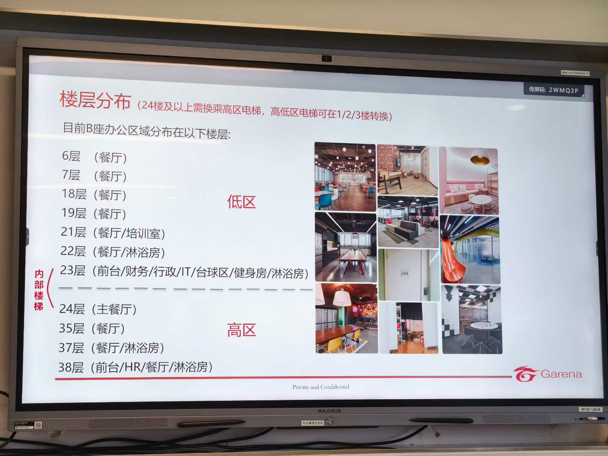
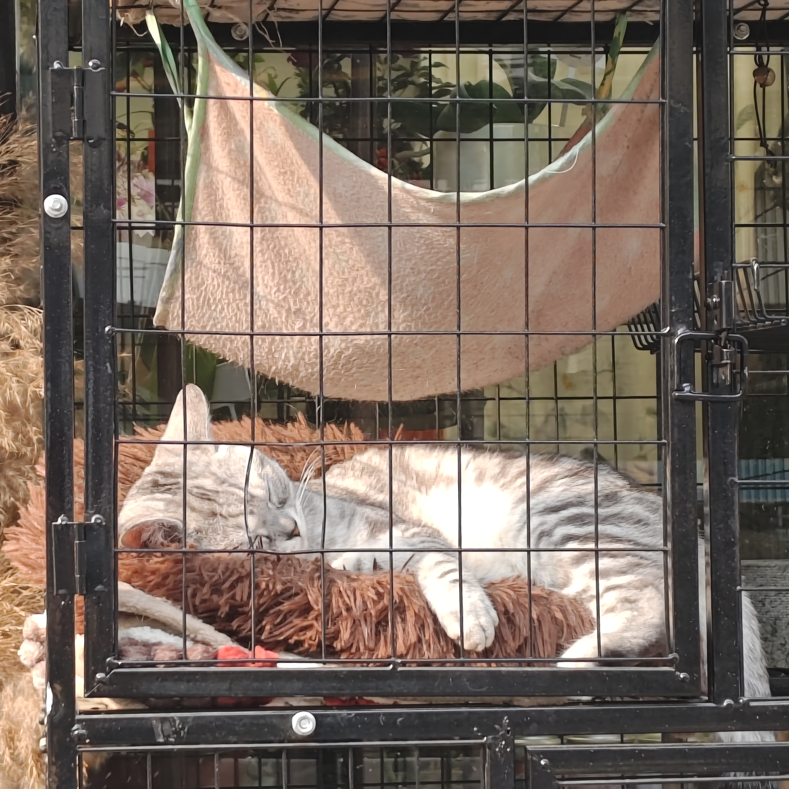
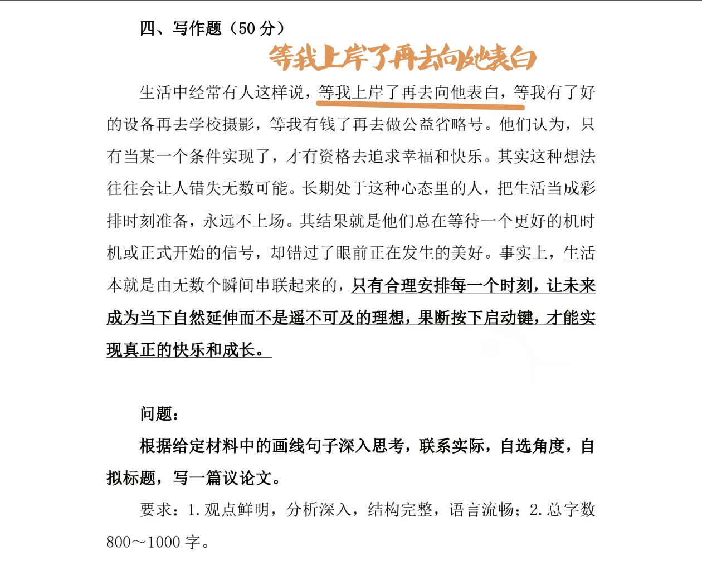
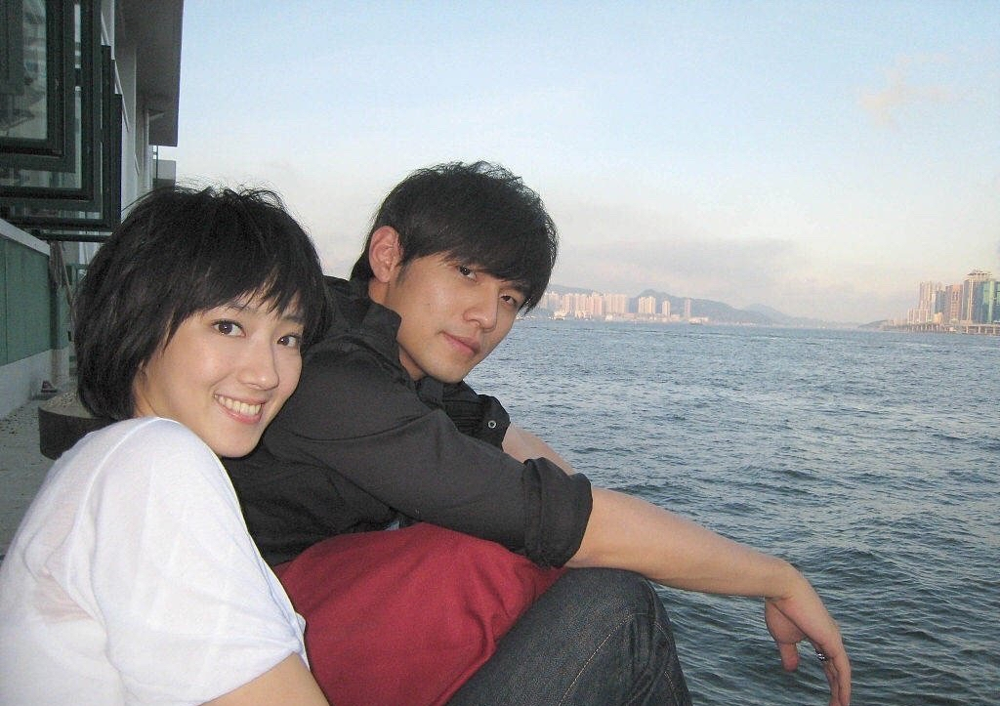

---
title: "随笔-202603 思绪汇总"
date: 2026-03-01
description: "随笔"
slug: 202603
tags:
  - 随笔
categories:
  - 随笔
---

---

# 随笔-202603 思绪汇总
## 读研感悟
202603021516
这么说吧，我问身边没考研的人后不后悔，他会说有点后悔但也接受，因为自己没有那个高学历，所以要比别人多走好多路，光是找工作在学历这一块就被人卡得死死的，待遇高的人家卡 92，待遇低的自己作为一个“大学生”又放不下身段，有时候真恨不得回去重考，不再受学历歧视的窝囊气，可自己又没有那个耐心考下去，最终只能硬着头皮去社会上闯；再去问考上研的后不后悔，他也会说有点后悔，因为考上之后自己也没有想象中那么顺风顺水，平步青云，导师头衔一大堆，也见到了业内各种大牛，但实际上跟自己没多大关系，也根本没有太多进步的机会，但不管怎么说，“读研没用，985 也没用”这句话是现在自己考上了才有资格说的，否则就会被别人反怼“吃不到葡萄说葡萄酸”，而且之所以这么说是因为身边的人都是 92，跟你同台竞争的人哪个不是高学历，其中也不乏王牌名校出身的学霸，都把自己当社会“精英”，可是又没有相应的待遇，所以觉得“没用”，对读研的失望也是因为，并没有像想象中那样待遇丰厚无忧无虑。
于是我越发觉得其实不管工作也好，读研也罢，甚至什么都不做，你都是逃不掉这种四处弥漫的焦虑的，其实你到哪都要看你的个人能力，但问题就在于怎么提升个人能力，提升之后又怎么证明你有个人能力，有学长在本科当搞笑博主就实现财富自由了，还有同学因为长得好看直接当网红入豪门，这个时候你当然可以说对他们而言上大学都是最没有性价比的事，但那是他们，不是你，你做不到去当搞笑博主还能年入百万，你这个长相也不足以支撑你靠脸吃饭，对于你来说，一路摸爬滚打靠踩雷填坑给自己铺路就是你唯一的捷径，学习各种知识，养成专业思维，努力提升自己的学历就是最有性价比的事，你不会一步登天，但至少也不会一落千丈，本科的时候我老师就告诉我，其实你考研和你考上之后也并不能给你的生活带来天翻地覆的变化，你要的就是一个圈层和平台，从前我在双非二本能接触到的是什么人，什么公司，别人对我什么态度，现在我考上 985 之后能接触到的又是什么，再想想过去的我和今天的我真的有什么巨大的实力提升吗？其实没有，但是有了这个学历，有了这层身份，你的生活就是不一样的，靠着这个敲门砖接触到行业内的佼佼者，就是能够接触到从前接触不到的机会，能不能把握住这些机会是自己的能力和运气问题，但如果没有考上这个研究生，有些人和事恐怕这辈子都没有渠道去接触和了解。
而更重要的是，你会终于明白一句话：王侯将相，宁有种乎。
## 羽毛球拍购买
202503041509
24 磅，4 U
李宁小钢炮
胜利小铁锤
熏风 k 520
## 中国人民解放军编制
202603091736
中国人民解放军编制:军､师､旅､团､营､连､排､班各有多少人：
一、军：3-5 万人
二、师：1 万人左右
三、旅：3000-5000 人左右；合成旅约 6000 人
四、团：1500 人左右
五、营：500 人左右；合成营约 900 人
六、连：120 人左右；机械化步兵连约 170 人
七、排：30-40 人
八、班：10 人左右
## 苏打绿《小情歌》有感
202603130919
我们总是容易用一种自虐的方式制造出一种痴情的假象来使得自己站在感情的道德制高点上，获得一种畸形的满足感和安全感。其实无论是雪夜去对方家楼下站会儿或者是冒着大雨给她送一杯奶茶什么的，自己回想起来往往觉得如乔峰大战聚贤庄、关羽千里走单骑一样壮怀激烈，而对于对方来说，一杯奶茶就是一杯奶茶，无法承载起你想要在上面寄托的山崩地裂的情怀。少年的时候，总是迫不及待地将自己的满腔爱意表达出来，而结果往往是陷入表演之中而不自知。所以两个人的记忆才会出现偏差，那些你觉得刻骨铭心的过去，对方往往没有同样的感觉，甚至茫然不知。成长的标志就是懂得克制自己。克制自己的情绪，克制自己的表演欲，甚至克制自己的喜欢。少年时候，喜欢一个人恨不能把她变成自己身体的一部分，她刚说冷，我这边心里已经结冰了，她说难过，我立马如丧考妣，比她还难过，唯恐无法将自己的爱意表达出来。<mark>而事实上，谁也无法承担起另一个人的价值寄托，只有做一个独立、有价值的人，才能真正学会去爱另一个人。</mark>也千万不要尝试改变另一个人，这注定是徒劳的。做自己就好，爱情的真谛在于相互的吸引、志趣相投的同行，而不是追逐和依附以及自我感动。
## 什么是真正爱一个人
202603142032
清微老头说：真正爱一个人，就千万不要进入他的生命，不能干扰对方，也不能让对方因爱的痴念而困惑。真正爱一个人，就应该让对方自由，去成全对方，让他永远不受束缚，全无牵挂的去达成理想，受真理的影响，去完成他自己的使命。真正爱一个人，就要放手。
## 午夜追忆出的一点思考
202603150946
本科时期的竞争主义也就是所谓的优绩主义回马枪打到现在的我头上了。本科时期，我不会主动告知甚至隐瞒一些细节（因为我认为这些信息差可以帮助我获得一些我认为重要的事情，比如说资源分配）。现在对于一些实验细节，师兄也不会主动告知甚至隐瞒一些细节，只是会说多看文献隐晦的提醒几句。之前我认为一个平台是主要靠老师，现在我觉得应该是依靠平台招到好学生（又有想法，又勤快（自驱），又能高效实践），然后形成一个正反馈。
也不是刻意隐瞒吧，至少不会轻易告知。就拿抄作业来说：一方面我认为这是我辛勤脑力劳动的结果，另一方面我给你抄出事了咋整？而且自己碰灰的可能性更高：有种道不轻传，法不轻出，我很认真给别人说，别人认为这是狗屎，换过来我也是这种对别人。
而且我本科的时候就隐隐约约感受到：1.资源有限，饼就这么大。2.你是一坨狗屎。3.你的自身价值比较低。
## 关于“君子慎独”的一点思考
202603151148
《道德经》有言：上士闻道，勤而行之；中士闻道，若存若亡；下士闻道，大笑之。不笑不足以为道。“君子慎独，不欺暗室。卑以自牧，含章可贞。”这句话出自《礼记中庸》，意思是:君子在独处时，即使别人看不见、听不见，也要谨慎不苟，不做违反道德法律之事，不负良知，不欺内心。作为中士的我，今天刷 B 站的时候刷到[学会慎独][https://www.bilibili.com/video/BV13jYqeYEB1]，所以选择回过头来想想“君子慎独，不欺暗室”这句话的含义。
评论区有人（A）认为：事实上这是封建王朝统治阶级统治人的方式，慎独就是一种糟粕，人对朋友有一套面孔，对老师长辈有一副面孔，对妻子有一副面孔，自己相处的时候还有不为人知的一面，这是很正常的，这种慎独要求人前人后始终如一容易得精神分裂，自己老想着用君子那一套要求自己，能不能成为圣人不知道，但容易得精神病。儒家的这一套东西是说给人听的，拿给人看的，谁真的用这一套办事情，什么事情都办不成。君子论迹不论心，不用强行逼着自己作甚么慎独，灭人欲存天理。
接着又有人（B）反驳：事实上，现在出现的很多问题，不都是先从心上面出的问题吗，你是君子，你看看社会上有几个君子，有几个守住了迹。自己没守住迹，然后自我安慰感动自己吗，说实话，很多罪犯就是这么产生的。在这个复杂的时代，普通人要求这自己没什么不好的，经历过真正失败的人都懂得夹着尾巴。慎独指的是正式人性内心的幽暗，告诉自己坚持底线，这才是君子论迹不论心，正视内心的幽暗，守住自己的底线原则。而且说实话，一个普通人就做好普通人该做好的事情，别动不动统治方式，人性自古以来都没用变，只要人还是动物，以后也会不变。别老是觉得过去的东西过时了，社会的形成又不是从近代形成的，尊重历史，尊重历史中的聪明人，因为他可能比你强太多了。
接着前者（A）发言：你说的不是慎独，这位老师都说了，慎独是人前人后，表里如一，一副面孔。你说正视内心幽暗没问题，和我说的不矛盾，但是有些事情，就是在没人的时候做的，比如夫妻之间做爱，青少年自慰，或者谋划一些自己的计划，这些事情就是人后做的，不能让人听见，所以人前人后怎么可能表里如一。但是慎独说了，你就是要坦荡荡，表里如一，人前人后一个样子，这怎么可能，追求慎独，只能培养出精神分裂。每个人都有自己的小秘密，甚至只能自己一个人知道。所以我说君子论迹不论心，别管心里怎么想的，只要你做出了好事，转出善果，这就是好的。比如一个人捐款 100 万，去抗震救灾，他是为了名气?还是为了满足自己的虚荣?或者说是真的想尽自己的一份力帮助百姓渡过难关?别管动机怎么样，这一百万是实实在在救助了百姓，这就是好事，最多只能说一句动机不纯。你说的我明白，这是两种善恶的观点，李敖的《北京法源寺》第一章，康有为和寺院和尚辩论唐太宗有提到建悯忠寺是好是坏，和我们说的很像，你感兴趣可以看看。
路人（C）发言：我们心灵的成长，就是要逐渐变的表里如一，内外均不装（这个度接近不了百分之百)，这是符合心理学的。首先君子慎独，这话正确的用法是内心正直表里如一的君子在独处时用来警戒自己的话，而不是用来判断一个人到底是不是君子的。你说的那种独处时还硬装的肯定不对，由外主导内他肯定做不到，所以正确的做法是你本身什么样的（内为主)，就要对外表现什么样，不必在外人面前展现完美，适当的展现感性和攻击性才是对的。内外差过会崩溃，但你说精神分裂用词不对，用人格分裂更恰当些，至于精神分裂人格分裂产生的病因是什么，你肯定不知道，所以你说只能培养出精神分裂太过武断。对于知识的吸收，和人与人之间交流，要学会吸收或改进其中有利的观点，去完善自己的观点，你没有把君子慎独这个用更正向的方式解读，还有待提升。
路人（D）发言：首先，你所说的这些例子只是处理事情的方法或者过程，而君子慎独是在处理事情上有着自己的道德准则，无论什么情况下都能坚定自己，更像是一种道德上的自律。然后，后面你所举的这个例子，我觉得你这里理解君子论迹不论心指的是通过一个人的行为去客观评判他人，但是它的含义似乎是指面对一些事情时有不好的想法或者邪恶的念头，通过自我约束来控制自己的行为。最后，你举的这个例子:第一，如果是按你说的那样，一个人通过捐款一百万帮助灾民以此扩大名气或者达到其他目的，这就像是通过手段达到目的，但我们看一件事也不能只看当下，有了这样的名气遮掩后，之后利用这种滤镜达到其他的目的甚至行非法之事，有一便有二，社会的风气也会变得功利，至于怎么让大家放心，这就是国家的职责所在。第二，如果出于真心，那他的目的就是为了帮助灾民，我相信这种人始终存在。
首先说说我的看法：
初次看到“君子慎独，不欺暗室”，我认为这句话好装啊！按照我的理解，这不就是把别人的期望与看法比重提高到一个新阶段么？什么是不做违反道德法律之事这我知道，但是不负良知不欺内心这句话内涵太广了，往小了说就是基本的社会道德品行（就像现在的社会主义核心价值观），但是假如说要求人前人后始终如一，这本质上就是一种“存天理、灭人欲”的儒家思想，某种程度上就是通过控制过度的私欲以维护道德和社会秩序。
现在假如一对明面上恩爱幸福美满的夫妻[丈夫 A 忙于事业工作，妻子 B 刻意伪装，婚后有一个小孩 C]，在妻子 B 意外去世之后，丈夫 A 发现其婚后不仅网络撩骚精神出轨，而且私下里还各种约炮还有各种怀孕吃药打孩子，发现其子女 C 非亲生。对于女方来说，自己爽翻了，管它仁义道德，自己反正爽了享受了；对男方来说，自己像被傻子一样不被尊重。
这不就是礼乐崩坏，道德败坏么？
君子慎独，不欺暗室这句话是说给自己听的，也是自己选择遵守的一种道德底线。A 说的冠冕堂皇，想要说明其实天下乌鸦一般黑，没有所谓圣人君子，当然那种绝对圣人可能现实生活中很难有存在，但是也不能就此否定甚至攻击一些人的准则。他们争论的其实是四个不同概念：A 认为慎独是道德表演；B 认为慎独是底线自律；C 认为慎独是心理成长，道德警戒；D 认为慎独是道德原则。所以看起来吵得很厉害，其实只是：各说各话。
多的不愿意写了。中国历史上对“慎独”其实有三种完全不同的解释：（儒家原典版/朱熹理学版/王阳明心学版）
中国思想史里，“慎独”从来不是一个单一概念。它在不同历史阶段被赋予过完全不同的含义，而现代人的争论，往往只是把这些不同传统混在一起。若把脉络稍微理清，就会发现很多争论其实并不是立场对立，而是**在讨论三个不同的“慎独”**。
儒家原典版：最早的“慎独”出自《礼记·中庸》。原句说：“莫见乎隐，莫显乎微，故君子慎其独也。”在先秦儒家那里，这句话的意思并不神秘：**人在没有监督时最容易暴露本性，所以君子在独处时也警惕自己**。它关注的不是思想纯洁，也不是欲望压抑，而只是最基本的道德底线。先秦儒家并不把欲望视为罪恶，孟子早就说过：“食色，性也。”吃饭与情欲本是人性。因此“慎独”真正针对的不是情欲，而是行为——不偷、不骗、不害人。换成今天的话，它不过是一个朴素的品格测试：**没人看见的时候，你会不会做坏事。**
朱熹理学版：到了宋代，这个概念被彻底改造。朱熹建立理学体系，把“慎独”推向一种高度道德化的解释。理学的核心口号是“存天理，灭人欲”。在这种框架下，人不仅要约束行为，甚至连念头都必须接受道德审查。贪念、淫念、私欲，一旦在心中出现，就必须立刻反省和压制。于是“慎独”从行为警惕，变成了**精神警察**。它的目标是塑造一种“圣人化人格”：思想纯净、情欲克制、内心无私。宋代士大夫借助这种伦理体系维持秩序，使理学成为官方意识形态。从这个意义上说，把理学式“慎独”理解为一种社会控制技术，也并非全无根据。
王阳明心学版：明代出现的反动，则把这个概念再次扭转。王阳明提出“心即理”，认为道德并不在外在规范之中，而存在于人的内心良知里。于是“慎独”不再意味着压抑欲望，而意味着**不欺骗自己**。独处时真正需要警惕的，不是欲望，而是自我伪装。所谓“不欺暗室”，并不是害怕被别人看见，而是不愿意在没有观众的时候仍然背叛自己的良知。这样理解的“慎独”，反而更接近现代心理学中的自我诚实：内外一致，不做道德表演。
如果把这三种传统并排放在一起，就会发现它们几乎是三种完全不同的伦理结构。先秦儒家谈的是**行为底线**；宋代理学追求**思想纯洁**；明代心学强调**内心真实**。现代人的争论，大多只是把这三种“慎独”混在一起，于是有人在反对理学，有人在捍卫原典，还有人在讲心学。表面上吵得不可开交，本质上却是在谈三个不同的问题。
更有意思的是，中国思想史其实早已给出一种更成熟的结构：**法律约束行为，社会评价行为，而个人修养才讨论动机**。因此“论迹不论心”与“慎独”并不冲突。前者属于社会秩序，后者属于自我修养。一个是制度逻辑，一个是人格逻辑。
历史上真正被鄙视的，从来不是做不到“慎独”的普通人，而是另一种人：**伪君子**。也就是表面道德、背地作恶的人。慎独真正针对的对象，从来不是人性，而是这种道德表演。当道德成为舞台艺术，人就开始学会在灯光下正直，在黑暗里堕落。所谓慎独，不过是提醒人：**如果道德只在别人面前存在，那它根本就不存在。**
最后我想说：无知会让人产生傲慢与偏见，读书和思考对一个人是有必要的。
## 关于文化大革命的一点思考
202603150919
这段思考的起点，其实是一个经常被提到的问题：毛泽东发动文化大革命，到底是不是“本来只想文斗，后来被别人利用，才演变成武斗”。
围绕这个问题，在历史研究和民间叙事里，大致可以看到三种不同的解释路径。三种说法其实都抓住了一部分事实，但强调的重点完全不同，因此得出的结论也不一样。
<mark>第一种解释</mark>，可以称为“**本意文斗，被人利用**”的说法。
这种说法在民间叙事、部分回忆录以及一些带有同情色彩的解释中比较常见。它的基本逻辑是：毛泽东最初想发动的是一种政治运动，其目标是通过群众力量监督官僚体系，进行思想批判和路线斗争，而不是直接的暴力冲突。
支持这种说法的人往往会引用一句非常著名的话：“要文斗，不要武斗”。这句话确实存在，而且在 1966 到 1967 年之间中央文件和讲话中也多次出现。因此在这种叙事中，文化大革命的结构通常被解释为这样一种关系：领袖本身带有理想主义动机，希望发动群众进行政治监督；普通群众在运动中被情绪和宣传煽动；而真正把局势推向暴力升级的，是地方派系、激进组织以及一些借机争权的人。
但这种解释有一个明显的问题：它在逻辑上很容易变成一种“为领袖减责”的叙事。因为如果把暴力的责任主要归结为“被人利用”，就很难解释一些关键事实，比如运动为什么会被发动、为什么要绕开既有政治体系、以及为什么整个国家结构会被如此彻底地冲击。
也正因为如此，学界更主流的解释其实是第二种路径。
<mark>第二种解释</mark>可以概括为“**政治斗争工具说**”。在大多数历史学研究中，文化大革命被理解为一次权力与路线的斗争，而不是单纯的群众运动。
如果把时间往前看，会发现 1960 年代初期有一个重要背景：大跃进失败之后，毛泽东在党内的威信明显下降，而国家的实际管理权逐渐转移到刘少奇、邓小平等领导人手中。与此同时，党内开始强调恢复经济秩序、加强制度管理，这与毛泽东原有的革命路线产生了明显分歧。
在这种背景下，毛泽东担心两件事情：一是党内可能走向类似苏联那样的“修正主义路线”；二是自己的政治地位可能逐渐被边缘化。因此，他选择了一种非常特殊的政治方式——绕开既有官僚体系，直接动员群众力量。
如果按照历史过程来看，这种机制其实很清晰：先从知识界批判开始，例如《海瑞罢官》事件；随后发动红卫兵运动，使学校和机关成为政治斗争的中心；再进一步把斗争对象扩大到党内高层，最终导致刘少奇被打倒；当局势逐渐失控之后，军队在 1968 年前后开始全面介入，恢复基本秩序。
在这种解释框架下，“文斗不要武斗”更多被理解为一种战术口号，而不是运动本身的性质。许多研究者认为，毛泽东在这场运动中的角色其实既不是完全失控，也不是完全控制，而是随着局势不断调整自己的态度：1966 年鼓励群众造反，1967 年武斗扩大，1968 年开始依靠军队恢复秩序。
这种变化说明，他既推动了运动的发生，同时在某些阶段又试图收束它。但无论如何，有一点是比较明确的：如果没有这场运动的发动，后来的全面失控也就不可能发生。因此，在学界的主流解释里，很少有人会把文化大革命简单归结为“被别人利用”。
除了政治史的解释之外，还有<mark>第三种解释</mark>，这种解释更多来自社会学研究，可以称为“**群众失控**”说。
这种观点并不否认政治因素，但它更强调结构性条件。研究者认为，一旦大规模群众政治被释放出来，暴力往往很难再被完全控制。文化大革命时期恰好同时出现了几个条件：第一是群众动员规模极大，数千万学生参与红卫兵运动；第二是原有的权威体系被系统性打碎，包括学校、政府机构以及知识分子群体都成为被批判对象；第三是不同组织之间出现激烈竞争，各个派系争夺“革命合法性”、资源和权力。
在这样的结构下，运动很容易从最初的批判和辩论迅速滑向暴力冲突。1967 年前后，中国很多城市都出现了严重的武斗，包括工人组织之间的冲突、武器抢夺，甚至某些地方接近城市内战的状态。像武汉“七二〇事件”就是比较典型的例子。
从这种角度看，即使没有明确命令，一场已经被全面动员起来的群众运动，本身也可能逐渐走向失控。
如果把这三种解释放在一起看，其实会发现它们并不是完全互相排斥的。第一种解释强调动机，第二种解释强调政治权力结构，第三种解释强调社会结构和群众动力。文化大革命之所以复杂，恰恰就在于它可能同时包含了这三个层面。
换句话说，把它简单理解为“本意文斗，被人利用”，确实过于简化了问题；但如果完全忽视群众政治在其中的作用，又会忽略运动为什么会迅速扩大并演变成全面失控。
## 本科看过的书记录
202603160024
03.16 00:24
《沉默的大多数》
《杜甫传》
《头号玩家》
《贪婪的多巴胺》
《庞氏骗局》
《剑桥中华人民共和国史》
《失乐园》
《我的二本学生》
《城南旧事》
《鲁迅大全集》
《紫禁城的黄昏》
《致命元素》
《房思琦的初恋乐园》
《天才引导的历程 数学中的伟大定理》
《圆圈正义》
《法治的细节》
《最终幻想 15》
《ultraman》
《鼠疫》
《局外人》
《鸡毛飞上天》
《微积分的历程 从牛顿到勒贝格》
《微积分的力量》
《长安乱》
《生命是什么》
## 科技进步的具体表现
202603162022
今天是 2026 年 3 月 16 日晚上 20.23，点击进入一个视频：重磅发布！银河通用推出全球首个面向复杂网球对抗的人形机器人全身实时智能规控算法，让人形机器人具备长程动态打网球的能力!
我靠，机器人通用大模型这么快就进入现实世界的体育环境了么？
我想我现在需要使用大模型建立个人博客网站来体会一下科技进步的具体表现。
202603162055 放弃尝试
## 3·14 长沙研究生坠江事件的一点思考
202603172325
2014 年，江苏省人民医院 24 岁规培医生在家中自杀；2017 年，山东麻醉科规培医生在医院内疑用麻醉药物自杀；2018 年，江苏镇江呼吸内科规培研究生，连续值班后猝死倒下；2022 年，华西医院规培生在规培结束后宿舍内猝死；2023 年，贵州规培女医生在医院内跳楼；2024 年 2 月，上海规培生在出租屋内烧炭自杀；2024 年 2 月，湖南规培医生曹丽萍因过劳与制度压迫（连续工作 30+小时，无法请假，扣工资威胁），在医院内用手术刀割颈自杀；2024 年 3 月，南宁市第一人民医院一周内连续发生规培生割颈，实习生烧炭（同一医院）；2024 年 5 月：湘雅二院医学研究生罗帅宇坠楼；2026 年 3 月中南大学湘雅医院 2023 级研究生孙馨钰在湖南长沙橘子洲大桥坠江自杀。
规培生尤其是研究生为什么会自杀，抛开外界因素不谈，自身的原因最大的一点就是当学生当太久了，长期以学生的身份生活，对很多社会上的事情，包括人情世故，包括为人处世，很多很多东西根本不接触，在社会生存的能力极其钝化，但是却需要在医院这么一个鱼龙混杂的社会属性极强的场所工作学习生活，这就是赶鸭子上架。
<mark>学生思维告诉我们，什么都不要想，完成任务就能得到回报</mark>。然而这一点在社会上很难适用，多的是付出却没有回报的隐形成本，但是作为当了二十年学生的人，很难马上去理解，为什么我学习这么苦，工作这么累，你还要去怪我，一旦自己开始钻牛角尖，最后的结局就是抑郁——赖以生存的原则被彻底毁灭了，谁能不抑郁？
我觉得研究生最要紧的问题就是赶快从思想上抛弃自己学生的身份，把自己当成一个社会人，学会照顾自己，学会爱惜自己，到了社会上，没有人会因为你干的好给你发小红花，任何的行为都伴随着人际关系的改变，见到的每个人包括导师院长都是你的朋友，每个朋友和你都有利益上的往来，只要明白你能给他带来什么，他能给你带来什么，至少你不会有太多的患得患失，你也能逐渐明白别人要什么，别人怕什么。
## 社会矛盾转化与发展的一点思考
202603181241
1981 年中国共产党第十一届六中全会指出：在社会主义初级阶段，我国社会的主要矛盾是<mark>人民日益增长的物质文化需要同落后的社会生产之间的矛盾</mark>。2017 年 10 月 18 日，十九大报告强调中国特色社会主义进入新时代，我国社会主要矛盾已经转化为<mark>人民日益增长的美好生活需要和不平衡不充分的发展之间的矛盾</mark>。我国进入改革开放已经四十多年了，主要矛盾由于人民日益增长的需要与<mark>社会生产力</mark>之间的矛盾转化为<mark>不平衡不充分发展</mark>之间的矛盾。
上个世纪影响延续至今的改革开放，本质上是在“纠偏”生产关系——人民公社、过度计划体制在当时已经明显束缚生产力，于是通过家庭联产承包责任制、市场机制引入、对外开放等方式，**主动调整生产关系以释放生产力**。结果就是：中国在四十多年里实现了生产力的高速跃升，这一点基本没有争议。但是时间过去四十年，当年可能比较先进的生产关系（生产资料分配）现在可能已经落后，这一点却从来没有尝试改动的痕迹。
生产力决定生产关系，生产关系构成经济基础，经济基础影响上层建筑。上世纪的春夏之交说明国家逻辑：脱离生产力发展阶段，单纯依靠上层建筑变动，难以有效重塑生产关系。但这种一味寻求生产力无疑是一边吐着血一边奔跑的马拉松，虽然现在又提出来所谓的新质生产力高质量发展，但是我依然怀疑这种发展模式。
这就是我对目前社会矛盾转化与发展的一点思考。
## 爱人先爱己
202603181814
别人爱不爱你不重要，真的不重要，甚至父母爱不爱你不重要，亲人爱不爱你不重要，孩子爱不爱你不重要，你的丈夫爱不爱你不重要。你渴望吗？如果你渴望，你就被困住了！当爱成为一种期待，一种施舍，即便被爱，也是短暂的。别人爱不爱你，真的不重要，重要的是你自己必须好好爱自己，当你把关注点多放在自己身上的时候，你会发现，人生会有更多的意义。幸福不是别人给的，而是要靠自己创造与争取。别人给的东西，永远都不会长久，你所拥有的能力，才是你活着的底气。
## 未来大方向之硕士研究生春招
202603191728
今天下午是天津大学化工学院春季招聘会，从下午 15.00 一直看到 16.10 左右。
天津渤化工程有限公司，工艺设计岗位：6-8 k/月
四川东材科技集团股份有限公司，13-17 w
深圳市研一新材料有限责任公司，8-14 k/月工艺工程师
安徽灿松工程技术有限公司，灿松-SYNCS，11-18 万/年
牧原食品股份有限公司，25-40 k/月
亚马逊（天津）国际贸易有限公司，8-10 k/月
高化学（陕西）化工新材料有限公司，8-10 k/月
上海中镭新材料科技有限公司，11-25 k/月
上海三瑞高分子材料有限公司，上海/南京，面议
中触媒有限公司，薪资不太清楚
山西诚信化工有限公司，10-12 w/年
内蒙古伊利实业集团股份有限公司，10-15 k/月，湖南，生产岗 10 k/年
广东宇新能源科技股份有限公司，传统化工，研发室内倒班半年，工艺岗倒班两年，本科 15 w/年，硕士 19 w/年。
天津费曼动力科技有限公司，实习 3 个月，一周四天起步
<mark>博士</mark>去研究院，或者自己创业开公司
emmm 不好说。
烟台睿创微纳技术股份有限公司
## 看电视剧《返校》有感
202603201306
首先叠甲强调保护：《返校》于 2017 年由开发商台湾省赤烛游戏发布，2019 年作品《还愿》涉及政治问题因此连带下架开发商所有作品（包括《返校》））。开发商团队屁股歪，有问题，这是不可回避的事实。
本科二年级 2023 年某天中午，无意中下载游戏《Detention》，然后我傻傻的按照游戏宝攻略一步一步游玩整个游戏，现在依然记得游戏结语是白水仙染上一河鲜血，只能如铁锈般凋零，那时我大概理解这游戏背景是台湾省白色恐怖时期。在大四年级，我观看电影版《Detention》，女主角王净是演过《周处除三害》程小美，电影版和游戏本体内容差不多，我也是囫囵吞枣似的过了一遍。昨天晚上我花了大概 5 个小时，看完电视剧改版《Detention》。
文化工作者终究要讲文化素养。作品主线我不再赘述，电视剧中张明辉不断表达：真正的自由，不在外在的环境，而在我内心的平静。任他强权如何横暴，都无法掠夺打压。愿早一日，自由如雨，遍撒这片岛屿。但联系剧中一些细节让我感到不适：剧中张明辉在诗社提到全国诗作大赛时，手中海报写的是“台湾省全国青年文学比赛”，这种表述显得相当突兀。类似问题在讨论区（如知乎）也有人指出：这类作品在叙事上往往打着“自由”的旗号，用当下视角去放大特殊历史时期的问题。
“白色恐怖”是指在 1949 年到 1987 年期间，台湾境内实行的戒严。在此期间，一切违反规定的行为（听禁歌，看禁书，讨论政治，只要是被认为是违纪行为……），都将得到严惩，惩戒力度视违反规定的严重情况而定，最高死刑。在长达 38 年的“白色恐怖”时期里，累计无辜受害者高达 14 万人，意味着每 40 个人中就会有一个人成为被害者。“白色恐怖”期间，人们被迫成为人肉监视器，不敢有一刻的松懈，理想和自由则是最为禁忌的话题。如果无法想象那个环境有多压抑和残酷，那就联想一下你军训时的压迫感和对教官的“绝对服从”，而身处“白色恐怖时期”的人们是没有中场休息和军训结束这些指望的。
从创作角度讲，一部游戏或影视作品需要冲突、需要传播、也需要市场，这本身可以理解。但问题在于，有人借此进行立场输出，甚至将其当做党政和 TD 的武器，，这就令人反感了。创作者如果本身立身不正，那么即便作品在形式上再精致，也难掩其内在问题。至于演员，在我看来很多人未必清楚背后的复杂情况，只是在花絮中不断感慨时代的一粒沙，落在人身上就是一座山。。
最后表达一个愿望：希望台湾问题能够早日得到解决，让那些在阴暗处进行操弄的人无所遁形，终将消散。
## 路上奔跑的皮蛋小王
202603211946
小王曾经是个大胖墩。
开学第一天下午，打开 329 宿舍门，一个黝黑的大胖墩正坐在 3 号桌前玩《QQ 飞车》，给我打了个招呼。害羞怪有礼貌是他给我的第一印象，183 大高个和 200+斤体重是第二印象。特别是军训完之后，大家都是黝黑黝黑的，小王又挺着小肚腩顶着飞机头，直接变成大号黑皮蛋。小王皮肤黑黑的，却写得一手好字，宿舍墙上贴着小王高中写的便签：考上大学了吗，按时吃饭了吗，新闻联播大结局了吗，以及你快乐吗？
大一上学期黑皮蛋小王开始跑步了。
事实上这件事过了大概半年我才搞明白：小王总是在下午 16-18 这个区间消失不见，晚上 19 点左右宿舍刷新一个臭哄哄黏糊糊的黑皮体育生，有时这个体育生穿着短裤趴在拥挤寝室中瑜伽垫上乱叫。哦，寝室那两张瑜伽垫还是我和另外一个舍友购买，体育生只不过有 24 小时使用权。宿舍墙上贴着除开小王高中写的便签，还多了一张动漫《强风吹拂》海报，跑步醒目写着：只要努力就一定能成功，其实是一种傲慢。闲暇之余小王在宿舍里追剧，耳机里一定放着《强风吹拂》ED《リセット》，开始真正理解：奔跑的时候，离目标会更近。大一和大三学年，学校必修学分体育课有个奇怪任务，每学期使用宥马运动[同学一般亲切得叫牛马运动]跑满 72 次 3 公里，否则体育课最高 59 分。叫声义父，小王就会带上我的 iQOONeo 5 活力版进行跑步运动：小王的运动量是大于软件运动要求 3 公里量。有次小王回来得比较晚，我手机的钢化膜碎了，小王用充满歉意话术给我说他跑步的时候给我手机跑飞了。由此可见小王日常运动量应该至少大于 3 公里，黑皮蛋小王也在运动中蜕变成黑小王，皮蛋二字已成为来时路上微不足道的中间态。一天有 24 小时，8 小时睡觉，8 小时上课（存疑），只有 8 小时是自由支配的。小王的自由支配时间除开跑步，还有部分是拿来打游戏的。除开上文说的《QQ 飞车》，小王被人拉入坑《原神》。其次就是《王者荣耀》，有晚小王打巅峰赛一晚掉了 200 分，气得小王开始引吭高歌问候队友亲戚父母。小王玩得一手司马懿出神入化，把把评分 16.0，因此一有机会我会恳求小王带我上分，小王被我的人机操作搞得不知所措，因此经常卖队友自己逃命。
大一下学期小王开始谈恋爱了。
事实上这件事过了大概半周我才搞明白：小王总是在晚上跑步洗澡之后不见，然后半夜才回来，有时候还对着手机傻笑，小王学会烫头发打理自身形象[虽然跑步后洗澡前依然穿着短裤趴在拥挤寝室中瑜伽垫上乱叫]，开始和女生发 QQ 空间分享他认为开心的事情，社交媒体账户会换上情侣头像。情不知所起，一往而深。不久上课的时候我会发现小王旁边坐着个可爱女孩子，于是我少了个吃饭搭子上课搭子[睡觉搭子倒是没少]，然后从此形单影只。其实细细分析来，小王在实验课上就和女孩子有勾勾搭搭嫌疑，只不过以为小王比较热心，除了帮我做实验还帮女孩子做实验。相比传说中喜欢煲电话谈恋爱舍友，小王也在宿舍煲电话，但是他和对象说话的时候声音柔柔弱弱低声细语，我都不知道他在干嘛，实在需要大声聊天的时候，小王会默默走到阳台关上窗户沟通。有时候我亲自跑 KEEP 体育锻炼，路上会碰见小王和那个女生挽着小手，甜甜蜜蜜偷偷摸摸你侬我侬光明正大，随机刷新在泰丰大街 168 号仁爱信义苑的各个食堂街边或者操场。撞见这种甜蜜时刻，我一般都很喜欢叫一声王哥，然后慢悠悠跑开，小王会装比似的不理我。印象最深的是小王的生日礼物，那是个充满爱意印着 HelloKitty 的粉红色篮球以及一个装满纸折蓝色五角星的玻璃瓶。小王初高中就喜欢打篮球，只不过大学可能更喜欢挥洒汗水在操场上看黑丝。
大三下学期小王开始考研了。
印象最深刻的是在大三下暑假里，有个叫张张包女孩子和我们一块打王者。大概 9 点小王从寝室出发，待到下午 17 点左右，小王先回寝室换装备跑步，洗澡干饭也就 19 点左右，然后我们四个人开黑打王者，打到昏天黑地，最后快 24 点依依不舍的下线睡觉。
大四学期小王不知道在干啥。
另外，什么时候小王能驮着我跑步？
## 我的恋爱择偶价值观
202603221049
假设和女朋友吃大排档，邻桌 6 个光着膀子的青年肌肉流氓，莫名其妙高喊这女人一千一天寻畔滋事，怎么办？
看到这个知乎问题，我现在就立马想起高中时期，有个很经典的画面：高二时期我有一个人高马大有点蛮狠不讲理的同学 sc，有次课间休息我在课桌上玩朋友 xx 的手指滑板，结果 sc 看见感兴趣就说想玩，我没玩够不太愿意，结果他就强行抢走了然后说你能怎么办？这位同学仗着自己母亲是本校高中政治老师，有次还差点和班主任发生冲突。我能怎么办，就尴尬的笑了笑，我一个农村背景的小个子当然干不过一个县城教师子女，只能发起言论抗议。结局就是同学 sc 觉得挺无聊的，废话，手指滑板当然无聊，然后还给了我。这个时间段我的手段只能是，祈求别人的宽容大量甚至是平等对待。然后我联想到要是自己的女朋友被这样抢走调戏会咋样？虽说不能物化女性，但是男女之间还是多少有体格差异。
话说回来，这个知乎问题是一个非常精密伪装的**恋爱择偶题**。这道题会让男生陷入焦虑和无措的最关键节点，根本就不是还不够强大的自己、或者无耻的对手、不是自己是否挨揍、是否害怕冲突、是否显得懦弱。而是：我需要考虑我女朋友对我的看法；我需要考虑我的决策是否会得到她的认同。我怕我的理智会被她当做胆小怕事，我怕我的勇敢会被她视为匹夫之勇。我怕我用绝对的理性和阅历去远离垃圾人后，她嫌我怂。我怕我冲冠一怒又为她奋不顾身后，她嫌我莽。可能我理智的拉着她买单走人，第二天她的闺蜜都传遍了我是个缩头乌龟可能我勇敢的 1 v 6 浴血奋战，进完医院进局子，也只能换来她不屑的嗤之以鼻，多年以后早已嫁为人妇的她提起我只会说“那个小丑”。这道题的游戏机制就是这样：最勇敢的那个选项，在客观上绑定着流血挨揍和违法；最理智的那个选项，在情绪上暗示着妥协退让和窝囊。
我的答案是毫不犹豫带着女生走，女生不走我也走。毕竟君子不立危墙之下。
## 《神兽战争》小说人物叙事视角
202603221148
高中时期我十分热衷阅读某知名作家江南《龙族》系列小说，但是全系列加起来大概也就 6 本书，不够看。因此我把目光转移到初中曾经追过的网络作家杨建东身上，他有一部小说《神兽战争》（也叫《神虽寿》），当做替身小说阅读，但是嘛，就像知乎评价的那样：作者可能有知识，但可惜不怎么懂文学。没有强大内涵的支撑，再美丽的素材也成就不了什么。江南好歹作为北京大学（本科）、圣路易斯华盛顿大学（硕士）高材生，起码有点学历文化素养保底。但杨建东从来没有展示过自己的学历，从作品文化素养来看也有待商榷......
话说回来，提到《神兽战争》我现在除了想到他借鉴了《龙族》《哈利波特》《鬼吹灯》之外，我还能清晰回想起彩虹龙那章，主角是误以为自己是被替身的彩虹龙。但仅此而已，不如龙族，因为素材美丽却没有内涵。
## 3 月份一对一组会辅导
202603221658
21 号中午 11.00-12.30，刘老师和我进行 3 月份一对一组会辅导。
聊了很多，解决了三个问题：
1.实验数据 Excel 问题；
2.MOF 孔径框架柔性问题；
3.课题 Ideas 交流与隐私问题。
然后又给我提出三个任务：
1.制备 MOF-303 粉末，进行 XRD 与 SEM 表征，首先捕获晶体的形貌，然后描述哪个面是{100}{010}{001}晶面方向；
2.进行 MOF-303 膜单组份氢气与氮气性能测试；
3.进行 MOF-303 膜氢气与氮气皂泡测试。
## 工具认识论
202603222230
看似你有机会得到这个世界上任何的知识或者工具，实际确实无尽的虚无，通过衡量价值来定义人类的一生，20 岁，30 岁，70 岁，他们都是人，不过被更多的人不约而同的贴上了一样的标签，在如今丰盈或充满机遇的时代，是否还会有人能够意识到，原来自己才是自己，互联网不是，ai 也不是，物质存在也不是，在你思考世界的同时，是否足够深入探索过自己，是否明了你该往何处，也许你并不年轻了，也许你正年轻但被千帆推浪，或许你不需要理会，你可以活在一个慢动作的世界里，只是活着，闻声见色，轻抚周遭，人生并不长久，虚无混沌或是奋进激昂那都是你，意义并不被创造，它本就存在。
## 工作环境的认识
202603231037
是刚刚看见朋友圈有本科校友分享他的梦中情司，于是我查了一下：Garena 三角洲面向东南亚和台湾地区的 Garena 服。然后我去查这位校友的抖音，我靠，人家是专门画画：用 ps 画画。我初一年级的时候上过一年美术班，然后不了了之。嗨，真是没有啥艺术细胞啊。

青山依旧在，几度夕阳红。
## 经济学认识
202603231750
假币故事：一个人拿着一张假 100 元去找理发师理发。理发师收了这 100 元（没发现是假币），并找零 50 元。理发师拿这 100 元去隔壁小卖部换零钱（小卖部给了他 100 真币）。理发师用这些钱正常做生意（相当于把假币“洗白”了）。后来小卖部发现这 100 是假币，于是找理发师要赔偿。理发师只好拿出 100 真币赔给小卖部。关键问题：谁亏了？亏多少？理发师只亏了 100 元（加一次理发服务成本）
破窗谬论：那些无事生非的青少年用砖块打碎面包店的窗户。人们跑过来并惋惜道“:多可恶。”但你可能不知道，有人会提出“坏事变好事”的说法:现在面包师将不得不花钱来修理窗户，这就会增加修理工的收入，而他又将把增加的收入用于支出，这又增加了其他卖者的收入，以此类推。你知道，支出链将以乘数扩大，并带来更高的收入和就业。如果打破的窗户足够大，它很可能会带来一轮经济繁荣!原本世界状态：面包店 + 一块完好的窗户 + 100 元；被砸之后：面包店 + 修好的窗户 + 0 元；社会总财富：减少了 100 元。
破窗谬论真正想打破的是一种直觉：
👉 “只要有经济活动就是好事”
但经济学更严谨的标准是：
👉 有没有“净增加价值“”
## 对时代割裂的一点感想 1
202603240003
我一向认为自己是个年轻，十分进步，容易接受新鲜事物的思想先进积极分子，左派，非君子也不是小人。
直到昨天晚上 23 点左右，我刷抖音看卡尔的考研成绩，他考研五战，被网友戏称为研王爷。然后我刷到卡尔发的直播录屏切片：卡尔强调 211 是 21 世纪全国 100 所重点大学，是香饽饽。下面评论区有个强调自己是直播录屏人，我点进去然后看到是一位吉大 20 本，中科大 24 硕的女主播，截止目前大概 2.0 万粉丝。接着我按照最热视频排序依次观看：热度第一高的视频是讲研究生脱发假发，有 2.6 w 点赞 1051 条评论 1098 收藏 5815 转发，有点脱发反差比较正常；第二高的视频是讲通过饱和式简历投递持续 7 个月获得实习 offer，有 1.9 w 点赞 1345 条评论 2372 收藏 1.8 w 转发，但问题是她穿个大眼眶 V 领毛衣，胸直接托在桌子上。我啥都没看进去，注意力全在她的 D 罩杯上。对，我承认，就是最原始的那种性吸引。
接着我刷到她 2025 年 8 月直播赚了 ¥9110，emmm，我脑子里开始串线了，本科同学张莉长得也漂亮，我记得她有想法直播赚钱？女性是不是早就意识到，可以利用身材、容貌、性别优势进行某种“利益转移”？这种东西，在市场逻辑里是不是天然合理？再往下想，国家也不可能明面禁止这种东西，毕竟这就是流量经济的一部分，就像古代卖艺。想到这，我有点卡住了。一边觉得这套逻辑挺“市场化、挺真实”，一边又隐约觉得哪里不太对。emmm，女性应该早就意识到可以利用身材容貌性别优势进行利益转移，至少我认为这个社会目前是有这种价值观的引导，也就是说，按照市场经济与计划经济理论来说，目前国家不会明面上禁止这种与主流价值观相违背的市场经济下的主播经济，就像古时候卖艺的艺术家。这里举例一个类似的 B站 UP 主是小冰心啊，华理法学本科。
吉大本科中科大硕士擦边卖软色情，我靠赚的还不少，但是举个正面例子，B 站 up 主鱼子鱼 yzy 就没有通过卖软色情啊。另外可以说一句，这种乳腺胸确实引起我的性欲，确实有色欲感，确实有女人味，确实有卖点，确实勾起人最原始的性欲。
emmm，大晚上我的思绪不太连贯，算了先睡了。
## 对时代割裂的一点感想 2
202603242015
暂别凌晨的乳腺胸，我们先把目光转向专业学科上面。我记得我 21 年高考那年填报志愿的时候计科相当火热，大家都在无脑投计算机；23 年左右师范生更是火热，分数线水涨床高；25 年电气机械火热，临床开始衰弱式微；土木金融专业 在 2019 年之前居高不下。有人常说可惜在最该摇花手的年纪选择了读书，有时我在想父母在 90 年代为什么不下海经商，这样我就可以爽做亿万富翁之子。可能以后，这时我的孩子应该在问为什么我的父母没在人工智能如火如茶的时候入围一波大模型？
大概 2022 年年底 ChatGpt 3.5 震惊全球，接着 2023 年 3 月 ChatGpt 4.0 惊艳世界，2024 年 2 月 Sora 首次公布，2025 年 1 月 DeepSeek R1 火遍全球，同年 3 月通用 AI Agent 热度上升 Manus 爆火，2026 年 2 月通用 AI Agent 继续发力 OpenClaw 爆火。现在开始传出前端后端全栈工程师被通用 AI Agent 顶替，就像当年马夫被汽车司机顶替那种突然。某一瞬间我突然意识到我正在经历时代变革，我想起来当年挥洒在语文试卷背面那面作文中写的：<mark>时代的车轮滚滚向前，任何试图停留在原地的人，终将被历史洪流所淘汰；时刻拥抱社会的新变化，每一次社会新变革，就是一次财富重新分配的机会；滚滚历史长河向前奔腾，浪潮席卷之下，被改变的从来不是时代本身，而是一个个来不及准备的普通人</mark>。这些假大空喊口号的句子，这些我嗤之以鼻不屑一顾认为是大人骗小孩的谆谆教诲，终究像回马枪似的刺中我。我想说什么呢？其实我更想说作为一个默默无闻的小人物，仰视历史洪流滚滚向前气势汹汹不可阻挡顺者昌逆者亡，更是历史洪流记录者参与者见证者。2019 年新冠病毒席卷全球，2022 年江主席逝世，接着人工智能持续发力，2025 年底 2026 年初国际金价持续飙升达到前所未有的 5596.33 美元/盎司，然后现在轰轰烈烈如火如茶的人工智能大革命 OpenClaw 养龙虾开始了。
有时候我在想啊，我是不是读书读傻了？一直在获取已有的有标准答案的输入输出进行学习训练，所以我才是历史洪流记录者参与者见证者。所以，很多时候你的一个小抉择影响你一段时间的气运，但话说回来，你是人生的创造者而不是记录者。不要这么小气，有些时候，塞翁失马，焉知非福。
另外，今天晚上张雪峰因心源性猝死逝世。他曾在 2016 年 6 月凭借《七分钟解读 34 所 985 高校》走红网络。这个视频还是我一个曾经高中好友给我推荐一起看的，如今已过去快五六年，物是人非，欲言又止。
## 周杰伦新专辑
202603251508
今天凌晨，周杰伦 2026 年新专辑《太阳之子》已于 3 月 25 日全球上线，共收录 13 首作品，包括 12 首全新创作歌曲及特别赠送的《圣诞星》。
淘金小镇这首歌不错不错。
## 生平第一次洗牙经历
202603251940
刚刚预约天津医科大学口腔医院的牙周科穆玉竹医师，预约时间是20260325 下午14.00-14.30。我看小红书说人长得漂亮，医术在线，更重要的是为患者考虑的周到。我想先做一次专业洗牙，并请医生帮我全面检查一下牙齿和牙龈情况，看看有没有蛀牙、坏牙、牙周问题，同时评估一下牙齿排列和咬合情况，判断是否有畸形、是否需要正畸，是否存在拔牙矫正的可能，并给我一些后续治疗和日常护理建议。就洗个牙，然后看看牙齿有没有需求。
202603261729
今天早上 0806 刚刚醒来起床，看见师兄说 118 有空烘箱，赶紧爬起来去干活，结果差点没赶上第二节英语课，还把稀硫酸洒在桌面上忘记擦干，道歉语录如下：师姐，我刚刚急着上课。现在回想起来今天早上我有倒回硫酸，可能是我不小心洒在台面上然后忘记擦了，很抱歉我的错误操作。师姐手受伤的话，有啥问题可以说，我想想咋整。师姐当然说没事不用放在心上。
接着上完英语课，我赶着去天津医科大学口腔医院，妈的好远，而且我在东北门公交车站等 615 快车等了快 30 mins，结局当然是迟到超时了。医师给我临时加号，然后开始洗牙，给我洗了不到 30 mins，中间教训我让我好好刷牙。生平第一次洗牙，中度牙周炎，半年洗一次牙。有种为了洗牙而洗牙的感觉（脱裤子放屁），这有点像 2024 年为了入学体检，我特意花了 100 多来回程打车找了个二甲医院体检（体检要求），结果校医院就是三甲医院（我以为二甲大于三甲，殊不知校医院就是三甲医院，原谅我去的少没啥认知）。洗牙就是高压水枪对着牙缝冲洗，给我牙结石给冲掉，现在牙缝大大的。另外洗牙过程贼刺激，差点给我冲哭了，md，我都怀疑我牙被打掉了。
出来之后我步行走去公交车站，今天太阳不错，看见一只笼子里的小猫睡得很安静。但是我想，子非猫，安知猫之乐？可能有人认为猫在阳光沐浴中睡下午觉很快乐吧，但是他们看不见这一切都在冰冷的金属笼，因此我认为即使笼子暖和起来了，待阳光退下去，依旧是冰冷冷的环境。

## 人生的意义是什么
202603291934
人生的意义，其实是自己在“体验快乐、承担责任、留下影响”之间自己选择的平衡。感受本身就是意义；意义来自“被世界记住”或“产生价值；意义藏在每天的小事里。有人说，自己就像小麦一样，最年轻的时候最不值钱，其实优秀和有价值本来是两件事。年轻就是最大的价值。优秀是结果，价值是潜力；年轻的时候，潜力本身就是最大的资本。
## 近期关于我的认知一点改变
202603302346

这是 26 全国事业编联考 b 类大作文题目，其中有写到：生活中经常有人这样说，等我上岸了再去向他表白，等我有了好的设备再去学校摄影，等我有钱了再去做公益......
初中时期，我想等我成绩优异，也就是考上县城一中，我就给喜欢的女生表白；高中时期，我也是想等我成绩优异，考到全班前 10 名考上好大学等出高考成绩就给喜欢的妹子表白；本科时期，按照我原本的规划，我本来是准备在大学毕业的时候给她表白。其实我之前也一直赞同这种观念：只有当某一个条件实现了，才有资格去追求幸福和快乐。其实这种想法往往会让人错失无数可能。<mark>长期处于这种心态里的人，把生活当成彩排时刻准备，永远不上场</mark>。其结果就是我总在等待一个更好的机时机或正式开始的信号，却错过了眼前正在发生的美好。
有时我在想，我是不是妥协了？我认为延迟满足是成功的关键，越是层次低的人越追求当下满足。我一直以来引以为傲的延迟满足，在个人规划方面确实有起到一定的正面作用，但在感情这方面的应用真的是一败涂地。
我有点无语的地方是，当我笨拙的想要打开恋爱的大门时，你会发现周围已经没有人会纯粹的爱别人了，而且我也不再会纯粹的爱一个人了。好不容易熬到了父母不管可以恋爱自由的时候，你会意识到发现我曾经喜欢过的人好像心里都装过别人，会觉得好可惜啊，这一点其实还行，因为我的心里也装过别人。虽然我根本没有拥有过谁谁的青春，我更不是谁谁刻骨铭心的常青树，或许我只是一段路，因为我不介意我自己是一段路，路可以很宽敞 、可以晚上亮着满路的灯、也可以是长满鲜花的路；路也可以很长，一眼望不到尽头，也可以让自己毫无顾虑地一直走下去。
我一直坚定的选择自己，我初中高中时期就十分认同韩立的那套大道无情唯有一心向道之心，一直记得墨大夫给韩立的信：韩立吾徒，如果你能读到此信，说明我已经死了.....韩立，墨某一生行事从不向人解释，成王败寇自有天定，然而我妻女与此事无关，相信你能做出自己的判断。 人生苦短，终归尘土，凭什么仙家就可以遨游天地，而我等凡人只能做这井底之蛙。 韩立，这世间多少好景色，你就代为师去看看吧...
话又说回来，韩立一心追求修仙大道所谓的长生，仅仅是手段，从来没有人为了长生而长生。从古到今，古今中外，都没有。古代帝王是为了享受权力，现在资本家是为了资本的增值，各种影视动画里面的普通人，有的是为了爱人，有的是为了亲人，但是从没见过哪个小说或者电影动画为了长生而长生。因此总有一个锚定物。而韩立他修仙的目的就是追求这个世界的认知，随着他不断升界，认知不断扩大，他就不断精进，到最后在他的世界观里已经没有追求了，看尽了墨老所谓的风景才罢手。
但事实上，现实世界可能真的不能这样做。生活本就是由无数个瞬间串联起来的，只有合理安排每一个时刻，让未来成为当下自然延伸而不是遥不可及的理想，果断按下启动键，才能实现真正的快乐和成长。我想，可能我已经向生活妥协，和青春告别了。
所以，现在我对待课题实验，我不再精心准备各种细节之后（虽然还是有后遗症）再开始干活，而是大致的想一想定一个方向然后勇敢的开始实验。虽然我现在很难分清勇敢和鲁莽之间的区别，但堂吉诃德曾说过：我知道鲁莽和怯懦都是过失；勇敢的美德是这两个极端的折中。我宁愿鲁莽，也不要怯懦，因为鲁莽比怯懦更接近勇敢。我开始相信鲁莽比怯懦更接近勇敢。
此外，工具理性（效率、规划）不等于生命价值（体验、情感）。
最后以叶湘伦和路小雨合照结尾。

## 环球影城事件
202603312331
旅行紧急告停。
本来已经规划好本周四到周六，去邯郸旅游，去南北响堂石窟，赵都·礼宴，邯郸博物馆，丛台公园。结果今天下午，fzw 去北京环球影城被老师抓包了，然后师姐紧急通知：师弟，刚刚老师找我，老师让我给你们强调一下，工作日必须在学校，如果离校要给老师请假，周六周末等休息日如果离津，也要给老师请假。
然后我一边做 XRD 数据图一边学 SEM，一边给赵都·礼宴打电话退票（我买的抖音票，按理说不能退票，花了我 468￥ 大洋），一边退高铁票，然而之前租的大疆 osmo-action-5-pro 已经通过支付宝租凭，算了就不退货了。
今天做 SEM，师兄很高兴的样子，可能膜性能不错。

