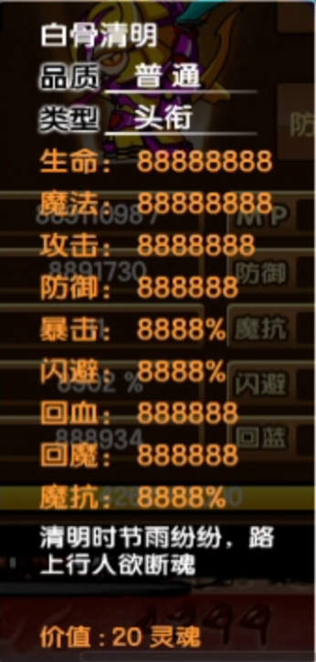
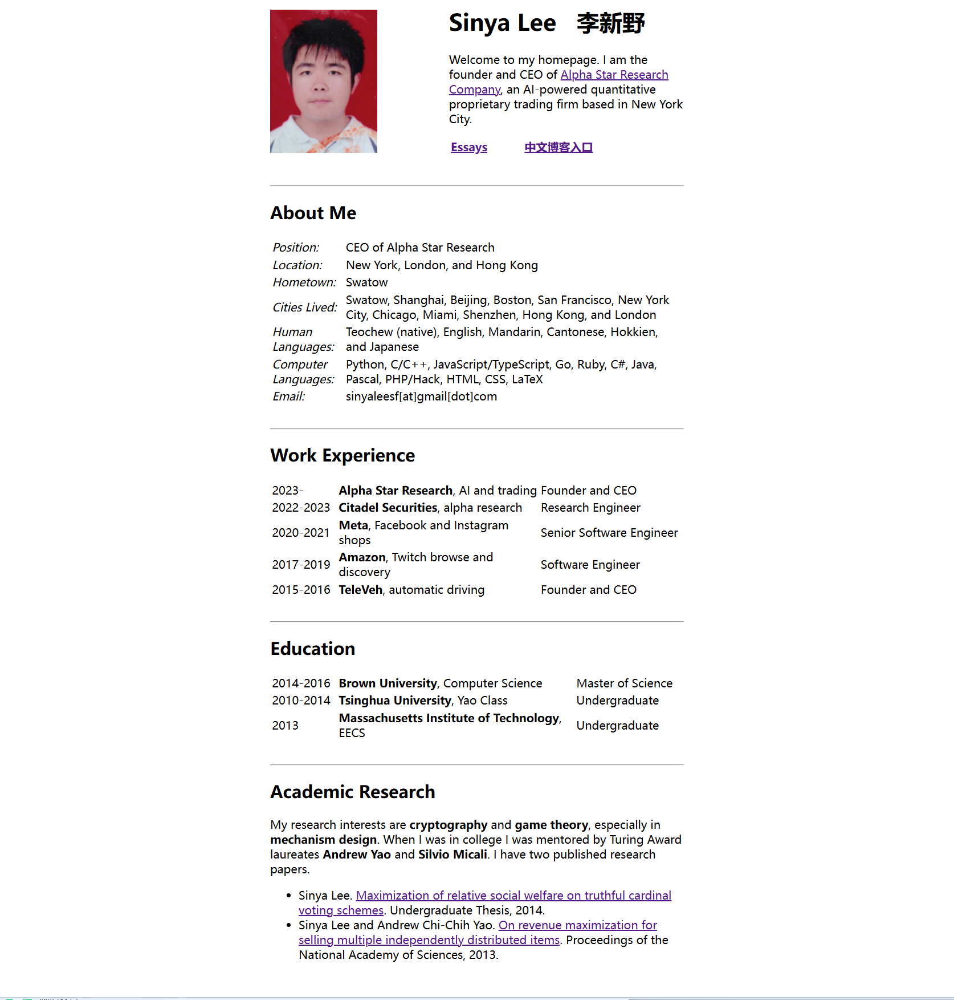

---
title: "随笔-202604 思绪汇总"
date: 2026-04-01
description: "随笔"
slug: 202604
tags:
  - 随笔
categories:
  - 随笔
---


---

# 随笔-202604 思绪汇总
## 清明有感
202604030016

造梦西游 3 白骨清明有言：清明时节雨纷纷，路上行人欲断魂。
今年清明节放三天假，周六周日和周一。按照原本的计划，现在的我应该坐在邯郸某个酒店里边，刚刚看完赵都·礼宴，准备第二天的响堂山之行。由于 3.31 的环球影城事件，我被迫在第一时间退票修改行程，然后现在买不到票了。但是哈，我现在体会到那句 "<mark>Attention Is All You Need</mark>"，真的，一天到晚，我发现我的注意力不断被分散被稀释，到最后精疲力尽得流眼泪睡着。眼睛还冒烟了，散光加重，就是这样加深近视程度的。

## 环球影城事件后续
202604031049
今天早上有点小感冒，所以去实验室有点迟，大概 9 点才到实验室，额，烘箱被用完了，所以清明假期之前我不准备做实验了，下午做个 XRD 表征一下。
遇到 lbh 师兄和 syx 师姐，然后我就问了问环球影城事件后续，额，大概就是老板很生气，再来一次可能会出现实验室安装打卡机。重点是不要得寸进尺，大概就是课题组氛围十分融洽，不要因为个人原因导致大家都不愉快（比如因为<mark>环球影城事件</mark>导致实验室安装打卡机，大家都不怎么乐意）。我 get 到师兄师姐说的意思了。
## 清明假期感悟
202604062314
4.4-4.6 期间，我去了趟大名鼎鼎的成语之都，邯郸。由于清明节假期正常展开，这段由于环球影城事件影响的旅游重启。
第一天 4.4 号早上 7.30 从寝室出发，我先去实验室整顿一下，7 点 50多站在 615 快线，一个小时左右转线地铁到达天津站，然后 10.27 火车出发。17.05 到达邯郸站之前，我按照丛台公园，邯郸东站和邯郸博物馆的距离先预定了一个三天两晚的酒店。到邯郸站之后，我直接打车，去**赵都·礼宴**。我靠，这个 18.30 到 20.30 演出特别特别带派！其实这个晚宴是类似有表演的商业饭店，然后饭店门口有四个窗台轮流出现美女跳舞，我默默录视频欣赏。接着我提着一个装衣服的袋子径直走进去，门口是店员打扮成的士兵和宫女 NPC，他们提醒我这个晚宴需要提前预约，我表示已经购票预约。接着一位宫女领我进去，也没有检票刷码而是报名字和电话号码（我留的是<mark>青山先生</mark>），我比较脸皮厚：在一楼前台寄存好衣服后，叫前台的宫女帮我手机充电，然后我拿着大疆 Action 5 Pro 到处溜达拍照录视频，哈哈哈......在临近 18.20 左右的时候我就拿回手机去二楼赴宴。整个流程大概分为这样：
壹 舞蹈诗《女娲补天•上古》餐 石煨春酎【五神汤】
貳 舞蹈诗《邯郸学步•战国》餐 咖喱融霜【金汤红袍虾】
叁 歌舞《完璧归赵 • 战国》餐 玄璞霜纹【琥珀炆玉环】
肆 舞蹈诗《将相和 • 战国》餐 盐梅共釜【和羹烩双珍】
伍 舞蹈诗《胡服骑射 • 战国》餐  塞外炙香【金桔炮羊排】
陆 舞蹈诗《陌上桑•汉末》餐 罗敷小宴【鳞潜碧銷卷】
柒 舞蹈诗《兰陵王入阵曲 • 南北朝》餐 鼓角融香【国宴煨牛腩】
捌 音舞诗《梅开二度•唐》餐 庖巧返春【清汤菊花豆腐】
玖 舞蹈诗《刚柔并济•明清》餐 甘凉五行【龟苓椰奶冻】
出来之后有点冷，本来原本计划去丛台公园-邯郸道-回车巷-学步桥，拍拍夜景，结果直接回酒店睡觉去了。
第二天早上 8.00 出发去邯郸东站，坐车去**响堂山**已买票，然后参观南北响堂山，千年响堂，神山福地，念念不忘，必有回响。<mark>去南响堂寺，二层石窟内，正中间有凹坑，用脚踩，明白什么是响堂山了</mark>！确实不错。下午 17.10 回到邯郸东站，我去南沿村拉面吃了一顿之后就去**邯郸博物馆**唰唰打卡拍照，接着回酒店睡觉。
第三天早上晚点起床，然后去丛台公园再逛逛，然后下午 15.56 从邯郸站，晚上 22.17 会天津站，考虑坐地铁回学校，大概 23.30 到学校，然后骑自行车回寝室。
总的来说就是：4.4 号第一晚参加赵都礼宴；4.5 号白天参观南北响堂山石窟，晚上参观邯郸市博物馆；4.6 号下午游览丛台公园。
邯郸回天津火车 K5292 也挺有意思的。
火车是 15.56 到 22.17 从邯郸站跑到天津站。下午 14.37 逛完小的可怜的邯郸秦始皇出生地纪念馆，看了一眼穿着燕赵古服的小姐姐然后毫不犹豫走出展馆。我坐在武灵丛台公园的坐椅上，收到 fzw 调侃说“我以为你把诚意带回来了”，接着我就屁颠屁颠去几百米远的邯宝坊(邯郸道店)，然后买了两个五十元的磁州窑盲盒，接着过马路买蜜雪冰城两杯奶茶套餐，最后打车急急忙忙去三公里外的邯郸站。
火车上面我是 17 车 113 座，加上我有四个个同行者，经典三男一女开局。其实本来是两个男的两个女生，结果可能我太丑了，旁边的女生和男生换座位了。反正莫名其妙就是三男一女开局。故事的开始是我找换座的男生借充电宝，然后开始搭话，一来二去我把在场所有人（小桌子四个人）都聊开了。然后这位男生 wx，和我对面的男生都是邯郸人回家探亲，斜对面的女生是天津人去邯郸玩儿，我也是去邯郸玩儿。这两位男生都是大一，我旁边 wx 是唐山师范学院人工智能专业大一新生，对面是天津某专科工程管理专业。高帅 wx 给大伙说了自己很多情感故事。emmm 我一开始还以为是装唐讲故事，反正我也是闲得无聊总不能凭空思考课题把，而且还在休假期间，虽然是休假返程。但聊着聊着就不太对劲，我靠，大概从高中到大一下学期讲了有 10 来个和女生的故事吧，我靠，他坐在我旁边我细看确实有种日系风格，然后根据他的聊天认知和行为举止（一丝不苟分享自己的感情故事和拿出平板看自己的抽象照片以及看聊天记录），我有点相信。但是直到下车他穿上潮人外套以及 185 的身高，低下头和我沟通，这时我才在心里把他和高冷帅的形联在一起。
真的淳朴帅哥，专业是人工智能，问他 cs（computer science）不知道，github 不知道，前端后端全栈不知道，emmm 专业问题我就知道这些皮毛，他啥也不知道，我一开始以为他装唐直到我看到他展示专业培养方案，没想到下火车才发现其实他说的是真的。主要是之前他说的论点和论据有点对不上，他展示他是个低情商，爱抽象，但和女生桃花多多多，有女生主动找他追求他，衣品不怎么好，对自己的专业没有啥未来规划与愿景，等等一系列清晰认知自己不足但是又好像是在显摆的论点，以及和微信新的好友手指一滑难以到底的页面，各种奇奇怪怪的聊天界面等一些论据。这里论点和论据我对不上，因为他目前只是长得有点小帅的普通人，没想到一起身穿上潮人风格外套站起来，倒是真的是男大 185 小帅。说到这里我居然没怎么写那个斜对面女生和对面男生。对面男生是天津某专科大一下，长得大概 160 左右戴个帽子，也不怎么帅有很多痘痘，也不怎么聊天。斜对面女生是天津商业大学法学大四实习生，emmmm，胖胖的大概 168。我就问了一段时间关于法学的基础知识，以及律师收费与基本工作内容啥的。能看出来女生家境不错，就是胖了点，身材不好，但是牙齿白白净净的，对她<mark>没啥性欲</mark>。
我靠，这是第一次被颜值身高 185 男大小帅所冲击到，确实高高帅帅的，说话还呆呆萌萌，虽然不怎么爱学习没啥家庭支撑规划啥的。
## 观《黑袍纠察队》第五季有感
202604081730
下午上完工程伦理课，我赶紧上社交媒体小红书， B站，小黑盒，抖音搜索资源，然后 15.20 左右在小红书找到百度网盘链接，急忙保存然后严肃观看。
首先说一下看法，第一集以火车头被祖国人扭断脖子下线结尾，第二集开头士兵男孩被祖国人唤醒，派遣去抓捕布切尔和星光，因超人类病毒而死亡的士兵男孩结尾爬起来了，貌似士兵男孩不受影响？整体观感比《怪奇物语》第五季好不少，起码剧情跌宕起伏我有点期待。
2026040151630
第三集。隐形人儿子上线又光速下线，我甚至没看见他长的啥样。莱恩和佐伊碰面，炸鸡叔被抓。这集有点水。
202604221835
第四集。黑袍纠察队前往 Fort Harmony（福特哈蒙尼）寻找 V 1下落，结果全员心智被蛊惑，互殴，没找到 V 1下落。
202604291711
第五集。好吧这一集太疯狂了：玄色与深海互相试探攻击，智者反水阿什利·巴雷特(Ashley Barrett) ，Soldier Boy与Homelander知道 Bombsight有V 1等等。
202605201703
第八集，《黑袍纠察队》结局
26 年元旦，《Stranger Things》 迎来最终季。结局里，11 在消灭维克那后直接生死不明，留下一个彻底开放式的结尾。没过几个月，到了今年的 520，《The Boys》开局给观众来了一坨大的——法国佬 Frenchie 葬礼直接开场，随后黑袍小队一路杀进白宫。喜美子 Kimiko 靠“胸炮”硬生生打掉了 Homelander 的超能力，最后却不是大家期待的超能力大乱斗，而是 Billy Butcher 跟祖国人互殴肉搏，祖国人最终被屠夫拿撬棍单杀。战斗结束后，屠夫发疯要消灭所有超能力者，Hughie Campbell 又亲手枪杀屠夫，最后过上包汉堡的生活。
整个第五季的经费都给了火车头，其他人只好话疗和王八拳，估计特效组在旁边嗑瓜子。另外一想到以后每年 520 是阿祖祭日就想笑。
## 自我安慰
202604160941
被这段话狠狠的治愈了：“<mark>风华正茂的年纪不该困在爱与不爱里</mark>，我希望可以热烈而又温柔的生活，做你觉得要紧的事情，走你认为善良的路。别在意别人口中的自己，做喜欢的自己才是最重要的。没有结果的事就不要再执着那么久了，人生那么长，那一城一墙的得失，和想去的远方相比，实在不算什么。摆弄好手里的柴米油盐，保护好心中的诗和远方。葡萄树上开不出百合花，找不到答案的时候就找自己，风华正茂的年纪你该所向披靡。”

## 职规赛彩排志愿者有感
202604181632
作为职规赛彩排志愿者，我本来以为过去当牛马，没想到是当演员。去了 17 名志愿者，结果分给我的任务是扮演选手上台播放 PPT 演讲，于是我果断选择路明非和空条承太郎作为选手身份上台唠嗑，下面是部分片段：
 ```
 ......
我是路明非，卡塞尔学院一名普通学生。今天站在这里，手里握着职业规划书，感觉比握着御神刀还紧张。在多数人想象中，我们卡塞尔学生的职业生涯应该充满刀光剑影——事实上也确实如此，但如果把人生规划全押在“屠龙”这一件事上，万一龙族申请了非物质文化遗产怎么办？
 ......
大家好。我是空条承太郎。
 今天我站在这里，并不是要讲一个传奇故事，而是想说明一件事：一个看似不适合学习的人，如何为自己找到一条高度匹配的专业道路。
 ......
 ```
 挺有趣的，PPT 大赛。
##  对个人博客的一点思考
202604182322
最近，也就是 2026‎年‎3‎月‎17‎日，我在做 MOF 孔径计算 使用 Zeo++，需要用上阿里云服务器运行 Ubuntu，意外知道一点关于服务器与域名租借。其实一直以来，大概 24 年末开始，我想做个人网站，上传自己的照片和一些想法，但是话又说回来，那些写在本地的想法可能不太适合上传互联网，我只是想做那种[李星野 SinyaLee个人博客][https://sinyalee.com/blog/]。

我觉得这种博客特别装逼，但是唯一坏处在于过于暴露自己的想法，在达到一定目的之前，过分暴露自己的想法无意识错误的。《运命论》有言：“故木秀于林，风必摧之；堆出于岸，流必湍之；行高于人，众必非之。前鉴不远，覆车继轨。”而且《韩非子·说难》有言：“夫事以密成，语以泄败”。跟别说有点**高昂的服务器和域名租借费用**。
时尚是个轮回，风靡一时的个人博客被互联网媒介抖音 QQ 取代，现在我居然有开历史倒车想法：搭建个人博客。呵呵。
## 关于追女生的一点想法
202604190919
昨天晚上，阿笑说他最近约了一个学习很勤奋的女生好几次，想一起爬山、打乒乓球、逛公园，都没成功。给我说的几分钟又被拒了。一开始阿笑下意识会觉得，是不是女生压根就不喜欢阿笑。再往下想，就开始归因到外貌、吸引力，甚至觉得“阿笑是不是不配”。
但冷静想一下，这里面其实混了几层完全不同的东西：
第一层，是**具体这个人对阿笑有没有兴趣**。
她多次拒绝，基本可以判断——至少目前，她对阿笑没有那种想进一步发展的意愿。这是一个很具体、很局部的结论，而不是对阿笑这个人的整体否定。
第二层，是**吸引力问题**。
外貌、气质、表达、生活方式，这些确实会影响第一印象和“有没有感觉”。这一点没必要自欺。但它也不是单一维度，更不是“长得不帅=完全没机会”。
第三层，是阿笑刚刚提到的“配不配”，甚至上升到**阶级差距**。
这个其实有点跑偏了。我最近刷到一个气质女孩，高中在天津英华实验学校，这是一个全日寄宿制民办国际学校，大概一年 8 w 学费啥的。再钻进个人主页，高三成人礼合照是爷爷奶奶外公外婆父母和这个女生，妥妥中产阶级，这种阶级差距我看可以说配不配。然后自动代入“阿笑和她不是一个世界的人”，然后再反推到“阿笑不配”。
但问题是——阿笑现在约的这个女生，和抖音那个女生，是同一个人吗？不是。
我把一个“具体被拒”的现实，套进了一个“抽象的社会分层模型”，这本身就是一种认知偷懒。真正更接近事实的说法应该是：
> 有些人确实会在择偶中考虑家庭背景、资源、阶层，这没问题；
> 但绝大多数普通人的关系，其实还是发生在**同一生活半径、同一成长路径里**。

也就是说，很多时候不是“配不配”，而是：**你们有没有在同一个频道上。**
再往下说一句更现实的话：
阿笑现在被拒，很可能不是因为阿笑“阶级不够”，而是因为——她对阿笑没有那种感觉；阿笑的表达方式不够有趣或不够自然；或者只是时机不对。这些原因，都比“阿笑不配”要具体得多，也更有改进空间。
另外还有一点我刚刚意识到：
阿笑现在的挫败感，有一部分不是因为“失去这个女生”，而是因为——**连续尝试都没有正反馈**。这很容易让人开始怀疑自己，从“这次不行”变成“阿笑这个人不行”。
但这两者不是一回事。最后，关于“放弃不谈了”这件事：如果是因为真的想把精力放在别的事情上，那是选择；但如果是因为几次受挫就直接给自己下结论，那更像是**防御**。
所以我现在更倾向于这样看这件事：她不喜欢阿笑，这是事实；但这不等于阿笑不值得被喜欢，也不等于阿笑在所有关系里都会失败。至于外貌、能力、生活方式这些东西——确实可以慢慢变好，但不需要把它们当成“有没有资格喜欢别人”的前提条件。
先把生活过好，把人做得有意思一点。性吸引力这种东西，很多时候是**副产物**，不是直接目标。

## 课题组聚餐有感
202604192326
今天11:00，我们乘坐 3 号线到营口道下车，到达汉巴味德自助烤肉（乐宾百货店）用餐。这次聚餐就嘎嘎喝酒，啤酒beer 加 43 度牛栏山大概 50 ml 一两，轮流敬酒，晕。用餐结束后，乘 3 号线，到北站地铁站下车，由北宁公园西门进入，游览公园。大约 17：30，游览结束后，晚餐在粤焰津门·广式烧腊茶餐厅进行，这次喝白酒 53 度汾酒，嘎嘎喝，喝了不少，大概 100 ml 二两。然后打车回北洋园。
这个轮流敬酒就是陋习，妈的，给我喝得头晕晕的。


## 心有所想
202604201148
看完 B 站视频[和李现，攀登人生第一座雪山](https://www.bilibili.com/video/BV1SSQLBREVV)，下面有段评论：不要等退休再去做想做的事，少年的心气、身体的能量、<mark>穷开心</mark>的能力，是不可再生资源。于是我果断决定五一出去玩，虽然可能有点来不及买。
## 阶段性思考
202604201409
当我坐在天津大学北洋园校区 44 教 B 311 听王志老师讲授《膜科学与技术》努森扩散模型和溶解扩散模型时，我突然想出大二学期末思考出那个问题的答案。
那是 2023 年暑假，我正拿下化工实验国一和化工设计国二，这两个比赛稳稳提高我推免院校上限，我的高兴洋溢在脸上。其实那个时候我就认为我有个大问题大忧虑，我认为这些表现反而证明我有点问题，具体是什么问题我又说不出来一个所以然，而 2024 年春节过后前五学期学分绩点出来之后更加证明我的思考忧虑是对的。其实这个问题很容易描述：我没有培养一个完成具体项目的能力，或者我这个完成项目能力很差。我的专业壁垒不够高，和他人没有明显差距。或者说我做的各种努力都是敷衍三脚猫，没有属于自己的作品。
大概是 2024 年年底 2025 年年初，我开始认识到数据积累与笔记整理这个问题，于是我开始使用 obsidian，开始有规律思考总结完善我的经历与感想。2024 年年底和 2025 年前五个月，我开始花大量时间做实验，其实大部分时间在浪费，但是多少有点实验经验。接下来的半年，我的大部分时间花在上课和出去玩的路线上。2026 年 2 月，我开始进实验室，然后至今依然在犯错误。最近的四月公开组会上面，我又犯了一个大错。其实也没什么，大概就是 mof 膜的气体分离色谱测试上边，出现装置漏气的情景，然后导致数据有误。既然目前我清晰认识到我 2023 至今的最大毛病，我认为我还是已经走在解决问题的路上了。愿硕士毕业之前可以解决这个问题。
另外，我有种追求艺术作品的想法，我觉得得做出点什么，不枉自己在这世上活下来。就行我现在听的《我的秘密》，这是邓紫棋在她 13 岁时作词作曲创作艺术作品。我很羡慕她，她值得我欣赏。周杰伦《不能说的秘密》，羡慕死我了。
“努力需要方向，否则缘木求鱼；人生需要目标，否则掘地寻天。只要找到目标、做好规划，保持努力的情况下，人生会产生巨大的复利效应，超出你我的想象。面对不确认的未来，希望大家能更好地规划未来的学业或工作，减少迷茫和焦虑，活出让自己满意甚至骄傲的人生！”
## 小回忆
202604212051
上午还在上英语课，叔叔给发消息，约老师下午喝咖啡。下午开着一辆大号车直接去后勤保障与基本建设部 226，然后去化工院 327 喝咖啡，老板和一个女的好像是化工院副书记苏艳霞。俺夹着一条中华和茶叶嘎嘎呆着不知道干啥。然后走出化工学院的时候我把中华和茶叶留在前台，留给副书记苏艳霞了。
然后关键是在海棠餐厅对面的停车场，我坐在叔叔的大豪车里边和叔叔聊天，然后碰到 zb 师兄了，我落落大方的打招呼然后简单介绍了一下这是我家长叔叔，然后他们简单打招呼之后，师兄就走了。然后和叔叔交流过程中，他说我得提前规划，无论是读博，就业啥的，都得努力争取，同时得搞好关系啥的，积极参加活动，积极把握机会。
也不知道这样让家长和老师接触是好事还是坏事？得让时间见证了。


## 一个人的价值
2026‎0‎4‎241525
学生常常以为世界就是一个智力游戏，崇尚分数与竞赛，智商与天份。对理科战神五体投地，对文科大佬顶礼膜拜，学东西一定要往底层学，要学数论，学数分，要学 C，学寄存器，要学符号，学形式。但现实却是，没有人真正在乎你懂得多少东西，知道多少知识。睡在书架上的菲赫金哥尔茨、黑格尔、拉康是死的，技巧不是掌握就有用的，评判价值的，<mark>永远是你的智识能给他人带来多少价值</mark>。经济学能告诉你 “价值来源于需求”，但不会把需求端到你脸上。如果学习一个东西不是单纯为了陶冶情操，而是想要让它成为自己的社会价值，那最重要的就是去对接别人的需求：市场需求、单位需求、社区需求……仅仅懂得多是没有任何用的。用经济学的话来讲就类似，你只是知道，却不能用这些知识帮助到别人，那么这就是闲置资产，不仅没法创造价值，还会贬值。
有本书叫《纳瓦尔宝典》。​​纳瓦尔认为致富不是靠勤奋，而是靠杠杆和判断力。**普通人是通过时间换钱，而富人通过杠杆换钱**。 <mark>如果你只是在重复劳动，那么你永远无法平衡生活</mark>。年入百万的人并不是因为他们每天工作 24 小时，而是因为他们找到了杠杆比如代码、媒体、资本诸如此类具有复利和复制的税后收入，所以反而他们并不会很忙。
但人和人的禀赋是不一样的。智慧不敌神通，神通不敌业力，业力不敌愿力，愿力不敌法力。史铁生：从前往后看，一切皆变数；从后往前看，一切皆定数
急急如丧家之犬，忙忙如漏网之鱼
所以还是心静自然凉。

## 《中国机长》观后感
2026‎0‎4‎26‎‏‎2038
《中国机长》根据 2018 年 5 月 14 日 5·14 川航航班备降成都事件改编。本次事件的最大可能原因是：B-6419 号机右风挡封严（气象封严或封严硅胶）可能破损，风挡内部存在空腔，外部水汽渗入并存留于风挡底部边缘。电源导线被长期浸泡后绝缘性降低，在风挡左下部拐角处出现潮湿环境下的持续电弧放电。电弧产生的局部高温导致双层结构玻璃破裂。风挡不能承受驾驶舱内外压差从机身爆裂脱落。
其实我只看了《中国机长》一点片段，没啥兴趣，然后看了看事故特此报告，接着做 PPT。
## 关于性吸引力的思考
202604281853
这个观点是我对男女关系的一点新认识。
在以抖音文化为潮流主题的当今社会下，第一印象成为当前快文化下较重要因素，其中，我认为性吸引力作为首要关键因素。

先不谈论这个人是谁，身份如何，我首先看到一条大白腿，以及带有性暗示的妩媚姿势，emmmm，勾起了我的吸引力。可能我思想觉悟不够高吧。有一点性欲，有点兴趣。

## 对我本可以的一点思考
202604291609
刷抖音的时候，刷到 2026考研分享[好像没考上][https://www.douyin.com/user/self?from_tab_name=main&modal_id=7612356987996623205&showTab=favorite_collection]，里面有一段文案是这样的：最折磨人的不是失败，是“<mark>本可以</mark>”。本可以再对一道选择题，本可以少刷两天手机，本可以……可这个世界上，本可以是最没用的三个字。
我又回忆起和阿笑的一段对话：阿笑在一次考试中<mark>因为没有复习到关键的练习册内容</mark>，恰好考到原题却无从下笔，让他产生了强烈的挫败感与自责情绪。他将结果归因为自身的“愚笨”和准备不足，进而放大为对自我价值的否定，甚至用“笑话”“废物”等标签评价自己。在与他人的比较中，这种落差被进一步强化——他认为别人付出更少却取得更好结果，自己反而成为“拉分”的那一个，从而陷入对公平与能力的怀疑。同时，这种学业挫败也外溢到对未来与人际关系的悲观判断，例如对恋爱机会、家庭背景差距以及人生走向的消极预期，甚至将自己想象为回到小地方从事重复劳动的“失败者”。
本科时期我也经历过这种阶段：在大学二年级第二学期“毛泽东思想和中国特色社会主义理论体系概论”也就是毛概这门课，尽管我甚至都没看小程序刷题啥的，但是我凭借及其强大的背诵整理能力，实现考试提前交卷，因为我准备充分基本上都背了一遍。但是在今天，也就是硕士一年级第二学期的“工程伦理”这门课上面，我在开卷考试的第三题：
```
《黄河水量调度案例》“同比例丰水量增加枯水量减少”是指在各省市水量的分配额基础上，按照水量多少来确定，丰水年分配额度高，枯水年分配额度低。但不管是丰水年还是枯水年，各省市的分配额度的比例保持不变。考虑到水资源具有随机性的特点，请思考实施该原则可能引发哪些伦理问题？
答：
1、实施该原则可能会引发社会、生态、发展以及经济方面的伦理问题。
2、偏离情况，除河北省分配指标和实际用水量相差不大，其他地区均有不同程度超标，其中陕西和山东超标严重。引发这些的原因与自然气候、地区差异有关，也和政策制度有关，应结合实际情况，在丰水年和枯水年适当调整调水量，使资源合理分配。
3、这种偏离可能引发公众对资源分配合理性产生质疑，同时资源分配会影响地区经济发展，也会引起人们的争议。
```
实事求是的说，我只花了大概半天的复习时间，大概过了一下这个复习资料，考前我更多的是关注PPT资料，结果忘记看这个了，考试的时候蒙圈了，直接胡诌了一大段，唉，大意失荆州，我心里有点挫败感。
尽管情绪一度失控，但我存在一定的自我调节能力：在宣泄之后，我逐渐尝试用“接纳普通”“做好当下能做的事”等方式进行自我安抚，也能理性认识到考试本身的性质与现实限制。
多少心里有点不干以及我本可以的自我折磨，算了，不必事事求全。不要让这种小事情干扰我的美好心情。
行，我一定全力以赴准备明天的英语小测试以及后面的考试，先让我看一集《黑袍纠察队》第五季第五集。

## 有点小寂寞
 202604301558
有点想无病呻吟，虽然早已规划好五一离校不离津，以及未来的娱乐规划：2026 年 5 月 2-4 日，天津泡泡岛<mark>音乐与艺术节</mark>；2026 年 6 月 19-21 日，青岛 CAISSA“一声有你”<mark>演唱会</mark>；2026 年 7 月 24-26 日，天津 G.E.M.邓紫棋 I AM GLORIA 巡回<mark>演唱会</mark>；
至此，音乐节也可以参加，邓紫棋演唱会也打算去，2 w 毫安充电宝
也买了，毛不易演唱会也去了（虽然是拼盘演唱会）。
等你上了大学你就会发现你的人生突然失去了意义，因为过往的 18 年总有人告诉你要干什么、总有人推着你走，当你突然有了选择的权利时，你已经丧失了选择的能力。但是，人生的每一段时间都会有不同的境遇，总在展望未来的人和一直活在过去的人没有区别，你现在经历的就是最好的，如果你找不到所谓的意义，那就拥抱当下。
但其实这段话有点问题，太过于强调人生的意义。余华有本小说叫《活着》，主人公叫做福贵。在原著里，福贵的一生几乎被命运碾压殆尽：败光家产、父亲气死、儿子有庆被抽血抽死、女儿凤霞难产而亡、老婆家珍病死、女婿二喜被水泥板砸死、最后连小外孙苦根也因为吃豆子撑死。一家人一个接一个地死去，最后只剩下一头老牛陪着他。但福贵还活着，支撑他活着的，不是希望，不是信念，而是“活着”本身。我想说的是，其实人活着的基层意义就是“活着”本身，生理上说就是刻在 DNA 深处的的生存本能，其他任何希望信念只不过是人类社会所赋予的文化。
如果把人生当作一场修行，我想这修行只不过是为了让“活着”这个至始至终的观测到底罢了，就像强化学习是找到一种策略（Policy），让长期累计奖励最大化。而为了实现“活着”这个目标的长期累计奖励最大化，社会文化给出一种答案是修行。而所谓的三观（即人生观，世界观，价值观），不过是人们对待“活着”这个 target 的不同策略，短期长期都有不同的收益，局内人难以分辨孰轻孰重。
攒钱和早睡是底层，关于生存；攒钱改运是因为物质地基决定选择半径，<mark>早睡续命</mark>是因为身体资本是一切账户的余额；读书和自律是中层，关于认知；读书开悟是用他人的经验穿透自己的迷障，**自律破局是用秩序对抗熵增的侵蚀**；行善和独处是高层，关于境界；行善积德是向外释放善意以拓宽能量回路，独处修心是向内凝聚专注以沉淀生命重量；止怒和止怨，是顶层，关于情绪。止怒避祸是切断愤怒引发的连锁崩塌，止怨得福是转化怨气为改变的动力。攒钱与早睡守护现实，读书与自律重塑认知，行善与独处滋养灵魂，止怒与止怨驾驭情绪。最终汇成一句：所谓修行，<mark>就是关键处管住自己</mark>。
每一次选择、每一次偏差，都是对这个“活着”的采样。你以为是在试图最大化回报，其实回报函数本身也在被你悄悄重写。起初它可能很粗糙——名利、分数、他人的认可；后来它开始变得复杂——体验、理解、自洽，甚至是某种难以言说的“清明感”。而所谓修行，大概不是把自己训练成一个完美策略的智能体，而是逐渐意识到：你既是那个在环境中不断试错的“agent”，也是定义奖励的“designer”，甚至还是那个旁观一切波动的“observer”。当你开始察觉这一点时，很多执念会自然松动。失败不再只是负样本，成功也不再是唯一的正反馈。它们更像是轨迹中的点，帮助你看清整个分布。于是，“活着”这件事，不再只是为了抵达某个终点，而更像是在一条无穷延展的曲线上，不断修正方向、更新权重、重构意义。
也许到最后，你会发现，最优策略从来不是某个具体的行动序列，而是一种状态：既参与其中，又不被完全定义。
我写这些可能有点虚无主义，自我否定，但其实我只是想诠释一些现象，让自己的言行不那么矛盾，更加合理。但是不得不承认一件事：活着本身就是唯一底层意义，其他都是社会赋予的文化，而我**隐含地把它当成行动原则**。这是一件很危险的事情，比如：钱是社会构造的，但我不能因此说“不用在乎钱”。同理：意义是构造的，但人依然需要意义来做长期决策（这是不能否认的客观事实）。我可以“说”不在乎他人认可，但我的大脑奖励系统未必同意（多巴胺不会听哲学），我可以说我不喜欢美女，但是我的二弟不会承认。

因此我虽然知道意义是构造的，但在行动层面，先当它是真的来用。我比较偏向“理性自洽过度” ，这也和我这个人比较拧巴有关，哈哈哈。但如果我一直停留在“我知道这是构造的，所以我只是暂时把它当真”的层面，其实还不够。因为这种“半信半疑”的使用方式，会让我陷入一种微妙的悬空状态：**我在执行规则，但内心并不完全认同；我在追求目标，却始终给自己留着退路**。这种状态短期看很理性，长期却会消耗我的意志力，因为每一次行动前，我都要多做一层“值不值得认真”的判断。<mark>可能会出现左脑攻击右脑的情况</mark>。
所以我开始意识到，一个更现实的做法，不是反复提醒自己“这一切都是假的”，而是**在有限范围内，主动选择一种我愿意承担后果的“当真方式”**。换句话说，我既不完全被动接受社会给出的意义，也不彻底拆解一切意义，而是——有意识地“选一套来信”，哪怕我清楚它本质上只是一个模型。就像罗曼·罗兰曾经说过：“世上只有一种英雄主义，就是在认清生活真相之后依然热爱生活。 ”
这有点像我前面提到的强化学习：在某一个阶段，我需要先固定一个相对稳定的 reward function。不是因为它绝对正确，而是因为如果连一个相对稳定的目标都没有，我的策略根本无法收敛。
于是问题就从“意义是不是真的”，转变成了一个更具体的问题：在我当前所处的阶段，哪一套意义结构，最有利于我活成一个未来不太否定自己的样子。
这样一来，我的“拧巴”反而有了另一种解释。它不再只是自我消耗，而更像是一种调参的过程——我能察觉不适，说明系统还在更新；我会怀疑当前路径，说明我没有完全被某一套叙事锁死。
也许到这里，我可以再往前走一步去理解：所谓的“自洽”，并不是找到一个永远正确的终极解释，而是让我在不断变化的环境里，在某一个时间窗口内，尽量让自己的认知、情绪和行为对齐。
因此我不需要永远正确，只需要在此刻，我做出的选择，是我能承担的，也是我愿意承担的。


