---
title: "随笔-202605 思绪汇总"
date: 2026-05-01
description: "随笔"
slug: 202605
tags:
  - 随笔
categories:
  - 随笔
---

---

# 随笔-202605 思绪汇总
## 近期对音乐节的一点认识 1
202605011125
今天看群里面陈绮贞老师音乐作品《太聪明》，突然理解电影《夏洛特烦恼》秋雅喜欢的是夏洛的才华也就是商业利益而不是他这个人本身。
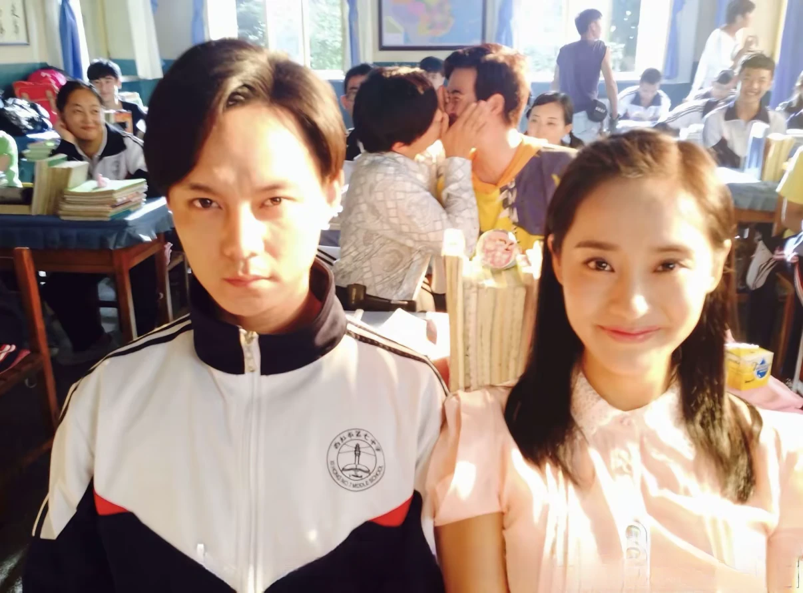
因为我确实被陈绮贞的歌曲吸引到了，尽管她已经 50 了。
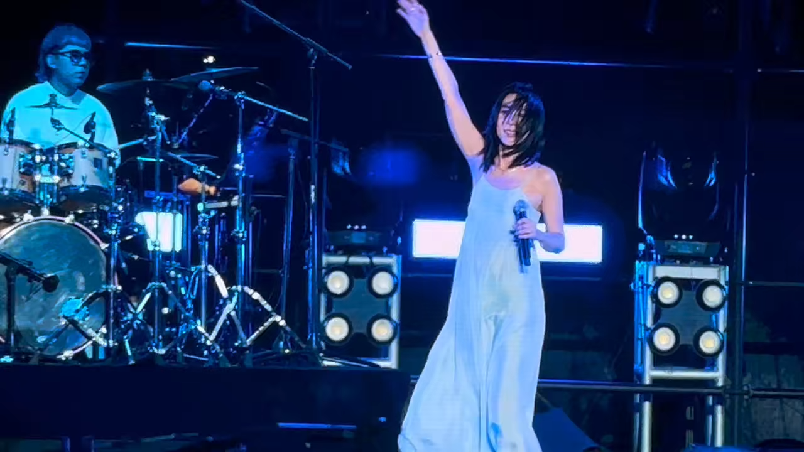
然后最近开始有点神神叨叨，可能是从上个月 25 号搜索《赛文 X》刷到 ONE OK ROCK（这是日本摇滚乐队）唱的 Voice，这首歌我短时间内（1-3 天）重复播放至少 20 次，主要是太好听了。接着我对摇滚开始有一点兴趣。其实之前我就特别喜欢电影《头号玩家》中那首 I Hate Myself for Loving You - 「摇滚女皇」Joan Jett，虽然我一直听不明白，但是我第一次听就下意识认为这是一首神曲，而且我也对 DouDou 乐队作品《嗵嗵》《可你听见了》《我用什么把你留住》多少有点了解。好吧其实也只是跟风了解一点流行乐曲作品。
事情转折出现在本次的音乐节，也就是最近五一劳动节 5.1-5.5 期间的 2026 北京超级草莓音乐节和 2026 天津泡泡岛音乐与艺术节。下面简称草莓音乐节和泡泡音乐节，先贴图看看阵容。
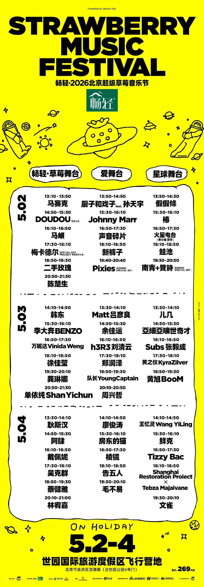
最开始我只打算去 5.4 号的泡泡岛音乐节，虽然现在我也只打算去这一场，但是从 4.30 考完工程应用英语作文开始，那天下午到 5.1 号晚上 22 点，这段时间我一直在纠结到底要不要 临时决定去 2 号的摇滚场。其实无论是草莓音乐节还是泡泡岛音乐节，我之前都没有打算去的想法。
一个主要原因是天气和地理位置原因：根据天气预报 5.2 号无论是延庆区还是滨海新区据说都是雨天（当然是小雨），而且二者地点距离市中心又远又堵。另外一个原因是嘉宾没有吸引我：草莓节只有<mark>陈楚生</mark>和 <mark>DouDou</mark>，泡泡岛只有<mark>逃跑计划</mark>，<mark>痛仰</mark>和<mark>万能青年旅店</mark>，其他人可能也很厉害但目前我没有粉上。最后我对**摇滚后朋**没有足够的热爱，可以面对 440+的草莓音乐节票价与 270+的泡泡岛音乐节昂贵票价，以及阴雨湿冷天和奇奇怪怪的规则（比如不能带瓶装水入场，现在一时激动买了就不能退票）。于是我果断理智没有购买票，然后我在抖音和小红书看到各种吐槽如何退票，不下于拨打 10306 等阴招，其实我在上上个月 3.31 就用抖音官方强制退了赵都礼宴的抖音渠道票，然后在 4.3 号又抢到一张票并于 4.4 号准时前往邯郸休假。
话虽如此，假如嘉宾夹杂着<mark>林俊杰</mark>，陈势安，苏打绿，<mark>王铮亮</mark>啥的，我肯定去，当然票价得在 400 左右我能接受的这个最低性价比前提下，哈哈哈哈哈。
十分期待 4 号的泡泡岛音乐节！！！
然后明天我想分析看看这个音乐节为毛价格直逼演唱会？毕竟我抢的 26 年青岛 CAISSA“一声有你”演唱会看台只要 288￥，然后天津泡泡岛音乐节普区要 274￥，而北京草莓音乐节普区要 446￥，wdf？

## 近期对音乐节的一点认识 2
202605020927
我想分析看看这个音乐节为毛价格直逼演唱会？毕竟我抢的 26 年青岛 CAISSA“一声有你”演唱会看台只要 288￥，然后天津泡泡岛音乐节普区要 274￥，而北京草莓音乐节普区要 446￥，wdf？
我一开始的直觉是：为什么 CAISSA“一声有你”演唱会看台只要 288，而北京草莓音乐节能卖到 446，甚至比天津泡泡岛音乐节还贵？如果只是“听歌”，这明显不合理。但我马上意识到一个问题：我是不是默认“<mark>音乐节=演唱会的劣化版</mark>”？如果这个前提是错的，那我的比较本身就已经偏了。
那我继续问自己：我在演唱会里买的到底是什么？其实是一个确定的对象：个艺人、一套完整编排、一种情绪递进的体验。换句话说，我买的是“深度”。而音乐节呢？我真的只是去“听某一个人”吗？好像不是，我面对的是几十组艺人、不同风格、随机切换的现场，这更像一种“广度”。那问题就变成：我为什么要用“深度产品”的价格直觉去衡量“广度产品”？
但这还不够，我再往下追问：那 446 到底贵在哪？如果只是艺人数量多，理论上可以摊薄成本，反而应该更便宜才对。所以一定有别的东西在里面。我想到的是场地：户外大场地、安保、临时搭建、天气风险，这些都是演唱会不需要承担的；我又想到商业区：餐饮、品牌、装置，这些其实并不直接提升“听歌质量”，但它们构成了一种环境。于是我不得不承认：音乐节的定价，并不是围绕“音乐”本身，而是围绕“场景”。
那我再逼自己一个问题：如果把这些场景全部拿掉，只保留一个舞台+随机艺人轮流唱歌，我还会觉得 446 合理吗？直觉告诉我不会。那就说明，我真正付费的部分，其实是“非音乐”的那一部分。那这时候我再回头看草莓比泡泡岛贵，是不是就没那么离谱了？北京草莓音乐节背后是摩登天空的品牌，它本身就是一种“预期稳定的氛围生产者”，再叠加北京的成本和消费能力，这个价格更像是“环境溢价”，而不是“音乐溢价”。
最后我只能问自己一个更诚实的问题：我到底为什么会觉得它贵？如果我只是想“听歌”，那 288 的演唱会明显更优；但如果我想要的是一种“在场感”，比如和朋友待一整天、拍照、发圈、感受人群，那音乐节的价值就完全不在同一个维度。也就是说，我的困惑本质上不是价格问题，而是我在用一种需求，去评判另一种产品。
于是问题被还原成一句话：我去音乐节，是为了“听”，还是为了“在”？只要这个答案不清楚，446 看起来就永远像“wdf”。
好吧现在我知道我的疑惑了，我其实主观愿望是去听歌的。
另外很喜欢这种**苏格拉底式自问自答推进**。
那我继续问自己：如果我只是想听歌，音乐节能不能满足？可以，但体验会被切碎：每个艺人只有几十分钟，音响调试不一定为某一个人优化，人群嘈杂，甚至还要跑场抢位置。也就是说，我花的钱里，有相当一部分并没有转化成“听歌质量”。
那我再往下逼一个更现实的问题：既然我知道这一点，为什么我还会被音乐节吸引？可能不是因为音乐，而是被它的“热闹感”“阵容名单”“大家都在去”这些外部信号拉着走。但这些东西，本质上并不服务于“听歌”这个目标。
所以现在逻辑其实变得很干净了，如果我的目标是“听歌最大化”，那演唱会几乎是严格优解；而音乐节，对我来说就变成了一种性价比不高的替代品，甚至可以说是“偏离目标的消费”。
最后我可以问自己一个最关键的问题：
如果同一天，我可以用 446 去看一场更好的演唱会，或者买两场普通演唱会，我还会选音乐节吗？如果答案是否定的，那就说明——不是音乐节贵，而是它根本就不适合我这个需求模型。
我靠，要是音乐节有林俊杰，估摸着我都不会考虑这个问题了。
下回参加音乐节我得考虑有没有喜欢的歌手了，这次有我喜欢的<mark>陈粒</mark>，<mark>陈绮贞</mark>，都是限定 75 mins。
虽然春风依旧，但岁月还是无情的留下了痕迹。
## 为什么我明明朋友很多，却没人约我出去玩？
202605032157
我一直给人的印象都是朋友很多，认识的人很多的人。也确实，我有很主动地在认识新朋友
但好奇怪，每当遇到节假日的时候，好像很少有朋友会约我出去玩。我的意思是约好了一起去一个地方，露营也好，聊天也好。我都是更主动的那个，找别人出去玩的人，但好像别人会想到我的情形比较少。
这会让我陷入内耗，是不是我不够好，所以大家不会想到我；是不是我对他人的关心还不够，所以大家会选择关系更好的朋友；是不是我不擅长融入集体，所以有集体活动也没人会想到我，有人会说我一个人过得也很开心的，很会生活的，这么无聊的活动我不会喜欢。
但显然不是的，我并不是一个不够“好”的人，相反，我甚至“好”得有点过了头。
但每当我很真诚地去对待别人的时候，我会希望他们也一样真诚对待我，可没有，完全没有。有可能是他们接不住，有可能是太过真诚也会被别人当成傻 x。我是那种路上看见别人需要帮助一定会去帮助他人的人，但好像这个世界上，还是虚情假意的人更多一些。
意识到这一点和这个情况，我一直以来的解决方法就是自己和自己玩，自己把自己家里变成最好玩的地方，我发现只要把时间花在自己身上只会觉得时间不够用。所以我好像很早之前就开始，对朋友好，我并不想要他回报我什么，我只是在做对他好这个行为本身。包括对自己也是，对自己好是方方面面的。
只是有时候想想还是会有点伤心，觉得我应该保持更多联系，但我又是个很怕麻烦的人，怕麻烦他，也怕麻烦自己，如果没事并不会想主动去联络朋友，infj 拧巴人的一生
## 26 天津泡泡岛音乐节是一场梦
202605081546
5.4（准确说是 5.4+5.5）的 2026 泡泡岛音乐与艺术节·京津冀站（以下简称“26天津泡泡岛音乐节”），像是一场被精心编排的梦。天津东疆的海风、重低音、落日和人群，把一天拉得很长。相比传统“去听歌”的演唱会，音乐节更像一次大型气氛实验：有人负责唱歌，有人负责造梦。根据公开阵容，这一天确实集合了 陈粒、尚雯婕、陈婧霏、陈绮贞、陈珊妮、范晓萱 等偏文艺、独立气质的阵容。
5.2 号下午开始下雨，没有能遮雨的棚子，有人就着雨水吃着面，简直不要太狼狈。晚上有人已经在雨里排起了火车，脚也踩在水里，鞋湿透了 5.3 号下午大概 15 点前还是好天气，接着“大风起兮云飞扬”，面对突如其来的 11 级狂风和产生的影响，两个舞台 BUZZ STAGE 和 SOSO STAGE 表演合并到一个舞台 SOSO STAGE 上面。接着舞台合并就延续到 5.4 号了。
连续下了两天的暴雨，甚至刮倒了一个舞台，双舞台直接变成单舞台，5.4 号终于迎来天晴。海风，海浪，恰到好处的阳光，一个灿烂的日子。
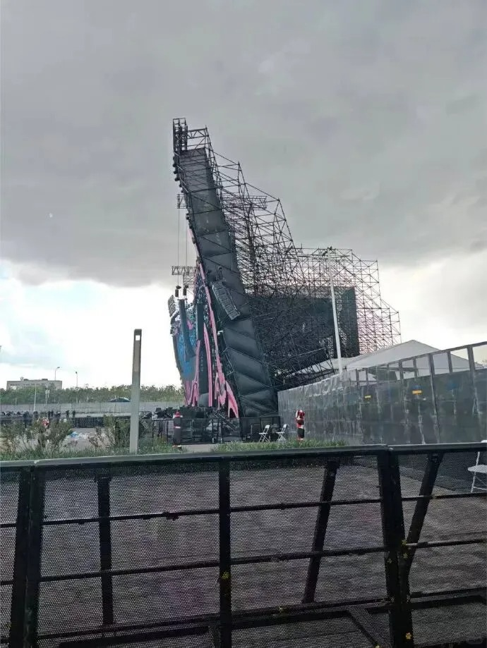
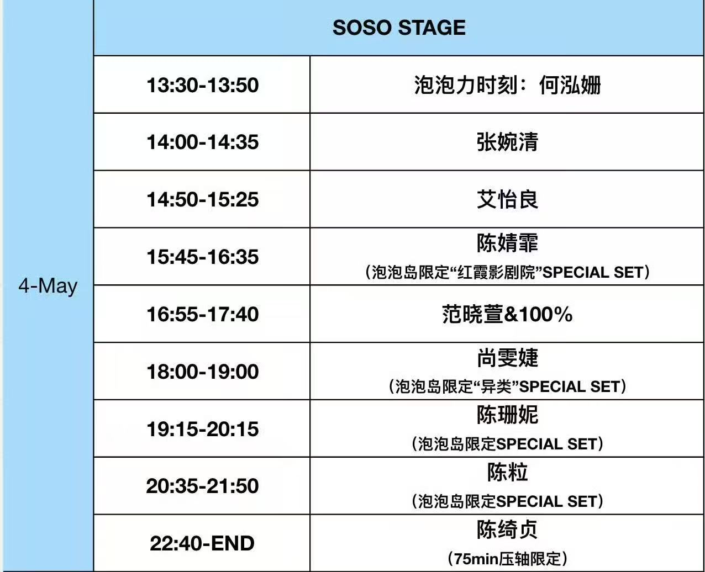
何泓姗：演员气质很明显，人很漂亮，状态完全不像 87 年出生。舞台时间不长，中午的太阳倒是比她更抢戏。张婉清：印象停留在“腰很细”，除此之外几乎没有太多记忆点。艾怡良：现场属于“听过但没真正进入”的状态。网上对她的评价其实挺两极，有人觉得她的唱功和情绪表达很强，也有人觉得太“内向型音乐”。陈婧霏：有点惊喜。“红霞影剧院”special set 挺有趣的，很多歌是自己写的，舞台气质也完整，带着一种复古电影感。网上对她的评价基本集中在“氛围感”和“都市迷离气质”，属于这几年独立女歌手里挺有辨识度的一类。范晓萱：热情是真热情，话也是真多。网络上很多人对她现在的评价其实是“彻底从甜妹转成怪女孩”，从《健康歌》时代一路变成实验摇滚和迷幻风格，反差非常大。尚雯婕：当天最特别的一位。哥特、宗教感、暗黑舞美、披着斗篷的舞者，再加上极重的低音，心脏都被震得发麻。她的妆扮造型有种“<mark>西弗勒斯·斯内普</mark> × **怪奇物语**”的混合感。很多网友这些年对她的评价其实很统一：审美超前、舞台概念强，但始终偏“小众精英路线”。她从早年的电子实验风格到现在的暗黑系视觉，确实越来越像“艺术项目”而不是传统华语流行歌手。她唱英文歌的比例也很高，和她过去“学院派”“国际化”的路线一致。有人觉得高级，有人觉得距离感太强。不是我最喜欢的类型，但能明显感觉到经费、野心和职业态度都比普通音乐节歌手高一个档次。陈珊妮：很“老派文青”的味道，有种 2000 年代博客时代的气质，不太对我胃口，但现场会让人意识到她在很多独立音乐人里的“祖师奶奶”地位。
陈粒：才女型歌手。网络评价一直是“文艺青年收割机”，现场也能看出来她的团队审美、编曲、氛围都很成熟。陈绮贞：神。基本属于“只要站在那里就已经赢了”的类型。很多人青春里的 BGM，到了现场会发现，她已经不只是歌手，更像一种时代滤镜。
5.4 号听到了好多喜欢的歌，看到了范晓萱陈粒陈绮贞，尚雯婕还像开演唱会一样带了一群伴舞，并且一个小时换了三套服装，唱了很多法语和英语歌。认识了新朋友，还有特别好的姐姐帮忙抓拍了特别好看的照片。虽然站到晚上站的腰疼。将近凌晨一点，就在大家都以为演出结束了，顺着人流往外走，就听到陈绮贞突然的安可 encore，唱了我最喜欢的《告诉我》。按原来流程应该是没有安可 encore 环节，唱完《旅行的意义》大家都开始往场外走了结果走到一半的时候奇珍的声音《告诉我》从后面传过来：告诉我，你不是真的离开我😭现在我脑子里只有陈粒的《绝对占有，相对自由》那句歌词--山河的浩瀚，宇宙的浪漫，都在我内心翻腾，推着我前行，对我眨眼睛。
此外，经历本次音乐节，我发现我无法共情他们说的戒断反应，但是那首《告诉我》：告诉我，你不是真的离开我😭，直接触动我的心灵，这回票价值了。
现在回头看，这场泡泡岛最有意思的地方，其实不是“哪首歌最好听”，而是它把几种完全不同的文艺体系硬塞进了一天：独立、哥特、民谣、实验、青春回忆、都市感、台式文青……最后混成一种很混乱、但又很真实的梦境感。

## 论作品和作品意识
202605090958
学东西要拿出阶段性的成果（完美主义不适用于初期），获取别人的反馈，评价可以驱动情绪脑继续向前，中期再不断打磨具备作品意识（理智脑知道如何做到更好），等到后期能力和水平都达到一定高度后再拿出完美主义的态度。没有作品和作品意识，一切免谈。
初期要做出个垃圾，后期再调动理智脑不断优化。
我在做事情的时候，有时候会因为完美主义而感觉到不想开始，总是在寻找做这件事情的全部流程。拿课后复习来说，我在课后复习的过程中，可以称得上是自己第一次对于老师上课内容进行回顾。但是由于期末考试，我总是想要第一版复习就做到很好，也就是想要做到完美。这件事情本身是好的，但是并不适用于实操。这样会让我不断怀疑自己做的某部分笔记没有涵盖某个知识点，自己做笔记的载体是否足够好，等等等等。光是在纠结笔记载体的过程中，就花费了我很长时间。然而这些时间，本来是能够运用到学习书本中的知识中去的。
包括我在大学里面接触一些新的活动的时候，由于对我来说是陌生的，我又很想一下子把它做得很好，但这就造成了自己迟迟没有产出。没有产出，也就没办法获得反馈。我知道自己是想要做到一个完美的产品再交出去，但是这样会让我的行动力变得迟缓，而且还会引起很多不必要的焦虑。直到自己被 ddl 逼到不得不产出，我才开始真正去做。然而也正是在这个过程中，我才算是真正学到了一些东西，在这个过程中解决一些东西。而且在这个过程中，虽然我的初始作品没有那么好，但是我的理智脑会发挥它的作用，会自己不断优化我做事情的过程。但是理智脑发挥的前提，一定是我先用本能脑做出来一个“垃圾”出来。也就是先“做出个垃圾”，才会有后面的不断迭代与优化。不要试图一开始就做到完美。我只需要在后续进行很多轮不断优化，就够了。
人不应该是插在花瓶里供人观赏的静物，而是蔓延在草原上随风起舞的韵律。 ---伍尔夫-
我在看游戏视频的时候，有个评论说：不知道博主为什么过去了这么久还会坚持做视频，我从上学看到工作，已经对很多东西失去兴趣了，只想早点攒够钱自己退休。接着有人说：光是攒钱是没用的，人总要做点事情来证明自己活着。我 10 岁的时候就想攒钱退休了，发现根本不可能，这个社会的机制就是让普通人燃烧最大价值的，所以说还是要自己找乐子，忙碌也要快乐着。
我想，我活着的意义在于作品和作品意识，目前这个作品是我自己，可能在有些人眼里我这个作品并不值一提，但对我自己来说却相当可以。我爱我自己这个作品，精益求精。
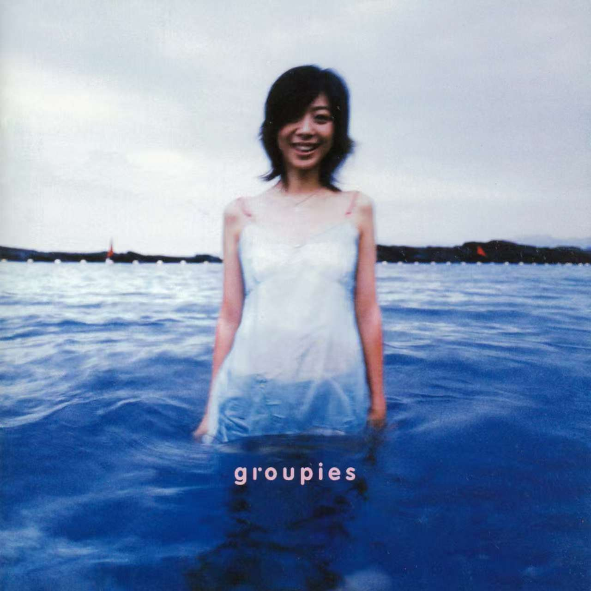
陈绮贞音乐作品集：旅行的意义；太聪明；我喜欢上你时的内心时刻；鱼；告诉我；After 17；吉他手 ；私奔到月球；躺在你的衣柜...这些作品我比较喜欢。但是论华语独立创作女歌手邓紫棋也比较有才：泡沫；光年之外；倒数；句号；多远都要在一起；摩天动物园；来自天堂的魔鬼；再见；A.I.N.Y.；我的秘密；Where Did U Go；我靠邓紫棋确实🐮，这些作品都比较耳熟能详，至少对我来说是这样的。
## 科技论文写作课程与 AI 结合思考
2026‎0‎5‎‎13‎‏‎1100
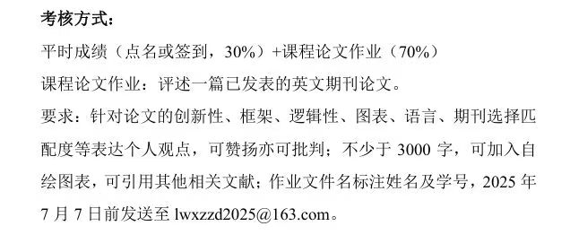
科技论文写作作业： 课程论文作业 1.大量阅读：使用 excel 表格进行文献阅读总结，如下载 5 篇/10 篇进行阅读总结。
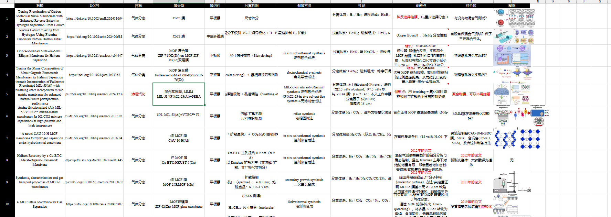
2.精细写作：评述一篇已发表的英文期刊论文。要求：使用英文评述一篇论文的图表，类似雅思图表题写作（必然使用 AI，但是多少可以学会描述图片数据趋势）
**图表题写作示例**
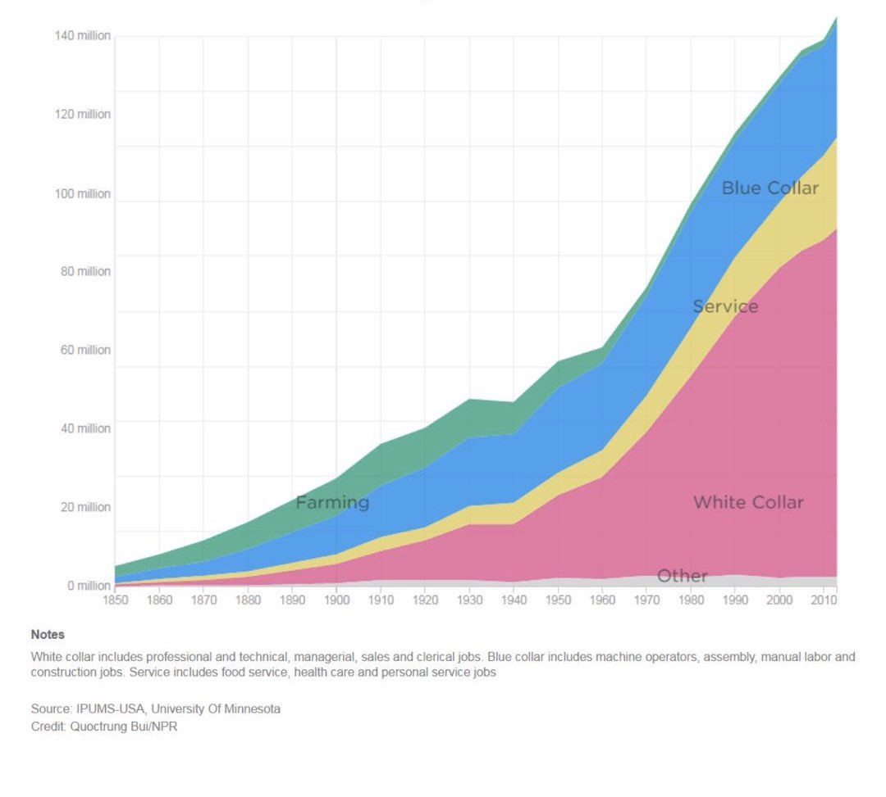
The graph illustrates the changes in the number of jobs across different sectors from 1850 to 2010.
Overall, total employment increased significantly over the period. The most notable trend is the sharp rise in white collar jobs, which became the dominant sector by the end of the timeline. In contrast, farming declined steadily and eventually played a minor role.
In the early years, farming was one of the main sources of employment, while other sectors remained relatively small. However, as industrialization progressed, blue collar jobs grew rapidly, reaching a peak around the 1950s before stabilizing. Meanwhile, service jobs also experienced gradual growth throughout the period.
The most dramatic change occurred in white collar employment. Starting from a low base, it expanded rapidly after 1950 and overtook all other sectors by a large margin. By 2010, it accounted for the largest proportion of jobs. In comparison, the other category remained minimal and showed little fluctuation.
In conclusion, the data reflects a clear shift from an agriculture economy to a service and knowledge economy.

结论
- 允许大家使用 AI 生成作业，但是作业得提交手写板
## 论我的青春
202605141948
我的青春太过于安静。以至于到现在，我都没有反应过来，我已经 23 岁。没有逃课，没有不良习惯。没有特别优秀的成绩，没有精彩故事。没有出众的才艺，没有肆意而为之的洒脱。平平淡淡，中规中矩，弃之可惜，食之无味。但是换个视角，平平淡淡才是真，而且我的成绩平平淡淡也很正常，因为我高中也没有玩儿命的学习。有付出不一定有回报，但没有付出一定没有有回报，下面贴一张高考成绩单。
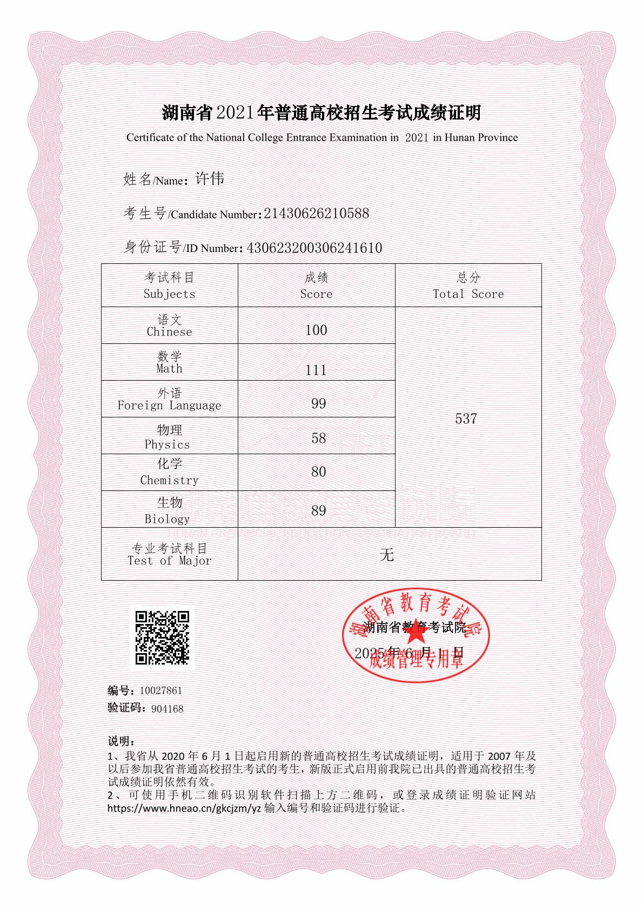
从大学开始卷绩点，然后在 2025 年逐渐开始从“读万卷书”转移到“行万里路”，也就是到处旅游玩儿。但需要警惕的一点是：提升认知的方法不是消费端而是生产端。举个例子，我为了健康自己在家制作手打柠檬茶，结果发现如果不放过量的糖浆，根本做不出奶茶店的味道。于是我就再也不喝外面的奶茶了。俗话说：读万卷书不如行万里路，行万里路不如阅人无数，阅人无数不如明师指路，明师指路不如自己领悟。唉，我需要一个贵人，但我又有什么价值呢？
## 感兴趣的书
2026‎0‎5‎18‎2212
前两张纸质页的原文出处：是《史记》，作者司马迁。
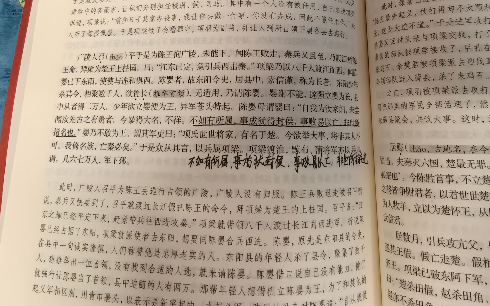
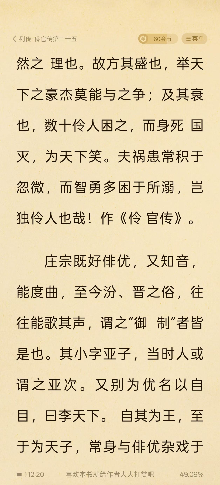
第三张电子书：书名是《新五代史》，作者欧阳修，篇名《伶官传》。
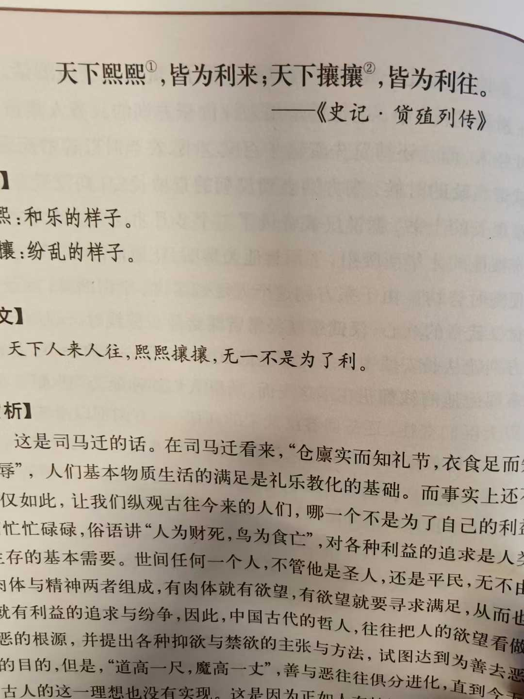

## 《黑袍纠察队》结局有感
202605201609
26 年元旦的《怪奇物语》第五季（Stranger things season 5）11 在消灭维克那之后消失不知生死，迎来开放式结局。接着 26 年的 5.20 也就是今天，《黑袍纠察队》（the boys season 5）开头迎来法国佬 Frenchie 的葬礼，接着主角团杀入白宫，喜美子 Kimiko 胸炮消除 祖国人 Homelander 的超能力，然后屠夫 Billy Butcher 水管插爆祖国人结束战斗，事后休伊 Hughie 枪杀屠夫，结尾过上了包汉堡的日子。这对么，我想看的是祖国人和黑袍小队超能力大乱斗，而不是屠夫和祖国人的肉搏，另外士兵男孩真变成老冰棍了，第五季愣是出场 7集，然后看快大结局的时候被锁进冰柜进行当老冰棍了，明显能看出来剧组的经费相比前四季明显不足。
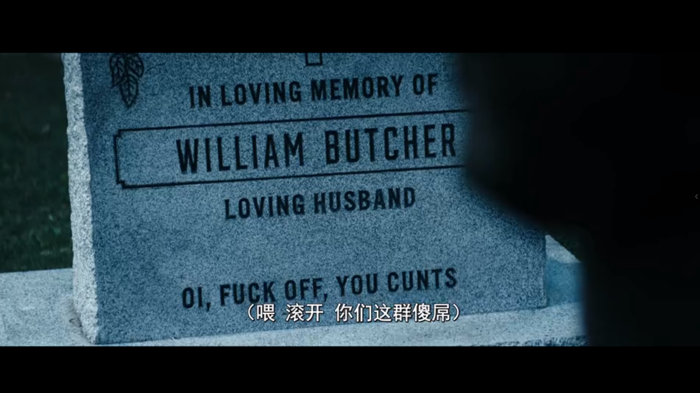
再来一张伪结局。

## 我是一个怎样的人？
202605210123
凌晨一点，写于中国天津市津南区天津大学北洋园格园二斋 寝室1284 号床
05.21 01:23
我是一个怎样的人？
幼儿园，那天雪夜，我记错老师布置的作业（抄写一排变成抄写一页）哭着写完作业。
二年级，因为没有零花钱却又好吃懒做的缘故，五指伸向父亲的钱袋，被发现然后罚跪在街边哭了很久，还是邻居阿姨好心帮我解围。
三年级，上英语课的一天晚上，父亲叫我罚跪只因为我无法背诵英文单词，我哭了很久却什么也不敢做，最后父亲无奈让我睡觉。
五年级，再次因为没有零花钱却又好吃懒做的缘故，我在给父亲数钱的时候夹带私货被父亲发现，父亲给我讲了堆大道理，一夜过后安然无事。
初一，因为奶奶患胆结石住院，陪护期间想到英语好难，曾经一度想要跳楼自杀。
初三，因为太想玩手机然后自己买了台小米 4 躲在厕所玩手机，某天被母亲发现，叫嚣告诉父亲。然后我跑出家门跑去沱江广场蹲了一个下午，接着去了趟同学家，发现母亲在微信群里面询问我去了哪里，回家安然无事。
初中毕业，我和同学在学校门口玩儿滑板，撞到人家，我赶紧赔礼道歉，然后留下父亲电话号码，听着父亲赔礼道歉。回家 diss 我一顿，安然无事。
高二，虚荣心爆棚，骗父母买书➕饭钱攒到 899，买了一双欧文五，然后穿到高中毕业气垫坏了就闲置扔了。
大一，暑假和发小骑自行车 20km，到达湖北荆州桃花山镇，往返 4h，骑到最后小腿抽筋低血糖。父亲教育一顿。
大二，参加比赛，暑假不回家。
大三，参加夏令营准备预推免，经常坐高铁跑路。
大四，前往天津实习，在家一个月。
我是一个什么样的人？qy 说我是一个说断就断说散就散的人，lzj 说我是一个不交心的人，xx 说我是一个傲娇的人，xxz 说我是一个虚伪懦弱的人，txl 说我是个有点帅的人，yzy 说我是一个不珍惜朋友的人，lzh 说我是一个心里想的事全都写在脸上爱和别人较真的人，smy 说我是一个努力优秀的人，czy 说我是一个不懂得珍惜眼前事物的人，sx 说我是一个逃避问题不想解决问题的人，lzl 说我是一个自卑胆小的人。
## 形容女生的词语
202605221949
形容女生的词语：
**五官类**  
明眸皓齿、柳眉星眼、琼鼻樱唇、杏眼桃腮、眉目如画、眼含秋水、顾盼生辉、唇红齿白、冰肌玉骨、肤若凝脂、朱唇皓齿、凤眼含情、面若桃花、眉眼弯弯、五官精致
**脸型/肤感类**  
鹅蛋脸、幼态感、小脸精致、冷白皮、奶油肌、通透感、水光肌、瓷娃娃感、白皙透亮、细腻无瑕
**身材类**  
珠圆玉润、亭亭玉立、纤腰楚楚、身姿曼妙、曲线柔和、肩颈优越、腰肢纤细、比例完美、修长双腿、丰润匀称、轻盈感
**气质类**  
清冷感、破碎感、少女感、御姐气质、知性温柔、慵懒随性、高级感、氛围感、仙气飘飘、邻家感、贵气感、禁欲系、甜美治愈、温婉娴静、灵动俏皮
**神态类**  
浅笑嫣然、眼神温柔、含羞带怯、神情慵懒、若有所思、回眸一笑、神态灵动、眼尾含情、低头浅笑、目光清澈
**头发类**  
黑长直、及腰长发、微卷长发、法式卷、空气刘海、公主切、高马尾、中分长发、湿发感、发丝蓬松
**古风向特别好用**  
清艳绝伦、遗世独立、仙姿玉色、倾国倾城、楚楚动人、弱柳扶风、云鬓花颜、月下美人、淡雅出尘、温婉如玉
我觉得这些描述词可以很好的帮助我 AI 生成图片。
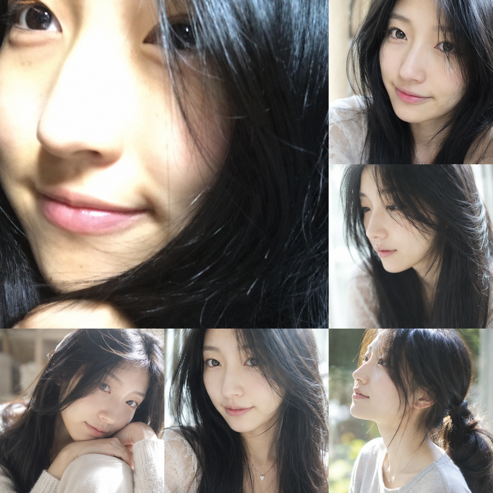
## 短暂歇息之左脚小拇指疼痛
202605261446

今天本来应该去听这位大师的讲堂，然后我早上左脚小拇指疼痛，上午进行英语 Project 汇报后力竭，接着爽玩手机然后中午回寝室睡了一觉，然后下午两点被 fzw 通知要进行听报告，我拖着病腿然后看见外边下雨,然后我就没去了。
近期要做的事情如下：
~~5.22 12 点抢 7.25 邓紫棋演唱会天津站票~~
	~~没抢到，改抢 5.27 抢 7.26 邓紫棋演唱会天津站票~~
~~5.22 下午组会汇报，背稿子,熟悉 PPT~~
	~~改成 5.25 组会~~
~~照片处理，文案处理~~
~~5.23 晚上英语排练，背稿子~~
~~5.25 一对一辅导组会~~
~~5.25 晚上英语最后一次排练，背稿子~~
~~5.26 上午英语 Project 汇报，背稿子~~
~~5.26 下午听报告~~
~~5.26 在学习通 project peer review 英语课打分， 5.28 之前完成~~
~~5.26 向小高师兄拿支撑体~~
## 近期小烦恼
202605261851
我原以为保研天大就不会有烦恼了。就能找到一份好工作，就能赚到许多钱。 后来才发现，如果保研天大成为我人生的最高点也许才是最大的烦恼。
其实具体来说，我从大二暑假也就是 2023 年 8 月 3 号化工设计竞赛华中赛区决赛的那天下午开始，我就有点忧虑：我好像并没有那么聪明，反而还有点笨。然后大一上一直维系到大三上学期的绩点第一，被老李一学期干翻，也多少在我意料之中，只是我并不太能接受这个事实。包括后来我 24 年 9 月完成天大专硕推免，我都有一些忧虑：我担心天大是我人生的最高点。我担心保研两个字一直成为我的标签，就像命运勒在我脖根上的麻绳，无法动弹。可能我会安慰自己说：阿伟你要知道，如果天大是你人生的最高点，那么天大对你的意义在于无论以后你过成什么样子，你都会知道你原本就是能登上高峰的人，你之后是选择住在山顶山腰还是山谷又有什么关系，只是你的选择不同而已。
唉，我有时候只是难以接受泯然众人矣。所以大二下开始，我积极探索我可能存在的其他兴趣天赋。包括但不限于那些化工设计竞赛，化工实验大赛，大创，化工过程数字创新竞赛，数学建模竞赛，入党，Coursera，个人博客...我想我可能真没什么天赋。

## 观《超能路人甲》第一季有感
202605270025
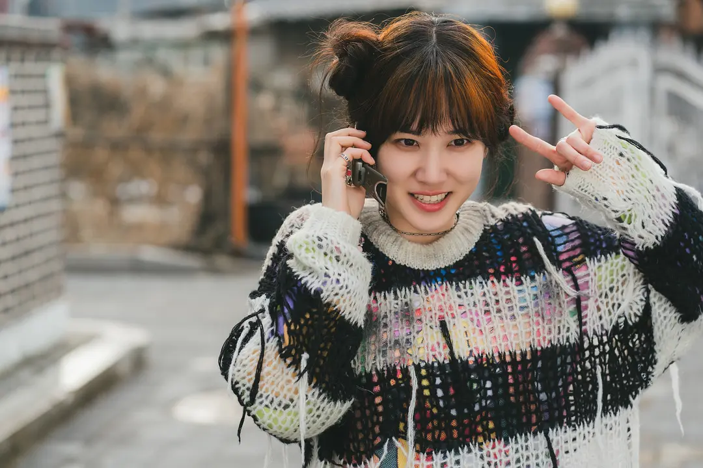
韩剧《超能路人甲》，女主角朴恩斌（有点像马丽）很漂亮，具体来说就是衣品不错，然后印象深刻。	男主角是车银友，帅。剧情方面有种工程伦理的感觉，大概就是标准的科学家拿小孩做实验，然后失控，以及莫名其妙的想把实验用于全小镇，主角由反派帮衬变成对抗。标准的工业级别电影，就是类似流水线级别的电影，然后男女主角爱上对方的理由在我看来莫名其妙：首先男主卖了女主，虽然男主给女主留了一线生机（咖啡果冻），但是我看不出来为什么会有爱情？而且爱情是这样的么？值得我怀疑。
## 论规划
202605270944

贴一张《工程应用英语》Project队友 Zhao Gangyi，在英语课汇报完之后给我讲解用的小纸条。Gangyi川大物理本科，24 年毕业外派越南干外贸两个月，然后裸辞考研天大电子信息专硕，研一上发篇会议然后现在研一下在投会议，目前正在深圳实习 LLM。总结就是物理转行 LLM。下面贴一张小组 Project 合照。
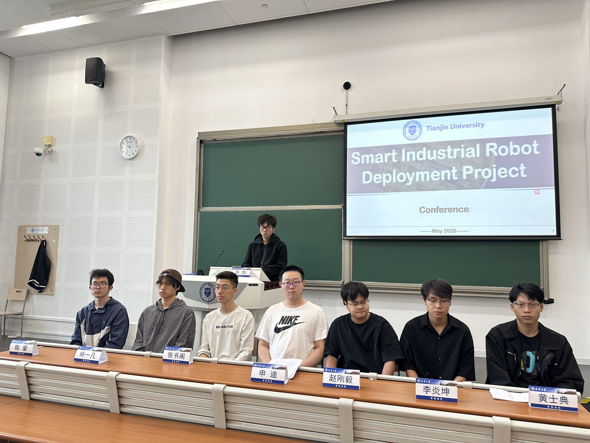
## 观《王国》与写作小灵感
202605271014
如果丧尸病毒发生在大明王朝会怎么样？😆首先朝鲜是其发源地😏，剧情开始——朝鲜已经完蛋了。
你是大明王朝的将军！朝鲜国王羸弱的军队无法抵抗行尸走肉，向大明王朝请求支援。在朝鲜的王都，朝鲜国王的军队依托城墙正在和丧尸战斗着……但是以城市中拥有的城防物资储备，很显然支撑不了多少天了……
你受大明天主之令，率领铁骑前往朝鲜王都，拯救朝鲜国王及其附属，并查明不死人诞生之谜。这不是一场普通的战斗……你的对手是无法死去的人，只有用刀剑砍下其头颅才能使其丧失攻击能力。据朝鲜斥侯兵传回来的消息，这些活死人面目狰狞，十分恐怖，即便被刀剑刺伤也依然能活动……一旦被其撕咬，便会在半时辰内被感染成为新的行尸走肉。
你带领的是大明王朝最精锐的部队……不仅训练有素，而且早已将生死置之度外。大家都做出了准备……在鸭绿江边，大明的工兵部队早已修建好了临时木质要塞，弓箭手、神机营在此开始进行防御，明日太阳一早，你们便会启程。说起来……在古代战争中，对于全副武装的铠甲士兵而言，这种奔跑速度快一点的丧尸，应该没有太大的威胁吧？盔甲能够防御刀剑和劈砍……人的牙齿尖锐程度跟铁没法比。也许步兵会输在体能优势上，但是面对全副武装的骑兵……我个人认为威胁不是很大。再加上骑兵经常练习对人的砍杀……跟丧尸作战还是很有优势的，而且就算死掉的丧尸不会感到疲惫，应该也不至于跑得比马还快吧？
至于丧尸的起源……我迷迷糊糊和瞬间想出来的设定，和秦始皇有关。原来秦始皇寻找的在日本的长生不死药是真实存在的……只不过那种不死药，只是把人变成行尸走肉了。当年秦始皇派出去寻找这批药的人驻扎在了岛上，并不是因为贪生怕死，只是不想让这种药落入秦始皇手中罢了……他们在日本岛上建立了一处墓地，用于存放这种使人能够处于不死的药草。然而这种药草，根据壁画上的记录，是来自于从天而降的一块石头上携带的种子生长出来的，其实就是陨石……
男主随同自己的部下，在朝鲜开辟了新战场，借助装备优势以及大明王朝强大的物资补给能力，很快建立起了补给线。大明的军队在朝鲜连战连胜，朝鲜人民也自发组织起来收复自己的家园。最终在大家齐心协力下巩固领地，在七个月之后，已经打通了一条直达海岸线的城市物资补给枢纽。军队和军舰将开往日本，最终揭开了不死人之谜。当你凯旋而归，被朝鲜人和大明王朝百姓视为英雄之时，大明王朝的皇帝却害怕你谋权篡位。最终，在路上你的军队被大明王朝秘密部队袭击，最后死去……这段历史也被大明王朝强令各诸侯改写，改为倭寇之乱……所有有关之人以及文献皆被摧毁😆从朝鲜那里发生事件开始，大明王朝就已经收到了消息。这得多亏锦衣卫的出色情报能力😏为了防止不死人在国内出现，大明王朝几乎对全境进行了封锁……
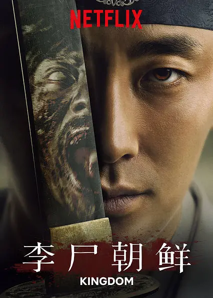
## 对痛苦脱敏对幸福敏感
202605280942
多少个夜晚，大概 21 点之后，我开始焦虑迷茫。
先说说过往衣食住行基本层次。穿搭方面：衣柜里面我现在有很多件衣服，但我依然不满足于现状。不满足要洗这么多衣服（我会攒着几天的衣服一块洗），不满足不够漂亮（买的时候觉得不错，但是审美不断升级），不满足不够舒服（我逐渐开始追求衣服的材质与舒适度）。饮食方面：我觉得我还是比较实在，虽然天大食堂普遍性比较贵，大多超过 11 块，但是先比外卖还是相对便宜一点。住宿方面：我觉得有点痛苦，我需要个人空间，甚至我做不到独属于自己的自慰时间与空间。出行方面：我在 25 年刚入学的 9 月份就买了一辆立马电动车，然后校内出行基本上都骑上小电驴，校外地铁或者网约车。身体健康方面：我基本保持健康，每周打一次羽毛球，偶尔 3km 耐力跑。
再聊聊当前现状进阶层次。学历：我现在是天津大学化工学院硕士研究生，全国第一的化工专业，仍然在攀比与其他工作的待遇环境差距与分歧。家庭：我有裸身高 173cm，65kg，长得不丑，父母都买了退休金保险，有独立的房子和小轿车，相对稳定的工作（出租车司机大叔和食堂阿姨），有一个妹妹。经济：每个月国家发 500￥，老师发 300￥，以及支付宝基金，一些私活娱乐：节假日旅游，音乐节，演唱会。
最后聊聊未来选择场次。我可能不太适合读研，所以硕士之后进半导体厂或者国央企业。
总的来看，似乎我知道的越多越痛苦？忆往昔，<mark>幼儿园时期</mark>的我，甚至没开智，具体表现就是呆呆的 NPC，没有自己的想法；<mark>小学时期</mark>的我，大概有点自我意识的体现，比如会因为没完成老师布置的作业而痛苦；<mark>初中时期</mark>的我，由于接触了互联网（甚至在 2017 年偷偷买了一个小米手机 4c 没事就偷玩手机）知道了很多时期；<mark>高中时期</mark>的我，对有个叫 yzt 的同班同学骂我我都感觉没啥，但是我多少知道有同学是在拿我名字取笑或者嫌弃我（毕竟又穷又丑成绩还差谁稀罕），这是我作为一个低敏感人的唯一聪慧；<mark>大学时期</mark>的我，在那样的环境（安徽理工大学与我想象或者电视剧里面的大学完全不一样）与认知（只知道保研考研或者进厂打螺丝）的前提下意识到必须得全力学习，于是我刻意或者又偷懒嫌疑保持造型的粗糙（寸头标配再加上衣品趋向花红柳绿的老年人衣着），我多多少少有点知道自己对几个人的喜欢，但是我也清楚的知道那不是喜欢而是一张情绪寄托，于是我回避这些问题；<mark>硕士研究生时期</mark>的我，开始总结前面五个时期的问题，开始慢慢校正自己的人生准星，找到自己的人生定位。
那为什么我知道的越多越痛苦？由于抖音等社交媒体快速发展，各种信息飞速传播，你知道和你能改变什么是两回事。苏格拉底说：这世上只有两种人，一种是快乐的猪，一种是痛苦的人。做痛苦的人，不做快乐的猪。如果站在五六十岁、经历过下岗潮、国企改革、房地产上升周期、互联网黄金年代的父辈角度来看，其实会觉得我们这一代人的痛苦是真实的，但也会觉得你们有些地方“看得太早、想得太透”。他们那一代人，年轻时其实也苦。很多人二十多岁时一个月工资几百块，住集体宿舍，干体力活、倒班、加班，也被领导骂，也担心下岗。但区别在于，他们那时候普遍相信“熬下去会越来越好”——城市在扩张，行业在增长，房价还没高到绝望，学历含金量也高，只要肯吃苦，大概率能比父母过得好。而你们这一代的问题在于：你们<mark>很早就意识到</mark>，有些苦未必能换来对应的回报。努力和结果之间，不再像过去那样线性相关。但从父辈视角，他们大概也会提醒一句：年轻时很容易把“当前环境”当成“整个人生”。<mark>实际上，大多数人的一生都不是靠某一次选择彻底决定的。</mark>很多人二十多岁觉得自己完了，三十多岁反而稳定下来；也有人年轻时风光，后来一地鸡毛。企业会淘汰人，行业会周期波动，科研和就业也确实有运气成分，但人真正能拉开差距的，往往不是某几年冲得多猛，而是能不能长期活下去、调整自己、保住心气。所以从他们的角度看，你们现在这种“提前看透”其实有利有弊。好处是不会被鸡汤骗得太惨，会更早考虑退路、稳定、健康和生活；坏处是容易在真正开始之前，就先把自己判了死刑。很多五六十岁的人回头看，会发现年轻时最危险的状态，不是吃苦，而是“觉得一切都没有意义”。因为只要人还愿意慢慢往前走，很多事情其实没那么早定型。
这就是我对我需要痛苦脱敏的一点思考。
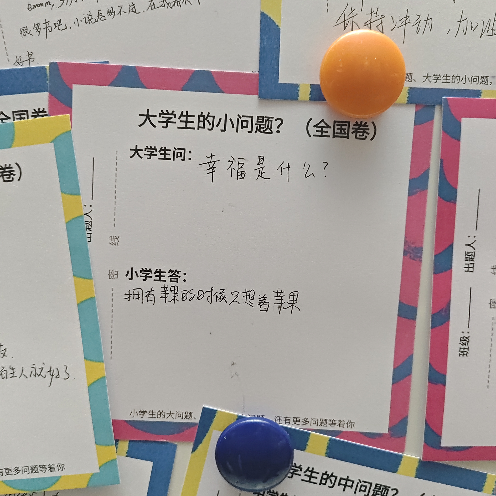
事实上，正是由于我对幸福高度脱敏才会对痛苦高度敏感。人并不是因为对痛苦敏感，才想痛苦脱敏；而是因为已经对幸福脱敏，所以才越来越承受不起痛苦。我不会因为饱餐一顿而幸福，不会因为解答一道题目而高兴，不会因为认识新朋友而开心，不会因为拥有什么而满足，只会因为想要什么而感到痛苦，因为我的欲望永远无法彻底满足而痛苦。
## 科研小痛苦
202605281402
我现在在进行氦气/氢气 MOF 膜分离，但性能微弱，二者渗透率小于 5GPU 且选择性小于 2，好像做了一个不透气的塑料袋。
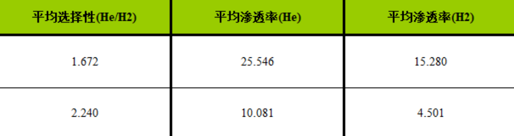
师兄都做到这个程度了，emmmm，我有点迷茫。好他妈难啊。

