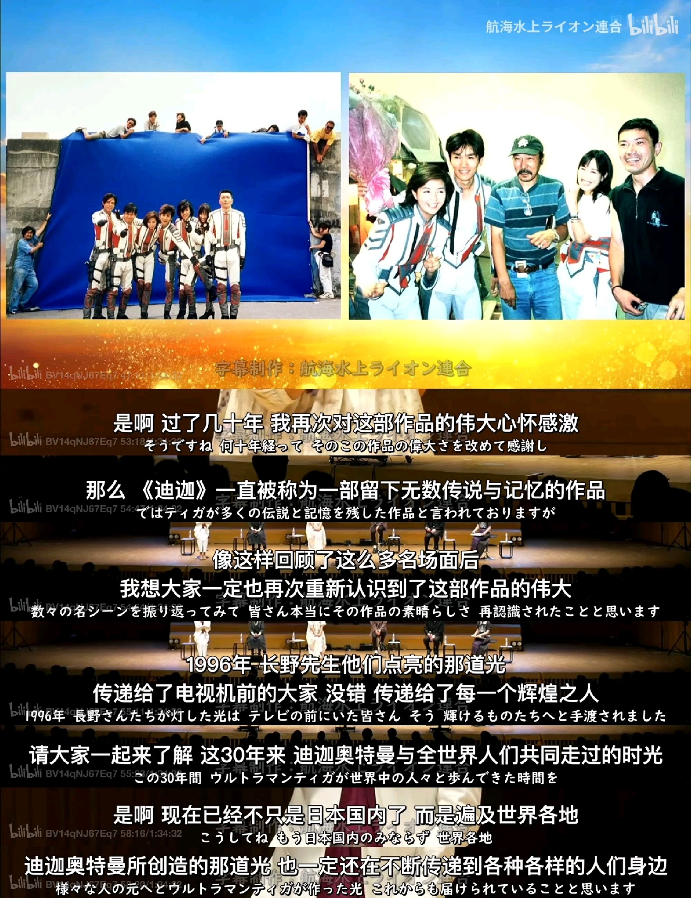
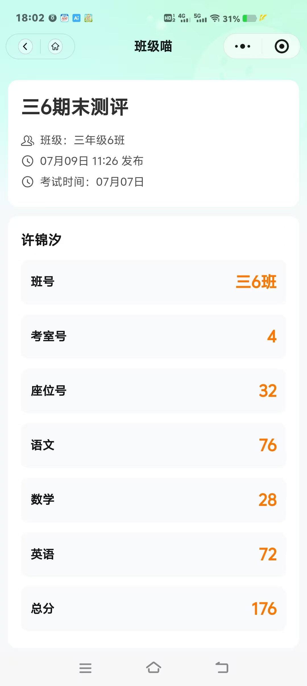

# 随笔-202607 思绪汇总

## 在人与人的关系中成长
202607030812
阿扬在课题组里遇到了人际关系问题。根据他的描述：课题组里有个女同学喜欢他，但阿扬没有给予积极回应。然后，这位女同学似乎因为情感上的落差，开始和其他同学形成小团体，对阿扬产生疏远或者孤立行为。阿扬因此感到：在实验室办公时很不舒服；感觉被排斥；心情低落了一个月左右；晚上越想越生气；不知道应该装作不知道，还是主动解决。
阿扬把事情发到群里，希望朋友们帮忙分析。一开始大家比较震惊，询问：事情是不是真的；对方是谁；想了解具体情况。期间有人提出想看照片，更多是朋友间调侃，并不是正式建议。阿扬解释：这个女生就是导致现在实验室关系变化的人。
阿伟的核心观点其实比较现实：
1.不要把实验室关系看得过重。
阿伟认为：读研拿毕业证是自己的事情。课题组同事更多是“搭子”，因为大家刚好在同一个环境里合作，并不一定会成为真正的朋友。
未来真正重要的是：自己的学业；自己的发展；自己的生活。
别人不会替自己承担毕业、人生规划这些责任。
2.老板可能并不关注这种人际矛盾
老板关注的是：实验进度；工作成果；能不能完成任务。
同事之间的小团体问题，只要没有影响科研和工作，老板通常不会介入。
3.解决策略：降低冲突，装傻充愣
也就是：不主动激化矛盾；不表现出愤怒；不回应对方的小动作；保持正常工作关系。
阿伟的逻辑：如果对方只是情绪问题，时间可能会让事情淡化。
在中间讨论阶段出现关于“直接追求/发生关系”的玩笑：可以约一下；事情可能解决。但阿扬后面自己也提出：担心如果关系进一步发展：激情过后；对方产生更多期待；甚至产生新的风险（比如挂小红书社会性死亡）。这种方式风险太大。所以阿扬最后仍然倾向：利益损失最小化，选择装傻充愣。
阿扬在讨论中说：虽然知道装傻充愣这个道理，但是实际上很难受。其主要原因是，自己和对方每天实验室见面；对方和闺蜜在一起；自己感觉被针对；内心觉得她们是“坏人”。阿扬接着说，这一个月他心情很低落。
阿笑接着加入讨论分析中，开始把问题从“谁对谁错”转向“如何处理自己的情绪”。他的核心观点如下：第一就是要接受现实，人与人相处，本来就会出现喜欢与不喜欢。矛盾是普遍存在的，而且大家的价值观会有些许不同。不是所有人都会喜欢自己。也不要因为别人行为，就完全否定对方的人品；第二就是不要让别人影响自己的生活主线，阿笑认为阿扬真正需要关注的是学业，兴趣，自己的发展。如果这件事情已经影响到自己的状态，就需要主动调整。因为过度愤怒和纠结，本质上是在消耗自己。第三阿扬就是需要反思双方关系，阿笑提出，阿扬可以想一想是不是自己拒绝对方的时候方式比较强硬？有没有无意伤害对方？对方是不是因为受伤才采取回避？阿笑不是说阿扬一定错，而是希望阿扬理解，双方可能都有自己的感受。最后，阿笑提出解决方案，找机会面对面沟通而不是手机聊天，因为文字沟通容易误解。其沟通目标不是一定重新建立关系，而是把误会讲清楚。如果女生确实喜欢阿扬，阿笑建议感谢对方喜欢自己，尊重对方感情，但明确表达自己目前没有同样感觉，不要因为愧疚接受，因为这样对双方都不好。关于送礼物，阿笑建议可以考虑找机会聊天顺便送一个小礼物缓和关系，他认为这样做不是因为女生“重要”，而是为了让阿扬自己减少内耗。
阿扬后来补充情况，他之前已经找过女生。但是对方没有回应，甚至直接走开。他觉得那说明她很恨我了。女生现在没有完全避开实验室，但更多待在实验室里。阿扬认为事情可能已经无法解决。
阿笑分享自己的过去经历进行讨论，他说自己本科时也经历过类似的人际问题。后来意识到：很多矛盾其实来自生活习惯不同，性格不同，需求不同。例如：他本科舍友不喜欢他早睡早起，而舍友喜欢晚睡。后来他认为，大家不一定是谁坏，只是不适合。所以应该尊重别人，也尊重自己。阿笑接着说，自己一直喜欢一个不太喜欢自己的女生，而且她好像在我心里住下了，不走了。她在想，喜欢一个人是不是会打扰别人。最后阿笑总结，人际关系中的很多矛盾并不一定是谁对谁错，而是双方需求和认知存在差异。重要的是尊重别人，也尊重自己，不要因为别人的行为让自己长期陷入愤怒和内耗。
......
Tips：昨晚听完阿扬的事情，我最大的收获其实不是如何处理一次实验室矛盾，而是重新理解了人与人之间的关系。以前我面对类似问题，更多选择逃避：不合适就删除，不喜欢就远离，好像只要切断联系，问题就不存在。但后来才发现，很多关系并不是因为谁不好而结束，而是两个人的需求、期待和生活轨迹发生了偏差。
回头看自己这些年的一些关系，无论是初中、高中还是本科，都曾经在某个阶段占据很重要的位置。从小学开始，额小学也没有喜欢的妹子，那就从初中开始，初中的 hjl 同学，高中的 yzy 同学（这个算是高中搭子，难说，其实算是挚友，但是这样的挚友介于吃饭搭子和挚友之间，夹生友），本科的 smy 同学。我有时候会不自觉提高某些人的权重，把他们想象成生活中的“关键变量”，甚至把自己的情绪寄托在一段关系上。当后来发现现实和想象存在差距时，反而会产生巨大的落差。
现在想来，人际关系可能更像化学反应。我总以为某些人是反应体系中的核心催化剂，但实际上，他们可能只是特定条件下参与反应的一种物质。随着温度、环境、浓度的变化，原本稳定的键也可能断裂，而新的键会重新形成。重要的不是强行维持每一个反应，而是在反应结束后，仍然保持自己的结构稳定。其实他们也没有那么重要，也没有那么不重要，更重要的是我应该尊重自己，做自己，而不是遇到分别遇到不太能接受的事情时，仍由消极态度占据每一个细胞开始摆烂（微信啥的拉黑一条龙服务，呵呵确实不太成熟）。
所以，尊重别人，也是在保护自己。接受有人喜欢自己，也接受有人离开自己。人与人之间最好的状态，也许不是永远绑定，而是在彼此经过的时候，都留下一个温和的痕迹。
以前，我的安全感更多来自于对关系的控制。我会觉得，只要我能够及时切断一段让我不舒服的关系，就可以避免受到伤害。但现在我逐渐意识到，真正的安全感并不是来自于掌控别人是否留下，而是来自于相信自己的内在稳定性。即使有人离开，即使某段关系走向变化，我依然能够保持完整，继续成为自己。人与人的关系其实没有必要被简单定义为“重要”或者“不重要”。他们没有那么重要，不应该决定我的情绪、价值和生活方向；但他们也没有那么不重要，因为每一段相遇、每一次连接，都曾经在某个阶段留下意义。成熟并不是降低别人存在的价值，而是降低别人对自我价值的控制权。
未来，我依然会选择朋友，依然会判断一段关系是否值得投入，但在做出筛选之前，我也会允许关系存在一些摩擦、不确定和不完美。真正稳定的人，并不是从未失去过任何人，而是在经历关系变化、面对分别之后，依然能够接受现实，保持自己的结构稳定，继续向前生活。

## 与苗师兄聊天有感
202607071350
今天中午在留园食堂一楼，苗师兄给我说他在 25 年也就是研二上学期，9-12 月那几个月做科研最辛苦同时也是提升最快。按照自己的节奏走，不要整天想着休息啥的，然后只要持之以恒一定能做出一些东西，顺利毕业。我受益匪浅。
## 迪迦奥特曼 30 周年纪念
202607112354
学习二外的重要性.
今天在 B 站看了《迪迦奥特曼 30th Premium Stage》。
这次活动是《奥特曼》系列 60 周年纪念活动「ウルトラマンの日 in 杉並公会堂」中的特别环节，同时也是《迪迦奥特曼》播出 30 周年纪念舞台。最开心的一点，是饰演真角大古的长野博终于再次以《迪迦奥特曼》主演身份登上官方纪念活动舞台。
过去由于日本艺能界对艺人肖像权、作品版权等方面管理较为严格，加上《迪迦》相关授权涉及多方协调，长野博与“大古”这一身份在公开宣传中的出现机会一直比较有限，所以这次重聚对于很多迪迦粉丝来说意义很特别。
不过因为自己日语水平有限，现在只能在等待字幕组整理翻译之后，才能咀嚼二次信息，这让我再次感受到学习第二外语的重要性。
光芒啊，原来一直都留存在我们所有人的心间。
即使是短暂的一个半小时，也为了能再次见到那些熟悉的面孔而感动。
“我领悟到一件很重要的事。那就是人们称赞你，并不是因为你的超能力，而是因为你同时拥有每个人都拥有的东西，比方说，勇气和爱的力量。”
You are always my hero.

我靠，《迪加奥特曼》这部作品真的太美好了。

## 博客维护小日记
202607131046
刚刚用 condex 把博客维护了一次，大概修复了一些形式 bug（老生常谈的一个问题是，目前我这个人行为动机是形式大于逻辑，所以有时候会做一些拟人行为，搞得我很抽象）。我得想想我做博客的目的是什么？是炫耀自己吗？也没有什么好炫耀的啊。
## 观小许的成绩有感
202607152316

这两天我看了妹妹这次三年级期末考试的成绩，总分 176 分。看完以后，心里其实有一点复杂。语文 76 分，英语 72 分，两个科目虽然还有提升空间，但整体来说基础还算可以；不过数学只有 28 分，这说明她在数学学习上确实遇到了比较大的困难。作为哥哥，我第一反应不是责怪她，而是在想，到底是什么原因导致数学成绩这么低。是基础知识没有掌握牢，还是平时练习不够？小学阶段的学习，其实成绩并不是最重要的，更重要的是有没有形成好的学习习惯。如果现在能够及时发现问题，把不会的知识一点一点补起来，后面还有很大的提升空间。
两科正常，一科严重偏科型。
唉，想当年我初中成绩也没有这么差啊。基本上小学成绩就是 95 左右浮动，从来没下过 80 分啊，甚至双百都可能。
我在校园集市看到一个问题，表弟成绩差怎么办？然后里面讨论有关于小学阶段孩子学习问题的原因与解决方法。原始提问如下：表弟==今年 9 岁，下学期读四年级。==这学期期末考试成绩不理想：==语文、数学 70 多分，英语 60 多分。==表弟平时喜欢打游戏，精力旺盛，有些叛逆，学习时注意力不集中。之前曾经给他辅导过英语，但效果很差。讲题时他不认真听，英语课本上的单词几乎不会，字迹潦草，坐姿也不好。相比之下，他父母对他比较温和，即使只是记住一个单词，也会夸奖“真棒”，不愿意严厉管教。表弟的父母很焦虑，希望我能帮忙提高他的成绩。但在辅导过程中发现，问题可能不仅仅是学习方法，而是学习习惯、家庭教育方式以及学习动力的问题。看到这里，我突然想到这和我妹妹的情况很相似。结合评论区大家分享的方法，再根据妹妹的实际情况，我总结了几点解决思路：
1.不要急着批评，先建立规则
2.先培养学习习惯，再追求成绩提升
3.提高学习兴趣比强迫更重要
日常习惯培养：
完成作业后，可使用科大讯飞 Q30 1 小时（已设置每日使用时间为 8:00–21:00，限时 1 小时）；
每周日晚上整理书包；
每天积累 5～10 个英语单词（专用本记录）；
每天练习 10 分钟规范书写（专用本）；
每天阅读 15 分钟并做好记录（专用本)。
目标：培养阅读、书写、整理等习惯；激发孩子自己的学习动力；养成写字规范、坐姿端正等基本习惯；
## 关于邓紫棋演唱会的讨论
202607180836
本科期间，我满脑子都是学习绩点保研的想法，离开学校的时间屈指可数，大部分都是因为比赛（比如化工设计竞赛去九江庐山，化工数字创新竞赛去南京玄武湖，化工实验竞赛去北京上海）的缘故才能一睹世界的美好。
说实话，外出的体验并不美好，景色也没有那么美丽，只是能以最小的代价去散散心乐呵乐呵这件事本身对我就有较高性价比。其实本科我的娱乐时间大部分都被我以饱和式救援形式投入刷题背题学习，这对我身心而言都是及其痛苦的，而且这种饱和式救援形式刷题学习会出现类似过拟合的现象，也就是考过就忘了，所以我本科三年级曾经一度怀疑自己那些重复学习的意义，这有点类似买衣服那种边际效应。因为边际效用递减，很贵的那些衣服比平价性价比高的普通衣服性能上也就多了 20%，但是溢价是几倍几十倍几百倍，那 20%性能上的提升对绝大多数人来讲并没有那么重要，80%已经够满足需求了，有那钱买点别的划算多了。同理，我多花的时间全拿去卷绩点，这让我十分疲惫，除了拿到推免资格，其余的对我而言只是重复记忆背诵不断过拟合。当然我本科一直认为在推免资格的前提下，这种过拟合是不存在边际效应或者边际效应的范围被不断缩小，也就是某种程度上而言这种过拟合是有意义的，虽然只是我提升学历的砝码。
在这种背景下，本科的我当然自我阉割式减少外出旅游的时间，这一点可以十分清楚的体现在每年的五一国庆节。这种节假日一般四人寝室中，两个舍友回家，我和另外一个舍友成为孤寡老人留守寝室。
所以本科毕业之后的暑假那两个月，我借着实习劳动学习的机会，狠狠的在北京溜达娱乐，假如我在安理工读研的话，正常情况下我不太可能有机会去北京旅游数次，毕竟时间精力金钱都不太够。随着时间流逝，我在~~摸鱼~~工作与旅游~~花钱买罪~~之间流转，最后进入研究生生活。
研一上学期课比较多，国庆节 10.3,10.5,10.6 这三天继续去故宫溜达， 11.9 去爬长城， 1.1-1.3 无锡之旅。研一下学期课稍微少一点，4.4-4.6 邯郸之旅，5.4 去 26 年天津泡泡岛音乐与艺术节，6.19-6.21 青岛之旅。
这里必须得提到 7.26 G.E.M.邓紫棋 I AM GLORIA 巡回演唱会-天津站。说实话，当初（5.26）决定去看这场演唱会，其实带有一点“上头”的成分，并不是经过长时间权衡后的理性选择。可能是在某个瞬间被音乐、氛围或者某种情绪推动，突然觉得“想去一次”。现在回过头来看，这个决定确实有一点冲动，但我并不后悔（主要是退票需要 30%手续费而且我是和别人一块拼的）。很多事情如果只用理性的成本收益去衡量，可能永远不会开始。有时候，人也需要为自己喜欢的东西留下一点空间，去体验一些无法被简单量化的快乐。这个时候我应该理性提到边际效应，认为如果单纯从功能性消费来看，演唱会似乎并不是一个高性价比选择：3个小时的现场体验，需要付出 480￥的成本，相比购买一些长期使用的物品比如球鞋或者衣服，这种情绪价值/体验类消费的直接收益并不高。
但是从理性的角度看，演唱会消费同样可以用边际效用解释。物质消费带来的满足感往往会递减，而一次具有特殊意义的体验，可能在特定阶段产生更高的效用。尤其是在学生时期，时间和青春具有不可重复性。因此，这并非单纯的“花钱买快乐”，而是在有限资源约束下，对个人效用的一次重新分配。
其实写到这里我就应该明白，有时候并没有绝对的好坏对错，只是站在不同是视角看待问题罢了。很多事情并不存在脱离主体和环境的绝对评价标准。不同的人由于经历、目标和价值排序不同，对同一件事会产生不同判断。父母老师看到的是机会成本，而我看到的是体验价值，本质上只是站在不同的坐标系中进行评价。
## 翻聊天记录的时候想到了一些事情
202607192200
前几天（7.16）把与阿笑牢蔡聊天记录导了出来，这份工作花了我一个下午和一个晚上，最后在 2026-7-16 晚上 23 点使用 **CipherTalk** 导出两份聊天记录（阿笑和牢蔡）。两个人，加起来快九万条消息，横跨了整个本科和研一。一个四十多兆，一个快五十兆。
我没有从头到尾看，因为太多了，看不完。就随手点开几个日期，翻了几段对话。翻着翻着就停不下来了。不是因为聊天内容有多精彩，而是因为我忽然发现，那些对话里的"我"，和现在的我不太一样了。倒不是说脱胎换骨那种不一样。更像是，以前那个在对话框里长篇大论、为一个想不明白的问题纠结好几天的人，现在已经不太会那样了。
说不上这是变好了还是变懒了。可能都有。
阿笑是我初中就认识的朋友。初中同班，高中同班。后来我去了安徽理工读化工，他去了湖南大学读机械。高中毕业的时候，其实不太确定以后还会不会联系。毕竟去了不同的城市，学着完全不同的东西，周围的人也换了。以前天天坐同一间教室的时候觉得友谊是天经地义的，等到各自去了不同的地方才意识到，很多关系就是这么慢慢断掉的。不是因为吵架，就是没话聊了。
但奇怪的是，我们没断。就这么有一搭没一搭地聊了好几年。
翻聊天记录的时候，我注意到的第一个事情是自己以前话真多。在很多对话里，我发的是好几行的长消息，阿笑回一句"6"或者"确实"，然后我接着发。我不是在写论文，就是在表达一些刚想到的东西，关于喜欢一个人到底是什么意思，关于为什么人会嫉妒，关于我自己是不是一个"不够纯粹"的人。阿笑有时候认真回我，有时候不回，但从来没有说过"你在说什么鬼"。他给了我一个可以在里面当傻子的空间。
很长一段时间里，我们聊得最多的是感情。不是那种"哥们你追到谁了"的八卦，而是两个人各自在感情里的困惑和挫败。他会跟我说对一个人有好感但是不知道怎么表达，会觉得自己是不是不够好。我则会花很长时间跟他分析，不是分析对方怎么想，是分析他自己为什么这么想。2026 年 4 月有一次，他约一个人好几次都被拒了，整个人特别低落。从"对方不喜欢我"一路推导到了"我这个人是不是不行"，甚至开始算阶级差距，说自己在抖音上看到那些家境好的人，觉得自己跟人家不是一个世界的。
我当时跟他说，你犯了一个错。你把"这次被拒"套进了"你整个人被否定"的框架里，然后又用抖音上看到的那些人的生活方式来证明自己不行。这三件事根本不在一个层面上。对方不喜欢你，不等于你不值得被喜欢。你和抖音上那个人不是一个世界的——问题是你约的这个人，和抖音上那个人，是同一个人吗？
我现在回头看这段话，觉得说得还挺有道理的。但当时打下那些字的时候，我也不确定。我们就是在互相给对方讲自己也没搞懂的题。讲了几年，谁也没变成感情大师，但谁也从来没说过"别聊这个了"。
能跟一个人聊这些，需要的东西比想象的多。首先得认识够久——我跟阿笑从初中到现在，快十年了。他知道我以前在高中是什么样子，我也知道他。这种"知道你底细"的安全感，让你可以在对方面前说实话，不用担心被当成矫情。其次得有一种默契：你知道他不会把你的困惑当成笑话讲给别人听。
还有一个很具体的事情让我一直记得。2022 年的时候，阿笑说过我"有点矫情"。我当时把这句话写进了自己的一篇随笔里，不是抱怨，是真的觉得他说得对。那时候我确实不太会和别人相处，经常因为一些小事纠结半天，也处理不好和同学之间的关系。阿笑是少数会直接跟我说实话的人。大部分人要么不说，要么说得太好听。他说得难听，但难听得有用。
后来这几年，我不确定自己的情商有没有提高。但至少有一点变了：我开始接受自己不是所有人都喜欢这件事。以前总觉得被人讨厌是很大的问题，现在觉得只要不是所有人都讨厌就行了。阿笑是不是也有类似的变化？我没有问过他。但翻聊天记录的时候能感觉到，他说话的方式比以前柔和了一些，开玩笑的时候也少了那种刻意的尖锐。
我们聊天最多的时候永远是暑假。大三暑假我忙着准备保研材料，他也在为保研焦虑，两个人都有大把的不知道怎么办需要说出来。到了大四暑假，我们分别上岸了，新的焦虑代替了旧的——课题组怎么适应、导师怎么相处、毕业要求是什么——但倾诉的对象没变。那种感觉很奇怪：明明两个人已经一年多没见面了，但打开微信聊天框的时候，就跟昨天刚聊过一样。
今年之后联系明显少了，因为我在群里面和他聊天。最近几个月加起来不到几十条。不是因为关系不好了，就是两个人都往前走了。他忙他的，我忙我的。研究生阶段各自有了新的社交圈，不再需要靠微信维持联系了。我觉得这反而是成年之后友谊的正常状态。不需要每天说话。知道有这个人就够了。
称呼是个有意思的事情。他叫我"阿伟"，有时候叫"伟哥"——这个称呼从高中就开始了，我已经想不起来是谁起的。我基本都叫他"阿笑"。翻记录的时候发现，这些称呼出现的频率高得吓人，几乎每条消息都带。不是"在吗""你好"，是"阿伟，我跟你说个事""伟哥，我 emo 了"。称呼本身就是距离的刻度。等到哪天他突然开始叫我全名了，我才会觉得不对劲。
蔡子阳是我本科同学。制药工程的，跟我一个学院不同专业，大二因为化工设计竞赛才认识的。和蔡子阳的聊天记录是另外一种感觉。跟阿笑聊的大多是情绪和困惑，跟蔡子阳聊的几乎全是具体到不能再具体的事情。实验做不出来怎么办。论文怎么下手。奖学金覆盖率哪个学校高。助学贷款什么时候还。暑假实习一天多少钱，工厂包不包吃住。
两个农村出来的学生，在对方面前不需要装"我不在乎钱"。这种坦荡本身就是一种信任。可能比聊感情更需要信任——因为聊钱暴露的是最底层的焦虑。你跟别人说"我这个月生活费不够了"是需要勇气的。但跟蔡子阳说，就跟说"今天食堂的土豆丝放了辣椒"一样自然。
有一段时间我们每天都在讨论保研。2024 年 9 月，保研季最焦灼的时候，两个人几乎把所有能交换的信息都交换了一遍：哪个学校的夏令营什么时候截止，推免名额怎么算，直博和先硕后博哪个更划算，哪个导师人好哪个导师要避开。那段时间的聊天记录密集到吓人，几乎每天都有新消息。
后来我走推免路线保上了。他选择了考研。目标是中科大。成绩出来的时候，没有达到预期。那段时间我没有跟他聊太多。不是不想聊，是不知道该说什么。恭喜谈不上，安慰又觉得太轻。他后来调剂到了福建师范大学，跟中科院海西研究所联合培养。
这件事我一直没在文章里写过。不是因为觉得他失败——正好相反。考研和推免是两条完全不同的赛道。推免像长跑，靠的是前三年的每一门课每一个绩点慢慢积累。考研像冲刺，靠的是最后几个月的爆发。他选的那条路更窄、更不确定，更需要一个人扛。每天早起占座，每天刷题，每天跟自己说再坚持一下。然后结果不如预期，然后接受，然后重新找方向。这条路谁走谁知道。
我有时候会想，如果当初我没有拿到推免资格，我也去考研，我会不会也有勇气接受调剂、换个城市重新开始？这个问题没有答案。但蔡子阳的经历让我知道，大学到研究生这条路，不是只有"考上了"和"没考上"两种结果。还有更多普通人的路径——曲折的、迂回的、需要多走几步的。这些路径同样值得被看见。
本科毕业之后，我们的联系也变少了。以前每个月几百条，现在可能几十条。但跟阿笑不太一样的是，和蔡子阳之间本来就不是靠频率维系的关系。有事了就说事，没事的时候可以一两个月不说话。这种友谊不需要昵称来保温——我叫他"蔡哥"或者就一个"蔡"字，他觉得够了，我也觉得够了。有时候他转发一个 B 站视频，我回一个"6"。有时候我转发一篇知乎文章，他回一个"确实"。消不消耗情绪不重要，重要的是两个人都知道：如果真有需要，可以找到对方。
翻完这些聊天记录，最让我愣住的不是别人，是我自己。
2023 年、2024 年的我，在对话框里留下的那些话，有些我现在看了会觉得不好意思。比如有一次我跟阿笑写了很长一段话分析"喜欢到底是什么"，从多巴胺写到短视频算法对审美的驯化，结论是"我的喜欢不够纯粹了"。现在回头看，一个化工专业的本科生，正经实验没做几个，倒先把"纯粹"这么大的词用在自己身上了。不是说他写得不对——有些地方确实想得挺深——但那种非要把每件事都分析出个子丑寅卯的劲头，那种觉得"只要我想得够清楚问题就能解决"的信念，现在没有了。
说不上这是退化还是成熟。可能是知道了有些事情不是想通就能解决的。也可能是研究生阶段实在太累了，没有多余的脑力去分析自己的情绪。累了就说累，烦了就说烦，已经不需要先论证"为什么我有权利感到累"了。跟蔡子阳学会了用一个"寄"字解决一切，跟阿笑学会了不在状态的时候就不回消息。以前觉得不回复就是不重视，现在觉得不勉强回复才是尊重。
另一个变化是，以前我好像特别喜欢在聊天里证明自己。发一个 B 站视频链接，要附带一段观后感。讨论一个问题，要拆成好几层来分析。现在回头看，有些内容确实不错，但也有一些纯粹是在满足自己的表达欲——我不是在跟对方聊天，我是在给对方展示"你看我想得多深"。阿笑和蔡子阳从来没戳穿过我。他们知道我是什么样的人，也知道我愿意成长。
说到成长，我这几年最大的变化可能是：开始接受"不同"这件事。
高中毕业的时候，觉得朋友就应该是天天在一起的。大学毕业的时候，知道大家会去不同的城市、做不同的工作、有不同的生活轨迹。读研以后，接受了即使曾经无话不说的人，也可能慢慢变成只有过年才说一句"最近怎么样"。不是关系淡了。是每个人都有自己的路要走。阿笑走的是湖南大学机械推免到国防科技大学读研的路，我走的是安徽理工化工推免到天津大学读研的路，蔡子阳走的是安徽理工制药到考研调剂联培的路。三条路没有哪条更好或更差，它们就是三个不同的人在不同的条件下做出的不同选择。而我们还保持联系这件事本身，已经比大多数高中同学和大学同学走得更远了。
翻聊天记录不是为了怀念过去。过去没什么好怀念的——那时候焦虑的事情现在看都算不上事，那时候纠结的问题大部分也没解决，那时候的我也没有比现在更好。翻聊天记录的意义在于：它会提醒你，你不是一个人走到今天的。那些在对话框里跟你说过"6"的人，那些听你长篇大论的人，那些在你最焦虑的时候跟你共享同一份恐惧的人，他们参与了你成为现在的你的过程。你可能不会天天想起他们。但他们在你的聊天记录里。这就够了。
2026 年 7 月 19 日，写于津南区北洋园
## AI in scientific publishing: Slower, worse, and more expensive
202607211554
Author：**H. Holden Thorp**
Editor-in-Chief of the Science journals
There’s a saying in the ==management world==, popularized by NASA administrator Daniel Goldin in the 1990s, that the goal of technological improvements is to **make products faster, better, and cheaper.** Although this strategy had some success in the aerospace industry, the zealots of artificial intelligence (AI) have been making the same argument regarding how it will transform work, claiming that so little human effort will be required that humanity will enter an era of ==radical abundance==, free from disease, drudgery, and danger, among other benefits, leaving society with more time for creative pursuits.
	技术改进的目标，是让产品变得更快、更好、更便宜。
	radical abundance 物质极其富裕
But history tells a different story. When machines began to increase productivity during the second industrial revolution, American engineer Frederick Winslow Taylor’s The Principles of Scientific Management encouraged corporations to use ==surveillance== to get employees to work harder and longer, an approach that exhausted and discouraged workers and led to the transfer of knowledge and any decision-making from workers to management, **while enriching the profits for only those at the top**. Yet, it remains foundational to the American economic enterprise.
	surveillance 监督手段
	让利润只流向最上层的人
Indeed, scientific publishing is starting to experience some ==Taylorism== with the insertion of AI. Rigorous human checking of AI-generated research papers is creating bottlenecks as publishers strive to maintain the integrity of the scientific record. The challenge is requiring even more human effort, making the whole endeavor slower and more expensive.
	自动化是否真的解放劳动，还是把劳动转化成另一种形式
Recently, the ability of large language models (LLMs) to predict protein structures and to accelerate the discovery of new materials has revolutionized both fields. New ==AI agent==s can now carry out many aspects of research design and analysis. But there is a dark side. A recent paper describes how an LLM “still struggles in areas requiring nuanced clinical judgment, experimental reasoning, or deep biological thinking and synthesis.” In addition, some of these agents are more likely than humans to engage in what amounts to research misconduct such as cherry-picking data and manipulating statistical analyses ==until a desired result is achieved==.When the agents then generate papers describing the findings, they are likely to make more errors, including hallucinating references, some of which have already made their way into the literature.
	一些智能体比人类更容易做出实质上相当于科研不端的行为。
	[有没有一种可能这也是和人类学的]
Over time, the models may well improve and correct some of these behaviors, but it was recently argued that as long as LLMs are used in research, these errors will always exist.
	只要 LLMs 仍被用于科研，这类错误就会始终存在。
==LLMs work not by seeking truth or through logical reasoning but by making probable connections.== And efforts to improve these programs to avoid unwanted behaviors may be all for naught because LLMs tend toward sycophantic behavior that keeps the user engaged.
	LLMs 的运作方式并不是寻求真相，也不是进行逻辑推理，而是建立概率上可能成立的联系。
These factors are complicating scientific publishing. The rate of research submissions at Science and other journals is increasing because conducting research and producing papers are accelerating. But because more papers contain more AI-generated errors, greater human oversight is required to check the findings. There are tools (many AI-based) that help catch errors, such as **fake citations** and **nonsensical phrasing**, but every automated report requires further human effort to interpret the findings and work with the authors on addressing them and either revising the paper or deciding not to publish it at all.
	由于越来越多的论文包含更多由 AI 产生的错误，核查研究结果便需要更严格的人工监督。
This also holds for AI tools that check for image manipulation, plagiarism, and referencing. However, AI tools don’t catch all errors, and they can also generate false positives, incorrectly flagging genuine human research as AI-generated.
	AI 工具无法发现所有错误，而且还会产生假阳性，把真正由人类完成的研究错误地标记为 AI 生成内容。
The creation of robust human-curated scientific literature has never been more crucial. The propagation of AI slop in the scientific record and generally on the internet is making science less trustworthy.
	AI slop，数字泔水
But in parallel, AI enthusiasts are telling the world that the remedies should all be easy to automate, creating the impression that journals can not only catch more errors but also do it more efficiently and cheaply. That’s not the reality for scientific publishing right now or likely in the future.
	AI 拥护者却不断告诉全世界，这些补救措施应该很容易实现自动化
	但这既不是当下科学出版的现实，未来很可能也不会成为现实
Other workplaces, such as warehouses and trucking, are experiencing the similar challenges of surveillance in the face of the need for greater human effort, which again, keeps American AI-driven productivity closer to Taylorism than to Goldin’s mantra.
	在需要投入更多人力的同时，监督却不断加强。
The history of Taylorism indicates that society should fight to protect the welfare and agency of those being pushed to do too much by technology in the name of production.
	泰勒主义的历史表明，社会应当努力保护那些以提高产量为名、被技术迫使承担过量工作的人的福祉与自主权。
If the scientific community fails to address the influence of AI, then authentic research and validated findings will slow down to an expensive trickle into established knowledge, and the opportunities for flawed or fabricated information to be seen as reality will grow—all while AI profiteers cash in.
	AI 提高了信息生产速度，但科学验证速度没有同步提高，最终导致可靠知识变慢，垃圾信息变多，而商业利益获得者受益。
此外， AI 带来的最大变化并非简单地降低知识生产门槛，而是改变了稀缺资源的位置。在信息匮乏时代，知识获取能力决定竞争力；在 AI 时代，信息生产成本下降，真正稀缺的是注意力、判断力和筛选能力。未来优势不属于能够制造最多信息的人，而属于能够在信息洪流中识别重要问题、过滤低价值内容并持续投入注意力的人。
## 我的小感想
202607241152
我是一个喜欢逃避问题的人。
唉，先信息整理一小时，然后休息 10mins 刷抖音。
有时候看到这句“你以为这天是又一个很平常的日子，多年后你才发现，这其实是你一生中最棒的一天，这样的一天永远不会再有了。”我会想做点什么但是又没有方向。
下面这段节选自《越野滑雪》，[美]海明威，也是 2020 年全国 I 卷高考题语文阅读理解。
“也许我们再也没机会滑雪了，尼克，”乔治说。
“我们一定得滑，”尼克说，“否则就没意思了 。
“我们要去滑，没错，”乔治说。
“我们一定得滑，”尼克附和说。
“希望我们能就此说定了，”乔治说。
尼克站起身，他把风衣扣紧。他拿起靠墙放着的两支滑雪杖。
“说定了可一点也靠不住。”他说。
他们开了门，走出去。天气很冷。雪结得硬邦邦的。大路一直爬上山坡通到松林里。

## 邓紫棋演唱会有感
202607262306
本次演唱会是 G.E.M.邓紫棋 I AM GLORIA 巡回演唱会 2.0 天津站。
演唱会分为六个部分。
第一部分
邓紫棋站在大狮子出场，开场是搭配《摩天动物园》，注意到她唱歌没有提词器。在 talking 环节，邓紫棋讲话发言都是正能量，假大空。她大概 每唱4-6 首歌为一个部分，然后趁着乐队成员展示（比如电子吉他，钢琴，架子鼓展示）的时候换衣服。
第二部分
还行，邓紫棋这小子演唱会有种宗教朝圣的感觉。另外邓紫棋唱歌挺鸡贼啊，还让观众唱两句。
第三部分很多串烧
第四部分是最新专辑。
有人带头吹哨子然后观众一起高呼邓紫棋，然后这部分的英文歌不怎么样。另外邓紫棋是不是信基督教啊？本来以为这个婚纱套装是焊死在舞台中央，结果其实可以动啊。我靠我坐的地方部分视角被挡住了，我艹。新专辑作品没有美感，我 get 不到。钢琴弹得不错。似乎全场有 4w 观众。来了一个 wink。发生一件很美好的事情，在演奏 find you 的时候，似乎有求婚。笑死，这么多切镜头亲嘴。
第五部分
这部分害我老人罚站。然后大部分歌曲是摇滚类型。挺有感觉的，但是不如李荣浩的台风。笑死，MV 里面女主角爬山穿高跟鞋。邓紫棋她没有乐队，一个人的 IP，emmmm 有点危险。原来迪迦奥特曼变身来自 gem 这首歌
第六部分
首唱泡沫，点歌环节清唱我的秘密，海阔天空与天空没有极限结尾。
19.31 开始，22.28 结束，全程三个小时。
