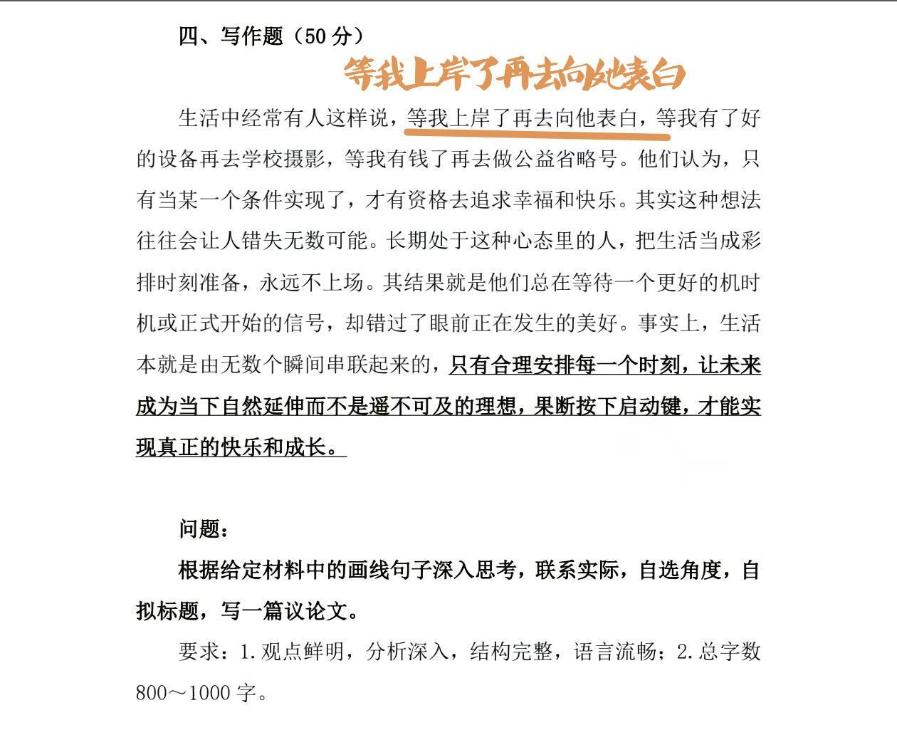
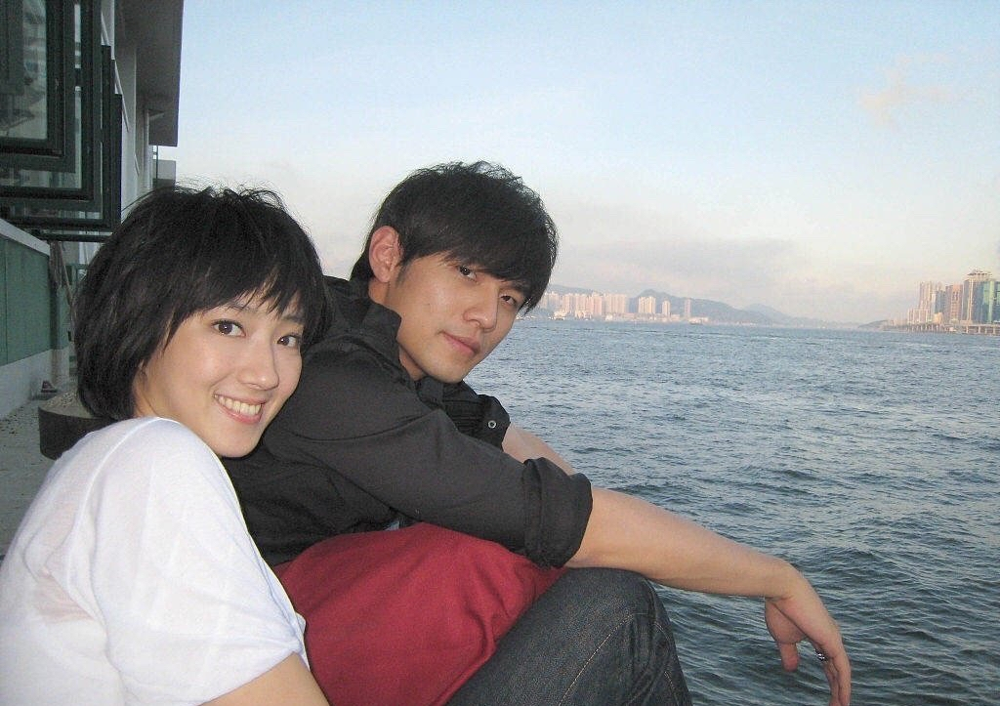
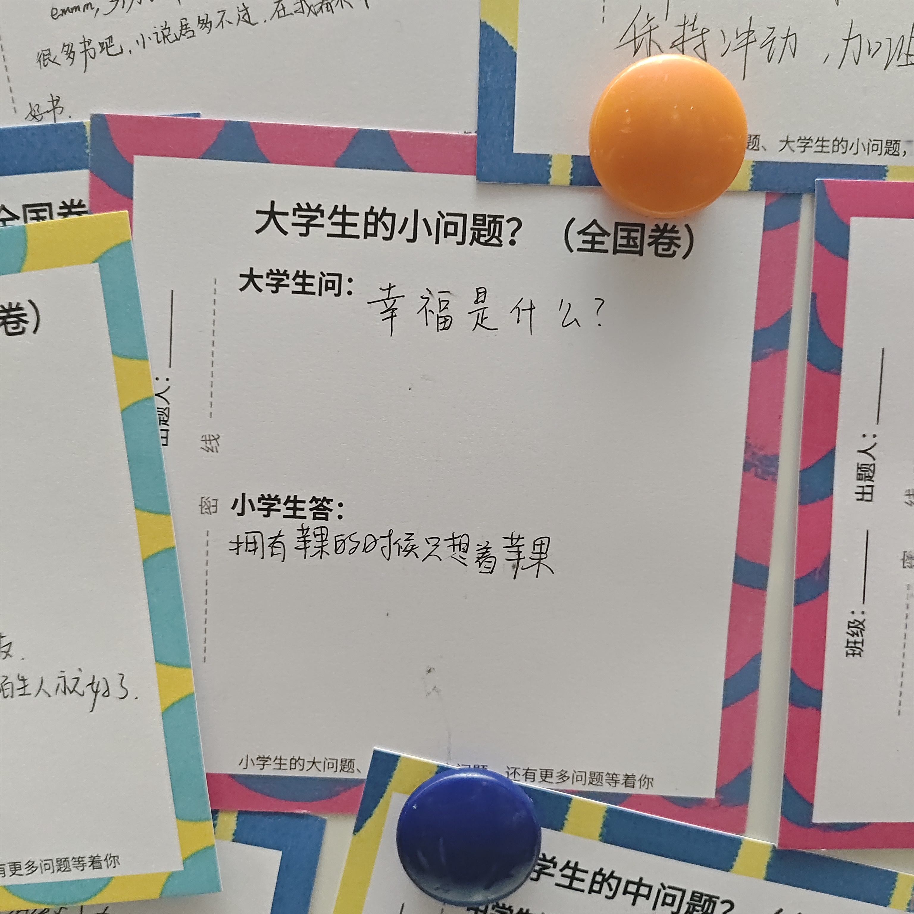
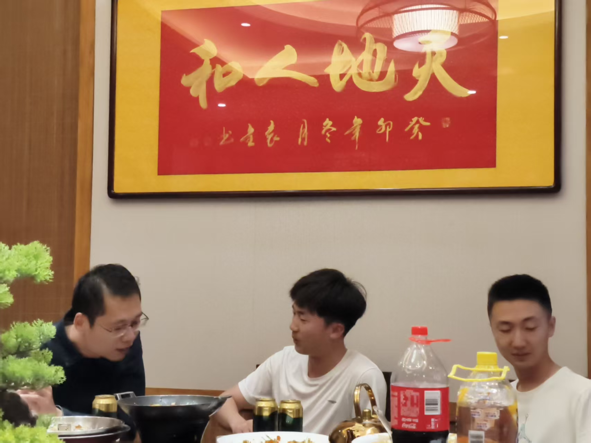
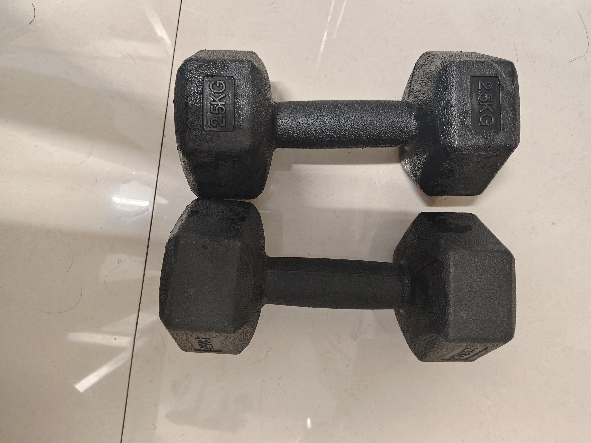
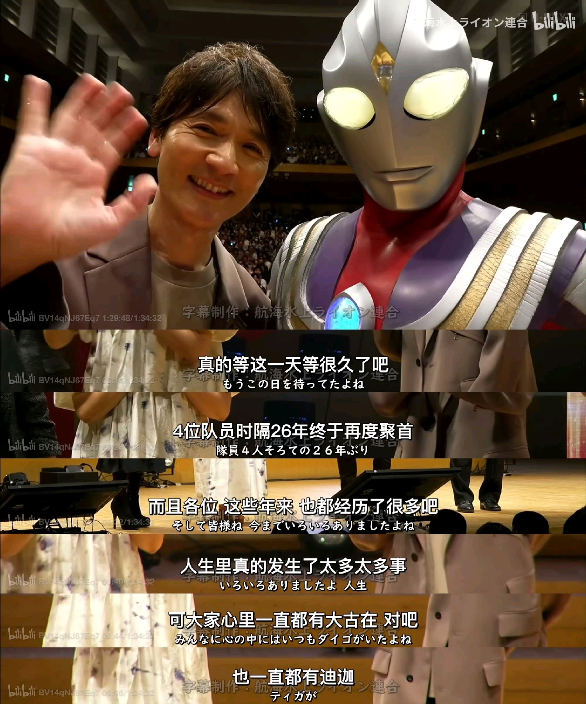
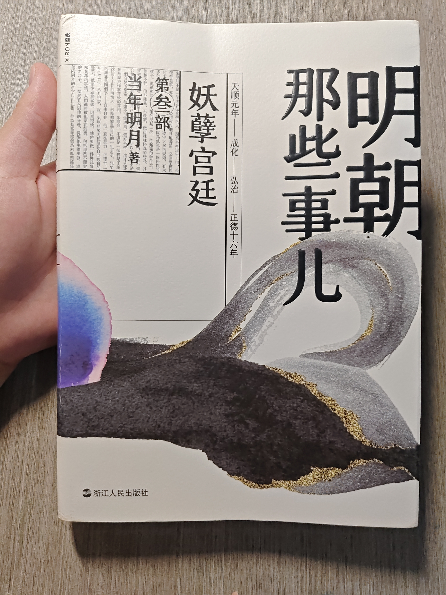

---
title: "随笔-2026 年思考汇总"
date: 2026-01-01
description: "随笔"
slug: 2026
tags:
  - 随笔
categories:
  - 随笔
---

---

# 随笔-2026 年思考汇总

## 读短文《阶层复制：一个高校老师看见的精英家庭教育》有感
202601291035
这篇短文底下有很多评论，其实并不是在反驳文章，而是在分享补充一个更残酷的认识：
==阶层真正的力量，不只是资源，而是让人意识不到资源本身的存在==。
有人指出，精英家庭最成功的教育，并不是替孩子铺路，而是让孩子以为这条路本就存在；让他们自然地相信，世界理应回应自己，机会本该向自己敞开。这种“配得感”，比金钱更早进入身体，也更难被后来者习得。**而普通人的困境，恰恰相反**。他们的人生往往是一条不能出错的单行线：专业要选稳妥的，工作要选能养活自己的，兴趣和理想必须服从风险评估。不是不想试，而是试错的代价太高——一旦失败，没有兜底，没有重来，只能自我消化。于是谨慎被误解为保守，焦虑被误解为能力不足，但这其实是一种理性的生存策略。
也有人试图拉回希望，提醒“人生很长，终会均值回归”。确实，个体命运并非完全被出身封死，总有人逆流而上，甚至后来居上。但这种反例本身，恰恰说明它的稀缺。它需要的不只是努力，还需要时代窗口、个人韧性、偶然机遇的叠加。把少数幸存者当作普遍路径，本身也是另一种精英叙事。
评论里反复出现的愤怒，并非源自嫉妒，而是来自==被优绩主义羞辱的体验==。当成功被简化为“你不够努力”，结构性的差距就被抹去，失败者不仅要承受结果，还要承担道德指控。于是精英可以心安理得地把一切归因于自己，而普通人只能在一次次比较中怀疑自身价值。
也有人选择抽身，不再执着于阶层叙事本身。他们说，年龄增长之后，会逐渐意识到：世界足够大，人生并不只有一条成功模板。与其用别人的起点折磨自己，不如重新定义“过得好”的含义。这并非逃避现实，而是一种对自我主体性的回收。
最令人警醒的，其实是那些看似冷静的声音：他们指出，这一切并非阴谋，而是长期运行的结果——资源会向资源聚集，认知会向认知靠拢，教育只是这套系统最温和、也最有效的再生产工具。理解这一点，不是为了绝望，而是为了不再误把结构当成个人。
当这些声音汇聚在一起时，你会发现，讨论早已超越“精英是否努力”这种浅层问题。真正被反复触碰的，是一个更根本的命题：
**==在一个起点严重不均的世界里，我们究竟该如何理解努力、失败与自我价值==。**
这本书读起来一直让我有种如鲠在喉的感觉，问题倒不完全在于它说错了什么，而在于它默认了一套我并不完全认同的价值判断。书中似乎很自然地把分数带来的校园优势，当成一种值得肯定的能力和正当性，把挑战老师、凌驾规则视为“优秀”，再顺势将这种学生时期被制度偏爱的体验，延伸为未来社会竞争中的资本。这种逻辑在学校里或许说得通，但一旦跳出校园，我始终对它是否成立心存疑问。
更让我困惑的是，这套判断建立在非常有限的样本之上。仅凭二十余人的田野材料，便概括出“==学神—学霸—学渣—学弱==”的结构，并据此推演出一整套精英逻辑，难免显得有些仓促。书中反复描绘的分数等级、标签化话语和由此产生的师生互动，其实并不只存在于所谓的北京精英教育现场，而是全国高中普遍存在的一种做题秩序。如果这些现象本身并不特殊，那么它们究竟在多大程度上能够支撑“精英教育”的结论，我是存疑的。
读到后面，我逐渐感觉这本书更像是在用既有理论反复印证一个预设结论：社会是不平等的，学校是精英化的，北京学生尤其内卷。但真正让我期待被展开的部分——比如学生和家庭如何理解自身处境、如何想象未来、是否拥有承担失败的空间——却被轻轻带过。书中被不断强调的“学神”，在我看来也未必是真正意义上的学神，更像是作者理解中的一类精英特权形象。
我并不否认这个议题本身的重要性，恰恰相反，我觉得它非常值得被认真讨论。只是至少就这本书而言，它给我的感觉更像是“==拿着锤子找钉子==”：问题被提前设定，材料被用来反复佐证，而不是在研究过程中真正被问题牵着走。此外作者思想源自书籍《学神：中国精英教育现场一手观察》，也许这本书可以和《我的二本学生》《读书的料》《文凭社会》《金榜题名之后》《寒门子弟上大学》《特权》《音乐神童加工厂》《美国的职业结构》以及==布尔迪厄==的系列著作对照来看？反而更容易懂到这一问题的复杂性。
后续继续思考这个有价值的问题

## 再看电影《燃烧烈爱》有感

2025‎04‎‎18‎‏‎1938 第一次观看原版电影
202602071441 第二次观看微信视频号解说
> 日韩部分电影比如《燃烧烈爱》，带着一股压抑迷茫麻木的精神变态感。就像村上春树著作《挪威的森林》，渡边淳一著作《失乐园》《北海道物语》《红城堡》。

日韩的一些作品里，那种精神状态并不是靠情绪宣泄完成的，而是靠持续的空白与迟钝慢慢逼出来的。比如《燃烧烈爱》里，钟秀几乎没有明确的欲望。他爱、愤怒、怀疑，却始终无法确认任何一件事是否真实存在——本是否真的焚烧温室大棚？惠美是否真的被杀害，祭祀，消失？他像是被困在一个永远无法对焦的现实里，所有暴力都不是爆发出来的，而是在迟疑中被一点点拖向极端。那种感觉更像精神被慢慢掐紧，而不是被击中。
村上春树《挪威的森林》里的渡边彻也是如此。他始终在“正常生活”的表面行走：上课、恋爱、聊天、听音乐。可直子与木月的死亡像一块始终无法消化的异物，让他的情感逐渐脱水。他并不歇斯底里，甚至显得温和、克制、礼貌，但正是这种过度正常，让整个世界显得异常空洞。生与死、爱与失去，在他那里没有转折，只有持续下沉。
在渡边淳一的《失乐园》中，久木祥一郎与松原凛子并不是被激情推向毁灭，而是在长期被日常生活磨损之后，逐步走到绝境。婚姻、工作、身份都仍在运转，但内在早已塌陷。他们的殉情并非出于无法生存，而是继续活着，已再也感受不到任何“正在活着”的证据。《北海道物语》中，这种裂缝出现得更早。塔野的生活同样稳定、体面，却在北海道的空旷与孤独中，与绘梨子靠近。这不是燃烧，而是消解：在漫长的雪夜与静止的风景里，情感被拉长、稀释，生命的触感变得既清晰又遥远。而《红城堡》里，崩塌几乎发生在意识层面。克彦试图用一套理性而荒谬的计划挽救婚姻，却发现真正失效的并非欲望，而是情感本身。自卑、期待与幻觉在长期压抑中堆积，最终让人连面对真实感受的能力都一并丧失。把这些作品放在一起看，会发现渡边淳一写的并不是瞬间爆发的激情，而是一种缓慢的内在耗竭：情感冻结，欲望延迟，连痛苦本身也逐渐失去重量。毁灭并非降临，而是一步步完成。
这些作品里的“精神变态感”，并不来自疯狂，而来自无法逃离的清醒。他们看得太清楚，却又无力改变；继续生活，只是惯性；停止生活，反而成了一种主动选择。那是一种非常东亚式的绝望：没有巨大的反抗，也没有彻底的崩溃，只有在秩序之内，被一点点耗空的自我。

## 除夕送亮有感

202602162312
送亮是指一个家族的同胞集合成一个大家庭，准备好蜡烛、香火、纸钱、鞭炮，装叠在一起，然后结伴向**大龟山文化遗址**（其实就是许多小墓堆积起来的坟山）进发。一群人走向一片片墓地，来到自家先人的墓前，然后领头的郑重其事点燃蜡烛，插在墓碑前，又点燃香火，插在墓前的土里，接着燃了纸钱，在旁“噼里啪啦”的鞭炮声中，大人拉着孩子，一一在墓前磕头。最后，又默默地离开，走向另一处墓地。
今天在我祭拜先人中，有一位是我父亲的奶奶，按辈分算是我的太奶奶。按照如今后辈们的回忆，太奶奶原来是大地主家的女儿，正值打土豪分土地的土改时期，然后嫁给了我的太爷爷，生下了六姊妹。
三男三女。已逝世的鲇鱼须镇女儿是老大，2000 年 5 月去世的爷爷是老二，许超叔叔的父亲是老三，现如今居住武汉的女儿是老四妹珍，现如今居住岳阳的六旬爷爷是老五碧缘[另外他有一个比我还小的女儿，也就是大概 15 岁（2025 年进高中） 2010 年左右的许夏芹，名义上是我姑姑]，现如今居住禹山镇南山乡的老奶奶是老六妹珍）。
时光荏苒，1993 年太爷爷（72 岁）去世，2017 年 5 月太奶奶（91 岁）去世。这中间的 24 年时光里，2011 年，太奶奶不知为何患上了老年痴呆症[阿尔茨海默病]，从给子女打杂帮工的母亲变成了痴呆症患者，逐渐受子女嫌弃，老年痴呆乱拉大便浑身臭气熏天，白天睡觉晚上敲打物体干扰正常人睡觉。两个儿子每人 5 个月，三个女+一个孙子[爷爷的义务传递给父亲]每个人 15 天，这样太奶奶剩下的六年时光被她的六个子女所承担赡养。最终太奶奶于 2017 年 5 月摔倒之后引发各种问题，以 91 岁高龄并不安然的逝世。
为什么说并不安然呢？太奶奶在太爷爷去世（1993 年）之后，去大女儿家帮忙看管旅社开设饭馆，照看大女儿家庭小孩，大概持续 10 多年。然后大概在 2006 年还是 2007 年去岳阳小儿子老五家住，然后去二儿子老三住，渐渐的 2010 年左右的两年时光里，太奶奶进入老年痴呆前兆阶段，在太奶奶生命最后的 6-7 年时光里，进入老年痴呆症。此时，太奶奶的子女都已处于 50-60 岁，大多已经进入半退休状态，子女或已经成家立业，子女自身的财政大权和话语权已经移交给下一代了。这时候的太奶奶就像路边的狗尾巴草，遭子女嫌弃，太奶奶的抚养义务屡次被反复踢皮球。子女和孙子女的各种嫌弃是随着太奶奶的衰老而愈发严重的，甚至可能存在子女以太奶奶老年痴呆为借口当着太奶奶的面谈论各种关于她的不利索以及她的后事。仿佛她的子女作为一股血吸虫在榨干剥削太奶奶的最后一股价值之后，无所顾忌的嫌弃太奶奶。写到这里，我想起来我的外公。2022 年 7 月，外公癌症晚期，最后在打吗啡都无效的情况下去世，其实这个癌症大概就持续了两到三年，病情如此严重有部分原因是外公不愿意化疗。在外公最后的日子里，病床前的后辈各种嬉笑玩闹，子女更是当着癌症晚期无法顺利进食的外公商讨棺材寿衣这种后事，根据外公的木讷精神与反应，可能病痛和子女的无法共情彻底剥夺了他的最后一丝尊严，显然，久病床前无孝子。
但事实上，在太奶奶生命最后的 6-7 年老年痴呆的时光里，甚至在太爷爷 （1993 年）去世之后，她的子女就在尽量的赡养太奶奶，虽然存在被反复踢皮球的情况，但是事实就是还是由子女赡养。外公在患病的那段日子里，大概一年多的时间里，舅舅一家费心费力照顾外公和招待上门看望的客人。
只能说，久病床前无孝子，久贫家中无贤妻。后面这句话以后有机会我再思考讨论。

## 看《红星照耀中国》有感
202602262241
你现在有机会到前线去，你却不知道该不该要这个机会?可不要犯这样的错误!蒋介石企图消灭我们已有十年了，这次他也不会成功的。你没有看到真正的红军就回去，那可不行!
这段文字让我联想到电影《飞驰人生 2》里边张弛的一句台词：我努力过无数次了，但我知道，机会只会出现在这其中的这一两次。另外还有ShowMaker说的：如今奖杯就在眼前，我必须考虑这会不会是我此生仅有的机会。
抓住机会，义不容辞!
目前我读到《红星照耀中国》第八篇《同红军在一起》。这一篇部分记叙斯诺对彭德怀的访问，以及他对红军的整体认识。作者从彭德怀的童年经历写起，借此探讨红军如何成长、又为何能够成长。这是一场极为有趣且富有启发性的谈话。
本书主要介绍了毛主席在陕北根据地（1936 年，陕西保安）时期的革命实践。与此同时，张国焘领导的鄂豫皖苏区在土地革命时期（1927-1937年）同样具有重要影响，只是在后来的历史叙述中相对着墨较少。

## 午夜追忆出的一点思考
202603150946
本科时期的竞争主义也就是所谓的优绩主义回马枪打到现在的我头上了。本科时期，我不会主动告知甚至隐瞒一些细节（因为我认为这些信息差可以帮助我获得一些我认为重要的事情，比如说资源分配）。现在对于一些实验细节，师兄也不会主动告知甚至隐瞒一些细节，只是会说多看文献隐晦的提醒几句。之前我认为一个平台是主要靠老师，现在我觉得应该是依靠平台招到好学生（又有想法，又勤快（自驱），又能高效实践），然后形成一个正反馈。
也不是刻意隐瞒吧，至少不会轻易告知。就拿抄作业来说：一方面我认为这是我辛勤脑力劳动的结果，另一方面我给你抄出事了咋整？而且自己碰灰的可能性更高：有种道不轻传，法不轻出，我很认真给别人说，别人认为这是狗屎，换过来我也是这种对别人。
而且我本科的时候就隐隐约约感受到：1.资源有限，饼就这么大。2.你是一坨狗屎。3.你的自身价值比较低。

## 看电视剧《返校》有感
202603200157
原来真正的自由，不在外在的环境，而在我内心的平静。任他强权如何横暴，都无法掠夺打压。愿早一日，只有如雨，遍撒这片岛屿。方芮欣。
202603201306
首先叠甲强调保护：《返校》于 2017 年由开发商台湾省赤烛游戏发布，2019 年作品《还愿》涉及政治问题因此连带下架开发商所有作品（包括《返校》））。开发商团队屁股歪，有问题，这是不可回避的事实。
本科二年级 2023 年某天中午，无意中下载游戏《Detention》，然后我傻傻的按照游戏宝攻略一步一步游玩整个游戏，现在依然记得游戏结语是白水仙染上一河鲜血，只能如铁锈般凋零，那时我大概理解这游戏背景是台湾省白色恐怖时期。在大四年级，我观看电影版《Detention》，女主角王净是演过《周处除三害》程小美，电影版和游戏本体内容差不多，我也是囫囵吞枣似的过了一遍。昨天晚上我花了大概 5 个小时，看完电视剧改版《Detention》。
文化工作者终究要讲文化素养。作品主线我不再赘述，电视剧中张明辉不断表达：真正的自由，不在外在的环境，而在我内心的平静。任他强权如何横暴，都无法掠夺打压。愿早一日，自由如雨，遍撒这片岛屿。但联系剧中一些细节让我感到不适：剧中张明辉在诗社提到全国诗作大赛时，手中海报写的是“台湾省全国青年文学比赛”，这种表述显得相当突兀。类似问题在讨论区（如知乎）也有人指出：这类作品在叙事上往往打着“自由”的旗号，用当下视角去放大特殊历史时期的问题。
“白色恐怖”是指在 1949 年到 1987 年期间，台湾境内实行的戒严。在此期间，一切违反规定的行为（听禁歌，看禁书，讨论政治，只要是被认为是违纪行为……），都将得到严惩，惩戒力度视违反规定的严重情况而定，最高死刑。在长达 38 年的“白色恐怖”时期里，累计无辜受害者高达 14 万人，意味着每 40 个人中就会有一个人成为被害者。“白色恐怖”期间，人们被迫成为人肉监视器，不敢有一刻的松懈，理想和自由则是最为禁忌的话题。如果无法想象那个环境有多压抑和残酷，那就联想一下你军训时的压迫感和对教官的“绝对服从”，而身处“白色恐怖时期”的人们是没有中场休息和军训结束这些指望的。
从创作角度讲，一部游戏或影视作品需要冲突、需要传播、也需要市场，这本身可以理解。但问题在于，有人借此进行立场输出，甚至将其当做党政和 TD 的武器，这就令人反感了。创作者如果本身立身不正，那么即便作品在形式上再精致，也难掩其内在问题。至于演员，在我看来很多人未必清楚背后的复杂情况，只是在花絮中不断感慨时代的一粒沙，落在人身上就是一座山。。
最后表达一个愿望：希望台湾问题能够早日得到解决，让那些在阴暗处进行操弄的人无所遁形，终将消散。

## 路上奔跑的皮蛋小王
202603211946
小王曾经是个大胖墩。
开学第一天下午，打开 329 宿舍门，一个黝黑的大胖墩正坐在 3 号桌前玩《QQ 飞车》，给我打了个招呼。害羞怪有礼貌是他给我的第一印象，183 大高个和 200+斤体重是第二印象。特别是军训完之后，大家都是黝黑黝黑的，小王又挺着小肚腩顶着飞机头，直接变成大号黑皮蛋。小王皮肤黑黑的，却写得一手好字，宿舍墙上贴着小王高中写的便签：考上大学了吗，按时吃饭了吗，新闻联播大结局了吗，以及你快乐吗？
大一上学期黑皮蛋小王开始跑步了。
事实上这件事过了大概半年我才搞明白：小王总是在下午 16-18 这个区间消失不见，晚上 19 点左右宿舍刷新一个臭哄哄黏糊糊的黑皮体育生，有时这个体育生穿着短裤趴在拥挤寝室中瑜伽垫上乱叫。哦，寝室那两张瑜伽垫还是我和另外一个舍友购买，体育生只不过有 24 小时使用权。宿舍墙上贴着除开小王高中写的便签，还多了一张动漫《强风吹拂》海报，跑步醒目写着：只要努力就一定能成功，其实是一种傲慢。闲暇之余小王在宿舍里追剧，耳机里一定放着《强风吹拂》ED《リセット》，开始真正理解：奔跑的时候，离目标会更近。大一和大三学年，学校必修学分体育课有个奇怪任务，每学期使用宥马运动[同学一般亲切得叫牛马运动]跑满 72 次 3 公里，否则体育课最高 59 分。叫声义父，小王就会带上我的 iQOONeo 5 活力版进行跑步运动：小王的运动量是大于软件运动要求 3 公里量。有次小王回来得比较晚，我手机的钢化膜碎了，小王用充满歉意话术给我说他跑步的时候给我手机跑飞了。由此可见小王日常运动量应该至少大于 3 公里，黑皮蛋小王也在运动中蜕变成黑小王，皮蛋二字已成为来时路上微不足道的中间态。一天有 24 小时，8 小时睡觉，8 小时上课（存疑），只有 8 小时是自由支配的。小王的自由支配时间除开跑步，还有部分是拿来打游戏的。除开上文说的《QQ 飞车》，小王被人拉入坑《原神》。其次就是《王者荣耀》，有晚小王打巅峰赛一晚掉了 200 分，气得小王开始引吭高歌问候队友亲戚父母。小王玩得一手司马懿出神入化，把把评分 16.0，因此一有机会我会恳求小王带我上分，小王被我的人机操作搞得不知所措，因此经常卖队友自己逃命。
大一下学期小王开始谈恋爱了。
事实上这件事过了大概半周我才搞明白：小王总是在晚上跑步洗澡之后不见，然后半夜才回来，有时候还对着手机傻笑，小王学会烫头发打理自身形象[虽然跑步后洗澡前依然穿着短裤趴在拥挤寝室中瑜伽垫上乱叫]，开始和女生发 QQ 空间分享他认为开心的事情，社交媒体账户会换上情侣头像。情不知所起，一往而深。不久上课的时候我会发现小王旁边坐着个可爱女孩子，于是我少了个吃饭搭子上课搭子[睡觉搭子倒是没少]，然后从此形单影只。其实细细分析来，小王在实验课上就和女孩子有勾勾搭搭嫌疑，只不过以为小王比较热心，除了帮我做实验还帮女孩子做实验。相比传说中喜欢煲电话谈恋爱舍友，小王也在宿舍煲电话，但是他和对象说话的时候声音柔柔弱弱低声细语，我都不知道他在干嘛，实在需要大声聊天的时候，小王会默默走到阳台关上窗户沟通。有时候我亲自跑 KEEP 体育锻炼，路上会碰见小王和那个女生挽着小手，甜甜蜜蜜偷偷摸摸你侬我侬光明正大，随机刷新在泰丰大街 168 号仁爱信义苑的各个食堂街边或者操场。撞见这种甜蜜时刻，我一般都很喜欢叫一声王哥，然后慢悠悠跑开，小王会装比似的不理我。印象最深的是小王的生日礼物，那是个充满爱意印着 HelloKitty 的粉红色篮球以及一个装满纸折蓝色五角星的玻璃瓶。小王初高中就喜欢打篮球，只不过大学可能更喜欢挥洒汗水在操场上看黑丝。
大三下学期小王开始考研了。
印象最深刻的是在大三下暑假里，有个叫张张包女孩子和我们一块打王者。大概 9 点小王从寝室出发，待到下午 17 点左右，小王先回寝室换装备跑步，洗澡干饭也就 19 点左右，然后我们四个人开黑打王者，打到昏天黑地，最后快 24 点依依不舍的下线睡觉。
大四学期小王不知道在干啥。
另外，什么时候小王能驮着我跑步？
## 我的恋爱择偶价值观
202603221049
假设和女朋友吃大排档，邻桌 6 个光着膀子的青年肌肉流氓，莫名其妙高喊这女人一千一天寻畔滋事，怎么办？
看到这个知乎问题，我现在就立马想起高中时期，有个很经典的画面：高二时期我有一个人高马大有点蛮狠不讲理的同学 sc，有次课间休息我在课桌上玩朋友 xx 的手指滑板，结果 sc 看见感兴趣就说想玩，我没玩够不太愿意，结果他就强行抢走了然后说你能怎么办？这位同学仗着自己母亲是本校高中政治老师，有次还差点和班主任发生冲突。我能怎么办，就尴尬的笑了笑，我一个农村背景的小个子当然干不过一个县城教师子女，只能发起言论抗议。结局就是同学 sc 觉得挺无聊的，废话，手指滑板当然无聊，然后还给了我。这个时间段我的手段只能是，祈求别人的宽容大量甚至是平等对待。然后我联想到要是自己的女朋友被这样抢走调戏会咋样？虽说不能物化女性，但是男女之间还是多少有体格差异。
话说回来，这个知乎问题是一个非常精密伪装的**恋爱择偶题**。这道题会让男生陷入焦虑和无措的最关键节点，根本就不是还不够强大的自己、或者无耻的对手、不是自己是否挨揍、是否害怕冲突、是否显得懦弱。而是：我需要考虑我女朋友对我的看法；我需要考虑我的决策是否会得到她的认同。我怕我的理智会被她当做胆小怕事，我怕我的勇敢会被她视为匹夫之勇。我怕我用绝对的理性和阅历去远离垃圾人后，她嫌我怂。我怕我冲冠一怒又为她奋不顾身后，她嫌我莽。可能我理智的拉着她买单走人，第二天她的闺蜜都传遍了我是个缩头乌龟可能我勇敢的 1 v 6 浴血奋战，进完医院进局子，也只能换来她不屑的嗤之以鼻，多年以后早已嫁为人妇的她提起我只会说“那个小丑”。这道题的游戏机制就是这样：最勇敢的那个选项，在客观上绑定着流血挨揍和违法；最理智的那个选项，在情绪上暗示着妥协退让和窝囊。
我的答案是毫不犹豫带着女生走，女生不走我也走。毕竟君子不立危墙之下。

## 对时代割裂的一点感想 1
202603240003
我一向认为自己是个年轻，十分进步，容易接受新鲜事物的思想先进积极分子，左派，非君子也不是小人。
直到昨天晚上 23 点左右，我刷抖音看卡尔的考研成绩，他考研五战，被网友戏称为研王爷。然后我刷到卡尔发的直播录屏切片：卡尔强调 211 是 21 世纪全国 100 所重点大学，是香饽饽。下面评论区有个强调自己是直播录屏人，我点进去然后看到是一位吉大 20 本，中科大 24 硕的女主播，截止目前大概 2.0 万粉丝。接着我按照最热视频排序依次观看：热度第一高的视频是讲研究生脱发假发，有 2.6 w 点赞 1051 条评论 1098 收藏 5815 转发，有点脱发反差比较正常；第二高的视频是讲通过饱和式简历投递持续 7 个月获得实习 offer，有 1.9 w 点赞 1345 条评论 2372 收藏 1.8 w 转发，但问题是她穿个大眼眶 V 领毛衣，胸直接托在桌子上。我啥都没看进去，注意力全在她的 D 罩杯上。对，我承认，就是最原始的那种性吸引。
接着我刷到她 2025 年 8 月直播赚了 ¥9110，emmm，我脑子里开始串线了，本科同学张莉长得也漂亮，我记得她有想法直播赚钱？女性是不是早就意识到，可以利用身材、容貌、性别优势进行某种“利益转移”？这种东西，在市场逻辑里是不是天然合理？再往下想，国家也不可能明面禁止这种东西，毕竟这就是流量经济的一部分，就像古代卖艺。想到这，我有点卡住了。一边觉得这套逻辑挺“市场化、挺真实”，一边又隐约觉得哪里不太对。emmm，女性应该早就意识到可以利用身材容貌性别优势进行利益转移，至少我认为这个社会目前是有这种价值观的引导，也就是说，按照市场经济与计划经济理论来说，目前国家不会明面上禁止这种与主流价值观相违背的市场经济下的主播经济，就像古时候卖艺的艺术家。这里举例一个类似的 B站 UP 主是小冰心啊，华理法学本科。
吉大本科中科大硕士擦边卖软色情，我靠赚的还不少，但是举个正面例子，B 站 up 主鱼子鱼 yzy 就没有通过卖软色情啊。另外可以说一句，这种乳腺胸确实引起我的性欲，确实有色欲感，确实有女人味，确实有卖点，确实勾起人最原始的性欲。
emmm，大晚上我的思绪不太连贯，算了先睡了。
## 对时代割裂的一点感想 2
202603242015
暂别凌晨的乳腺胸，我们先把目光转向专业学科上面。我记得我 21 年高考那年填报志愿的时候计科相当火热，大家都在无脑投计算机；23 年左右师范生更是火热，分数线水涨床高；25 年电气机械火热，临床开始衰弱式微；土木金融专业 在 2019 年之前居高不下。有人常说可惜在最该摇花手的年纪选择了读书，有时我在想父母在 90 年代为什么不下海经商，这样我就可以爽做亿万富翁之子。可能以后，这时我的孩子应该在问为什么我的父母没在人工智能如火如茶的时候入围一波大模型？
大概 2022 年年底 ChatGpt 3.5 震惊全球，接着 2023 年 3 月 ChatGpt 4.0 惊艳世界，2024 年 2 月 Sora 首次公布，2025 年 1 月 DeepSeek R1 火遍全球，同年 3 月通用 AI Agent 热度上升 Manus 爆火，2026 年 2 月通用 AI Agent 继续发力 OpenClaw 爆火。现在开始传出前端后端全栈工程师被通用 AI Agent 顶替，就像当年马夫被汽车司机顶替那种突然。某一瞬间我突然意识到我正在经历时代变革，我想起来当年挥洒在语文试卷背面那面作文中写的：==时代的车轮滚滚向前，任何试图停留在原地的人，终将被历史洪流所淘汰；时刻拥抱社会的新变化，每一次社会新变革，就是一次财富重新分配的机会；滚滚历史长河向前奔腾，浪潮席卷之下，被改变的从来不是时代本身，而是一个个来不及准备的普通人==。这些假大空喊口号的句子，这些我嗤之以鼻不屑一顾认为是大人骗小孩的谆谆教诲，终究像回马枪似的刺中我。我想说什么呢？其实我更想说作为一个默默无闻的小人物，仰视历史洪流滚滚向前气势汹汹不可阻挡顺者昌逆者亡，更是历史洪流记录者参与者见证者。2019 年新冠病毒席卷全球，2022 年江主席逝世，接着人工智能持续发力，2025 年底 2026 年初国际金价持续飙升达到前所未有的 5596.33 美元/盎司，然后现在轰轰烈烈如火如茶的人工智能大革命 OpenClaw 养龙虾开始了。
有时候我在想啊，我是不是读书读傻了？一直在获取已有的有标准答案的输入输出进行学习训练，所以我才是历史洪流记录者参与者见证者。所以，很多时候你的一个小抉择影响你一段时间的气运，但话说回来，你是人生的创造者而不是记录者。不要这么小气，有些时候，塞翁失马，焉知非福。
另外，今天晚上张雪峰因心源性猝死逝世。他曾在 2016 年 6 月凭借《七分钟解读 34 所 985 高校》走红网络。这个视频还是我一个曾经高中好友给我推荐一起看的，如今已过去快五六年，物是人非，欲言又止。

## 近期关于我的认知一点改变
202603302346

这是 26 全国事业编联考 b 类大作文题目，其中有写到：生活中经常有人这样说，等我上岸了再去向他表白，等我有了好的设备再去学校摄影，等我有钱了再去做公益......
初中时期，我想等我成绩优异，也就是考上县城一中，我就给喜欢的女生表白；高中时期，我也是想等我成绩优异，考到全班前 10 名考上好大学等出高考成绩就给喜欢的妹子表白；本科时期，按照我原本的规划，我本来是准备在大学毕业的时候给她表白。其实我之前也一直赞同这种观念：只有当某一个条件实现了，才有资格去追求幸福和快乐。其实这种想法往往会让人错失无数可能。==长期处于这种心态里的人，把生活当成彩排时刻准备，永远不上场==。其结果就是我总在等待一个更好的机时机或正式开始的信号，却错过了眼前正在发生的美好。
有时我在想，我是不是妥协了？我认为延迟满足是成功的关键，越是层次低的人越追求当下满足。我一直以来引以为傲的延迟满足，在个人规划方面确实有起到一定的正面作用，但在感情这方面的应用真的是一败涂地。
我有点无语的地方是，当我笨拙的想要打开恋爱的大门时，你会发现周围已经没有人会纯粹的爱别人了，而且我也不再会纯粹的爱一个人了。好不容易熬到了父母不管可以恋爱自由的时候，你会意识到发现我曾经喜欢过的人好像心里都装过别人，会觉得好可惜啊，这一点其实还行，因为我的心里也装过别人。虽然我根本没有拥有过谁谁的青春，我更不是谁谁刻骨铭心的常青树，或许我只是一段路，因为我不介意我自己是一段路，路可以很宽敞 、可以晚上亮着满路的灯、也可以是长满鲜花的路；路也可以很长，一眼望不到尽头，也可以让自己毫无顾虑地一直走下去。
我一直坚定的选择自己，我初中高中时期就十分认同韩立的那套大道无情唯有一心向道之心，一直记得墨大夫给韩立的信：韩立吾徒，如果你能读到此信，说明我已经死了.....韩立，墨某一生行事从不向人解释，成王败寇自有天定，然而我妻女与此事无关，相信你能做出自己的判断。 人生苦短，终归尘土，凭什么仙家就可以遨游天地，而我等凡人只能做这井底之蛙。 韩立，这世间多少好景色，你就代为师去看看吧...
话又说回来，韩立一心追求修仙大道所谓的长生，仅仅是手段，从来没有人为了长生而长生。从古到今，古今中外，都没有。古代帝王是为了享受权力，现在资本家是为了资本的增值，各种影视动画里面的普通人，有的是为了爱人，有的是为了亲人，但是从没见过哪个小说或者电影动画为了长生而长生。因此总有一个锚定物。而韩立他修仙的目的就是追求这个世界的认知，随着他不断升界，认知不断扩大，他就不断精进，到最后在他的世界观里已经没有追求了，看尽了墨老所谓的风景才罢手。
但事实上，现实世界可能真的不能这样做。生活本就是由无数个瞬间串联起来的，只有合理安排每一个时刻，让未来成为当下自然延伸而不是遥不可及的理想，果断按下启动键，才能实现真正的快乐和成长。我想，可能我已经向生活妥协，和青春告别了。
所以，现在我对待课题实验，我不再精心准备各种细节之后（虽然还是有后遗症）再开始干活，而是大致的想一想定一个方向然后勇敢的开始实验。虽然我现在很难分清勇敢和鲁莽之间的区别，但堂吉诃德曾说过：我知道鲁莽和怯懦都是过失；勇敢的美德是这两个极端的折中。我宁愿鲁莽，也不要怯懦，因为鲁莽比怯懦更接近勇敢。我开始相信鲁莽比怯懦更接近勇敢。
此外，工具理性（效率、规划）不等于生命价值（体验、情感）。
最后以叶湘伦和路小雨合照结尾。


## 阶段性思考
202604201409
当我坐在天津大学北洋园校区 44 教 B 311 听王志老师讲授《膜科学与技术》努森扩散模型和溶解扩散模型时，我突然想出大二学期末思考出那个问题的答案。
那是 2023 年暑假，我正拿下化工实验国一和化工设计国二，这两个比赛稳稳提高我推免院校上限，我的高兴洋溢在脸上。其实那个时候我就认为我有个大问题大忧虑，我认为这些表现反而证明我有点问题，具体是什么问题我又说不出来一个所以然，而 2024 年春节过后前五学期学分绩点出来之后更加证明我的思考忧虑是对的。其实这个问题很容易描述：我没有培养一个完成具体项目的能力，或者我这个完成项目能力很差。我的专业壁垒不够高，和他人没有明显差距。或者说我做的各种努力都是敷衍三脚猫，没有属于自己的作品。
大概是 2024 年年底 2025 年年初，我开始认识到数据积累与笔记整理这个问题，于是我开始使用 obsidian，开始有规律思考总结完善我的经历与感想。2024 年年底和 2025 年前五个月，我开始花大量时间做实验，其实大部分时间在浪费，但是多少有点实验经验。接下来的半年，我的大部分时间花在上课和出去玩的路线上。2026 年 2 月，我开始进实验室，然后至今依然在犯错误。最近的四月公开组会上面，我又犯了一个大错。其实也没什么，大概就是 mof 膜的气体分离色谱测试上边，出现装置漏气的情景，然后导致数据有误。既然目前我清晰认识到我 2023 至今的最大毛病，我认为我还是已经走在解决问题的路上了。愿硕士毕业之前可以解决这个问题。
另外，我有种追求艺术作品的想法，我觉得得做出点什么，不枉自己在这世上活下来。就行我现在听的《我的秘密》，这是邓紫棋在她 13 岁时作词作曲创作艺术作品。我很羡慕她，她值得我欣赏。周杰伦《不能说的秘密》，羡慕死我了。
“努力需要方向，否则缘木求鱼；人生需要目标，否则掘地寻天。只要找到目标、做好规划，保持努力的情况下，人生会产生巨大的复利效应，超出你我的想象。面对不确认的未来，希望大家能更好地规划未来的学业或工作，减少迷茫和焦虑，活出让自己满意甚至骄傲的人生！”

## 对我本可以的一点思考
202604291609
刷抖音的时候，刷到 2026考研分享[好像没考上][https://www.douyin.com/user/self?from_tab_name=main&modal_id=7612356987996623205&showTab=favorite_collection]，里面有一段文案是这样的：最折磨人的不是失败，是“==本可以==”。本可以再对一道选择题，本可以少刷两天手机，本可以……可这个世界上，本可以是最没用的三个字。
我又回忆起和阿笑的一段对话：阿笑在一次考试中==因为没有复习到关键的练习册内容==，恰好考到原题却无从下笔，让他产生了强烈的挫败感与自责情绪。他将结果归因为自身的“愚笨”和准备不足，进而放大为对自我价值的否定，甚至用“笑话”“废物”等标签评价自己。在与他人的比较中，这种落差被进一步强化——他认为别人付出更少却取得更好结果，自己反而成为“拉分”的那一个，从而陷入对公平与能力的怀疑。同时，这种学业挫败也外溢到对未来与人际关系的悲观判断，例如对恋爱机会、家庭背景差距以及人生走向的消极预期，甚至将自己想象为回到小地方从事重复劳动的“失败者”。
本科时期我也经历过这种阶段：在大学二年级第二学期“毛泽东思想和中国特色社会主义理论体系概论”也就是毛概这门课，尽管我甚至都没看小程序刷题啥的，但是我凭借及其强大的背诵整理能力，实现考试提前交卷，因为我准备充分基本上都背了一遍。但是在今天，也就是硕士一年级第二学期的“工程伦理”这门课上面，我在开卷考试的第三题：
```
《黄河水量调度案例》“同比例丰水量增加枯水量减少”是指在各省市水量的分配额基础上，按照水量多少来确定，丰水年分配额度高，枯水年分配额度低。但不管是丰水年还是枯水年，各省市的分配额度的比例保持不变。考虑到水资源具有随机性的特点，请思考实施该原则可能引发哪些伦理问题？
答：
1、实施该原则可能会引发社会、生态、发展以及经济方面的伦理问题。
2、偏离情况，除河北省分配指标和实际用水量相差不大，其他地区均有不同程度超标，其中陕西和山东超标严重。引发这些的原因与自然气候、地区差异有关，也和政策制度有关，应结合实际情况，在丰水年和枯水年适当调整调水量，使资源合理分配。
3、这种偏离可能引发公众对资源分配合理性产生质疑，同时资源分配会影响地区经济发展，也会引起人们的争议。
```
实事求是的说，我只花了大概半天的复习时间，大概过了一下这个复习资料，考前我更多的是关注PPT资料，结果忘记看这个了，考试的时候蒙圈了，直接胡诌了一大段，唉，大意失荆州，我心里有点挫败感。
尽管情绪一度失控，但我存在一定的自我调节能力：在宣泄之后，我逐渐尝试用“接纳普通”“做好当下能做的事”等方式进行自我安抚，也能理性认识到考试本身的性质与现实限制。
多少心里有点不干以及我本可以的自我折磨，算了，不必事事求全。不要让这种小事情干扰我的美好心情。
行，我一定全力以赴准备明天的英语小测试以及后面的考试，先让我看一集《黑袍纠察队》第五季第五集。

## 小寂寞时的一点思考
 202604301558
有点想无病呻吟，虽然早已规划好五一离校不离津，以及未来的娱乐规划：2026 年 5 月 2-4 日，天津泡泡岛==音乐与艺术节==；2026 年 6 月 19-21 日，青岛 CAISSA“一声有你”==演唱会==；2026 年 7 月 24-26 日，天津 G.E.M.邓紫棋 I AM GLORIA 巡回==演唱会==；
至此，音乐节也可以参加，邓紫棋演唱会也打算去，2 w 毫安充电宝
也买了，毛不易演唱会也去了（虽然是拼盘演唱会）。
等你上了大学你就会发现你的人生突然失去了意义，因为过往的 18 年总有人告诉你要干什么、总有人推着你走，当你突然有了选择的权利时，你已经丧失了选择的能力。但是，人生的每一段时间都会有不同的境遇，总在展望未来的人和一直活在过去的人没有区别，你现在经历的就是最好的，如果你找不到所谓的意义，那就拥抱当下。
但其实这段话有点问题，太过于强调人生的意义。余华有本小说叫《活着》，主人公叫做福贵。在原著里，福贵的一生几乎被命运碾压殆尽：败光家产、父亲气死、儿子有庆被抽血抽死、女儿凤霞难产而亡、老婆家珍病死、女婿二喜被水泥板砸死、最后连小外孙苦根也因为吃豆子撑死。一家人一个接一个地死去，最后只剩下一头老牛陪着他。但福贵还活着，支撑他活着的，不是希望，不是信念，而是“活着”本身。我想说的是，其实人活着的基层意义就是“活着”本身，生理上说就是刻在 DNA 深处的的生存本能，其他任何希望信念只不过是人类社会所赋予的文化。
如果把人生当作一场修行，我想这修行只不过是为了让“活着”这个至始至终的观测到底罢了，就像强化学习是找到一种策略（Policy），让长期累计奖励最大化。而为了实现“活着”这个目标的长期累计奖励最大化，社会文化给出一种答案是修行。而所谓的三观（即人生观，世界观，价值观），不过是人们对待“活着”这个 target 的不同策略，短期长期都有不同的收益，局内人难以分辨孰轻孰重。
攒钱和早睡是底层，关于生存；攒钱改运是因为物质地基决定选择半径，==早睡续命==是因为身体资本是一切账户的余额；读书和自律是中层，关于认知；读书开悟是用他人的经验穿透自己的迷障，**自律破局是用秩序对抗熵增的侵蚀**；行善和独处是高层，关于境界；行善积德是向外释放善意以拓宽能量回路，独处修心是向内凝聚专注以沉淀生命重量；止怒和止怨，是顶层，关于情绪。止怒避祸是切断愤怒引发的连锁崩塌，止怨得福是转化怨气为改变的动力。攒钱与早睡守护现实，读书与自律重塑认知，行善与独处滋养灵魂，止怒与止怨驾驭情绪。最终汇成一句：所谓修行，==就是关键处管住自己==。
每一次选择、每一次偏差，都是对这个“活着”的采样。你以为是在试图最大化回报，其实回报函数本身也在被你悄悄重写。起初它可能很粗糙——名利、分数、他人的认可；后来它开始变得复杂——体验、理解、自洽，甚至是某种难以言说的“清明感”。而所谓修行，大概不是把自己训练成一个完美策略的智能体，而是逐渐意识到：你既是那个在环境中不断试错的“agent”，也是定义奖励的“designer”，甚至还是那个旁观一切波动的“observer”。当你开始察觉这一点时，很多执念会自然松动。失败不再只是负样本，成功也不再是唯一的正反馈。它们更像是轨迹中的点，帮助你看清整个分布。于是，“活着”这件事，不再只是为了抵达某个终点，而更像是在一条无穷延展的曲线上，不断修正方向、更新权重、重构意义。
也许到最后，你会发现，最优策略从来不是某个具体的行动序列，而是一种状态：既参与其中，又不被完全定义。
我写这些可能有点虚无主义，自我否定，但其实我只是想诠释一些现象，让自己的言行不那么矛盾，更加合理。但是不得不承认一件事：活着本身就是唯一底层意义，其他都是社会赋予的文化，而我**隐含地把它当成行动原则**。这是一件很危险的事情，比如：钱是社会构造的，但我不能因此说“不用在乎钱”。同理：意义是构造的，但人依然需要意义来做长期决策（这是不能否认的客观事实）。我可以“说”不在乎他人认可，但我的大脑奖励系统未必同意（多巴胺不会听哲学），我可以说我不喜欢美女，但是我的二弟不会承认。

因此我虽然知道意义是构造的，但在行动层面，先当它是真的来用。我比较偏向“理性自洽过度” ，这也和我这个人比较拧巴有关，哈哈哈。但如果我一直停留在“我知道这是构造的，所以我只是暂时把它当真”的层面，其实还不够。因为这种“半信半疑”的使用方式，会让我陷入一种微妙的悬空状态：**我在执行规则，但内心并不完全认同；我在追求目标，却始终给自己留着退路**。这种状态短期看很理性，长期却会消耗我的意志力，因为每一次行动前，我都要多做一层“值不值得认真”的判断。==可能会出现左脑攻击右脑的情况==。
所以我开始意识到，一个更现实的做法，不是反复提醒自己“这一切都是假的”，而是**在有限范围内，主动选择一种我愿意承担后果的“当真方式”**。换句话说，我既不完全被动接受社会给出的意义，也不彻底拆解一切意义，而是——有意识地“选一套来信”，哪怕我清楚它本质上只是一个模型。就像罗曼·罗兰曾经说过：“世上只有一种英雄主义，就是在认清生活真相之后依然热爱生活。 ”
这有点像我前面提到的强化学习：在某一个阶段，我需要先固定一个相对稳定的 reward function。不是因为它绝对正确，而是因为如果连一个相对稳定的目标都没有，我的策略根本无法收敛。
于是问题就从“意义是不是真的”，转变成了一个更具体的问题：在我当前所处的阶段，哪一套意义结构，最有利于我活成一个未来不太否定自己的样子。
这样一来，我的“拧巴”反而有了另一种解释。它不再只是自我消耗，而更像是一种调参的过程——我能察觉不适，说明系统还在更新；我会怀疑当前路径，说明我没有完全被某一套叙事锁死。
也许到这里，我可以再往前走一步去理解：所谓的“自洽”，并不是找到一个永远正确的终极解释，而是让我在不断变化的环境里，在某一个时间窗口内，尽量让自己的认知、情绪和行为对齐。
因此我不需要永远正确，只需要在此刻，我做出的选择，是我能承担的，也是我愿意承担的。

## 我是一个怎样的人？
202605210123
凌晨一点，写于中国天津市津南区天津大学北洋园格园二斋 寝室1284 号床
05.21 01:23
我是一个怎样的人？
幼儿园，那天雪夜，我记错老师布置的作业（抄写一排变成抄写一页）哭着写完作业。
二年级，因为没有零花钱却又好吃懒做的缘故，五指伸向父亲的钱袋，被发现然后罚跪在街边哭了很久，还是邻居阿姨好心帮我解围。
三年级，上英语课的一天晚上，父亲叫我罚跪只因为我无法背诵英文单词，我哭了很久却什么也不敢做，最后父亲无奈让我睡觉。
五年级，再次因为没有零花钱却又好吃懒做的缘故，我在给父亲数钱的时候夹带私货被父亲发现，父亲给我讲了堆大道理，一夜过后安然无事。
初一，因为奶奶患胆结石住院，陪护期间想到英语好难，曾经一度想要跳楼自杀。
初三，因为太想玩手机然后自己买了台小米 4 躲在厕所玩手机，某天被母亲发现，叫嚣告诉父亲。然后我跑出家门跑去沱江广场蹲了一个下午，接着去了趟同学家，发现母亲在微信群里面询问我去了哪里，回家安然无事。
初中毕业，我和同学在学校门口玩儿滑板，撞到人家，我赶紧赔礼道歉，然后留下父亲电话号码，听着父亲赔礼道歉。回家 diss 我一顿，安然无事。
高二，虚荣心爆棚，骗父母买书➕饭钱攒到 899，买了一双欧文五，然后穿到高中毕业气垫坏了就闲置扔了。
大一，暑假和发小骑自行车 20km，到达湖北荆州桃花山镇，往返 4h，骑到最后小腿抽筋低血糖。父亲教育一顿。
大二，参加比赛，暑假不回家。
大三，参加夏令营准备预推免，经常坐高铁跑路。
大四，前往天津实习，在家一个月。
我是一个什么样的人？qy 说我是一个说断就断说散就散的人，lzj 说我是一个不交心的人，xx 说我是一个傲娇的人，xxz 说我是一个虚伪懦弱的人，txl 说我是个有点帅的人，yzy 说我是一个不珍惜朋友的人，lzh 说我是一个心里想的事全都写在脸上爱和别人较真的人，smy 说我是一个努力优秀的人，czy 说我是一个不懂得珍惜眼前事物的人，sx 说我是一个逃避问题不想解决问题的人，lzl 说我是一个自卑胆小的人。

## 近期小烦恼
202605261851
我原以为保研天大就不会有烦恼了。就能找到一份好工作，就能赚到许多钱。 后来才发现，如果保研天大成为我人生的最高点也许才是最大的烦恼。
其实具体来说，我从大二暑假也就是 2023 年 8 月 3 号化工设计竞赛华中赛区决赛的那天下午开始，我就有点忧虑：我好像并没有那么聪明，反而还有点笨。然后大一上一直维系到大三上学期的绩点第一，被老李一学期干翻，也多少在我意料之中，只是我并不太能接受这个事实。包括后来我 24 年 9 月完成天大专硕推免，我都有一些忧虑：我担心天大是我人生的最高点。我担心保研两个字一直成为我的标签，就像命运勒在我脖根上的麻绳，无法动弹。可能我会安慰自己说：阿伟你要知道，如果天大是你人生的最高点，那么天大对你的意义在于无论以后你过成什么样子，你都会知道你原本就是能登上高峰的人，你之后是选择住在山顶山腰还是山谷又有什么关系，只是你的选择不同而已。
唉，我有时候只是难以接受泯然众人矣。所以大二下开始，我积极探索我可能存在的其他兴趣天赋。包括但不限于那些化工设计竞赛，化工实验大赛，大创，化工过程数字创新竞赛，数学建模竞赛，入党，Coursera，个人博客...我想我可能真没什么天赋。

## 对痛苦脱敏对幸福敏感
202605280942
多少个夜晚，大概 21 点之后，我开始焦虑迷茫。
先说说过往衣食住行基本层次。穿搭方面：衣柜里面我现在有很多件衣服，但我依然不满足于现状。不满足要洗这么多衣服（我会攒着几天的衣服一块洗），不满足不够漂亮（买的时候觉得不错，但是审美不断升级），不满足不够舒服（我逐渐开始追求衣服的材质与舒适度）。饮食方面：我觉得我还是比较实在，虽然天大食堂普遍性比较贵，大多超过 11 块，但是先比外卖还是相对便宜一点。住宿方面：我觉得有点痛苦，我需要个人空间，甚至我做不到独属于自己的自慰时间与空间。出行方面：我在 25 年刚入学的 9 月份就买了一辆立马电动车，然后校内出行基本上都骑上小电驴，校外地铁或者网约车。身体健康方面：我基本保持健康，每周打一次羽毛球，偶尔 3km 耐力跑。
再聊聊当前现状进阶层次。学历：我现在是天津大学化工学院硕士研究生，全国第一的化工专业，仍然在攀比与其他工作的待遇环境差距与分歧。家庭：我有裸身高 173cm，65kg，长得不丑，父母都买了退休金保险，有独立的房子和小轿车，相对稳定的工作（出租车司机大叔和食堂阿姨），有一个妹妹。经济：每个月国家发 500￥，老师发 300￥，以及支付宝基金，一些私活娱乐：节假日旅游，音乐节，演唱会。
最后聊聊未来选择场次。我可能不太适合读研，所以硕士之后进半导体厂或者国央企业。
总的来看，似乎我知道的越多越痛苦？忆往昔，==幼儿园时期==的我，甚至没开智，具体表现就是呆呆的 NPC，没有自己的想法；==小学时期==的我，大概有点自我意识的体现，比如会因为没完成老师布置的作业而痛苦；==初中时期==的我，由于接触了互联网（甚至在 2017 年偷偷买了一个小米手机 4c 没事就偷玩手机）知道了很多时期；==高中时期==的我，对有个叫 yzt 的同班同学骂我我都感觉没啥，但是我多少知道有同学是在拿我名字取笑或者嫌弃我（毕竟又穷又丑成绩还差谁稀罕），这是我作为一个低敏感人的唯一聪慧；==大学时期==的我，在那样的环境（安徽理工大学与我想象或者电视剧里面的大学完全不一样）与认知（只知道保研考研或者进厂打螺丝）的前提下意识到必须得全力学习，于是我刻意或者又偷懒嫌疑保持造型的粗糙（寸头标配再加上衣品趋向花红柳绿的老年人衣着），我多多少少有点知道自己对几个人的喜欢，但是我也清楚的知道那不是喜欢而是一张情绪寄托，于是我回避这些问题；==硕士研究生时期==的我，开始总结前面五个时期的问题，开始慢慢校正自己的人生准星，找到自己的人生定位。
那为什么我知道的越多越痛苦？由于抖音等社交媒体快速发展，各种信息飞速传播，你知道和你能改变什么是两回事。苏格拉底说：这世上只有两种人，一种是快乐的猪，一种是痛苦的人。做痛苦的人，不做快乐的猪。如果站在五六十岁、经历过下岗潮、国企改革、房地产上升周期、互联网黄金年代的父辈角度来看，其实会觉得我们这一代人的痛苦是真实的，但也会觉得你们有些地方“看得太早、想得太透”。他们那一代人，年轻时其实也苦。很多人二十多岁时一个月工资几百块，住集体宿舍，干体力活、倒班、加班，也被领导骂，也担心下岗。但区别在于，他们那时候普遍相信“熬下去会越来越好”——城市在扩张，行业在增长，房价还没高到绝望，学历含金量也高，只要肯吃苦，大概率能比父母过得好。而你们这一代的问题在于：你们==很早就意识到==，有些苦未必能换来对应的回报。努力和结果之间，不再像过去那样线性相关。但从父辈视角，他们大概也会提醒一句：年轻时很容易把“当前环境”当成“整个人生”。==实际上，大多数人的一生都不是靠某一次选择彻底决定的。==很多人二十多岁觉得自己完了，三十多岁反而稳定下来；也有人年轻时风光，后来一地鸡毛。企业会淘汰人，行业会周期波动，科研和就业也确实有运气成分，但人真正能拉开差距的，往往不是某几年冲得多猛，而是能不能长期活下去、调整自己、保住心气。所以从他们的角度看，你们现在这种“提前看透”其实有利有弊。好处是不会被鸡汤骗得太惨，会更早考虑退路、稳定、健康和生活；坏处是容易在真正开始之前，就先把自己判了死刑。很多五六十岁的人回头看，会发现年轻时最危险的状态，不是吃苦，而是“觉得一切都没有意义”。因为只要人还愿意慢慢往前走，很多事情其实没那么早定型。
这就是我对我需要痛苦脱敏的一点思考。

事实上，正是由于我对幸福高度脱敏才会对痛苦高度敏感。人并不是因为对痛苦敏感，才想痛苦脱敏；而是因为已经对幸福脱敏，所以才越来越承受不起痛苦。我不会因为饱餐一顿而幸福，不会因为解答一道题目而高兴，不会因为认识新朋友而开心，不会因为拥有什么而满足，只会因为想要什么而感到痛苦，因为我的欲望永远无法彻底满足而痛苦。

## 6.4 毕业聚餐有感
202606042333
今天晚上 18 点到 22 点课题组在津沽沁园进行毕业聚餐，庆祝 spx 师兄顺利毕业。酒过三巡（虽是啤酒），老师先行离开（大概 20.30 便离开），然后我借着给师兄拿东西的机会，凑上前与师兄聊聊。开局 spx 师兄和老板说了很多客套话，然后老板聊了很多大概说他的观点是年轻的时候多拼搏，然后借他人之口表达对躺平的不屑。师兄也挺认同，但是他坚持在健康身体的前提下。传统化工煤石油天然气国央企大改革，未来不好说。

我很想知道师兄所说的核心竞争力是什么？师兄说，当一群人在一块竞争的时候，你迅速有力展示自己可靠且专业的一面，让大家迅速信服认可你。大概就是平时任何事情都十分认证对待吧。然后聊到我的双非本科案底，师兄建议我去读博提升一下，悲伤。然后从 24 年开始就业情况就特别不好。师兄是 19 年读硕士，导师是 lba 挂名 wz，然后博士就在老板下边读。在他硕士毕业也就是 22 年左右博士就业情况确实还不错（相比 24 年以后），然后他选择读博。然后相对年轻时候，他现在越来越考虑年龄问题了。接着说着说着，师姐也慢慢离场。
九点左右，fzw 也先行离开。然后我就坐在椅子上听师兄聊天。偷听一些课题组机密，(^ __ ^)  嘻嘻……嘻嘻……95 年的 spx 师兄（比我大八岁），化工学院里边团委书记赵书航，和我的硕士辅导员蒲博闻（国外博后，现在回天大接替崔美担任辅导员，有点感慨风云人物泯然众人矣。话说崔美现在已经是副研究员，她当辅导员只是过渡阶段），他们三个人算是同辈人，结果唏嘘不已。Spx师兄回忆了在天大 7 年经历，感叹万千。唉，师兄说他送盲审期间在校外溜电动车差点和人干架起来，确实校园比较单纯，社会上没有实力没有背景简直就是路边一条。真是感慨万千。
其次 spx 师兄感谢老板的高要求培养，大概也聊到去年也就是 2025 年第二十届京津冀地区研究生膜技术论坛举办期间，spx 师兄拔牙打麻药想休息几天，老板可能心情不好叫他休学（当然是气话），接着聊到之前有一对一辅导有 23 级以前硕士和老板顶嘴吵起来了，然后被老板开除了。以及 22 级硕士在研三下学期有次没有及时回老板消息，然后被老板截图移出群聊。以及 csz 师兄和老板似乎不太对付等等各种小道消息。可能等老板年纪上去了，脾气也就下来了。jzy 老师不延毕（认为延毕浪费经费）。老板和 zs 老师是西北大学校友，jzy 老师和 wz 老师私下关系不错（互认学长学弟)。大概就是老板之前脾气特别不好，相对之前而言，现在脾气好了很多。组内往届硕士有考公考编进半导体厂啥的，以及 csz 大师兄博士毕业入职扬州大学......唉，师兄师姐都有美好的未来。

## 毕业季有点小难受
202606072307
学长（学姐）和师兄（师姐）的区别我还没有体会到。xx 是我求学路上的众多学姐其中一个典型代表人物（成绩好，保研到传说中的天津大学，化工专业世界第二耶，仅次于麻省理工学院。据说中国化工半壁江山出天大），然后她大四毕业的时候我大概大二学期末，我也没见过她真人（其实我大四来天大参加预推免的时候见过一次）。好吧，我也只是她众多学弟学妹间不起眼的一个。
去年暑假算是我人生中第一个毕业季，有种**不识庐山真面目，只缘身在此山中**的感觉，体会不到毕业的感觉。本来没啥感觉，直到今年 6 月，在上课途中，实验室周围以及吃饭途中，我看到形形色色身穿学位服拍照的人，摆 pose 打卡。 spx师兄的毕业聚餐，还有博四 llp 师姐延毕。最近不是毕业季嘛，我刚刚在去洗衣服收衣服的路上遇到 zl 学长：他是23 级合成生物学院研究生，河工大本科，毕业之后去梅花集团生产岗位小组长。我和他是在刷牙洗脸的路上认识的，去年上半年见过太多次，然后我就搭话，也算混脸熟了。刚刚他送我健身器材，我想了想锻炼频率，于是只拿走了两个哑铃，洗了洗放在宿舍地上，希望以后常用。他的健身器材也是来自师兄的，唉现在传给我了。

自然的光影与历史洪流的交错，追不上的人与永远打不开的门。
唉，我想用对形容电影《末代皇帝》溥仪的一段话来描述我的心情：所有的人你都追不上，所有的门你都打不开！我们怎么告别呢?像当初见面那样。我原本也住这里，我原本就坐在那里，我原本是中国的皇帝。我总以为我恨这里。现在，我却害怕离开。你对你所做的事负责！在你一生中，你以为你比任何人优越，现在你认为你比任何人糟糕?
现在我深刻体会到时间流逝之快，大学期间我从未体会到这种感觉。我之所以把这些内容写下来，是因为我觉得这样可以舒缓我的焦虑与悲伤（双非案底，矮个案底，丑比案底)。唉，甚至此时此刻听的音乐《Where Is Armo》作者坂本龙一教授，也早已经在 2023 年去世了，时光不再。

## 与 M 师兄聊天有感
202607071350
今天中午，在留园食堂。M 师兄给我分享他的科研经历。谈话中我认识到，他在 25 年也就是研二上学期，9-12 月那几个月是做科研最黑暗最辛苦同时也是提升最快的一个时期。师兄建议我多看与自己课题相关的文献，看些无用之用的论文也可以激发灵感，自己按照节奏走，有计划有规划，可以稍微休息但不要整天想着躺平啥的，当然身体是首要关注的。持之以恒定能做出一些东西为课题组做出贡献，顺利毕业。这个中午的谈话使我受益匪浅。

## 迪迦奥特曼 30 周年纪念
202607112354
学习二外的重要性.
今天在 B 站看了《迪迦奥特曼 30th Premium Stage》。
这次活动是《奥特曼》系列 60 周年纪念活动「ウルトラマンの日 in 杉並公会堂」中的特别环节，同时也是《迪迦奥特曼》播出 30 周年纪念舞台。最开心的一点，是饰演真角大古的长野博终于再次以《迪迦奥特曼》主演身份登上官方纪念活动舞台。
过去由于日本艺能界对艺人肖像权、作品版权等方面管理较为严格，加上《迪迦》相关授权涉及多方协调，长野博与“大古”这一身份在公开宣传中的出现机会一直比较有限，所以这次重聚对于很多迪迦粉丝来说意义很特别。
不过因为自己日语水平有限，现在只能在等待字幕组整理翻译之后，才能咀嚼二次信息，这让我再次感受到学习第二外语的重要性。
光芒啊，原来一直都留存在我们所有人的心间。
即使是短暂的一个半小时，也为了能再次见到那些熟悉的面孔而感动。
“我领悟到一件很重要的事。那就是人们称赞你，并不是因为你的超能力，而是因为你同时拥有每个人都拥有的东西，比方说，勇气和爱的力量。”
You are always my hero.



我靠，《迪加奥特曼》这部作品真的太美好了。

## 读《明朝那些事儿》有感
202608082210
《明朝那些事儿》这本书📖是我在安理工就读时，于某次串寝，偶然在一位同学书桌架上瞥见的。据他所言，此书是他高考结束后的那个暑假，在新华书店打暑假工时，临走前书店赠予他的。可能是书本封面精美高档，搭配上那奇怪的水墨花儿，以及那座妖孽般的宫廷，总之我是一个视觉动物🦒，这本书一瞬间就勾起了我的好奇心，吸引着我的眼球。
我是一个肤浅的人，相较于了解一个新奇的世界，我更加倾向于拥有这本书。也就是说，我更加在乎拥有权，而不是使用权。我不在乎是否看完这本书，而是在乎拥有这本书。顺其自然且臭不要脸的我向这位同学提出，能否免费将此书赠予本人，本人好奇心十足而又不想付出任何代价。这位同学理所应当地拒绝了我的无理要求，但是补充提示我可以在安理工就读期间无限畅读此书，没有任何代价的阅读体验。我一听就下头了😑，好奇心掉完了。
此后在与 GPA 斗智斗勇⚔️的历程中，我偶尔想起此书，但如鸡肋般被我弃置一旁。当然，偶尔我会刷抖音刷到《明朝那些事儿》最后一章，作者从徐霞客讲起，引出用自己喜欢的方式度过一生，搭配着变奏《青花瓷》BGM，大脑偶尔会想起此书。后来在写本科毕业论文的那段时间，我看完《大明风华》，为此我特意选择听说书先生讲述《明朝那些事儿》。在听完朱见深与万贵妃那段奇特而又悲剧的感情故事后，我开始重新审视这本书。
本科毕业典礼结束的那天下午，宿舍楼道挤满了同学们不要的杂物（不能说是杂物吧，可能只是在高昂的运费面前相形见拙变成杂物罢了），行李箱滚轮声时不时的传到我耳朵里，虽然已经运走了大部分行李，宿舍此时仍是满满当当，但可预见没几天这里就变成空荡荡的宿舍，不由自主的我开始本科生涯同学之间最后一次串寝。不可否认我本科期间经常串寝，这次我同样以串寝的形式流窜于他人宿舍。同样是偶然瞥见这本书，此时这位同学即将结束美好的安理工生涯，正在打包衣物、收拾行李。看见👀我鬼使神差、别有用心，却又仿佛命运般地看着那本《明朝那些事儿》。此书静悄悄地呆在书架上，经历了四年“刑期”，即将转移阵地。接着，他随手将此书递给我：“你不是之前挺想要这本书的么，送给你了。”我呆了一秒钟，然后再自然不过地接过此书，成为此书下一个主人。在我的安理工生涯中，我拥有了许多书籍，但最后快递📦运回家时舍弃了大概三分之一。然而此书淘汰了众多备选书籍，历经数日快递搬运至我家，最后成功躺在我远在湖南老家的书柜中。
我静悄悄地看了一会儿，五分钟后放下此书，刷抖音去了。后来我想，也许一本书最好的归宿，并不是被反复翻阅，而是在某个时间节点提醒自己，我曾经是一个怎样的人？甚至我觉得，它和《明朝那些事儿》的关系反而很像书里常写的东西：历史不是帝王将相本身，而是某个普通人在某个时间点，与某件普通事情发生了联系。四年后，我终于拥有了那本书。但真正被保存下来的，其实不是书，而是那个在安理工串寝时，第一次看到它，满心想占有它的年轻人。


## 只为燃烧本身
202608092010
性欲有来处，有去处，像潮汐的退涨，至少我懂得如何与它相处，用一个清晨的冷水澡，或者手心的一点温度和重复。
但爱欲不是，它没有形状，也没有预告，它会在某个最平常的夜晚突然推门进来，坐在我的床边，不发出任何声音。
然后我就彻底醒了，蜷缩成一团，像回到母体里那个最脆弱的姿态，眼泪毫无缘由地涌出来，我的胸口空出一个人的形状，热气腾腾的，急需另一个人来填满。
我想要你。
想要你的嘴唇碰在我眉骨上的那种轻，想要在黑暗里靠着你，说一些天亮之后就会忘记的、没有逻辑的话，想要听你讲小时候淋过的那场雨，讲你第一个喜欢的人的名字，讲你所有还没来得及讲给任何人听的脆弱。
我要它们在空气里散开，落进我的皮肤里，成为我身体记忆的一部分。
想参与你的未来，不是作为旁观者，而是作为一个愿意为你搬运石头、阻挡洪水的同路人；想要在每一个你疲惫的深夜，把你的头按在我的胸口，让我的呼吸变成你睡眠的背景音，让你梦见的都是温软的光。
这样的欲望，我是拿它没有任何办法的，它来的时候像一场很小的地震，只有我的心在晃，外面的世界完好无损。
我甚至不能责怪它，因为它就是你，是你不在我身边时，你在我心里留下的回声。
我只能抱住自己，假装那是你，只能让眼泪流下去，因为除了它们，我拿不出别的什么来吻你了。
可是，我比谁都清楚，也许我们终将在一个不经意的渡口走散，你变成我往后余生里一个轻轻念起就会疼的名字，我成为你旧梦中一个逐渐模糊的侧影。
但我不问结局，不为抵达，不为任何可以被预见的长久。
我此刻握着你的手，不是为了走到哪里，只是为了真切地感受你掌心的暖意和微颤的脉搏；我此刻吻你的眼睑，不是为了占有一个未来，只是为了这一刻，我们的气息在空气里交缠成唯一真实的时间。
我不要用这些回忆去兑换一个虚无的承诺，我不要它们成为通向某个终点的阶梯，我只要它们每一个都完整地、彻底地、不计后果地燃烧在当下，像荒原上的野火，不是为了照亮归途，就只是为了燃烧本身那滚烫的痛快。
倘若最后注定要肝肠寸断，那就让它断吧。我会把断掉的每一寸都捻成温柔的线，织成此刻裹住你肩膀的这片暖意。
我不怕疼，我只怕在来得及拥抱你的每个瞬间，我却用瞻前顾后把它浪费了。
所以，未来的眼泪留给未来的我去流，未来的破碎也留给未来的我去拼，此刻，我只想把我全部的、笨拙的、毫无保留的力气，都用来贴近你，用来记住你呼吸的频率，用来在黑暗中一次又一次摸索着找到你的嘴唇。
性欲是“我的身体想要你”，爱欲是“我的整个存在都想靠近你”。
真正让“我”失控的，不是想和你做爱，而是想和你建立一种无法轻易替代的亲密关系。
情欲的满足，暂时让我忘却了生命的虚无和嘈杂，然而灵魂的痛苦，是用任何方式也消除不掉的。

## 褐色 T 恤与紫色 SU7
其实原标题是《顺手拿到》
202608181041
刚才在洗烧杯的时候，瞥见自己身上的褐色 T 恤，突然想起大四那一年，我在前往艺苑操场的路上，遇到了一辆紫色的小米 SU7，车里坐着的是同为安理本科生的抖音网红“韩堡包”。当时我正值推免成功，心里高兴得不得了。路过的那一刻，好似小说中的描述，双方对视了一眼，然后各自走向自己的方向。
韩堡包开着紫色小米 SU7，而我低头看着自己的褐色 T 恤，觉得有点不对劲，但依旧前往操场，依旧跑步。也不是说去羡慕人家，我有自己的优势，我有自己的想法。只是我在想，同为安理工本科生，他已经凭借自己的努力（当然也离不开抖音平台的提携）坐上了小米 SU7，甚至建立了属于自己的传媒公司。这些，算是世俗世界里的成功。那么，我的成功是什么呢？
当然，我可以说，我成功推免，拿到了硕士学位的入场券。嗯，我只是想说，这只是我顺便拿到的，并不是我的最终目标。就像小米 SU7 不是韩堡包的最终目标，而是他顺手拿到的。
这里我同样想到另一位网红钟美美。2026 年 6 月，钟美美确认被美国波士顿大学录取。四年近 300 万的留学学费，全部来自他自媒体的个人收入，不用家里出一分钱。事业、学业双线并行，是圈内少有的口碑和实力都在线的年轻创作者。美国波士顿大学的录取，以及近 300 万的留学学费，对他来说同样是顺手拿到的。
从目标层级意识来看，==把阶段性成果当作能力发展的副产品，而不是把成果本身当作发展的终点==，这是我目前的总结。

## 8 月公开组会总结
202608261514
首先记录一下学到的小知识点。图片中文字稍大于文字中字体，因为图片中文字是离散的，文字中字体是连续的。论文修改审阅中，第一遍审阅，重点检查图表逻辑性、创新性及整体框架。第二遍审阅，针对具体描述、论述细节进行逐字逐句的完善与修改。第三遍审阅，仅做最后的文字润色与查漏补缺，要求作者在前两遍已解决核心逻辑问题。
M 师兄介绍小论文。他制备的应该是 MIL 系列 MOF，师兄原位生长没长好，直接采取二次生长，其中二次生长（第一步配方大改，而第二步配方参考论文），师兄调好种子层配方（晶种层表面规整，晶体长大）后，优化反应时间和温度（M1 M2...M5），比较得到最优取向 MOF 膜，然后进行温度，压力，测试时间，温度循环，压力循环，可重复性测试，其中氢气氮气测试（氢气 700+GPU，氮气 100+GPU，IS=6.12）。论文创新点，也就是值得讨论的地方：晶面孔径各向异性显著。不同取向晶面的孔径差异较大，例如 {002} 晶面约为 2.8 Å，而 {202} 晶面可达 5.2 Å。后续可以看师兄的小论文或者当面与师兄交流。
然后就是拷打我的这部分。PPT 讲“膜具有良好的长期运行稳定性”不太合适，不要用主观词语描述 PPT 内容。然后就是 AI 图片记得标注。再次核实 MOF-303-H 的 CIF 与窗口直径取向。标记回收次数。文献引用的时候写通讯作者。 ==M== 师兄指出，支撑体活性位点可能有影响（NaOH 会腐蚀支撑体）想要的取向 [0,1,-1]与[0,-1,1]怎么通过 SEM 判断？最后就是分离体系可能需要更换（上次老师也说换成 C10 异构体分离，师姐说）。==T== 师姐指出，她做的 303 基本上都密， C7 选择性大概就有 7/8 的样子。然后反应液澄清与不澄清其实并不重要，可能会有影响，但是膜性能更重要。一般膜越致密，渗透率下降。==X== 师兄指出目前 303 晶体无法分辨出具体晶面，可以考虑调节剂调节制备取向晶体。==S== 师姐指出 303 孔径过大，分离体系需要考虑更换。
本次 8月公开组会，我受益匪浅。

## 研二开学有感
202609032209
这两天学校学院不太平。
==首当其冲==的是卫津路校区化工学院马组。某天晚上某研三女生低血糖晕厥在 CO 环境中，单人实验的缘故无人发现，鲜活生命迅速逝去。==紧随其后==，材料学院那边据说还有一起学生在实验室自杀的事情，大体就是男生因父亲家暴斩断母亲双臂这起家暴，男生在实验室使用装满 Ar 的塑料袋自嘎。==最后则是==延毕博五男生在实验室疑似使用光气自嘎。
在小红书等社交媒体平台上，关于天大化工学院噶人的消息无迹可寻，网上依旧风平浪静。可水面之下早已暗流汹涌。各种小道消息在学生之间私下流转，飘飘荡荡，越传越玄，真假混杂。比较确定的是，化工学院确实有人嘎了，因为学院最近发红头文件，要求 23:00 后禁止学生在实验室滞留，夜间连续、过夜实验必须提前报备，且至少 2 人现场值守，严禁单人操作和实验脱岗。50、52、54 教的实验室也明显开始严查。我舍友那边甚至连晚上开烘箱都不允许，烘箱、马弗炉、固定床、反应釜、水浴锅等原则上都不能过夜运行，确需开展必须提前报备，两人在岗。说实话，这个限制多少有点抽象。对于化工实验来说，不过夜的反应几乎不存在，很多实验本来就需要连续十几个甚至二十四小时，我的反应釜甚至要在 100 度下反应 48h。学院的管理措施明显不是普通的例行检查，而是事故之后的一次集中收紧。从这些连锁反应来看，这次事故的严重程度应该不低。
另外这两天 233 的色谱出现机时冲突，大概就是色谱分配不均，这是老板的问题，招这么多学生又只有这些仪器。有天晚上 fzw 和我在聊一些有的没的，无意中我给 fzw 说我做了快 200 张 MOF 膜，震惊之余 fzw 说我是个分不开生活与工作的人。我想想哈，确实，本科大二暑假事情的化工实验大赛前夕身患重感冒，我义不容辞（当时身兼化工设计竞赛，很忙）地说出玩命也会给拿个一等奖（当然没想到拿了区赛第五名特等奖，进入全国决赛），此外本科在校期间从未出去玩过（当时甚至觉得正常），可能就是年轻不把生活当回事，生活也没把我当回事。话说回来，顺路骑电动车与 fzw 去双港锦堂菜市场买水果，emmm，虽然没戴头盔很危险，但有一说一很有生活气息莫名其妙的自由快乐，完全没有校园里的压抑，花了大概 50 ￥买水果和晚餐，吃完晚餐（大葱水饺和两张饼，md大葱很臭）很饱。其实花点小钱就可以活得很开心，假如自己做饭可能更加便宜，当然时间成本没算上。